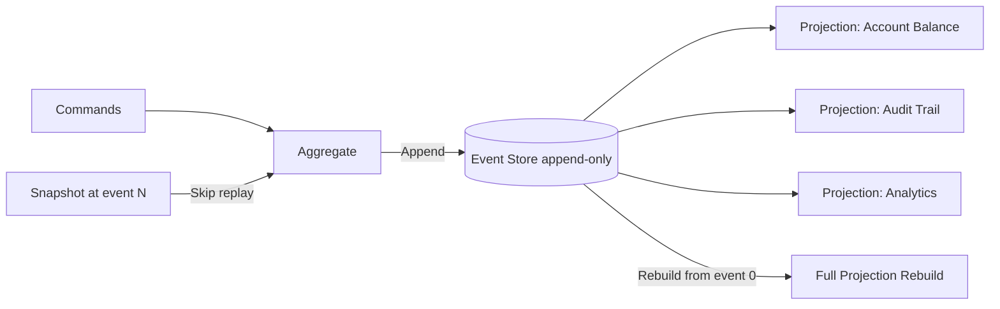
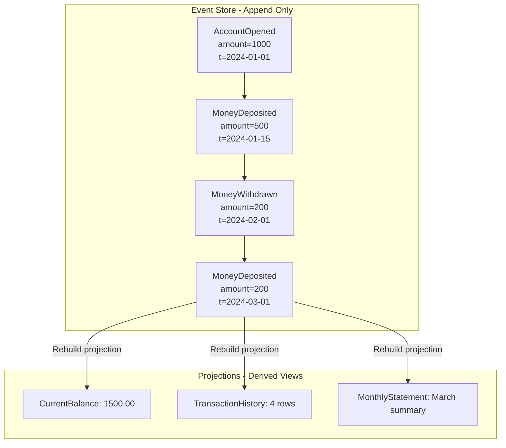
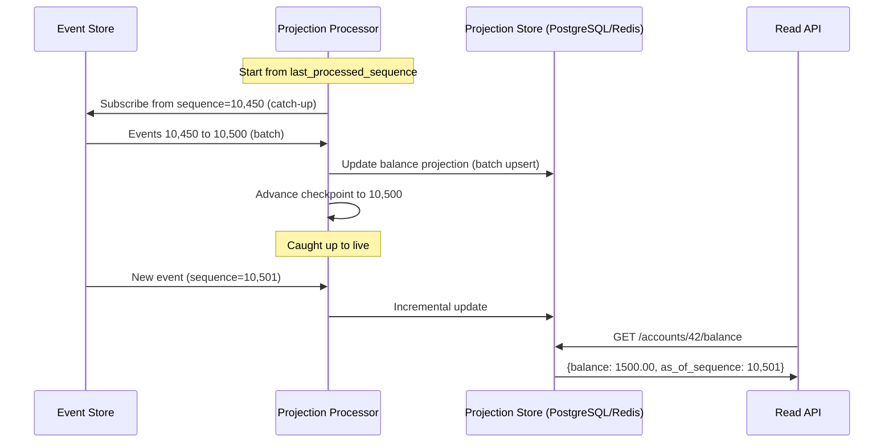
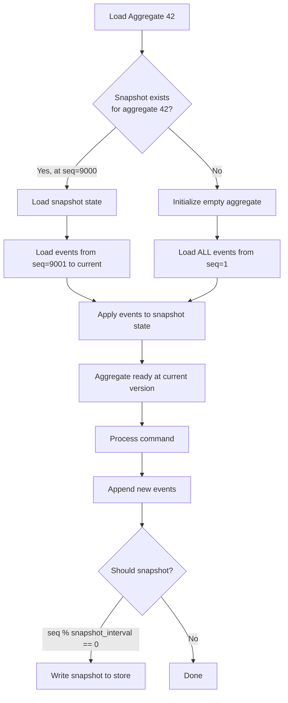
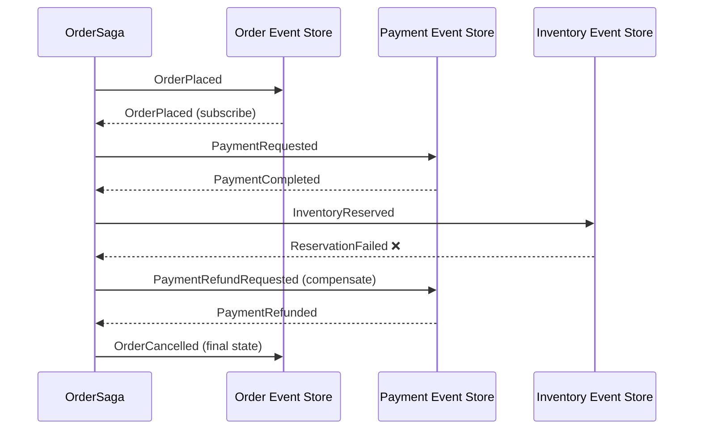
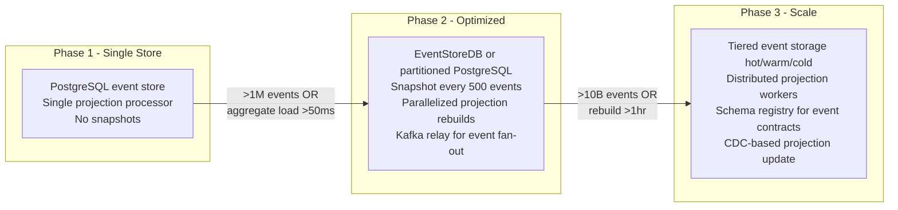

# Event Sourcing: Event Store Design, Projections, and Snapshot Strategies

## 🗺️ Quick Overview



*All state changes are appended as immutable events; projections rebuild current state by replaying events — snapshots skip old events to keep replay fast as the event log grows.*

**Event sourcing stores the sequence of facts that led to current state, not the state itself.** This unlocks audit trails, temporal queries, and projection rebuilding — but introduces a rebuild cost that grows linearly with event volume, projection consistency challenges, and schema evolution complexity that will break consumers if not managed carefully.

---

## The Problem Class `[Mid]`

You're building a bank account system. Traditional state-based persistence stores the current balance: `{account_id: 42, balance: 1500.00}`. You know the balance now. You don't know how it got there.

Regulatory requirement: you must provide a complete audit trail of every transaction for the past 7 years. Business requirement: you need to answer "what was the balance at 2pm on March 3rd, 2024?" for fraud investigations.

With state-based persistence, you'd need a separate audit log table, append-only transaction history, and a separate balance calculation. You're building event sourcing manually and badly.

Event sourcing makes the event log the **system of record**. The current balance is a derived projection, computed by replaying events.



**Real numbers that frame the problem:**
- A high-traffic e-commerce system might produce 50,000 events/second during peak
- At 50k events/sec, 1 year of history = 1.6 trillion events
- Replaying 1 million events at 100k events/sec = 10 seconds per aggregate rebuild (unacceptable)
- Event schema changes affect consumers reading events written years ago

---

## Why the Obvious Solution Fails `[Senior]`

### Naively replaying all events every time

The initial implementation replays all events from the beginning to reconstruct aggregate state for every command. At 100 events per aggregate, this is fast. At 100,000 events (a heavily used account over years), this is 100,000 database reads per command — before you even start processing.

**The math**: At 10,000 commands/second against aggregates with average 10,000 events each, you need 100,000 × 10,000 = 1 billion event reads per second. PostgreSQL handles ~100k reads/sec per instance. You'd need 10,000 database replicas just for event reads.

### Storing all projections in the event store

Teams sometimes store projection state inside the event store (same database, same transaction). This creates:
1. **Write amplification**: every event write requires updating all projection tables
2. **Coupling**: a slow projection update blocks the event append
3. **Schema lock-in**: you can't add new projections without reprocessing all historical events

### Ignoring schema evolution until it breaks

Event sourcing's permanent event history is a liability for schema evolution. If you store events as JSON without a schema registry and later rename a field, all event replays from before the rename will fail or silently use stale field names. This is not theoretical — it happens 100% of the time as systems evolve.

---

## The Solution Landscape `[Senior]`

### Solution 1: Event Store Design

**What it is**

The event store is an append-only log, indexed by aggregate ID and sequence number. It is the only source of truth — never update or delete events.

**How it actually works at depth**

Event store schema (PostgreSQL implementation):

```sql
CREATE TABLE events (
    event_id        UUID        DEFAULT gen_random_uuid() PRIMARY KEY,
    aggregate_id    UUID        NOT NULL,
    aggregate_type  VARCHAR(100) NOT NULL,
    event_type      VARCHAR(100) NOT NULL,
    event_version   INT         NOT NULL,  -- schema version for this event type
    sequence_number BIGINT      NOT NULL,  -- global monotonic sequence
    aggregate_seq   INT         NOT NULL,  -- per-aggregate sequence for optimistic locking
    payload         JSONB       NOT NULL,  -- event data (or Avro bytes for schema registry)
    metadata        JSONB,                 -- correlation_id, causation_id, user_id, etc.
    created_at      TIMESTAMPTZ DEFAULT NOW(),

    UNIQUE(aggregate_id, aggregate_seq)    -- optimistic concurrency: prevents two writers at same position
);

CREATE INDEX idx_events_aggregate ON events(aggregate_id, aggregate_seq);
CREATE INDEX idx_events_sequence ON events(sequence_number);  -- for projection catch-up
CREATE INDEX idx_events_type ON events(event_type, created_at);  -- for event-type queries
```

**Optimistic concurrency control**: before appending events, verify that the current `max(aggregate_seq)` for the aggregate matches the expected version. If another writer has appended since you loaded the aggregate, your write fails with a concurrency exception — the command processor retries by reloading and replaying.

```
Append atomicity guarantee:
  BEGIN;
    SELECT MAX(aggregate_seq) FROM events WHERE aggregate_id = :id;  -- verify expected version
    INSERT INTO events (..., aggregate_seq = :expected + 1);          -- atomic with version check
    INSERT INTO outbox (...);  -- for CDC relay to Kafka (see Outbox Pattern)
  COMMIT;
```

**CloudEvents schema for event payload:**

```json
{
  "specversion": "1.0",
  "type": "com.bank.account.MoneyDeposited",
  "source": "/accounts/42",
  "id": "550e8400-e29b-41d4-a716-446655440000",
  "time": "2026-03-18T10:30:00Z",
  "datacontenttype": "application/json",
  "schemaurl": "https://schemas.bank.com/MoneyDeposited/v2",
  "data": {
    "amount": 500.00,
    "currency": "USD",
    "reference": "TRANSFER-99"
  }
}
```

**Sizing guidance** `[Staff+]`

```
Event store sizing:
  avg_event_size_bytes = 500 bytes (typical JSON with metadata)
  events_per_day = command_rate_per_sec × 86400 × avg_events_per_command
  storage_per_day_GB = events_per_day × 500 / 1e9

  For 10,000 commands/sec, 1.5 events/command:
    events_per_day = 10,000 × 86,400 × 1.5 = 1.296 billion events/day
    storage_per_day = 1.296e9 × 500 / 1e9 = 648 GB/day

  At this rate, use tiered storage:
    Hot tier (PostgreSQL/EventStoreDB): last 90 days = 58 TB
    Warm tier (S3 + Parquet): 90 days to 2 years
    Cold tier (S3 Glacier): 2+ years

Partition strategy for PostgreSQL event store:
  PARTITION BY RANGE (created_at)  -- monthly partitions
  Oldest partitions: moved to S3 via pg_partman
```

**Configuration decisions that matter** `[Staff+]`

For high-throughput event stores, consider **EventStoreDB** (purpose-built for event sourcing) over PostgreSQL:
- EventStoreDB handles 100k+ writes/sec natively with its log-structured storage
- Built-in projections engine (server-side, JavaScript-based catch-up subscriptions)
- Native support for optimistic concurrency, stream versioning, and server-sent events

Kafka as event store (only append, no reads-by-aggregate-ID natively) is suitable when:
- You need massive throughput (millions of events/sec)
- You don't need point queries by aggregate ID
- You use an external aggregate store (Redis, Cassandra) for current state

**Failure modes** `[Staff+]`

| Failure Mode | Trigger | Impact | Mitigation |
|---|---|---|---|
| Optimistic concurrency conflict storm | High contention on same aggregate | Command retry loops, latency spikes | Command deduplication, pessimistic locking for hot aggregates |
| Event store I/O saturation | Projection rebuilds compete with live writes | Write latency increases, timeouts | Rebuild on read replica; throttle projection catch-up |
| Unbounded event sequence per aggregate | No snapshot strategy | Aggregate load time grows O(N) | Implement snapshot at interval (see Solution 3) |
| Schema incompatibility on replay | Event schema changed, old events unreadable | Projection rebuild fails | Event upcasting pipeline (see schema evolution) |

---

### Solution 2: Projections (Read Models)

**What it is**

Projections are derived read models built by processing the event stream. They are **disposable** — any projection can be rebuilt from the event store. The projection is eventually consistent with the event stream.

**How it actually works at depth**

Projection types:
1. **Transient projections**: rebuilt on-demand from event store (for temporal queries)
2. **Live projections**: maintained in real-time via event subscriptions
3. **Catch-up projections**: built by replaying events from a checkpoint, then switching to live



**Projection rebuild cost — the key formula:**

```
Rebuild time estimate:
  total_events = events_in_event_store
  projection_processing_rate = events_per_second (depends on projection complexity)
  rebuild_duration_s = total_events / projection_processing_rate

  For 10 billion events, processing at 500k events/sec:
    rebuild_duration = 10e9 / 500,000 = 20,000 seconds ≈ 5.5 hours

Mitigation: parallel partition processing
  parallel_streams = num_partitions_in_Kafka_or_num_aggregate_shards
  rebuild_duration_parallel = total_events / (processing_rate × parallel_streams)
  For 32 parallel streams: 5.5 hours / 32 = 10 minutes

Checkpoint persistence:
  Every 10,000 events, persist checkpoint to survive processor restart
  On restart: resume from last checkpoint (max replay = 10,000 events)
```

**Sizing guidance** `[Staff+]`

```
Projection store sizing:
  projection_size = f(query_patterns, not event_count)

  Balance projection: O(num_accounts) — fixed size regardless of event history
  Transaction history projection: O(num_events_in_window) — grows with retention period

  Redis for read projections:
    max_memory = projection_count × avg_projection_size_bytes
    For 10M accounts, 200 bytes/account balance projection: 2 GB Redis memory

Consistency window:
  projection_lag = event_production_rate / projection_processing_rate × avg_event_age
  Target: < 100ms for user-facing projections
  Acceptable: < 5s for analytics projections
```

---

### Solution 3: Snapshot Strategies

**What it is**

Snapshots persist the aggregate state at a specific event sequence, allowing replay to start from the snapshot rather than from event 0. They are **optimization artifacts**, not system of record — snapshots can always be discarded and rebuilt.

**How it actually works at depth**



**Snapshot frequency formula:**

```
Optimal snapshot frequency:
  Let:
    C = cost to load one event (read + deserialize) = ~0.1ms
    S = cost to write one snapshot = ~5ms
    N = events between snapshots

  Cost without snapshot: C × total_events_per_aggregate
  Cost with snapshot: S + C × N

  Break-even: S = C × (total_events - N)
  Optimal N = S / C = 5ms / 0.1ms = 50 events

  Conservative rule: snapshot every 100–500 events
  For long-lived aggregates (>10,000 events): snapshot every 1,000 events

Storage overhead:
  snapshot_store_size = num_aggregates × avg_aggregate_state_size
  For 10M orders, 1KB state/order: 10 GB (manageable in PostgreSQL)
```

**Snapshot storage options:**

| Option | Pros | Cons |
|---|---|---|
| Same event store DB | Atomic with event append | Adds load to primary write path |
| Separate PostgreSQL table | Query flexibility, joins | Two-phase commit risk (use separate logical store) |
| Redis | Fast reads, TTL-based expiry | Not durable; cold start after eviction |
| S3 + DynamoDB | Infinite scale | Higher latency (50–100ms) |

**Configuration decisions that matter** `[Staff+]`

```
Snapshot schema versioning:
  Every snapshot must carry schema version.
  On load, if snapshot_schema_version < current_schema_version:
    → discard snapshot, replay from events (upcasting handles event evolution)

  Snapshot retention:
    Keep last N snapshots per aggregate (N=3 for safety during rollback)
    Delete older snapshots via TTL or background job

Async snapshot writing:
  Write snapshot asynchronously after command completes
  Do not block command response on snapshot write
  Idempotent snapshot writes: use aggregate_id + sequence_number as PK
```

---

### Solution 4: Saga Orchestration via Events `[Senior]`

**What it is**

Sagas coordinate long-running distributed transactions across aggregate boundaries using events. Each saga step emits compensating events on failure, enabling rollback without 2-phase commit.



---

## Trade-off Matrix `[Senior]` → `[Staff+]`

| Dimension | Event Sourcing | State-Based Persistence |
|---|---|---|
| Audit trail | Native (complete history) | Requires separate audit log |
| Temporal queries | Native (replay to point in time) | Requires history table |
| Current state query | Requires projection rebuild | Direct read |
| Write complexity | High (event schema, versioning) | Low |
| Schema evolution | Complex (upcasting pipeline) | Simple ALTER TABLE |
| Storage growth | Unbounded (append-only) | Bounded (current state only) |
| Query flexibility | Limited (event store = append log) | Full SQL |
| Rebuild cost at scale | O(events) — can be hours | Not applicable |

---

## Production Failure Story `[Staff+]`

**The projection rebuild that took 3 days — an e-commerce platform**

A platform migrated to event sourcing for their order management system. After 18 months of operation, they had 2 billion events across 50 million orders. A bug in the discount calculation projection required a full rebuild.

Rebuild attempt 1: Single-threaded processor consuming from PostgreSQL event store. Rate: 80,000 events/sec. Estimated rebuild: 2 billion / 80,000 = 25,000 seconds ≈ 7 hours. Acceptable.

**Reality**: The projection processor competed with live event writes for PostgreSQL I/O. Live write latency increased from 5ms to 80ms. The SLO breach alert fired 2 hours into the rebuild. They aborted.

Rebuild attempt 2: Read from read replica. But the read replica was 3 hours behind due to replication lag from the rebuild I/O load. Stale data. Aborted after reading stale events.

**Rebuild attempt 3 (final solution)**:
1. Spin up a dedicated PostgreSQL read replica for the rebuild (separate from the replica serving live reads)
2. Snapshot the event store at a point in time (pg_basebackup)
3. Run 32 parallel projection processors, each assigned a shard of aggregate IDs
4. Process from snapshot, merge results into new projection tables
5. Total time: 2 billion events / (80,000 × 32) = 781 seconds ≈ 13 minutes

**Lessons**:
- Projection rebuild must be isolated from the production write path
- Always design for parallel partition-based rebuild from the start
- Checkpoint every 10,000 events to support resumable rebuilds after crashes
- Maintain a "rebuild in progress" flag — serve stale projection data with `stale: true` header during rebuild

---

## Observability Playbook `[Staff+]`

```
Dashboard: Event Sourcing Health

Panel 1: Event store write latency (p50, p95, p99)
  Alert: p99 > 20ms → I/O contention, check for concurrent projection rebuild

Panel 2: Projection lag (events behind live)
  Metric: live_sequence - projection_checkpoint_sequence
  Alert: > 10,000 events behind → projection processor falling behind

Panel 3: Aggregate load time histogram
  Metric: time to reconstruct aggregate from events + snapshot
  Alert: p99 > 100ms → snapshot interval too large, reduce to 100 events

Panel 4: Optimistic concurrency conflict rate
  Metric: rate of ConcurrencyException on event append
  Alert: > 1% of appends → hot aggregate contention, investigate command dedup

Panel 5: Snapshot age per aggregate type
  Metric: current_sequence - snapshot_sequence (per aggregate type)
  Alert: > 2× snapshot_interval → snapshot writer falling behind
```

---

## Architectural Evolution `[Staff+]`



---

## Decision Framework Checklist `[All Levels]`

- [ ] **Ordering guarantees defined**: per-aggregate ordering enforced via aggregate_seq?
- [ ] **Optimistic concurrency implemented**: unique constraint on (aggregate_id, aggregate_seq)?
- [ ] **Event schema versioning in place**: every event carries schema version?
- [ ] **Upcasting pipeline exists**: old event versions transformed to current schema on read?
- [ ] **Snapshot frequency calculated**: using the `N = snapshot_write_cost / event_load_cost` formula?
- [ ] **Projection rebuild is parallelizable**: shardable by aggregate ID partition?
- [ ] **Checkpoint every N events**: projection processors survive restarts without full replay?
- [ ] **Rebuild isolation strategy**: separate read replica or snapshot clone for rebuilds?
- [ ] **Projection store sized correctly**: based on derived state size, not event count?
- [ ] **Saga compensation events defined**: for every command, compensating event documented?

*Written by Gaurav Porwal — 10+ Year Engineer | Tech Lead | Product Owner | Business-Minded Builder*
*Last updated: 2026-03-18*
