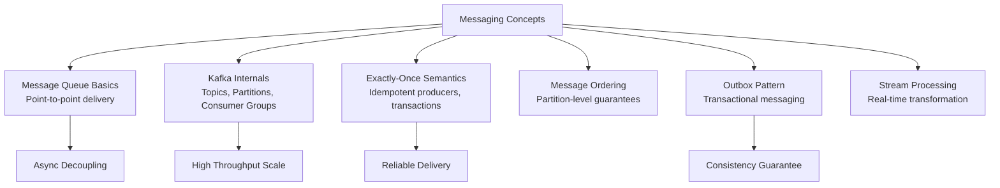

# Messaging Concepts

Core theory behind message queues, event streaming, and async communication.

```mermaid
graph TD
    CONCEPTS[Messaging Concepts]
    CONCEPTS --> QUEUES[Message Queue Basics\nPoint-to-point delivery]
    CONCEPTS --> KAFKA[Kafka Internals\nTopics, Partitions, Consumer Groups]
    CONCEPTS --> EXACTLY[Exactly-Once Semantics\nIdempotent producers, transactions]
    CONCEPTS --> ORDER[Message Ordering\nPartition-level guarantees]
    CONCEPTS --> OUTBOX[Outbox Pattern\nTransactional messaging]
    CONCEPTS --> STREAM[Stream Processing\nReal-time transformation]
    QUEUES --> ASYNC[Async Decoupling]
    KAFKA --> SCALE[High Throughput Scale]
    EXACTLY --> RELIABLE[Reliable Delivery]
    OUTBOX --> CONSIST[Consistency Guarantee]
```
