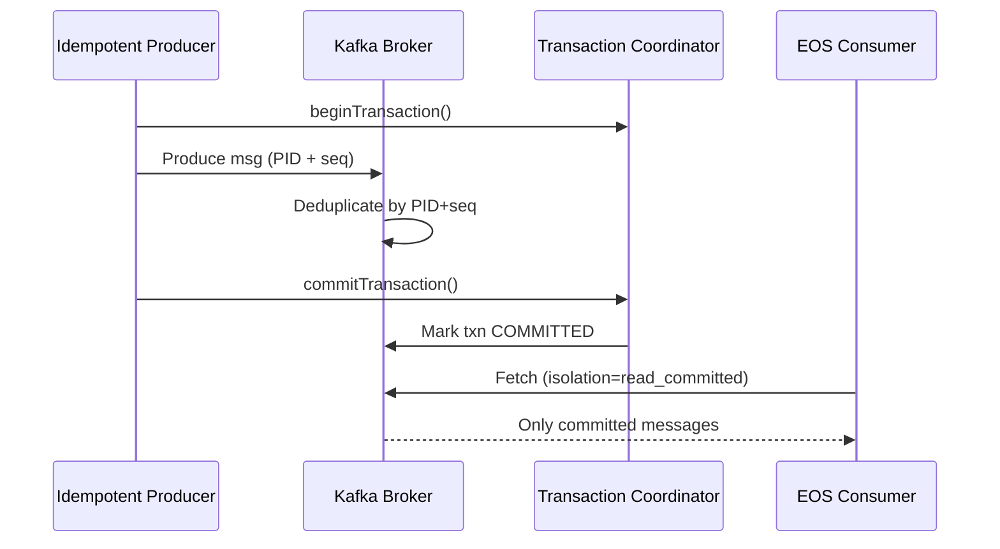
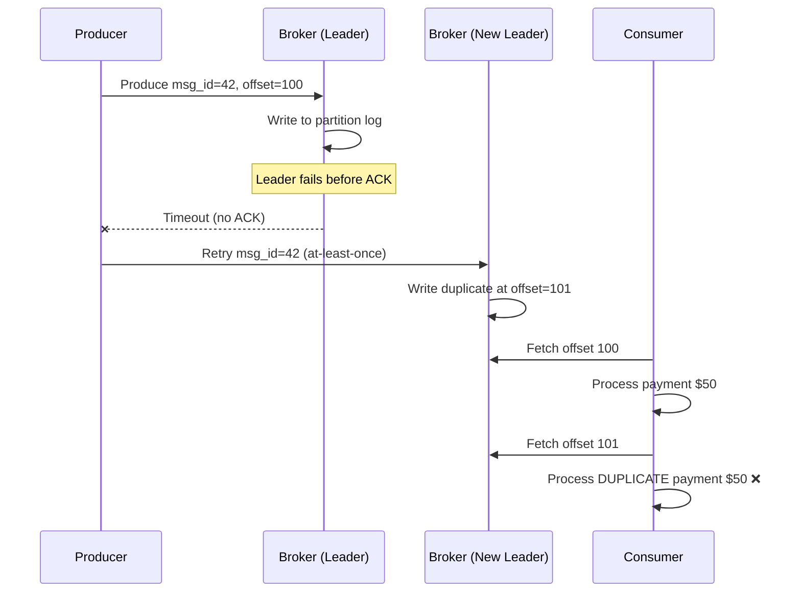
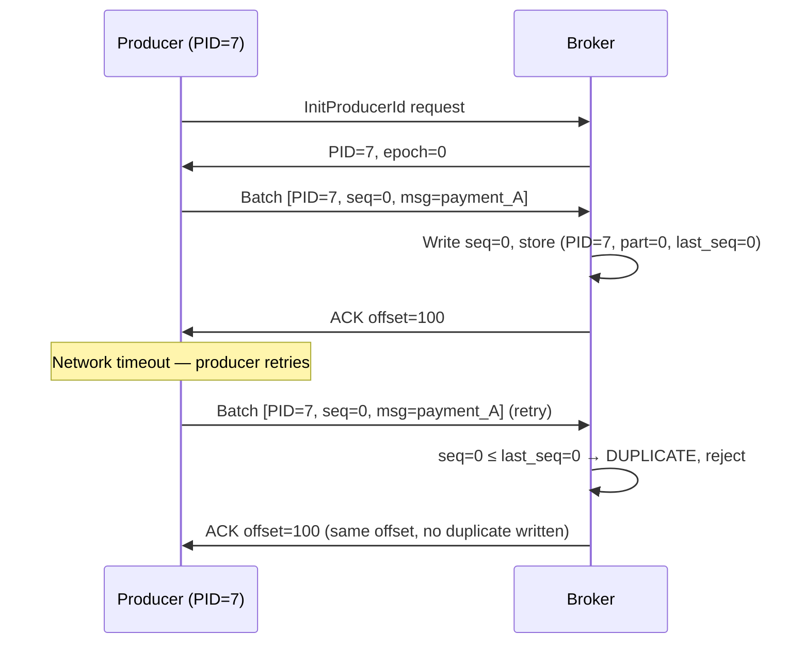
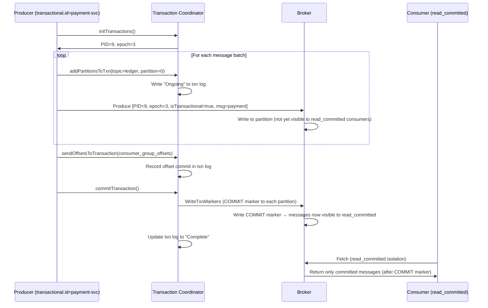
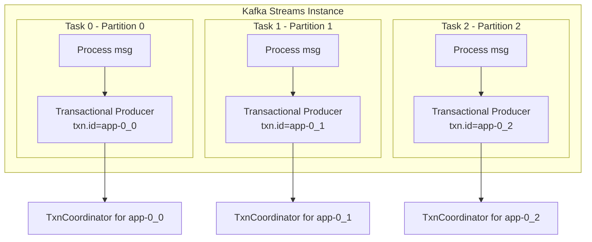
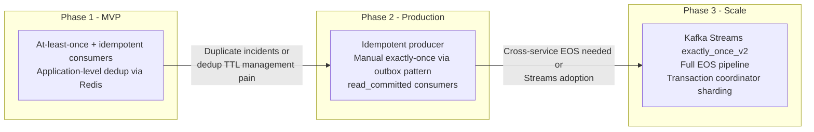

# Kafka Exactly-Once: Idempotent Producers, Transactions, and EOS Pitfalls

## 🗺️ Quick Overview



*Idempotent producers stamp each message with a producer ID and sequence number so the broker can detect and drop retries; transactions group produce + consumer-offset commits atomically so consumers only see committed results.*

**Every messaging system promises "at-least-once" delivery. Kafka's exactly-once semantics (EOS) is one of the few industrial implementations that actually works — but it costs 20% throughput and introduces new failure modes most teams don't account for.** This article covers the mechanics, the configuration, and where EOS breaks down.

---

## The Problem Class `[Mid]`

You're building a payment ledger that consumes from a `raw-transactions` Kafka topic, transforms the data (currency conversion, fee calculation), and produces to a `processed-ledger` topic. The ledger drives account balances, so duplicate processing means double-charging customers.

Three delivery semantics exist:

| Semantic | Producer retries on failure | Consumer offset commit | Result |
|---|---|---|---|
| **At-most-once** | No | Before processing | Message lost on crash |
| **At-least-once** | Yes | After processing | Duplicate on producer retry |
| **Exactly-once** | Yes + deduplication | Atomic with produce | No loss, no duplicate |

The naive implementation uses at-least-once: producer retries on network error, consumer commits offset after processing. On a broker failover, the producer might receive a timeout and retry — but the original message was already written. The consumer now processes the same transaction twice.



The exactly-once solution requires solving this at two layers: **producer-to-broker** (idempotent producer) and **consume-transform-produce** (Kafka transactions).

---

## Why the Obvious Solution Fails `[Senior]`

### Application-level deduplication is not sufficient

Teams often implement a Redis SET with `msg_id` to detect duplicates. This fails because:

1. **The deduplication state and the downstream write are not atomic.** The consumer can crash between "seen this message" and "committed the write."
2. **Redis and Kafka have independent failure domains.** A Redis cluster partition can cause the deduplication check to fail open (allow duplicates) or fail closed (drop valid messages).
3. **TTL management is complex.** How long do you keep seen message IDs? If the consumer lags for days, the TTL expires and duplicates slip through.

### Idempotent producer alone is insufficient for consume-transform-produce

`enable.idempotence=true` prevents broker-side duplicates from producer retries — but it does NOT make the read-process-write cycle atomic. If the consumer crashes after producing the output but before committing the input offset, it will reprocess and re-produce on restart.

### Transactions without `read_committed` isolation leak in-progress messages

Even with transactions enabled on the producer side, if consumers use the default `read_uncommitted` isolation level, they will read messages from aborted transactions. This breaks EOS end-to-end.

---

## The Solution Landscape `[Senior]`

### Solution 1: Idempotent Producer

**What it is**

An idempotent producer ensures that broker-side deduplication eliminates duplicates caused by producer retries within a single session. It solves the producer → broker layer of exactly-once.

**How it actually works at depth**

When `enable.idempotence=true`, the broker assigns each producer a **Producer ID (PID)** at session initialization. The producer maintains a monotonically increasing **sequence number** per (PID, topic-partition) pair. Each message batch carries the PID and sequence number.

The broker stores the last 5 sequence numbers per (PID, partition) in memory. On receiving a batch:
- If `sequence == last_sequence + 1`: accept (normal case)
- If `sequence ≤ last_sequence`: reject as duplicate (idempotent)
- If `sequence > last_sequence + 1`: reject as out-of-order (gap detected, client bug)



**Sizing guidance** `[Staff+]`

```
Idempotent producer overhead:
  - Additional InitProducerId RPC at startup: ~5ms one-time cost
  - Per-batch: +4 bytes PID + 4 bytes epoch + 4 bytes sequence = 12 bytes overhead
  - Broker memory per (PID, partition): ~60 bytes × 5 cached sequences = ~300 bytes
  - For 10,000 active producers × 100 partitions: ~300 MB broker heap overhead

Throughput impact of idempotence alone:
  - Benchmark (Confluent internal): <2% throughput reduction
  - The real cost comes from transactions (see below)
```

**Configuration decisions that matter** `[Staff+]`

```properties
# Producer
enable.idempotence=true
acks=all                          # required when idempotence enabled (enforced in Kafka 3.0+)
max.in.flight.requests.per.connection=5  # max 5 for idempotence; reduce to 1 for strict ordering without transactions
retries=Integer.MAX_VALUE         # infinite retries, rely on delivery.timeout.ms instead
delivery.timeout.ms=120000        # 2 min total retry window

# The interplay: acks=all + enable.idempotence + retries=MAX = strongest producer guarantee
```

**Failure modes** `[Staff+]`

- **Epoch fencing**: If a producer restarts with the same `transactional.id`, the broker bumps the epoch, fencing the old producer. Old producer writes with previous epoch are rejected. This prevents zombie producers from writing stale data.
- **PID expiry**: If a producer is idle for `transactional.id.expiration.ms` (default 7 days), its PID is removed. Reinitialization required.
- **Sequence gap detection**: If the broker receives sequence N+2 without N+1, it rejects with `OutOfOrderSequenceException`. This indicates client-side bugs (e.g., message dropped before send).

---

### Solution 2: Kafka Transactions (Full EOS)

**What it is**

Kafka transactions provide atomicity across multiple topic-partition writes AND atomic consumer offset commits. This enables the **consume-transform-produce** pattern with exactly-once guarantees across the entire pipeline.

**How it actually works at depth**

Kafka uses a **Transaction Coordinator** (a special broker role elected per transactional producer via `transactional.id` hash) and a **Transaction Log** (internal `__transaction_state` topic).

The transaction lifecycle:



The key insight: messages are written to the broker log **immediately** but are invisible to `read_committed` consumers until the COMMIT marker arrives. A `read_uncommitted` consumer sees them immediately — breaking EOS from the consumer side.

**Sizing guidance** `[Staff+]`

```
Transaction overhead breakdown:
  Per-transaction cost:
    - initTransactions(): 1 RPC to coordinator, ~2ms
    - addPartitionsToTxn(): 1 RPC per new partition per transaction, ~1ms each
    - commitTransaction(): 1 RPC to coordinator + 1 WriteTxnMarkers per partition, ~5-10ms

  Throughput impact:
    - Confluent benchmark (2022): ~20% throughput reduction at high volume
    - Latency addition: commit latency added to end-to-end latency

  Transaction duration tuning:
    transaction.timeout.ms=60000  # abort transactions open > 60s
    # Batch multiple messages per transaction to amortize overhead:
    messages_per_transaction = target_throughput / (1000ms / commit_latency_ms)
    # Example: 10,000 msg/s, 10ms commit latency → 100 messages/transaction amortizes well
```

**Configuration decisions that matter** `[Staff+]`

```properties
# Producer (transactional)
enable.idempotence=true           # automatically enabled with transactional.id
transactional.id=payment-svc-1   # unique per producer instance; use stable ID for epoch fencing
transaction.timeout.ms=60000      # abort if transaction open > 60s

# Consumer (EOS consumer side)
isolation.level=read_committed    # CRITICAL: without this, EOS is broken end-to-end
enable.auto.commit=false          # manual offset management required for EOS

# Kafka Streams (handles EOS automatically)
processing.guarantee=exactly_once_v2   # v2 uses per-task producers (Kafka 2.5+) vs v1's shared producer
```

**Failure modes** `[Staff+]`

| Failure Mode | Mechanism | Impact | Detection |
|---|---|---|---|
| Coordinator failover | TC broker restarts mid-transaction | Transaction times out; producer retries from beginning | `TransactionCoordinatorFencedException` in producer logs |
| Zombie producer | Old producer instance still running after restart | New epoch fences old producer writes | `ProducerFencedException` — old instance stops writing |
| Transaction log lag | `__transaction_state` replication lag | TC cannot confirm commits; transactions block | Monitor `__transaction_state` consumer group lag |
| Incomplete COMMIT markers | Broker crash between writing data and COMMIT marker | TC retries WriteTxnMarkers on recovery | Transparent to application — handled automatically by broker |
| `read_uncommitted` consumer | Consumer misconfiguration | Reads in-progress and aborted transactions | Downstream state corruption; must audit all consumer configs |

**Observability** `[Staff+]`

```
Key metrics for EOS:
  kafka.producer:type=producer-metrics,attribute=txn-init-time-ns-avg
  kafka.producer:type=producer-metrics,attribute=txn-commit-time-ns-avg
  kafka.producer:type=producer-metrics,attribute=txn-abort-rate

  Transaction coordinator metrics:
  kafka.server:type=TransactionCoordinator,attribute=active-transaction-count
  kafka.server:type=TransactionCoordinator,attribute=transaction-log-load-duration

Alert thresholds:
  txn-commit-time > 50ms → coordinator under load, check __transaction_state partition count
  txn-abort-rate > 0.1/sec → producer timing out, extend transaction.timeout.ms or reduce batch size
  active-transaction-count > 10,000 → coordinator memory pressure
```

---

### Solution 3: Kafka Streams `exactly_once_v2`

**What it is**

For stream processing applications (consume → transform → produce), Kafka Streams manages EOS automatically. `exactly_once_v2` (introduced Kafka 2.5) is the current best practice, replacing the original `exactly_once` mode.

**How it actually works at depth**

`exactly_once_v2` (EOS-v2) creates **one transactional producer per Kafka Streams task** rather than one per Streams instance (EOS-v1). This is critical because:

- EOS-v1: all tasks in one instance share one producer → one coordinator is a bottleneck
- EOS-v2: each task has its own `transactional.id` = `{applicationId}-{taskId}` → load distributed across coordinators



**Sizing guidance** `[Staff+]`

```
EOS-v2 resource requirements:
  transactional producers per instance = num_stream_tasks_per_instance
  typical: 10–50 tasks/instance → 10–50 concurrent transactions

  Coordinator throughput budget:
    max_transactions_per_coordinator_s = 1000 (benchmark from Confluent)
    coordinators_needed = (instances × tasks_per_instance) / 1000

  State store checkpointing:
    checkpoint_frequency = commit.interval.ms (default 100ms for EOS)
    # Higher frequency = lower recovery time, higher I/O overhead
    # EOS-v2 committed per commit.interval.ms; reduce to 30ms for low-latency requirements
```

---

## Trade-off Matrix `[Senior]` → `[Staff+]`

| Dimension | At-most-once | At-least-once | Exactly-once |
|---|---|---|---|
| Message loss | Possible | None | None |
| Duplicate delivery | None | Possible | None |
| Throughput cost | 0% | ~0% | ~15–20% |
| Latency addition | Minimal | Minimal | +commit latency (5–15ms) |
| Configuration complexity | Low | Low | High |
| Cross-system guarantees | None | None | Kafka-to-Kafka only |
| Consumer isolation required | No | No | `read_committed` mandatory |
| Application complexity | Low | Requires idempotent consumers | Lower (handled by Kafka) |

---

## Production Failure Story `[Staff+]`

**The epoch fencing disaster — a streaming analytics platform**

A financial data platform ran Kafka Streams with `exactly_once_v2`. During a Kubernetes eviction event, 3 Streams instances were evicted simultaneously. Kubernetes started replacement pods. The old instances, being evicted slowly (not killed), were still running and attempting to commit transactions.

The new instances initialized with the same `transactional.id` patterns (stable task IDs), bumping the epoch. Old instances received `ProducerFencedException` and stopped. So far, correct behavior.

**The failure**: The team had added a circuit breaker that caught `ProducerFencedException` and **logged + swallowed** the exception, assuming it was a transient error. The old instances continued running their processing logic but could not produce output. They committed offsets (incorrectly configured with `enable.auto.commit=true` as a leftover configuration). The messages were marked consumed but never produced to the output topic.

**Data loss volume**: 40 minutes of processed events (the eviction + restart window) were consumed and committed but never written to the output topic. Downstream aggregations produced incorrect balances.

**Root causes**:
1. `ProducerFencedException` must be treated as **fatal** — the producer must reinitialize or the instance must die
2. `enable.auto.commit=true` must never be set when using Kafka Streams with EOS
3. No alerting on `txn-abort-rate` or output topic lag relative to input topic lag

**Fix**:
- Added `ProducerFencedException` to the circuit breaker's re-throw list
- Added alert: `output_topic_lag / input_topic_produce_rate > 5s` → processing pipeline stalled
- Implemented pre-stop hook to allow Streams tasks to complete current processing window before eviction

---

## Observability Playbook `[Staff+]`

```
Dashboard: Kafka EOS Health

Panel 1: Transaction commit latency (p50, p95, p99)
  Metric: kafka.producer:type=producer-metrics,attribute=txn-commit-time-ns-avg
  Alert: p99 > 100ms → coordinator under load

Panel 2: Transaction abort rate
  Metric: kafka.producer:type=producer-metrics,attribute=txn-abort-rate
  Alert: > 0.01/sec → investigate timeout or coordinator failure

Panel 3: Active transaction count per coordinator
  Metric: kafka.server:type=TransactionCoordinator,attribute=active-transaction-count
  Alert: > 5,000 → coordinator memory and GC pressure

Panel 4: Input vs output topic lag delta
  Custom metric: input_topic_consumer_offset - output_topic_produce_offset
  Alert: delta > expected_processing_latency → EOS pipeline stalled

Panel 5: Producer epoch bumps (fencing events)
  Custom alert: ProducerFencedException rate in application logs > 0/5min
  Action: immediately investigate zombie producer instances
```

---

## Architectural Evolution `[Staff+]`



**When NOT to use EOS:**
- When downstream systems are already idempotent (e.g., database upserts by primary key)
- When 20% throughput reduction is not acceptable (consider at-least-once + idempotent consumers instead)
- When consumers are outside Kafka (EOS only covers Kafka-to-Kafka pipelines; external sinks need Kafka Connect with exactly-once support, available since Kafka 3.3)

---

## Decision Framework Checklist `[All Levels]`

- [ ] **Delivery semantic defined**: is exactly-once actually required, or is idempotent consumer sufficient?
- [ ] **`enable.idempotence=true`** set on all producers (free, no reason not to use it)
- [ ] **`transactional.id` is stable**: same ID survives restarts (enables epoch fencing of zombies)
- [ ] **`isolation.level=read_committed`** set on all EOS consumers
- [ ] **`enable.auto.commit=false`** on all transactional consumers
- [ ] **`ProducerFencedException` treated as fatal**: instance must reinitialize, not retry
- [ ] **`transaction.timeout.ms` tuned**: > processing latency per message but < acceptable staleness
- [ ] **`exactly_once_v2` used for Kafka Streams** (not v1): distributed coordinator load
- [ ] **Output lag vs input lag alerted**: pipeline stall detection independent of Kafka metrics
- [ ] **EOS scope documented**: team understands EOS covers Kafka-to-Kafka only; external sinks need separate strategy

*Written by Gaurav Porwal — 10+ Year Engineer | Tech Lead | Product Owner | Business-Minded Builder*
*Last updated: 2026-03-18*
