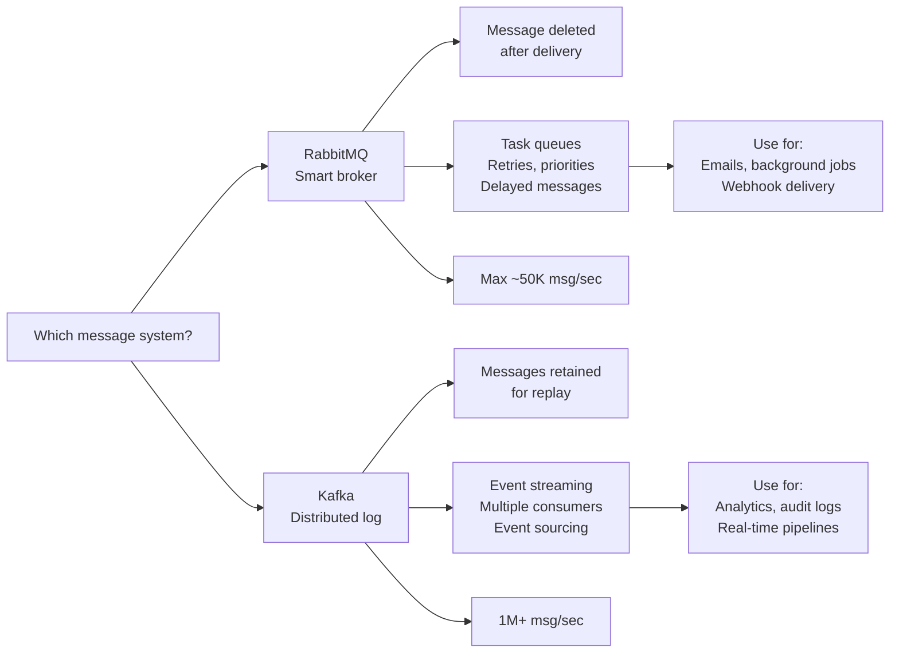

# Kafka vs RabbitMQ - Choose the Right Queue for 1M+ Messages/sec

> **Reading Time:** 15 minutes
> **Difficulty:** 🟡 Intermediate
> **Impact:** Prevents architectural rewrites that cost $500K+

## 🗺️ Quick Overview



*RabbitMQ is a smart task router that deletes messages on delivery; Kafka is a durable log that lets any consumer replay events independently.*

## The $2M Architecture Mistake

**Real Story (2023):** A fintech startup chose RabbitMQ for their payment processing system. 18 months later, they hit 50K transactions/minute.

**What happened:**
```
Month 1-12: RabbitMQ handles 5K msg/min easily ✅
Month 13: Growth to 20K msg/min, latency increases ⚠️
Month 15: 40K msg/min, messages backing up, customers complaining
Month 18: 50K msg/min, system crashes during peak hours

Cost of migration to Kafka:
- 6 engineers × 4 months = $800K
- Lost revenue during migration = $400K
- Customer churn = $300K
- Emergency infrastructure = $500K
Total: $2M+ and nearly killed the company
```

**The lesson:** Choose the right message queue from day one.

This article shows you exactly when to use Kafka vs RabbitMQ—and saves you from a $2M mistake.

---

## The Problem: Two Great Tools, Wrong Use Cases

### The Confusion

Both Kafka and RabbitMQ are "message queues," but they're fundamentally different:

```
Developer A: "We need a message queue. Let's use RabbitMQ!"
Developer B: "I heard Kafka is faster. Let's use Kafka!"
Architect: "What's your use case?"
Both: "...we need to send messages?"
```

**Result:** Wrong tool chosen, expensive rewrite later.

### The Real Difference (One Sentence)

```
RabbitMQ = Smart broker, dumb consumers (broker routes messages)
Kafka = Dumb broker, smart consumers (consumers pull from log)
```

This one difference changes EVERYTHING about when to use each.

---

## Why "Just Use Kafka" Fails

### Scenario: Task Queue for Background Jobs

```javascript
// ❌ Kafka for task queue (wrong tool)
// Processing email notifications

// Producer sends task
await kafka.send({
  topic: 'email-tasks',
  messages: [{ value: JSON.stringify({ userId: 123, template: 'welcome' }) }]
});

// Consumer processes task
await consumer.run({
  eachMessage: async ({ message }) => {
    const task = JSON.parse(message.value);
    await sendEmail(task);
    // Problem: If email fails, message is already committed
    // No automatic retry, no dead-letter queue
  }
});

// Problems with Kafka for task queues:
// ❌ No per-message acknowledgment (batch commits)
// ❌ No automatic retries (you build it yourself)
// ❌ No priority queues (all messages equal)
// ❌ No delayed delivery (process now or never)
// ❌ Overkill complexity for simple tasks
```

### What Actually Happens

```
Task: Send 1000 welcome emails
Kafka: All 1000 committed immediately
Email server: Rate limited after 100
Result: 900 emails "processed" but never sent

Recovery:
- Manual offset reset
- Duplicate emails sent
- Angry customers
- Engineering time wasted
```

**Kafka is designed for event streaming, not task queues.**

---

## Why "Just Use RabbitMQ" Fails

### Scenario: Event Sourcing / Analytics Pipeline

```javascript
// ❌ RabbitMQ for event sourcing (wrong tool)
// Tracking user behavior for analytics

// Producer sends event
channel.publish('user-events', 'page.viewed', Buffer.from(JSON.stringify({
  userId: 123,
  page: '/checkout',
  timestamp: Date.now()
})));

// Consumer processes event
channel.consume('analytics-queue', (msg) => {
  const event = JSON.parse(msg.content);
  await storeInDataWarehouse(event);
  channel.ack(msg);  // Message deleted after processing
});

// Problems:
// ❌ Message deleted after consumption (no replay)
// ❌ Only one consumer gets each message (no fan-out)
// ❌ No ordering guarantees across consumers
// ❌ Can't reprocess yesterday's events
// ❌ Throughput limited (~50K msg/sec max)
```

### What Actually Happens

```
Day 1: Analytics pipeline processes events ✅
Day 30: Data team: "We need to reprocess last month's data"
You: "Messages are deleted after processing"
Data team: "..."

Recovery:
- No recovery possible
- Lost 30 days of user behavior data
- ML models can't be trained
- Business intelligence broken
```

**RabbitMQ deletes messages after delivery. Kafka keeps them.**

---

## The Paradigm Shift: Log vs Queue

### Old Mental Model
```
"Kafka and RabbitMQ are both message queues"
→ Choose based on popularity/familiarity
```

### New Mental Model
```
RabbitMQ = Traditional queue (message deleted after delivery)
Kafka = Distributed log (message retained for replay)
```

### Visual Comparison

**RabbitMQ (Queue Model):**
```
Producer → [Message] → Queue → Consumer
                         ↓
                     (deleted)

- Message delivered once
- Gone forever after ACK
- Like a mailbox
```

**Kafka (Log Model):**
```
Producer → [Message] → Log (offset 0)
                       Log (offset 1)
                       Log (offset 2)
                         ↓
                    Consumer A (offset: 2)
                    Consumer B (offset: 1)  ← Different position!
                    Consumer C (offset: 0)  ← Replay from start!

- Messages retained (configurable: 7 days, forever)
- Multiple consumers at different positions
- Like a commit log / transaction history
```

### Why This Changes Everything

| Capability | RabbitMQ | Kafka |
|------------|----------|-------|
| **Replay events** | ❌ Impossible | ✅ Any time |
| **Multiple consumers** | ❌ Competing | ✅ Independent |
| **Event sourcing** | ❌ Not designed for | ✅ Perfect fit |
| **Task queues** | ✅ Built-in features | ❌ Build yourself |
| **Delayed messages** | ✅ Native support | ❌ Workarounds |
| **Priority queues** | ✅ Native support | ❌ Not supported |

---

## The Solution: Decision Framework

### Use RabbitMQ When:

```
✅ Task/Job Queues
   - Background job processing
   - Email sending, PDF generation
   - Any "do this task" pattern

✅ Request/Response Patterns
   - RPC over messaging
   - Microservice communication

✅ Complex Routing
   - Route by content/headers
   - Topic exchanges, fanout
   - Dead-letter queues

✅ Message Features Needed
   - Priority queues
   - Delayed/scheduled messages
   - Per-message acknowledgment
   - Automatic retries

✅ Simpler Operations
   - Smaller team
   - Less infrastructure expertise
   - Quick setup needed
```

**Real Examples:**
- **Shopify:** Background jobs (image processing, inventory sync)
- **Instagram:** Task queues for media processing
- **GitHub:** Webhook delivery and retry logic

### Use Kafka When:

```
✅ Event Streaming
   - Real-time analytics
   - User activity tracking
   - IoT sensor data

✅ Event Sourcing
   - Audit logs
   - State reconstruction
   - CQRS pattern

✅ Log Aggregation
   - Centralized logging
   - Metrics collection
   - Distributed tracing

✅ High Throughput
   - >100K messages/second
   - Big data pipelines
   - Stream processing

✅ Multiple Consumers
   - Same event → different services
   - Analytics + ML + Search
   - Event-driven microservices
```

**Real Examples:**
- **LinkedIn:** 7 trillion messages/day (activity feed, analytics)
- **Uber:** 1 trillion messages/day (location tracking, pricing)
- **Netflix:** 500 billion events/day (viewing history, recommendations)

---

## Architecture Comparison

### RabbitMQ Architecture

```
                    ┌─────────────────────────────────────┐
                    │            RabbitMQ                 │
                    │  ┌─────────┐    ┌─────────────┐    │
Producer ──────────►│  │Exchange │───►│   Queue 1   │────┼───► Consumer A
                    │  │         │    └─────────────┘    │
                    │  │(routes) │    ┌─────────────┐    │
                    │  │         │───►│   Queue 2   │────┼───► Consumer B
                    │  └─────────┘    └─────────────┘    │
                    └─────────────────────────────────────┘

Features:
- Smart routing (exchange types: direct, topic, fanout, headers)
- Message acknowledgment (per message)
- Dead-letter queues (automatic retry)
- Priority queues
- Message TTL
```

### Kafka Architecture

```
                    ┌─────────────────────────────────────────┐
                    │              Kafka Cluster              │
                    │  ┌─────────────────────────────────┐   │
Producer ──────────►│  │    Topic: orders                │   │
                    │  │  ┌─────────────────────────┐    │   │
                    │  │  │ Partition 0: [0][1][2]  │────┼───┼──► Consumer Group A
                    │  │  │ Partition 1: [0][1][2]  │────┼───┼──► Consumer Group B
                    │  │  │ Partition 2: [0][1][2]  │────┼───┼──► Consumer Group C
                    │  │  └─────────────────────────┘    │   │
                    │  └─────────────────────────────────┘   │
                    └─────────────────────────────────────────┘

Features:
- Partitions (parallel processing)
- Consumer groups (load balancing)
- Log retention (replay capability)
- High throughput (1M+ msg/sec)
- Replication (fault tolerance)
```

---

## Performance Comparison

### Throughput Benchmarks

| Metric | RabbitMQ | Kafka |
|--------|----------|-------|
| **Max throughput** | ~50K msg/sec | 1M+ msg/sec |
| **Latency (p99)** | 1-5ms | 5-15ms |
| **Message size** | Better for small | Better for large |
| **Persistence** | Slower with disk | Fast with disk |

### When Throughput Matters

```
Scenario: E-commerce order events

Traffic: 1,000 orders/minute = ~17 msg/sec
→ Both work fine ✅

Traffic: 100,000 orders/minute = ~1,700 msg/sec
→ Both work fine ✅

Traffic: 1,000,000 orders/minute = ~17,000 msg/sec
→ RabbitMQ: Struggling ⚠️
→ Kafka: Easy ✅

Traffic: 10,000,000 orders/minute = ~170,000 msg/sec
→ RabbitMQ: Won't work ❌
→ Kafka: Still easy ✅
```

**Rule of thumb:**
- < 50K msg/sec: Either works (choose by features)
- > 50K msg/sec: Kafka is the only choice

---

## Real-World Validation

### Companies Using RabbitMQ

| Company | Use Case | Scale |
|---------|----------|-------|
| **Robinhood** | Trade execution tasks | 5M trades/day |
| **Reddit** | Background jobs | 50K jobs/minute |
| **Mozilla** | Email/notification delivery | 100M emails/day |
| **Zalando** | Order processing | 30K orders/minute |

### Companies Using Kafka

| Company | Use Case | Scale |
|---------|----------|-------|
| **LinkedIn** | Activity feed, analytics | 7T messages/day |
| **Uber** | Location tracking, pricing | 1T messages/day |
| **Netflix** | Viewing events, recommendations | 500B events/day |
| **Spotify** | User behavior, playlists | 30B events/day |
| **Twitter** | Timeline, analytics | 400B events/day |

### Migration Stories

**Airbnb (RabbitMQ → Kafka):**
```
Before: RabbitMQ for booking events
Problem: Couldn't replay events, analytics team frustrated
After: Kafka for events, RabbitMQ for tasks
Result: Both tools for right use cases
```

**Pinterest (Kafka for everything → Kafka + RabbitMQ):**
```
Before: Kafka for all messaging
Problem: Task queue features missing, complex workarounds
After: Kafka for streaming, RabbitMQ for tasks
Result: Simpler architecture, fewer bugs
```

---

## Quick Decision Flowchart

```
Start
  │
  ▼
Do you need to replay messages?
  │
  ├─► YES ──► Use Kafka
  │
  ▼
  NO
  │
  ▼
Do you need >50K messages/second?
  │
  ├─► YES ──► Use Kafka
  │
  ▼
  NO
  │
  ▼
Do you need task queue features?
(retries, delays, priorities)
  │
  ├─► YES ──► Use RabbitMQ
  │
  ▼
  NO
  │
  ▼
Do multiple services need the same event?
  │
  ├─► YES ──► Use Kafka
  │
  ▼
  NO
  │
  ▼
Is this a background job/task?
  │
  ├─► YES ──► Use RabbitMQ
  │
  ▼
  NO ──► Either works, prefer RabbitMQ for simplicity
```

---

## Quick Win: Make the Decision in 5 Minutes

### Step 1: Answer These Questions

```
1. Do I need to replay old messages? □ Yes □ No
2. Will I exceed 50K msg/sec? □ Yes □ No
3. Do I need task queue features? □ Yes □ No
4. Do multiple services need same event? □ Yes □ No
5. Is this primarily background jobs? □ Yes □ No
```

### Step 2: Score

```
Questions 1, 2, 4 = YES → Kafka
Questions 3, 5 = YES → RabbitMQ
Mixed answers → Likely need both
```

### Step 3: Common Patterns

| Pattern | Choice |
|---------|--------|
| Background jobs | RabbitMQ |
| Analytics pipeline | Kafka |
| Event sourcing | Kafka |
| Email/SMS sending | RabbitMQ |
| Real-time updates | Kafka |
| Webhook delivery | RabbitMQ |
| Log aggregation | Kafka |
| Task scheduling | RabbitMQ |

---

## Key Takeaways

**What you learned:**
- Kafka = distributed log (replay, high throughput, multiple consumers)
- RabbitMQ = traditional queue (task features, routing, simplicity)
- Wrong choice costs $500K-$2M+ in migrations

**Decision rules:**
- ✅ Use Kafka for: events, streaming, analytics, >50K msg/sec
- ✅ Use RabbitMQ for: tasks, jobs, routing, retries, <50K msg/sec
- ✅ Use both for: large systems with different needs

**When to use both:**
```
User clicks "Buy"
  → Kafka: order.created event (analytics, search, ML)
  → RabbitMQ: send confirmation email (task with retry)
```

---

## Related Content

**POCs to try:**
- [POC #46: Kafka Basics](/04-messaging/hands-on/kafka-basics-producer-consumer) - Build a producer/consumer
- [POC #47: Kafka Consumer Groups](/04-messaging/hands-on/kafka-consumer-groups-load-balancing) - Load balancing

**Further reading:**
- [Message Queue Basics](/04-messaging/concepts/message-queue-basics) - Foundational concepts

---

**Remember:** The best message queue is the one that fits your use case. Kafka and RabbitMQ aren't competitors—they're different tools for different jobs. The $2M mistake is choosing based on popularity instead of requirements.
