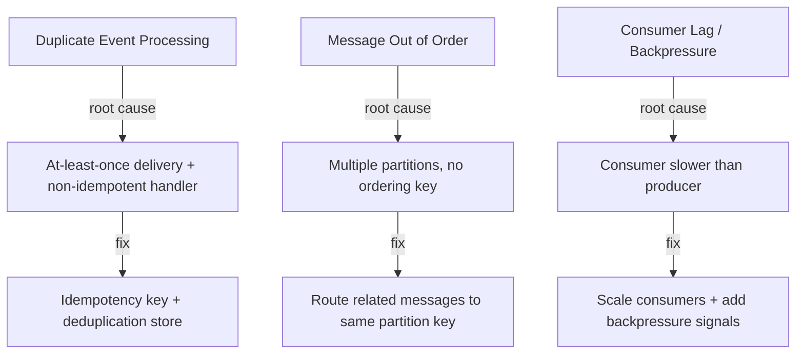

# Messaging Failure Modes

Message ordering, duplicate processing, and other async communication pitfalls.

```mermaid
graph TD
    DUP[Duplicate Event Processing] -->|root cause| RETRY[At-least-once delivery + non-idempotent handler]
    RETRY -->|fix| IDEMPOTENT[Idempotency key + deduplication store]
    ORDER[Message Out of Order] -->|root cause| MULTIPART[Multiple partitions, no ordering key]
    MULTIPART -->|fix| PARTKEY[Route related messages to same partition key]
    BACKPRESSURE[Consumer Lag / Backpressure] -->|root cause| SLOW[Consumer slower than producer]
    SLOW -->|fix| SCALE[Scale consumers + add backpressure signals]
```
