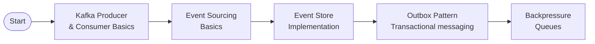

# Messaging Hands-On

Practical implementations with Kafka, event sourcing, and the outbox pattern.

```mermaid
graph LR
    Start([Start]) --> P1[Kafka Producer\n& Consumer Basics]
    P1 --> P2[Event Sourcing\nBasics]
    P2 --> P3[Event Store\nImplementation]
    P3 --> P4[Outbox Pattern\nTransactional messaging]
    P4 --> P5[Backpressure\nQueues]
```
