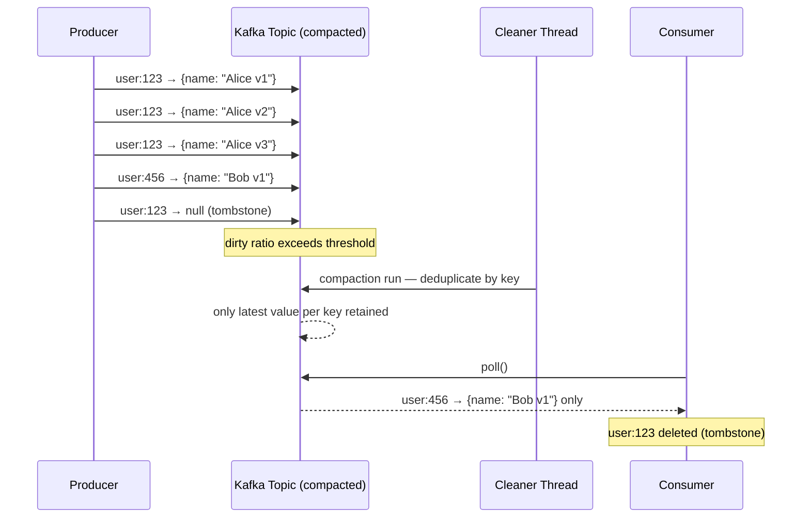

# POC: Kafka Log Compaction

## Quick Overview



*Kafka's log cleaner thread scans dirty segments, keeps only the latest value per key, and removes tombstoned keys after the delete retention window.*

## What You'll Build

A compacted Kafka topic that tracks user profile state. You will:

1. Produce 100 updates to the same key (`user:123`) and a handful of updates to other keys.
2. Produce a **tombstone** (null value) to delete `user:123` for GDPR compliance.
3. Force aggressive compaction settings so the cleaner runs within seconds.
4. Consume the topic after compaction and verify only the **latest value** per key survives.
5. Compare disk usage and consumer behavior between a normal topic and a compacted topic side-by-side.

## Why This Matters

- **Confluent ksqlDB**: Materialises KTable results as compacted changelog topics. Each downstream table re-reads only the latest per-key state on restart, not the full history — enabling fast recovery without a separate database.
- **Kafka Streams**: Every stateful operator (aggregations, joins) writes its local RocksDB state to a compacted changelog topic. Restoring a crashed instance replays only the compacted tail, cutting recovery time from hours to minutes at LinkedIn-scale (>1 trillion messages/day).
- **Debezium CDC**: Publishes database row changes to compacted topics keyed by primary key. Consumers always see the current row state without scanning the full CDC history, a pattern used by Shopify and Zalando for data synchronisation pipelines.

---

## Prerequisites

- Docker Desktop installed and running
- Python 3.9+ (for the producer/consumer scripts)
- `confluent-kafka` Python library (`pip install confluent-kafka`)
- 5–10 minutes

---

## Setup

```yaml
# docker-compose.yml
version: '3.8'

services:
  zookeeper:
    image: confluentinc/cp-zookeeper:7.6.0
    environment:
      ZOOKEEPER_CLIENT_PORT: 2181
      ZOOKEEPER_TICK_TIME: 2000
    ports:
      - "2181:2181"

  kafka:
    image: confluentinc/cp-kafka:7.6.0
    depends_on:
      - zookeeper
    ports:
      - "9092:9092"
    environment:
      KAFKA_BROKER_ID: 1
      KAFKA_ZOOKEEPER_CONNECT: zookeeper:2181
      KAFKA_LISTENER_SECURITY_PROTOCOL_MAP: PLAINTEXT:PLAINTEXT
      KAFKA_ADVERTISED_LISTENERS: PLAINTEXT://localhost:9092
      KAFKA_OFFSETS_TOPIC_REPLICATION_FACTOR: 1
      # Aggressive compaction — runs within seconds (not for production)
      KAFKA_LOG_CLEANER_ENABLE: "true"
      KAFKA_LOG_CLEANER_DEDUPE_BUFFER_SIZE: 1048576       # 1 MB
      KAFKA_LOG_CLEANER_MIN_CLEANABLE_RATIO: 0.01         # compact when 1% dirty
      KAFKA_LOG_CLEANER_DELETE_RETENTION_MS: 5000         # tombstones removed after 5s
      KAFKA_LOG_SEGMENT_BYTES: 102400                     # 100 KB — force segment rolls
      KAFKA_LOG_RETENTION_CHECK_INTERVAL_MS: 1000
```

```bash
# Start the cluster
docker-compose up -d

# Confirm both containers are healthy (wait ~20s)
docker-compose ps
# Expected: zookeeper Up, kafka Up
```

---

## Step-by-Step

### Step 1: Create Topics — Compacted vs Normal

```bash
# Create a COMPACTED topic (our main subject)
docker exec -it <kafka-container-name> \
  kafka-topics --bootstrap-server localhost:9092 \
  --create \
  --topic user-profiles \
  --partitions 1 \
  --replication-factor 1 \
  --config cleanup.policy=compact \
  --config min.cleanable.dirty.ratio=0.01 \
  --config delete.retention.ms=5000 \
  --config segment.bytes=102400

# Create a NORMAL (delete) topic for comparison
docker exec -it <kafka-container-name> \
  kafka-topics --bootstrap-server localhost:9092 \
  --create \
  --topic user-profiles-normal \
  --partitions 1 \
  --replication-factor 1

# Verify both topics exist
docker exec -it <kafka-container-name> \
  kafka-topics --bootstrap-server localhost:9092 --list
# Expected output:
#   user-profiles
#   user-profiles-normal
```

> Replace `<kafka-container-name>` with the actual container name shown by `docker-compose ps` (typically `<project>_kafka_1` or `<project>-kafka-1`).

### Step 2: Produce 100 Updates to the Same Key

Save this as `produce_updates.py`:

```python
#!/usr/bin/env python3
"""
Produce 100 profile updates for user:123 and a few for other users.
The same script writes to both the compacted and normal topics.
"""
import json
import time
from confluent_kafka import Producer

BOOTSTRAP = "localhost:9092"
COMPACTED_TOPIC = "user-profiles"
NORMAL_TOPIC    = "user-profiles-normal"

def delivery_report(err, msg):
    if err:
        print(f"Delivery failed: {err}")

def produce_updates():
    p = Producer({"bootstrap.servers": BOOTSTRAP})

    # 100 updates for user:123 — simulates rapid profile edits
    print("Producing 100 updates for user:123 ...")
    for version in range(1, 101):
        profile = {
            "user_id": "user:123",
            "name": f"Alice (v{version})",
            "email": "alice@example.com",
            "last_updated": time.time(),
            "version": version
        }
        value = json.dumps(profile).encode()

        # Write to BOTH topics so we can compare later
        p.produce(COMPACTED_TOPIC, key="user:123", value=value,
                  callback=delivery_report)
        p.produce(NORMAL_TOPIC,   key="user:123", value=value,
                  callback=delivery_report)

        if version % 20 == 0:
            p.flush()
            print(f"  ... flushed at version {version}")

    # A few updates for other users
    for uid in ["user:456", "user:789", "user:999"]:
        profile = {"user_id": uid, "name": f"User {uid}", "version": 1}
        value = json.dumps(profile).encode()
        p.produce(COMPACTED_TOPIC, key=uid, value=value, callback=delivery_report)
        p.produce(NORMAL_TOPIC,   key=uid, value=value, callback=delivery_report)

    p.flush()
    print("Done producing updates.")

if __name__ == "__main__":
    produce_updates()
```

```bash
python produce_updates.py
# Expected output:
#   Producing 100 updates for user:123 ...
#   ... flushed at version 20
#   ... flushed at version 40
#   ... flushed at version 60
#   ... flushed at version 80
#   ... flushed at version 100
#   Done producing updates.
```

### Step 3: Produce a Tombstone (GDPR Delete)

Save this as `produce_tombstone.py`:

```python
#!/usr/bin/env python3
"""
A tombstone is a message with key=<user-key> and value=None.
Kafka compaction retains the tombstone for delete.retention.ms,
then removes it entirely — erasing the key from the log.
This is the standard pattern for GDPR right-to-erasure in event-driven systems.
"""
from confluent_kafka import Producer

BOOTSTRAP = "localhost:9092"
COMPACTED_TOPIC = "user-profiles"

def produce_tombstone():
    p = Producer({"bootstrap.servers": BOOTSTRAP})

    print("Sending tombstone for user:123 (GDPR delete) ...")
    p.produce(
        COMPACTED_TOPIC,
        key="user:123",
        value=None,      # <-- None value = tombstone
    )
    p.flush()
    print("Tombstone sent. user:123 will be erased after delete.retention.ms (5s).")

if __name__ == "__main__":
    produce_tombstone()
```

```bash
python produce_tombstone.py
# Expected output:
#   Sending tombstone for user:123 (GDPR delete) ...
#   Tombstone sent. user:123 will be erased after delete.retention.ms (5s).
```

### Step 4: Wait for Compaction to Run

```bash
# Kafka's log cleaner thread is already running (enabled in docker-compose).
# With min.cleanable.dirty.ratio=0.01 and segment.bytes=100KB,
# compaction fires within 10–30 seconds after segment rolls.

# Watch the cleaner in the broker logs:
docker-compose logs -f kafka 2>&1 | grep -i "compact\|cleaner\|dirty"

# You should see lines like:
#   [kafka-log-cleaner-thread-0]: Starting cleaning of log user-profiles-0.
#   [kafka-log-cleaner-thread-0]: Cleaned log user-profiles-0 ... 100 -> 3 messages
```

Wait 30 seconds, then continue. The `100 → 3 messages` output confirms compaction ran.
If the cleaner has not fired yet, wait another 15 seconds — segment rolling triggers it.

### Step 5: Consume After Compaction and Compare

Save this as `consume_and_compare.py`:

```python
#!/usr/bin/env python3
"""
Read both topics from the beginning (offset 0) and count messages per key.
After compaction:
  - user-profiles       → 1 message per surviving key (or 0 if tombstoned)
  - user-profiles-normal → all 103 original messages still present
"""
import json
from confluent_kafka import Consumer, TopicPartition, OFFSET_BEGINNING

BOOTSTRAP = "localhost:9092"

def consume_all(topic: str) -> dict:
    """Return {key: [list_of_values]} for every message in the topic."""
    c = Consumer({
        "bootstrap.servers": BOOTSTRAP,
        "group.id": f"poc-reader-{topic}",
        "auto.offset.reset": "earliest",
        "enable.auto.commit": False,
    })

    # Assign partition 0 from the very beginning
    tp = TopicPartition(topic, 0, OFFSET_BEGINNING)
    c.assign([tp])

    messages = {}
    empty_polls = 0

    while empty_polls < 5:
        msg = c.poll(timeout=2.0)
        if msg is None:
            empty_polls += 1
            continue
        if msg.error():
            print(f"Consumer error: {msg.error()}")
            continue

        key   = msg.key().decode() if msg.key() else None
        value = json.loads(msg.value()) if msg.value() else None  # None = tombstone

        if key not in messages:
            messages[key] = []
        messages[key].append(value)

    c.close()
    return messages

def report(topic: str):
    print(f"\n{'='*60}")
    print(f"Topic: {topic}")
    print(f"{'='*60}")

    data = consume_all(topic)
    total_msgs = sum(len(v) for v in data.values())
    print(f"Total messages consumed : {total_msgs}")
    print(f"Unique keys             : {len(data)}")
    print()

    for key, values in sorted(data.items()):
        last = values[-1]
        tombstone = last is None
        count = len(values)
        if tombstone:
            print(f"  {key}: {count} message(s) — TOMBSTONE (deleted)")
        else:
            print(f"  {key}: {count} message(s) — latest version: {last.get('version', '?')}")

if __name__ == "__main__":
    report("user-profiles")
    report("user-profiles-normal")
```

```bash
python consume_and_compare.py
```

**Expected output after compaction:**

```
============================================================
Topic: user-profiles
============================================================
Total messages consumed : 3          # ← only 3 keys survived (tombstone may still show)
Unique keys             : 3

  user:456: 1 message(s) — latest version: 1
  user:789: 1 message(s) — latest version: 1
  user:999: 1 message(s) — latest version: 1
  # user:123 is gone (tombstone deleted after 5s delete.retention.ms)

============================================================
Topic: user-profiles-normal
============================================================
Total messages consumed : 103        # ← all 100 + 3 messages still present
Unique keys             : 4

  user:123: 100 message(s) — latest version: 100
  user:456: 1 message(s)   — latest version: 1
  user:789: 1 message(s)   — latest version: 1
  user:999: 1 message(s)   — latest version: 1
```

> Note: If compaction has not yet erased the tombstone, you will see `user:123: 1 message(s) — TOMBSTONE (deleted)` in the compacted topic. Re-run the consumer after another 10 seconds.

### Step 6: Inspect Disk Usage Difference

```bash
# Check log directory size for each topic
docker exec -it <kafka-container-name> \
  du -sh /var/lib/kafka/data/user-profiles-0/ \
         /var/lib/kafka/data/user-profiles-normal-0/

# Expected (approximate):
#   4.0K    /var/lib/kafka/data/user-profiles-0/
#   28.0K   /var/lib/kafka/data/user-profiles-normal-0/
```

The compacted topic retains ~4% of the original data. This ratio improves further at real-world update frequencies where many thousands of versions accumulate per key.

---

## What to Observe

| Signal | Where to look | What to expect |
|--------|--------------|----------------|
| Cleaner ran | `docker-compose logs kafka \| grep cleaner` | `Starting cleaning of log user-profiles-0` |
| Message count drop | Output of `consume_and_compare.py` | 103 → 3 in compacted topic |
| Tombstone erasure | Re-run consumer after 10s | `user:123` disappears completely |
| Disk savings | `du -sh` comparison | Compacted topic ~7x smaller |
| Broker metric | `kafka.log:type=LogCleaner,name=cleaner-recopy-percent` | Approaches 0 after full compaction |

---

## What Breaks It

### Scenario 1 — Compaction Never Fires

```bash
# Produce only a few messages — dirty ratio stays below threshold
# Solution: lower min.cleanable.dirty.ratio to 0.001 or produce more data
```

Compaction triggers only when the **dirty ratio** (uncompacted bytes / total bytes) exceeds `min.cleanable.dirty.ratio`. With very few messages and a large segment, the threshold is never crossed.

### Scenario 2 — Tombstone Consumed Before Deletion Window

```bash
# Consumer starts within delete.retention.ms of the tombstone being produced
# and receives the tombstone record — value is null
# Application code that does not handle null values will NullPointerException
```

Always guard against null values when consuming compacted topics. Null means "this key is deleted — remove it from your local state."

### Scenario 3 — Key Without a Value in the Middle of a Segment

Compaction only de-duplicates **across segment boundaries**. A message in the **active segment** (the one being written to) is never compacted — it is part of the "head" of the log. New consumers see all messages in the active segment regardless of compaction.

### Scenario 4 — Consumer Sees Version 50, Not Version 100

```bash
# If you consume DURING compaction, you may read an intermediate state.
# Compaction is not atomic — it proceeds segment by segment.
# Consumers should always be idempotent and handle out-of-order or
# intermediate-state messages gracefully.
```

---

## Extend It

1. **Multiple partitions**: Create the topic with `--partitions 3` and observe that compaction runs independently per partition. Keys are distributed by Kafka's default partitioner — re-run the consumer with partition-aware assignment to inspect per-partition state.

2. **Kafka Streams changelog simulation**: Write a Kafka Streams app that maintains a `KTable<String, UserProfile>`. Inspect the auto-created `<app-id>-<store-name>-changelog` topic — it will be compacted by default and hold only the latest value per key.

3. **Increase delete.retention.ms to 60000** (60s) and confirm that tombstones remain visible to consumers for the full retention window before erasure. This is the production setting that gives downstream consumers time to process deletes.

4. **Benchmark compaction throughput**: Produce 1 million messages to 100 unique keys (10,000 updates/key) and time how long the cleaner takes. Compare broker CPU and I/O during the compaction run.

5. **Combine `compact,delete` policies**: Set `cleanup.policy=compact,delete` to get both compaction (deduplicate by key) and time-based deletion (remove segments older than `retention.ms`). This is the policy used for Kafka Streams changelog topics in production.

---

## Key Takeaways

- **Compaction retains exactly 1 message per key** — the most recently produced value. For 100 updates to the same key, you store 1 record instead of 100: a **100x reduction** in retained data for high-churn keys.
- **Tombstones (null values) are the standard GDPR erasure mechanism** for Kafka. After `delete.retention.ms` (default 24h, set to 5s here), the key is completely erased from the log — no value, no key.
- **Compaction fires when dirty ratio > `min.cleanable.dirty.ratio`** (default 0.5 = 50% dirty). Production topics rarely need it below 0.1; aggressive settings (0.01) are only for demos and fast-restart state stores.
- **Active segment is never compacted** — only closed (rolled) segments are eligible. This means consumers always see the full tail of the log, not just compacted state.
- **Kafka Streams and ksqlDB depend on compacted changelog topics** for stateful operator recovery. Without compaction, a crashed Streams instance would need to replay the entire history (potentially terabytes) instead of the compacted tail (kilobytes to megabytes).

---

## References

- 📚 [Kafka Documentation — Log Compaction](https://kafka.apache.org/documentation/#compaction)
- 📖 [Confluent — Log Compaction Deep Dive](https://developer.confluent.io/learn-kafka/architecture/log-compaction/)
- 📖 [Confluent — ksqlDB Table Semantics and Compacted Topics](https://docs.ksqldb.io/en/latest/concepts/materialized-views/)
- 📺 [Kafka Summit — Kafka Streams State Management](https://www.confluent.io/kafka-summit-lon19/kafka-streams-state-management/)
- 📖 [Debezium — Compacted Topics for CDC](https://debezium.io/documentation/reference/stable/connectors/mysql.html#mysql-topic-names)
