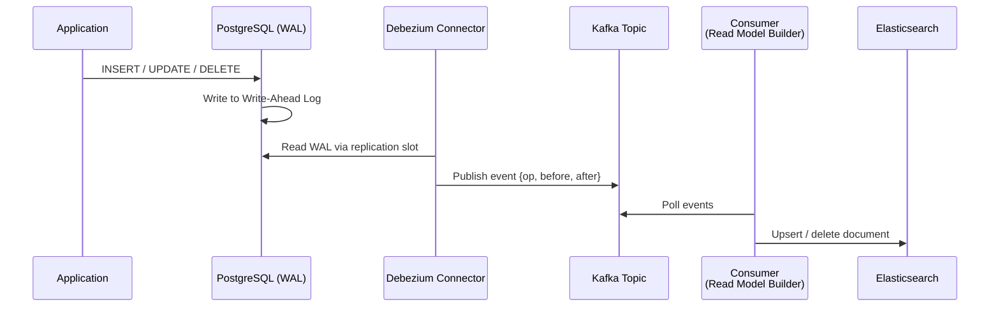

# POC: CDC with Debezium — PostgreSQL → Kafka

> **Difficulty:** 🔴 Advanced
> **Time:** 30–45 minutes
> **Prerequisites:** Docker Desktop, basic Kafka knowledge

## 🗺️ Quick Overview



*Debezium tails the PostgreSQL WAL and turns every row mutation into a Kafka event — zero application code change required.*

## What You'll Build

A complete Change Data Capture pipeline:

1. PostgreSQL table holding a `products` catalogue.
2. Debezium connector streaming every `INSERT`, `UPDATE`, and `DELETE` to Kafka in real time.
3. A Node.js consumer that reads those Kafka events and maintains a materialized view in Elasticsearch — giving you full-text search without any dual-write in app code.

You will see the raw Debezium event envelope (`op`, `before`, `after`, `ts_ms`, `source`) and understand exactly how to build downstream read models from it.

## Why This Matters

- **LinkedIn**: Invented Kafka precisely to replace point-to-point database polling between 70+ microservices. Every DB mutation became an event; downstream systems subscribed rather than queried.
- **Shopify**: Uses CDC via Debezium to keep their Elasticsearch product search index within < 1 s of PostgreSQL without touching application code.
- **Airbnb**: Runs a "Minerva" metrics pipeline where all fact tables are populated by CDC events from transactional databases — no ETL batch jobs, no stale data.

---

## Prerequisites

- Docker Desktop (4 GB RAM allocated minimum)
- Node.js 18+
- 5–10 minutes for containers to pull and start

---

## Setup

### docker-compose.yml

```yaml
# docker-compose.yml
version: '3.8'

services:
  # ── PostgreSQL with logical replication enabled ──────────────────
  postgres:
    image: postgres:15
    container_name: cdc_postgres
    environment:
      POSTGRES_USER: cdc_user
      POSTGRES_PASSWORD: cdc_pass
      POSTGRES_DB: store
    # Enable WAL logical replication (required by Debezium)
    command: >
      postgres
        -c wal_level=logical
        -c max_replication_slots=5
        -c max_wal_senders=5
    ports:
      - "5432:5432"
    volumes:
      - pg_data:/var/lib/postgresql/data
      - ./init.sql:/docker-entrypoint-initdb.d/init.sql

  # ── Zookeeper (Kafka dependency) ─────────────────────────────────
  zookeeper:
    image: confluentinc/cp-zookeeper:7.5.0
    container_name: cdc_zookeeper
    environment:
      ZOOKEEPER_CLIENT_PORT: 2181
      ZOOKEEPER_TICK_TIME: 2000

  # ── Kafka broker ─────────────────────────────────────────────────
  kafka:
    image: confluentinc/cp-kafka:7.5.0
    container_name: cdc_kafka
    depends_on:
      - zookeeper
    ports:
      - "9092:9092"
    environment:
      KAFKA_BROKER_ID: 1
      KAFKA_ZOOKEEPER_CONNECT: zookeeper:2181
      KAFKA_ADVERTISED_LISTENERS: PLAINTEXT://localhost:9092,PLAINTEXT_INTERNAL://kafka:29092
      KAFKA_LISTENER_SECURITY_PROTOCOL_MAP: PLAINTEXT:PLAINTEXT,PLAINTEXT_INTERNAL:PLAINTEXT
      KAFKA_INTER_BROKER_LISTENER_NAME: PLAINTEXT_INTERNAL
      KAFKA_OFFSETS_TOPIC_REPLICATION_FACTOR: 1
      KAFKA_AUTO_CREATE_TOPICS_ENABLE: "true"

  # ── Kafka Connect with Debezium PostgreSQL connector ─────────────
  kafka-connect:
    image: debezium/connect:2.4
    container_name: cdc_connect
    depends_on:
      - kafka
      - postgres
    ports:
      - "8083:8083"
    environment:
      BOOTSTRAP_SERVERS: kafka:29092
      GROUP_ID: 1
      CONFIG_STORAGE_TOPIC: debezium_connect_configs
      OFFSET_STORAGE_TOPIC: debezium_connect_offsets
      STATUS_STORAGE_TOPIC: debezium_connect_statuses
      CONFIG_STORAGE_REPLICATION_FACTOR: 1
      OFFSET_STORAGE_REPLICATION_FACTOR: 1
      STATUS_STORAGE_REPLICATION_FACTOR: 1

  # ── Elasticsearch for the read model ─────────────────────────────
  elasticsearch:
    image: elasticsearch:8.11.0
    container_name: cdc_elasticsearch
    environment:
      discovery.type: single-node
      xpack.security.enabled: "false"
      ES_JAVA_OPTS: "-Xms512m -Xmx512m"
    ports:
      - "9200:9200"

volumes:
  pg_data:
```

### init.sql — seed schema and data

```sql
-- init.sql  (placed at ./init.sql, auto-run on first start)

CREATE TABLE products (
    id          SERIAL PRIMARY KEY,
    name        VARCHAR(200)   NOT NULL,
    description TEXT,
    price       NUMERIC(10, 2) NOT NULL,
    stock       INT            NOT NULL DEFAULT 0,
    category    VARCHAR(100),
    updated_at  TIMESTAMPTZ    DEFAULT NOW()
);

-- Debezium needs REPLICA IDENTITY FULL to capture the BEFORE image
-- on UPDATE and DELETE. Default REPLICA IDENTITY only exposes PK.
ALTER TABLE products REPLICA IDENTITY FULL;

-- Seed data
INSERT INTO products (name, description, price, stock, category) VALUES
  ('Mechanical Keyboard', 'Tactile clicky switches, TKL layout', 129.99, 50, 'electronics'),
  ('Standing Desk',       'Electric height-adjustable, 140 cm wide', 599.00, 12, 'furniture'),
  ('Noise-Cancelling Headphones', 'ANC, 30 h battery', 249.99, 30, 'electronics');
```

### Start the stack

```bash
# Pull images and start (first run ~3 min on fast internet)
docker-compose up -d

# Watch Kafka Connect become ready
docker logs -f cdc_connect 2>&1 | grep "Kafka Connect started"
# Expected: INFO Kafka Connect started (org.apache.kafka.connect.runtime.Connect)
```

---

## Step-by-Step

### Step 1: Verify PostgreSQL has logical replication enabled

```bash
docker exec -it cdc_postgres psql -U cdc_user -d store -c "SHOW wal_level;"
# Expected output:
#  wal_level
# -----------
#  logical
# (1 row)

docker exec -it cdc_postgres psql -U cdc_user -d store -c "SHOW max_replication_slots;"
# Expected output:
#  max_replication_slots
# ----------------------
#  5
# (1 row)
```

Without `wal_level=logical`, Debezium cannot read row-level change events. Default `wal_level=replica` only supports streaming replication to standby servers.

---

### Step 2: Register the Debezium PostgreSQL connector

Send the connector configuration to Kafka Connect's REST API:

```bash
curl -s -X POST http://localhost:8083/connectors \
  -H "Content-Type: application/json" \
  -d '{
    "name": "products-cdc-connector",
    "config": {
      "connector.class": "io.debezium.connector.postgresql.PostgresConnector",
      "database.hostname": "postgres",
      "database.port": "5432",
      "database.user": "cdc_user",
      "database.password": "cdc_pass",
      "database.dbname": "store",
      "database.server.name": "store_server",
      "table.include.list": "public.products",
      "plugin.name": "pgoutput",
      "slot.name": "debezium_products_slot",
      "publication.name": "debezium_publication",
      "topic.prefix": "store_server",
      "snapshot.mode": "initial",
      "tasks.max": "1",
      "key.converter": "org.apache.kafka.connect.json.JsonConverter",
      "value.converter": "org.apache.kafka.connect.json.JsonConverter",
      "key.converter.schemas.enable": "false",
      "value.converter.schemas.enable": "false"
    }
  }' | jq .

# Expected: {"name":"products-cdc-connector","config":{...},"tasks":[],"type":"source"}
```

Verify the connector is running:

```bash
curl -s http://localhost:8083/connectors/products-cdc-connector/status | jq .
# Expected:
# {
#   "name": "products-cdc-connector",
#   "connector": { "state": "RUNNING", "worker_id": "..." },
#   "tasks": [{ "id": 0, "state": "RUNNING", "worker_id": "..." }],
#   "type": "source"
# }
```

The connector performs an **initial snapshot** first: it reads all existing rows and publishes them as `op: "r"` (read) events, then switches to streaming mode from the WAL.

---

### Step 3: Install consumer dependencies

```bash
mkdir cdc-consumer && cd cdc-consumer
npm init -y
npm install kafkajs @elastic/elasticsearch
```

### consumer.js — build the Elasticsearch read model

```javascript
// consumer.js
const { Kafka } = require('kafkajs');
const { Client } = require('@elastic/elasticsearch');

const kafka = new Kafka({
  clientId: 'cdc-consumer',
  brokers: ['localhost:9092'],
});

const es = new Client({ node: 'http://localhost:9200' });

// ── Ensure the Elasticsearch index exists ────────────────────────
async function ensureIndex() {
  const exists = await es.indices.exists({ index: 'products' });
  if (!exists) {
    await es.indices.create({
      index: 'products',
      body: {
        mappings: {
          properties: {
            id:          { type: 'integer' },
            name:        { type: 'text', fields: { keyword: { type: 'keyword' } } },
            description: { type: 'text' },
            price:       { type: 'float' },
            stock:       { type: 'integer' },
            category:    { type: 'keyword' },
            updated_at:  { type: 'date' },
          },
        },
      },
    });
    console.log('Created Elasticsearch index: products');
  }
}

// ── Handle a single CDC event ────────────────────────────────────
async function handleEvent(payload) {
  const { op, before, after, source } = payload;

  // op codes:
  //   "r" — read (initial snapshot)
  //   "c" — create  (INSERT)
  //   "u" — update  (UPDATE)
  //   "d" — delete  (DELETE)
  //   "t" — truncate

  console.log(`\n[${new Date().toISOString()}] op=${op} | table=${source?.table}`);

  if (op === 'r' || op === 'c') {
    // INSERT or snapshot read → index the new document
    console.log(`  + INDEX product id=${after.id} name="${after.name}" price=${after.price}`);
    await es.index({
      index: 'products',
      id: String(after.id),
      document: {
        id:          after.id,
        name:        after.name,
        description: after.description,
        price:       parseFloat(after.price),
        stock:       after.stock,
        category:    after.category,
        updated_at:  new Date(after.updated_at).toISOString(),
      },
    });

  } else if (op === 'u') {
    // UPDATE → partial update (only changed fields)
    console.log(`  ~ UPDATE product id=${after.id}`);
    console.log(`    before: price=${before.price} stock=${before.stock}`);
    console.log(`    after:  price=${after.price}  stock=${after.stock}`);
    await es.update({
      index: 'products',
      id: String(after.id),
      doc: {
        name:        after.name,
        description: after.description,
        price:       parseFloat(after.price),
        stock:       after.stock,
        category:    after.category,
        updated_at:  new Date(after.updated_at).toISOString(),
      },
    });

  } else if (op === 'd') {
    // DELETE → remove document
    const deletedId = before.id;
    console.log(`  - DELETE product id=${deletedId} name="${before.name}"`);
    await es.delete({ index: 'products', id: String(deletedId) });

  } else if (op === 't') {
    console.log('  ! TRUNCATE — deleting all documents');
    await es.deleteByQuery({ index: 'products', body: { query: { match_all: {} } } });
  }
}

// ── Main consumer loop ────────────────────────────────────────────
async function run() {
  await ensureIndex();

  const consumer = kafka.consumer({ groupId: 'cdc-read-model-builder' });
  await consumer.connect();

  // Topic name pattern: <topic.prefix>.<schema>.<table>
  await consumer.subscribe({
    topic: 'store_server.public.products',
    fromBeginning: true,
  });

  console.log('Consuming CDC events from store_server.public.products...\n');

  await consumer.run({
    eachMessage: async ({ message }) => {
      if (!message.value) return; // tombstone (Kafka delete marker)

      const payload = JSON.parse(message.value.toString());
      await handleEvent(payload);
    },
  });
}

run().catch((err) => {
  console.error('Consumer error:', err);
  process.exit(1);
});
```

```bash
node consumer.js
# Expected initial output (snapshot events):
# [2026-06-01T...] op=r | table=products
#   + INDEX product id=1 name="Mechanical Keyboard" price=129.99
# [2026-06-01T...] op=r | table=products
#   + INDEX product id=2 name="Standing Desk" price=599
# [2026-06-01T...] op=r | table=products
#   + INDEX product id=3 name="Noise-Cancelling Headphones" price=249.99
```

---

### Step 4: Trigger INSERT, UPDATE, DELETE and watch events flow

Open a second terminal while `consumer.js` is running.

```bash
# ── INSERT a new product ─────────────────────────────────────────
docker exec -it cdc_postgres psql -U cdc_user -d store -c "
  INSERT INTO products (name, description, price, stock, category)
  VALUES ('USB-C Hub', '7-port, 4K HDMI passthrough', 49.99, 200, 'electronics');
"
# Consumer prints:
# [2026-06-01T...] op=c | table=products
#   + INDEX product id=4 name="USB-C Hub" price=49.99

# ── UPDATE price ─────────────────────────────────────────────────
docker exec -it cdc_postgres psql -U cdc_user -d store -c "
  UPDATE products SET price = 44.99, updated_at = NOW() WHERE id = 4;
"
# Consumer prints:
# [2026-06-01T...] op=u | table=products
#   ~ UPDATE product id=4
#     before: price=49.99 stock=200
#     after:  price=44.99  stock=200

# ── UPDATE stock (simulate sale) ─────────────────────────────────
docker exec -it cdc_postgres psql -U cdc_user -d store -c "
  UPDATE products SET stock = stock - 5 WHERE id = 1;
"
# Consumer prints:
# [2026-06-01T...] op=u | table=products
#   ~ UPDATE product id=1
#     before: price=129.99 stock=50
#     after:  price=129.99  stock=45

# ── DELETE a discontinued product ────────────────────────────────
docker exec -it cdc_postgres psql -U cdc_user -d store -c "
  DELETE FROM products WHERE id = 2;
"
# Consumer prints:
# [2026-06-01T...] op=d | table=products
#   - DELETE product id=2 name="Standing Desk"
```

---

### Step 5: Verify the Elasticsearch read model

```bash
# Full-text search — should return the USB-C Hub
curl -s "http://localhost:9200/products/_search?q=hub&pretty" | jq '.hits.hits[] | {id: ._id, name: ._source.name, price: ._source.price}'
# Expected:
# { "id": "4", "name": "USB-C Hub", "price": 44.99 }

# Confirm deleted product is gone
curl -s "http://localhost:9200/products/_doc/2" | jq '.found'
# Expected: false

# List all indexed products
curl -s "http://localhost:9200/products/_count" | jq .count
# Expected: 3  (seeded 3, added 1, deleted 1)
```

---

## What to Observe

| Signal | Where to look | What it means |
|--------|--------------|---------------|
| Connector lag | `GET /connectors/products-cdc-connector/status` | `tasks[0].state == RUNNING` = healthy |
| Replication slot | `psql: SELECT slot_name, confirmed_flush_lsn FROM pg_replication_slots;` | LSN advances with each commit |
| Kafka topic lag | `kafka-consumer-groups.sh --describe --group cdc-read-model-builder` | LAG column should stay near 0 |
| Debezium offset | Kafka topic `debezium_connect_offsets` | Stores last committed WAL position |
| ES document count | `GET /products/_count` | Should match Postgres row count |

Raw Debezium event envelope (what actually arrives in Kafka):

```json
{
  "op": "u",
  "ts_ms": 1717228800000,
  "before": {
    "id": 4, "name": "USB-C Hub", "price": "49.99", "stock": 200,
    "category": "electronics", "updated_at": "2026-06-01T10:00:00Z"
  },
  "after": {
    "id": 4, "name": "USB-C Hub", "price": "44.99", "stock": 200,
    "category": "electronics", "updated_at": "2026-06-01T10:05:00Z"
  },
  "source": {
    "version": "2.4.0.Final",
    "connector": "postgresql",
    "name": "store_server",
    "db": "store",
    "schema": "public",
    "table": "products",
    "lsn": 23688384,
    "snapshot": "false"
  }
}
```

---

## What Breaks It

### Scenario 1: Connector falls behind on high write volume

```bash
# Simulate burst: 10 000 rapid INSERTs
docker exec -it cdc_postgres psql -U cdc_user -d store -c "
  INSERT INTO products (name, description, price, stock, category)
  SELECT
    'Bulk Product ' || g,
    'Auto-generated',
    (random() * 500)::numeric(10,2),
    (random() * 1000)::int,
    'bulk'
  FROM generate_series(1, 10000) AS g;
"

# Check connector lag spike
curl -s http://localhost:8083/connectors/products-cdc-connector/status | jq .tasks
```

**Symptom**: Consumer lag grows; Elasticsearch falls behind PostgreSQL by thousands of events.

**Fix**: Increase `tasks.max` (Debezium source connectors support only 1 task per table, so partition the load by table) and scale consumers:

```bash
# For multi-table setups, split into separate connectors per logical group
# For consumers, add more instances in the same consumer group:
node consumer.js &   # instance 2
node consumer.js &   # instance 3
# Kafka distributes partition assignments automatically
```

Also tune PostgreSQL's `max_wal_size` to avoid WAL recycling before Debezium reads it:

```sql
-- Check if the replication slot is blocking WAL cleanup
SELECT slot_name, pg_size_pretty(pg_wal_lsn_diff(pg_current_wal_lsn(), confirmed_flush_lsn)) AS lag
FROM pg_replication_slots;
```

If lag exceeds `max_wal_size` (default 1 GB), Postgres will **refuse further writes** to protect disk. Drop the slot if the connector is truly stuck:

```sql
SELECT pg_drop_replication_slot('debezium_products_slot');
```

### Scenario 2: `REPLICA IDENTITY` not set to `FULL`

Remove the `FULL` identity and observe UPDATE/DELETE events:

```bash
docker exec -it cdc_postgres psql -U cdc_user -d store -c "
  ALTER TABLE products REPLICA IDENTITY DEFAULT;
  UPDATE products SET price = 1.00 WHERE id = 1;
"
# Consumer prints:
# op=u | before=null  ← before image is MISSING
```

`REPLICA IDENTITY DEFAULT` only captures the primary key in the before image. You need `FULL` to see which fields changed. Always set `REPLICA IDENTITY FULL` on CDC-tracked tables.

### Scenario 3: Consumer group offset reset loses events

```bash
# Dangerous: resets offset to latest, skipping all buffered events
kafka-consumer-groups.sh \
  --bootstrap-server localhost:9092 \
  --group cdc-read-model-builder \
  --topic store_server.public.products \
  --reset-offsets --to-latest --execute
```

**Fix**: Keep `fromBeginning: false` only on intentional re-deploys; always confirm lag before resetting. Prefer `--to-offset <n>` with a known safe offset.

---

## Extend It

1. **Add a second table** (`orders`) to the same connector by updating `table.include.list` to `public.products,public.orders`. Watch both topics appear in Kafka automatically.

2. **Schema evolution**: Add a column to `products`:
   ```sql
   ALTER TABLE products ADD COLUMN sku VARCHAR(50);
   UPDATE products SET sku = 'SKU-' || id;
   ```
   Debezium detects the schema change and the new field appears in subsequent events — no connector restart required.

3. **Dead-letter queue**: Wrap the `handleEvent` call in a try/catch and publish failed messages to a `cdc-dlq` Kafka topic. Replay them later with a separate consumer.

4. **Idempotent consumer**: Add a `last_lsn` field to Elasticsearch documents and skip events whose `source.lsn` is less than or equal to the stored value. This makes the consumer safe to replay from the beginning.

5. **Exactly-once with transactional outbox**: Compare this CDC approach against the polling outbox in [Outbox Pattern POC](/04-messaging/hands-on/outbox-pattern). CDC removes polling lag but requires WAL access; the outbox works with any DB.

---

## Key Takeaways

- **< 500 ms end-to-end latency** from PostgreSQL commit to Kafka event under normal load — versus 1–5 s polling intervals in outbox-style approaches.
- The Debezium event envelope always carries `op` (`c/u/d/r`), `before`, `after`, and `source.lsn` — use `before` to compute diffs, `lsn` for idempotency.
- `REPLICA IDENTITY FULL` is mandatory on any table you want full before/after diffs on UPDATE and DELETE; without it, `before` is `null` except for the primary key.
- A stalled replication slot will prevent PostgreSQL from recycling WAL files and can fill the disk entirely — always monitor `pg_replication_slots` lag in production.
- `tasks.max > 1` does NOT help a single-table connector; partition load by splitting tables across multiple connector instances or scaling Kafka consumers horizontally.

---

## References

- 📖 [Debezium PostgreSQL Connector Docs](https://debezium.io/documentation/reference/stable/connectors/postgresql.html) — Official configuration reference including `snapshot.mode`, `publication.name`, and slot management.
- 📺 [Change Data Capture with Debezium — Gunnar Morling (Devoxx 2019)](https://www.youtube.com/watch?v=IOZ2Um6e430) — Deep dive from the Debezium creator; covers WAL internals, exactly-once semantics, and schema registry integration.
- 📖 [LinkedIn Engineering: The Log — Jay Kreps](https://engineering.linkedin.com/distributed-systems/log-what-every-software-engineer-should-know-about-real-time-datas-unifying) — The foundational essay that motivated Kafka's design; explains why the database WAL and a message log are the same abstraction.
- 📖 [Shopify Engineering: Capturing Every Change With CDC](https://shopify.engineering/capturing-every-change-shopify-postgres) — Production war story covering replication slot lag, schema evolution, and consumer group management at Shopify scale.
