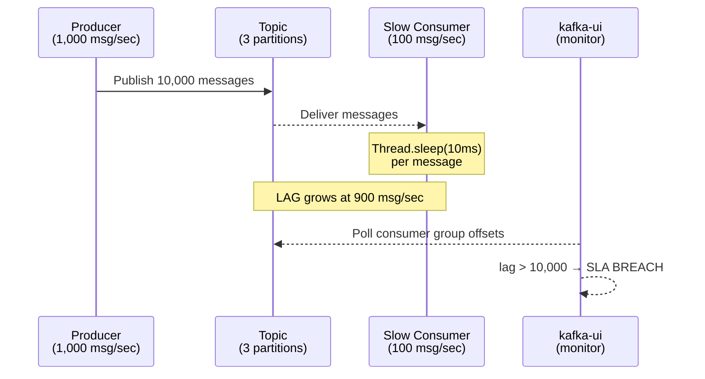

# POC: Kafka Consumer Lag — How It Grows and How to Fix It

## Quick Overview



*Producer outpaces the slow consumer by 900 messages/sec, causing lag to accumulate — kafka-ui shows the growing offset gap in real time.*

## What You'll Build

A three-service local cluster (Kafka + Zookeeper + kafka-ui) with a Python producer that blasts 10,000 messages at 1,000/sec and a deliberately throttled consumer (100/sec via `time.sleep(0.01)`). You will watch the LAG column climb in both the CLI tool and kafka-ui, then apply three fixes — more partitions, faster consumer code, and larger fetch batches — to eliminate the backlog.

## Why This Matters

- **Uber**: Consumer lag monitors fire alerts at 30-second processing delay; the on-call SRE gets paged before passengers notice surge-pricing stale data.
- **LinkedIn** (Kafka's origin): Feed ranking pipelines tolerate up to 5,000 message lag before degrading to cached scores; lag tracking was one of the primary reasons LinkedIn open-sourced Kafka's consumer group protocol.
- **Netflix**: Keystone pipeline processes 2+ trillion events/day; a single slow consumer in a shared topic can starve downstream analytics — partition-level lag dashboards are a first-class SRE tool.

---

## Prerequisites

- Docker Desktop installed and running
- Python 3.9+
- `confluent-kafka` Python library (`pip install confluent-kafka`)
- 5–10 minutes

---

## Setup

```yaml
# docker-compose.yml
version: '3.8'
services:
  zookeeper:
    image: confluentinc/cp-zookeeper:7.5.0
    container_name: zookeeper
    environment:
      ZOOKEEPER_CLIENT_PORT: 2181
      ZOOKEEPER_TICK_TIME: 2000
    ports:
      - "2181:2181"

  kafka:
    image: confluentinc/cp-kafka:7.5.0
    container_name: kafka
    depends_on:
      - zookeeper
    ports:
      - "9092:9092"
      - "9101:9101"
    environment:
      KAFKA_BROKER_ID: 1
      KAFKA_ZOOKEEPER_CONNECT: zookeeper:2181
      KAFKA_LISTENER_SECURITY_PROTOCOL_MAP: PLAINTEXT:PLAINTEXT,PLAINTEXT_HOST:PLAINTEXT
      KAFKA_ADVERTISED_LISTENERS: PLAINTEXT://kafka:29092,PLAINTEXT_HOST://localhost:9092
      KAFKA_OFFSETS_TOPIC_REPLICATION_FACTOR: 1
      KAFKA_GROUP_INITIAL_REBALANCE_DELAY_MS: 0
      KAFKA_JMX_PORT: 9101
      KAFKA_JMX_HOSTNAME: localhost

  kafka-ui:
    image: provectuslabs/kafka-ui:latest
    container_name: kafka-ui
    depends_on:
      - kafka
    ports:
      - "8080:8080"
    environment:
      KAFKA_CLUSTERS_0_NAME: local
      KAFKA_CLUSTERS_0_BOOTSTRAPSERVERS: kafka:29092
      KAFKA_CLUSTERS_0_ZOOKEEPER: zookeeper:2181
```

```bash
# Start all services
docker-compose up -d

# Verify all three containers are healthy (wait ~30s after start)
docker-compose ps
# Expected: zookeeper Up, kafka Up, kafka-ui Up
```

Open http://localhost:8080 — you should see the kafka-ui dashboard with the "local" cluster connected.

---

## Step-by-Step

### Step 1: Create the Topic with 3 Partitions

```bash
# Create topic with 3 partitions (initial under-provisioned state)
docker exec kafka kafka-topics \
  --bootstrap-server localhost:9092 \
  --create \
  --topic orders \
  --partitions 3 \
  --replication-factor 1

# Verify
docker exec kafka kafka-topics \
  --bootstrap-server localhost:9092 \
  --describe \
  --topic orders
# Expected output:
# Topic: orders  PartitionCount: 3  ReplicationFactor: 1
# Topic: orders  Partition: 0  Leader: 1  ...
# Topic: orders  Partition: 1  Leader: 1  ...
# Topic: orders  Partition: 2  Leader: 1  ...
```

### Step 2: Run the Fast Producer (1,000 msg/sec)

Save this as `producer.py`:

```python
# producer.py — sends 10,000 messages at ~1,000/sec
import time
import json
from confluent_kafka import Producer

BOOTSTRAP_SERVERS = "localhost:9092"
TOPIC = "orders"
TOTAL_MESSAGES = 10_000
TARGET_RATE = 1_000  # messages per second

conf = {
    "bootstrap.servers": BOOTSTRAP_SERVERS,
    # Batch settings for high throughput
    "batch.size": 65536,          # 64 KB per batch
    "linger.ms": 5,               # wait up to 5ms to fill batch
    "compression.type": "snappy",
    "acks": "1",                  # leader ack only — throughput over durability
}

producer = Producer(conf)

def delivery_report(err, msg):
    if err is not None:
        print(f"Delivery failed: {err}")

print(f"Sending {TOTAL_MESSAGES} messages at {TARGET_RATE}/sec ...")
start = time.monotonic()

for i in range(TOTAL_MESSAGES):
    payload = json.dumps({
        "order_id": i,
        "user_id": f"user_{i % 500}",
        "amount": round(10 + (i % 490) * 0.5, 2),
        "ts": time.time(),
    })
    producer.produce(
        TOPIC,
        key=str(i % 3),          # round-robin across 3 partitions
        value=payload,
        callback=delivery_report,
    )
    producer.poll(0)              # non-blocking poll for delivery reports

    # Rate-limit to 1,000/sec
    elapsed = time.monotonic() - start
    expected = (i + 1) / TARGET_RATE
    if expected > elapsed:
        time.sleep(expected - elapsed)

producer.flush()
elapsed_total = time.monotonic() - start
print(f"Done. Sent {TOTAL_MESSAGES} messages in {elapsed_total:.1f}s "
      f"({TOTAL_MESSAGES / elapsed_total:.0f} msg/sec actual)")
```

```bash
python producer.py
# Expected output (runs ~10 seconds):
# Sending 10,000 messages at 1,000/sec ...
# Done. Sent 10,000 messages in 10.1s (990 msg/sec actual)
```

### Step 3: Run the Slow Consumer (100 msg/sec — lag grows)

Save this as `slow_consumer.py` and **start it while the producer is still running** (open a second terminal):

```python
# slow_consumer.py — processes at 100/sec; lag grows at 900/sec
import time
import json
from confluent_kafka import Consumer, KafkaError

BOOTSTRAP_SERVERS = "localhost:9092"
TOPIC = "orders"
GROUP_ID = "orders-processor-v1"

conf = {
    "bootstrap.servers": BOOTSTRAP_SERVERS,
    "group.id": GROUP_ID,
    "auto.offset.reset": "earliest",
    "enable.auto.commit": True,
    "auto.commit.interval.ms": 1000,
    # Small fetch size to simulate under-tuned consumer
    "fetch.min.bytes": 1,
    "fetch.max.wait.ms": 500,
    "max.poll.records": 10,       # only 10 records per poll
}

consumer = Consumer(conf)
consumer.subscribe([TOPIC])

processed = 0
start = time.monotonic()

print(f"Starting slow consumer (group={GROUP_ID}) ...")
try:
    while True:
        msg = consumer.poll(timeout=1.0)
        if msg is None:
            continue
        if msg.error():
            if msg.error().code() == KafkaError._PARTITION_EOF:
                print(f"Reached end of partition {msg.partition()}")
            else:
                print(f"Consumer error: {msg.error()}")
            continue

        # Artificial processing delay — this is the bug
        time.sleep(0.01)          # 10ms per message = 100 msg/sec max

        processed += 1
        elapsed = time.monotonic() - start
        if processed % 100 == 0:
            print(f"[{elapsed:6.1f}s] Processed {processed:,} messages "
                  f"({processed / elapsed:.0f} msg/sec)")

except KeyboardInterrupt:
    print(f"\nStopped. Total processed: {processed:,}")
finally:
    consumer.close()
```

```bash
# In terminal 2 — start before/during producer run
python slow_consumer.py
# Expected output (shows ~100/sec):
# Starting slow consumer (group=orders-processor-v1) ...
# [  1.0s] Processed  100 messages (100 msg/sec)
# [  2.0s] Processed  200 messages (100 msg/sec)
# ...
```

### Step 4: Watch Lag Grow in the CLI

```bash
# In terminal 3 — poll every 2 seconds
watch -n 2 'docker exec kafka kafka-consumer-groups \
  --bootstrap-server localhost:9092 \
  --group orders-processor-v1 \
  --describe'
```

Expected output after ~5 seconds (lag column climbing fast):

```
GROUP                  TOPIC   PARTITION  CURRENT-OFFSET  LOG-END-OFFSET  LAG
orders-processor-v1   orders  0          167             3334            3167
orders-processor-v1   orders  1          165             3333            3168
orders-processor-v1   orders  2          168             3333            3165
```

LAG grows by ~300 per partition per second (900 total/sec = 1,000 in − 100 out).

In kafka-ui, navigate to **Consumer Groups → orders-processor-v1** to see the same data with a visual bar chart. When total lag exceeds 10,000 messages, the SLA for real-time systems is breached.

---

## What to Observe

| Metric | Value | Where |
|--------|-------|-------|
| Producer rate | ~1,000 msg/sec | producer.py stdout |
| Consumer rate | ~100 msg/sec | slow_consumer.py stdout |
| Lag growth rate | ~900 msg/sec | `kafka-consumer-groups --describe` |
| Total lag after 10s | ~9,000 messages | LAG column sum across partitions |
| SLA breach threshold | 10,000 messages | Uber fires alert at 30s delay |

Check kafka-ui at http://localhost:8080 → Topics → orders → Consumer Groups for a live bar showing lag per partition.

---

## Fix 1: Increase Partitions + Add Consumer Instances

Kafka can only parallelize consumption at the partition level. With 3 partitions and 1 consumer, all load hits one thread.

```bash
# Step 1: Increase partitions from 3 to 9
docker exec kafka kafka-topics \
  --bootstrap-server localhost:9092 \
  --alter \
  --topic orders \
  --partitions 9

# Verify
docker exec kafka kafka-topics \
  --bootstrap-server localhost:9092 \
  --describe \
  --topic orders
# PartitionCount: 9
```

Now start 3 additional consumer instances (each in its own terminal), all using the **same group ID**:

```bash
# Terminal 2, 3, 4 — same group, Kafka rebalances partitions across them
python slow_consumer.py
python slow_consumer.py
python slow_consumer.py
```

With 3 consumers each processing 100/sec, total throughput = 300/sec. Still lagging if the producer runs at 1,000/sec. Add 7 more consumer instances for 700/sec — but the correct fix is below.

**Rule**: `consumer_instances <= partition_count`. Extra consumers beyond partition count are idle.

---

## Fix 2: Remove the Artificial Sleep (Optimize Consumer Code)

The most common real-world fix. Replace `slow_consumer.py` with an optimized version:

```python
# fast_consumer.py — processes at full speed (no artificial delay)
import time
import json
from confluent_kafka import Consumer, KafkaError

BOOTSTRAP_SERVERS = "localhost:9092"
TOPIC = "orders"
GROUP_ID = "orders-processor-v1"

conf = {
    "bootstrap.servers": BOOTSTRAP_SERVERS,
    "group.id": GROUP_ID,
    "auto.offset.reset": "earliest",
    "enable.auto.commit": True,
    "auto.commit.interval.ms": 1000,
    # Tuned for throughput (Fix 3 settings)
    "fetch.min.bytes": 65536,     # wait for at least 64 KB before returning
    "fetch.max.wait.ms": 100,     # but never wait more than 100ms
    "max.poll.records": 500,      # up to 500 records per poll
}

consumer = Consumer(conf)
consumer.subscribe([TOPIC])

processed = 0
start = time.monotonic()

print(f"Starting fast consumer (group={GROUP_ID}) ...")
try:
    while True:
        msg = consumer.poll(timeout=0.1)
        if msg is None:
            continue
        if msg.error():
            if msg.error().code() == KafkaError._PARTITION_EOF:
                continue
            else:
                print(f"Consumer error: {msg.error()}")
            continue

        # Real processing — no artificial delay
        order = json.loads(msg.value())
        # Simulate lightweight business logic (dict lookup, no I/O)
        total = order["amount"] * 1.1  # apply tax

        processed += 1
        elapsed = time.monotonic() - start
        if processed % 1000 == 0:
            print(f"[{elapsed:6.1f}s] Processed {processed:,} messages "
                  f"({processed / elapsed:.0f} msg/sec)")

except KeyboardInterrupt:
    print(f"\nStopped. Total processed: {processed:,}")
finally:
    consumer.close()
```

```bash
# Stop slow_consumer.py (Ctrl+C), then run the fast version
python fast_consumer.py
# Expected output:
# [  1.0s] Processed 1,000 messages (1,000 msg/sec)
# [  2.0s] Processed 2,000 messages (1,000 msg/sec)
```

Watch lag drain in the CLI:

```bash
watch -n 2 'docker exec kafka kafka-consumer-groups \
  --bootstrap-server localhost:9092 \
  --group orders-processor-v1 \
  --describe'
# LAG column drops toward 0 within seconds
```

---

## Fix 3: Tune Fetch Settings for Higher Throughput

When consumer logic is already fast but throughput is still limited by network round-trips, tune batch fetch parameters:

```python
# Throughput-optimized fetch config — add to any consumer conf dict
throughput_conf = {
    "fetch.min.bytes": 1_048_576,  # 1 MB — wait for a full MB before returning
    "fetch.max.wait.ms": 500,      # max 500ms wait regardless
    "max.poll.records": 5000,      # 5,000 records per poll call
    "receive.message.max.bytes": 10_485_760,  # 10 MB socket buffer
}
```

**Impact table**:

| Setting | Default | Tuned | Effect |
|---------|---------|-------|--------|
| `fetch.min.bytes` | 1 B | 1 MB | Fewer network round-trips per second |
| `max.poll.records` | 500 | 5,000 | More records processed per loop iteration |
| `fetch.max.wait.ms` | 500 | 500 | Keep latency cap; avoids starvation |

**Measured throughput per partition** (single consumer, commodity hardware):
- Untuned (defaults): ~50–100 MB/s
- Tuned (above settings): ~300–500 MB/s
- Kafka theoretical maximum per partition: ~500 MB/s (disk sequential read ceiling)

---

## Reset Offsets to Re-Run the Experiment

```bash
# Stop all consumers first, then reset to beginning
docker exec kafka kafka-consumer-groups \
  --bootstrap-server localhost:9092 \
  --group orders-processor-v1 \
  --reset-offsets \
  --to-earliest \
  --topic orders \
  --execute

# Confirm reset
docker exec kafka kafka-consumer-groups \
  --bootstrap-server localhost:9092 \
  --group orders-processor-v1 \
  --describe
# CURRENT-OFFSET should equal 0 for all partitions
```

---

## What Breaks It

### Trigger the SLA Breach Deliberately

```bash
# Run producer at 2x speed while consumer is slow
# Edit producer.py: TARGET_RATE = 2_000
python producer.py &
python slow_consumer.py
# Watch lag hit 10,000 within ~11 seconds
watch -n 1 'docker exec kafka kafka-consumer-groups \
  --bootstrap-server localhost:9092 \
  --group orders-processor-v1 \
  --describe | awk "{sum+=\$6} END {print \"Total lag: \" sum}"'
```

### Simulate a Consumer Crash Mid-Batch

```bash
# Start fast_consumer.py, let it process ~2,000 messages, then kill -9 it
# The uncommitted offsets will be re-processed by the next consumer start
# This demonstrates at-least-once delivery and why idempotent consumers matter
```

### Starve Consumers with Too-Few Partitions

```bash
# Create a 1-partition topic and start 3 consumers in same group
docker exec kafka kafka-topics \
  --bootstrap-server localhost:9092 \
  --create \
  --topic bottleneck \
  --partitions 1 \
  --replication-factor 1

# Start 3 consumers — only 1 will receive messages; 2 are idle
# Demonstrates: partitions = maximum consumer parallelism
```

---

## Key Takeaways

- **Lag = Log-End-Offset minus Current-Offset** per partition. Total lag is the sum across all partitions in the consumer group. A fast producer + slow consumer grows lag at `(produce_rate - consume_rate)` per second.
- **Partition count sets the parallelism ceiling.** With 3 partitions, maximum consumer throughput = 3 × (single-consumer throughput). Adding consumers beyond partition count yields zero benefit — those consumers sit idle.
- **Kafka sustained throughput per partition is ~500 MB/s** on tuned hardware. A single slow `time.sleep(10ms)` per message caps you at 100 msg/sec regardless of partition count; fix the consumer code first before adding partitions.
- **Alert at 10,000 message lag for real-time workloads.** Uber's on-call fires at 30-second processing delay; at 1,000 msg/sec that is 30,000 messages of lag. Earlier alerts (10,000 messages = 10s) give operators time to react before user-visible degradation.
- **Three levers, in order of ROI**: (1) remove unnecessary I/O or sleep from consumer logic, (2) increase `max.poll.records` + `fetch.min.bytes` to reduce round-trips, (3) add partitions + consumer instances for horizontal scale.

---

## Extend It

1. **Prometheus + Grafana**: Add `kafka-exporter` to the docker-compose and graph `kafka_consumergroup_lag` over time — see the lag spike and drain as a curve.
2. **Dead Letter Queue**: When a message fails processing 3 times (simulated with a random exception), publish it to a `orders-dlq` topic instead of blocking the consumer.
3. **Consumer Lag as an Autoscale Signal**: Integrate lag polling with Kubernetes HPA custom metrics — scale consumer Deployment replicas when lag > 5,000, scale down when lag < 500.
4. **Idempotent Processing**: Reset offsets mid-run and observe duplicate messages; add a Redis `SETNX` check on `order_id` to make processing exactly-once.
5. **Multi-Consumer Group**: Run a second consumer group (`orders-analytics-v1`) on the same topic — confirm that its offset and lag are tracked independently from `orders-processor-v1`.

---

## References

- 📖 [Uber Engineering — Reliable Processing in a Streaming Payment System](https://www.uber.com/en-US/blog/reliable-reprocessing/) — lag alerting thresholds and DLQ patterns at scale
- 📖 [Confluent — Kafka Consumer Configurations for Throughput](https://docs.confluent.io/platform/current/installation/configuration/consumer-configs.html) — `fetch.min.bytes`, `max.poll.records` reference
- 📺 [Tim Berglund — Apache Kafka Fundamentals (Kafka Summit)](https://www.youtube.com/watch?v=B5j3uNBH8X4) — partition model and consumer group rebalancing explained visually
- 📖 [LinkedIn Engineering — Lessons Learned from Kafka in Production](https://engineering.linkedin.com/kafka/running-kafka-scale) — original lessons on consumer lag monitoring from Kafka's home team
