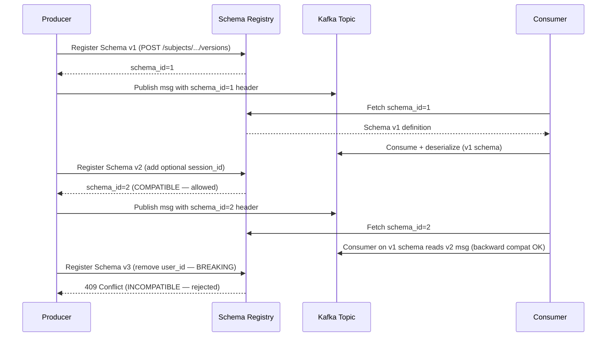

# POC: Avro Schema Evolution with Confluent Schema Registry

## 🗺️ Quick Overview



*Producer registers schemas before publishing; Registry enforces compatibility rules so breaking changes never silently reach consumers.*

## What You'll Build

A three-actor Kafka pipeline: a Python producer that evolves an event schema across three versions, a Confluent Schema Registry enforcing BACKWARD compatibility, and a Python consumer that proves v1 readers can transparently consume v2 messages. You will also trigger a deliberate breaking change (Schema v3) and watch the Registry reject it before it ever touches the topic.

## Why This Matters

- **LinkedIn** (Schema Registry inventor): runs 1 000+ Kafka topics across 2 000+ engineers; Schema Registry prevents silent data corruption when teams independently evolve schemas.
- **Confluent Cloud**: handles **1 billion+ schema lookups per day** at large enterprises, proving the Registry becomes a critical read-path dependency.
- **Uber**: uses Avro + Schema Registry for its geolocation event pipeline (millions of events/sec); backward-compatible schema evolution lets 50+ consumer teams upgrade independently on their own schedule.

---

## Prerequisites

- Docker Desktop ≥ 4.x installed and running
- Python 3.9+
- `curl` available in your terminal
- 10–15 minutes

---

## Setup

```yaml
# docker-compose.yml  — save this file in a new directory (e.g. schema-registry-poc/)
version: '3.8'

services:
  zookeeper:
    image: confluentinc/cp-zookeeper:7.6.0
    hostname: zookeeper
    container_name: zookeeper
    environment:
      ZOOKEEPER_CLIENT_PORT: 2181
      ZOOKEEPER_TICK_TIME: 2000
    healthcheck:
      test: ["CMD", "bash", "-c", "echo ruok | nc localhost 2181"]
      interval: 10s
      timeout: 5s
      retries: 5

  kafka:
    image: confluentinc/cp-kafka:7.6.0
    hostname: kafka
    container_name: kafka
    depends_on:
      zookeeper:
        condition: service_healthy
    ports:
      - "9092:9092"
    environment:
      KAFKA_BROKER_ID: 1
      KAFKA_ZOOKEEPER_CONNECT: zookeeper:2181
      KAFKA_LISTENER_SECURITY_PROTOCOL_MAP: PLAINTEXT:PLAINTEXT,PLAINTEXT_HOST:PLAINTEXT
      KAFKA_ADVERTISED_LISTENERS: PLAINTEXT://kafka:29092,PLAINTEXT_HOST://localhost:9092
      KAFKA_OFFSETS_TOPIC_REPLICATION_FACTOR: 1
      KAFKA_AUTO_CREATE_TOPICS_ENABLE: "true"
    healthcheck:
      test: ["CMD", "kafka-topics", "--bootstrap-server", "localhost:9092", "--list"]
      interval: 15s
      timeout: 10s
      retries: 5

  schema-registry:
    image: confluentinc/cp-schema-registry:7.6.0
    hostname: schema-registry
    container_name: schema-registry
    depends_on:
      kafka:
        condition: service_healthy
    ports:
      - "8081:8081"
    environment:
      SCHEMA_REGISTRY_HOST_NAME: schema-registry
      SCHEMA_REGISTRY_KAFKASTORE_BOOTSTRAP_SERVERS: kafka:29092
      SCHEMA_REGISTRY_LISTENERS: http://0.0.0.0:8081
    healthcheck:
      test: ["CMD", "curl", "-f", "http://localhost:8081/subjects"]
      interval: 15s
      timeout: 10s
      retries: 5

  kafka-ui:
    image: provectuslabs/kafka-ui:latest
    container_name: kafka-ui
    depends_on:
      - kafka
      - schema-registry
    ports:
      - "8080:8080"
    environment:
      KAFKA_CLUSTERS_0_NAME: local
      KAFKA_CLUSTERS_0_BOOTSTRAPSERVERS: kafka:29092
      KAFKA_CLUSTERS_0_SCHEMAREGISTRY: http://schema-registry:8081
```

```bash
# Start the stack (run from the directory containing docker-compose.yml)
docker-compose up -d

# Wait ~30 s, then verify all four containers are healthy
docker-compose ps
# Expected: zookeeper, kafka, schema-registry, kafka-ui all "Up (healthy)"

# Confirm Schema Registry is reachable
curl -s http://localhost:8081/subjects
# Expected: [] (empty list — no schemas yet)
```

---

## Step-by-Step

### Step 1: Install Python Dependencies

```bash
pip install confluent-kafka[avro] requests

# Verify
python -c "import confluent_kafka; print(confluent_kafka.__version__)"
# Expected: 2.x.x
```

### Step 2: Register Schema v1

Schema v1 captures the minimal user event — three required fields.

```bash
# Register schema v1 via the Schema Registry REST API
curl -s -X POST http://localhost:8081/subjects/user-events-value/versions \
  -H "Content-Type: application/vnd.schemaregistry.v1+json" \
  -d '{
    "schema": "{\"type\":\"record\",\"name\":\"UserEvent\",\"namespace\":\"com.example\",\"fields\":[{\"name\":\"user_id\",\"type\":\"string\"},{\"name\":\"event_type\",\"type\":\"string\"},{\"name\":\"timestamp\",\"type\":\"long\"}]}"
  }'
# Expected: {"id":1}   <-- schema_id = 1

# Verify the schema was stored
curl -s http://localhost:8081/subjects/user-events-value/versions/latest | python -m json.tool
# Expected: version=1, schema with user_id / event_type / timestamp
```

### Step 3: Publish Events with Schema v1

Save this as `producer_v1.py`:

```python
# producer_v1.py
import json
import time
from confluent_kafka import SerializingProducer
from confluent_kafka.schema_registry import SchemaRegistryClient
from confluent_kafka.schema_registry.avro import AvroSerializer
from confluent_kafka.serialization import StringSerializer

SCHEMA_REGISTRY_URL = "http://localhost:8081"
KAFKA_BOOTSTRAP = "localhost:9092"
TOPIC = "user-events"

SCHEMA_V1_STR = json.dumps({
    "type": "record",
    "name": "UserEvent",
    "namespace": "com.example",
    "fields": [
        {"name": "user_id",    "type": "string"},
        {"name": "event_type", "type": "string"},
        {"name": "timestamp",  "type": "long"}
    ]
})

def main():
    sr_client = SchemaRegistryClient({"url": SCHEMA_REGISTRY_URL})
    avro_serializer = AvroSerializer(sr_client, SCHEMA_V1_STR)

    producer = SerializingProducer({
        "bootstrap.servers": KAFKA_BOOTSTRAP,
        "key.serializer":   StringSerializer("utf_8"),
        "value.serializer": avro_serializer,
    })

    events = [
        {"user_id": "u-001", "event_type": "page_view",  "timestamp": int(time.time())},
        {"user_id": "u-002", "event_type": "add_to_cart","timestamp": int(time.time())},
        {"user_id": "u-003", "event_type": "purchase",   "timestamp": int(time.time())},
    ]

    for evt in events:
        producer.produce(topic=TOPIC, key=evt["user_id"], value=evt)
        print(f"[v1] Produced: {evt}")

    producer.flush()
    print("Done — 3 v1 messages produced.")

if __name__ == "__main__":
    main()
```

```bash
python producer_v1.py
# Expected output:
# [v1] Produced: {'user_id': 'u-001', 'event_type': 'page_view',  'timestamp': ...}
# [v1] Produced: {'user_id': 'u-002', 'event_type': 'add_to_cart','timestamp': ...}
# [v1] Produced: {'user_id': 'u-003', 'event_type': 'purchase',   'timestamp': ...}
# Done — 3 v1 messages produced.
```

### Step 4: Register Schema v2 (BACKWARD COMPATIBLE — adds optional field)

Schema v2 adds `session_id` with a default of `null`. This is **backward compatible**: a consumer using the v1 schema can still read v2 messages by ignoring the unknown field.

```bash
# Register schema v2 — adds optional session_id with null default
curl -s -X POST http://localhost:8081/subjects/user-events-value/versions \
  -H "Content-Type: application/vnd.schemaregistry.v1+json" \
  -d '{
    "schema": "{\"type\":\"record\",\"name\":\"UserEvent\",\"namespace\":\"com.example\",\"fields\":[{\"name\":\"user_id\",\"type\":\"string\"},{\"name\":\"event_type\",\"type\":\"string\"},{\"name\":\"timestamp\",\"type\":\"long\"},{\"name\":\"session_id\",\"type\":[\"null\",\"string\"],\"default\":null}]}"
  }'
# Expected: {"id":2}   <-- schema_id = 2

# Confirm the Registry accepted both versions
curl -s http://localhost:8081/subjects/user-events-value/versions
# Expected: [1, 2]
```

Now produce v2 events. Save as `producer_v2.py`:

```python
# producer_v2.py
import json
import time
from confluent_kafka import SerializingProducer
from confluent_kafka.schema_registry import SchemaRegistryClient
from confluent_kafka.schema_registry.avro import AvroSerializer
from confluent_kafka.serialization import StringSerializer

SCHEMA_REGISTRY_URL = "http://localhost:8081"
KAFKA_BOOTSTRAP = "localhost:9092"
TOPIC = "user-events"

SCHEMA_V2_STR = json.dumps({
    "type": "record",
    "name": "UserEvent",
    "namespace": "com.example",
    "fields": [
        {"name": "user_id",    "type": "string"},
        {"name": "event_type", "type": "string"},
        {"name": "timestamp",  "type": "long"},
        {"name": "session_id", "type": ["null", "string"], "default": None}
    ]
})

def main():
    sr_client = SchemaRegistryClient({"url": SCHEMA_REGISTRY_URL})
    avro_serializer = AvroSerializer(sr_client, SCHEMA_V2_STR)

    producer = SerializingProducer({
        "bootstrap.servers": KAFKA_BOOTSTRAP,
        "key.serializer":   StringSerializer("utf_8"),
        "value.serializer": avro_serializer,
    })

    events = [
        {"user_id": "u-004", "event_type": "page_view",  "timestamp": int(time.time()), "session_id": "sess-abc123"},
        {"user_id": "u-005", "event_type": "checkout",   "timestamp": int(time.time()), "session_id": "sess-xyz789"},
    ]

    for evt in events:
        producer.produce(topic=TOPIC, key=evt["user_id"], value=evt)
        print(f"[v2] Produced: {evt}")

    producer.flush()
    print("Done — 2 v2 messages produced.")

if __name__ == "__main__":
    main()
```

```bash
python producer_v2.py
# Expected:
# [v2] Produced: {'user_id': 'u-004', ..., 'session_id': 'sess-abc123'}
# [v2] Produced: {'user_id': 'u-005', ..., 'session_id': 'sess-xyz789'}
# Done — 2 v2 messages produced.
```

### Step 5: Consume All Messages Using Schema v1 (Backward Compat Proof)

A consumer registered on v1 should read both v1 and v2 messages without error — `session_id` is silently projected away.

Save as `consumer_v1.py`:

```python
# consumer_v1.py — uses v1 schema to consume both v1 and v2 messages
import json
from confluent_kafka import DeserializingConsumer
from confluent_kafka.schema_registry import SchemaRegistryClient
from confluent_kafka.schema_registry.avro import AvroDeserializer
from confluent_kafka.serialization import StringDeserializer

SCHEMA_REGISTRY_URL = "http://localhost:8081"
KAFKA_BOOTSTRAP = "localhost:9092"
TOPIC = "user-events"

# Consumer deliberately uses v1 schema — no session_id field
SCHEMA_V1_STR = json.dumps({
    "type": "record",
    "name": "UserEvent",
    "namespace": "com.example",
    "fields": [
        {"name": "user_id",    "type": "string"},
        {"name": "event_type", "type": "string"},
        {"name": "timestamp",  "type": "long"}
    ]
})

def main():
    sr_client = SchemaRegistryClient({"url": SCHEMA_REGISTRY_URL})
    avro_deserializer = AvroDeserializer(sr_client, SCHEMA_V1_STR)

    consumer = DeserializingConsumer({
        "bootstrap.servers":  KAFKA_BOOTSTRAP,
        "group.id":           "v1-consumer-group",
        "auto.offset.reset":  "earliest",
        "key.deserializer":   StringDeserializer("utf_8"),
        "value.deserializer": avro_deserializer,
    })

    consumer.subscribe([TOPIC])
    print(f"Consuming from '{TOPIC}' with v1 schema (5 messages expected)...\n")

    received = 0
    while received < 5:
        msg = consumer.poll(timeout=5.0)
        if msg is None:
            print("Waiting for messages...")
            continue
        if msg.error():
            print(f"Error: {msg.error()}")
            break

        record = msg.value()
        print(f"[v1 consumer] key={msg.key()!r:10s}  value={record}")
        # NOTE: session_id is NOT in the output — projected away by v1 schema
        received += 1

    consumer.close()
    print(f"\nConsumed {received} messages — no deserialization errors despite v2 messages.")

if __name__ == "__main__":
    main()
```

```bash
python consumer_v1.py
# Expected output (5 messages — 3 v1 + 2 v2, all deserialized cleanly):
# Consuming from 'user-events' with v1 schema (5 messages expected)...
#
# [v1 consumer] key='u-001'     value={'user_id': 'u-001', 'event_type': 'page_view',  'timestamp': ...}
# [v1 consumer] key='u-002'     value={'user_id': 'u-002', 'event_type': 'add_to_cart','timestamp': ...}
# [v1 consumer] key='u-003'     value={'user_id': 'u-003', 'event_type': 'purchase',   'timestamp': ...}
# [v1 consumer] key='u-004'     value={'user_id': 'u-004', 'event_type': 'page_view',  'timestamp': ...}
# [v1 consumer] key='u-005'     value={'user_id': 'u-005', 'event_type': 'checkout',   'timestamp': ...}
#
# Consumed 5 messages — no deserialization errors despite v2 messages.
#
# KEY OBSERVATION: session_id is absent — the v1 reader projected it away transparently.
```

### Step 6: Attempt Schema v3 — BREAKING CHANGE (Registry Rejects It)

Schema v3 attempts to **remove** `user_id` — a required field. This breaks all existing consumers that depend on it. The Registry enforces BACKWARD compatibility and **must** reject this.

```bash
# Try to register schema v3 — removes user_id (BREAKING)
curl -s -X POST http://localhost:8081/subjects/user-events-value/versions \
  -H "Content-Type: application/vnd.schemaregistry.v1+json" \
  -d '{
    "schema": "{\"type\":\"record\",\"name\":\"UserEvent\",\"namespace\":\"com.example\",\"fields\":[{\"name\":\"event_type\",\"type\":\"string\"},{\"name\":\"timestamp\",\"type\":\"long\"},{\"name\":\"session_id\",\"type\":[\"null\",\"string\"],\"default\":null}]}"
  }'
# Expected: HTTP 409 Conflict
# {"error_code":409,"message":"Schema being registered is incompatible with an earlier schema for subject \"user-events-value\"; ..."}

# The Registry rejected it — user_id removal is NOT backward compatible.
# Existing consumers reading the topic would fail to find user_id in new messages.
```

### Step 7: Inspect Compatibility Rules and Check Before Registering

```bash
# View the global default compatibility level
curl -s http://localhost:8081/config | python -m json.tool
# Expected: {"compatibilityLevel": "BACKWARD"}

# Subject-level override — set FULL for even stricter guarantees
curl -s -X PUT http://localhost:8081/config/user-events-value \
  -H "Content-Type: application/vnd.schemaregistry.v1+json" \
  -d '{"compatibility": "FULL"}'
# Expected: {"compatibility":"FULL"}

# Check compatibility BEFORE registering (dry-run) — use /compatibility endpoint
curl -s -X POST \
  "http://localhost:8081/compatibility/subjects/user-events-value/versions/latest" \
  -H "Content-Type: application/vnd.schemaregistry.v1+json" \
  -d '{
    "schema": "{\"type\":\"record\",\"name\":\"UserEvent\",\"namespace\":\"com.example\",\"fields\":[{\"name\":\"user_id\",\"type\":\"string\"},{\"name\":\"event_type\",\"type\":\"string\"},{\"name\":\"timestamp\",\"type\":\"long\"},{\"name\":\"session_id\",\"type\":[\"null\",\"string\"],\"default\":null},{\"name\":\"country\",\"type\":[\"null\",\"string\"],\"default\":null}]}"
  }'
# Expected: {"is_compatible":true}
# A hypothetical v3 adding an optional country field would be accepted.

# View all registered schemas for the subject
curl -s http://localhost:8081/subjects/user-events-value/versions
# Expected: [1, 2]

# Retrieve a specific version
curl -s http://localhost:8081/subjects/user-events-value/versions/1 | python -m json.tool
# Expected: full schema definition for v1

# List all registered subjects (topics with schemas)
curl -s http://localhost:8081/subjects
# Expected: ["user-events-value"]
```

---

## What to Observe

Open **kafka-ui** at `http://localhost:8080` to inspect visually:

1. **Topics tab** → `user-events` → Messages: see 5 total messages with their schema_id embedded in the message binary header (magic byte `0x00` + 4-byte schema_id).
2. **Schema Registry tab**: two versions of `user-events-value` listed. Click each to see the diff.
3. **Consumer group** `v1-consumer-group` shows lag = 0 after running `consumer_v1.py`.

**Terminal signals to look for**:

| Signal | What it proves |
|--------|---------------|
| `{"id":1}` on v1 POST | Registry stored the schema and assigned a globally unique ID |
| `{"id":2}` on v2 POST | Compatibility check passed — Registry accepted the evolution |
| `HTTP 409` on v3 POST | Incompatible schema rejected **before it enters the topic** |
| 5 clean records in `consumer_v1.py` | BACKWARD compat works: old readers consume new data |
| `session_id` absent in v1-consumer output | Projection semantics: unknown fields silently dropped |

---

## What Breaks It

### Trigger 1: Simulate a legacy consumer hitting a breaking v3 schema

If you manually bypass the Registry (e.g., produce raw Avro bytes without schema_id header), a consumer using the wrong schema receives a deserialization error:

```python
# Deliberately produce with the wrong schema_id to simulate corruption
from confluent_kafka import Producer
import struct

p = Producer({"bootstrap.servers": "localhost:9092"})

# Manually craft a magic-byte + fake schema_id=999 payload (no real Avro body)
bad_payload = b'\x00' + struct.pack('>I', 999) + b'\x00\x00\x00'
p.produce("user-events", value=bad_payload)
p.flush()
# consumer_v1.py will now throw: SchemaRegistryError: Schema not found (404)
# This is the Registry protecting consumers from unknown schema IDs.
```

### Trigger 2: Delete a schema version and see consumers fail

```bash
# Delete v1 schema (soft delete)
curl -s -X DELETE http://localhost:8081/subjects/user-events-value/versions/1
# Expected: 1  (version number deleted)

# Now try to fetch it — consumer would fail to deserialize old messages
curl -s http://localhost:8081/subjects/user-events-value/versions/1
# Expected: {"error_code":40402,"message":"Version 1 not found."}
# Old messages on disk reference schema_id=1 — they can no longer be deserialized.
# Lesson: Never hard-delete schemas while old messages remain on the topic.

# Restore by re-registering (soft-deleted schemas can be re-registered)
# Use the permanent delete endpoint only when retiring a topic entirely:
# curl -X DELETE http://localhost:8081/subjects/user-events-value/versions/1?permanent=true
```

---

## Extend It

1. **Test FORWARD compatibility**: switch the subject to `FORWARD` mode and verify that a consumer using v2 schema can read v1 messages. Add `"default": null` to `session_id` in the v1 reader schema and observe how Avro fills in defaults.

2. **Multi-subject pipeline**: register separate schemas for `-key` and `-value` subjects (`user-events-key` and `user-events-value`). Evolve both independently. This models real pipelines where keys also change.

3. **Schema normalization and fingerprints**: call `GET /schemas/ids/{id}` and compare the MD5 fingerprint of identical schemas registered under different subjects. Observe that Schema Registry deduplicates schemas by content — two subjects sharing the same Avro definition share the same schema_id.

4. **Protobuf or JSON Schema**: replace the `AvroSerializer` with `ProtobufSerializer` or `JSONSchemaSerializer`. Re-run the same compatibility test to see how enforcement differs (Protobuf uses field numbers; JSON Schema uses `additionalProperties`).

5. **CI gate with compatibility check**: add the `/compatibility` dry-run curl call to your CI pipeline. The pipeline fails on a non-200 response before any code reaches production — the same pattern LinkedIn uses to protect 1 000+ topics.

---

## Key Takeaways

- **1 billion+ schema lookups/day** at large enterprises — Schema Registry is a hot read path; run it with replication factor ≥ 3 and behind a CDN-style cache in production.
- **BACKWARD compatibility** (the default) means: *new schema can read old data*. Adding a field with a default is safe; removing a required field is a 409 rejection.
- **Compatibility is enforced at registration time, not at publish time** — the Registry rejects the schema before a single breaking message reaches the topic, protecting all downstream consumers on all 50+ teams instantly.
- A **5-byte magic header** (`0x00` + 4-byte schema_id) is prepended to every Avro message by the Confluent serializer. Consumers fetch the schema once per schema_id and cache it; cold-path latency is ~1–5 ms; warm-path is sub-millisecond.
- **Never hard-delete a schema version** while old messages still exist on a topic with a finite retention window — you will permanently break replay and audit pipelines.
