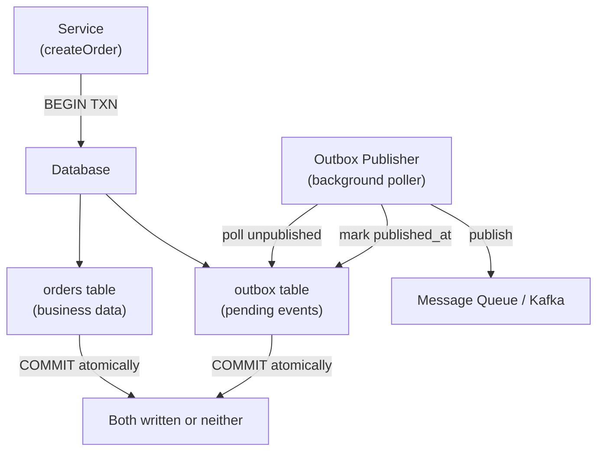

# POC #85: Outbox Pattern

> **Difficulty:** 🔴 Advanced
> **Time:** 30 minutes
> **Prerequisites:** Node.js, PostgreSQL, Message queues

## 🗺️ Quick Overview



*Storing the event in the outbox within the same DB transaction guarantees the event is never lost even if the message broker is down.*

## What You'll Learn

The Outbox Pattern ensures reliable message publishing by storing events in a database table as part of the same transaction, then publishing them asynchronously.

```
PROBLEM: DUAL WRITE
┌─────────────────────────────────────────────────────────────────┐
│                                                                 │
│  Service                                                        │
│     │                                                           │
│     ├─── 1. Write to DB ──────────▶ Database ✅                │
│     │                                                           │
│     └─── 2. Publish Event ────────▶ Message Queue ❌ (fails!)   │
│                                                                 │
│  ⚠️ Data saved but event never published = inconsistency!       │
│                                                                 │
└─────────────────────────────────────────────────────────────────┘

SOLUTION: OUTBOX PATTERN
┌─────────────────────────────────────────────────────────────────┐
│                                                                 │
│  Service                            Outbox Publisher            │
│     │                                     │                     │
│     └─── 1. Transaction ───┐              │                     │
│                            │              │                     │
│          ┌─────────────────▼────────┐     │                     │
│          │  Database                │     │                     │
│          │  ├── orders table        │     │                     │
│          │  └── outbox table ◀──────┼─────┘                     │
│          └──────────────────────────┘     │                     │
│                                           │                     │
│                            2. Poll & Publish                    │
│                                           │                     │
│                                           ▼                     │
│                                    Message Queue                │
│                                                                 │
│  ✅ Atomic: Both writes in same transaction                     │
│  ✅ Reliable: Events guaranteed to be published eventually      │
│                                                                 │
└─────────────────────────────────────────────────────────────────┘
```

---

## Database Schema

```sql
-- outbox_schema.sql

-- Main business table
CREATE TABLE orders (
    id VARCHAR(50) PRIMARY KEY,
    customer_id VARCHAR(50) NOT NULL,
    total DECIMAL(10, 2) NOT NULL,
    status VARCHAR(20) DEFAULT 'pending',
    created_at TIMESTAMP DEFAULT NOW()
);

-- Outbox table for reliable messaging
CREATE TABLE outbox (
    id BIGSERIAL PRIMARY KEY,
    aggregate_type VARCHAR(100) NOT NULL,
    aggregate_id VARCHAR(100) NOT NULL,
    event_type VARCHAR(100) NOT NULL,
    payload JSONB NOT NULL,
    created_at TIMESTAMP DEFAULT NOW(),
    published_at TIMESTAMP,
    retries INT DEFAULT 0
);

-- Index for efficient polling
CREATE INDEX idx_outbox_unpublished ON outbox(created_at)
    WHERE published_at IS NULL;

-- Index for cleanup
CREATE INDEX idx_outbox_published ON outbox(published_at)
    WHERE published_at IS NOT NULL;
```

---

## Implementation

```javascript
// outbox-pattern.js

// ==========================================
// OUTBOX REPOSITORY
// ==========================================

class OutboxRepository {
  constructor(db) {
    this.db = db;
  }

  // Add event to outbox (called within transaction)
  async addEvent(client, event) {
    await client.query(
      `INSERT INTO outbox (aggregate_type, aggregate_id, event_type, payload)
       VALUES ($1, $2, $3, $4)`,
      [event.aggregateType, event.aggregateId, event.eventType, JSON.stringify(event.payload)]
    );
  }

  // Get unpublished events
  async getUnpublishedEvents(limit = 100) {
    const result = await this.db.query(
      `SELECT id, aggregate_type, aggregate_id, event_type, payload, created_at, retries
       FROM outbox
       WHERE published_at IS NULL
       ORDER BY created_at ASC
       LIMIT $1
       FOR UPDATE SKIP LOCKED`,  // Prevent concurrent processing
      [limit]
    );
    return result.rows;
  }

  // Mark event as published
  async markPublished(eventId) {
    await this.db.query(
      `UPDATE outbox SET published_at = NOW() WHERE id = $1`,
      [eventId]
    );
  }

  // Increment retry count
  async incrementRetry(eventId) {
    await this.db.query(
      `UPDATE outbox SET retries = retries + 1 WHERE id = $1`,
      [eventId]
    );
  }

  // Cleanup old published events
  async cleanupPublished(olderThanDays = 7) {
    const result = await this.db.query(
      `DELETE FROM outbox
       WHERE published_at IS NOT NULL
       AND published_at < NOW() - INTERVAL '${olderThanDays} days'`
    );
    return result.rowCount;
  }
}

// ==========================================
// ORDER SERVICE WITH OUTBOX
// ==========================================

class OrderService {
  constructor(db, outboxRepo) {
    this.db = db;
    this.outboxRepo = outboxRepo;
  }

  async createOrder(customerId, items, total) {
    const orderId = `ORD-${Date.now()}`;
    const client = await this.db.connect();

    try {
      await client.query('BEGIN');

      // 1. Insert order
      await client.query(
        `INSERT INTO orders (id, customer_id, total, status)
         VALUES ($1, $2, $3, 'created')`,
        [orderId, customerId, total]
      );

      // 2. Insert event into outbox (same transaction!)
      await this.outboxRepo.addEvent(client, {
        aggregateType: 'Order',
        aggregateId: orderId,
        eventType: 'OrderCreated',
        payload: {
          orderId,
          customerId,
          items,
          total,
          createdAt: new Date().toISOString()
        }
      });

      await client.query('COMMIT');
      console.log(`✅ Order ${orderId} created with outbox event`);

      return { orderId };
    } catch (error) {
      await client.query('ROLLBACK');
      throw error;
    } finally {
      client.release();
    }
  }

  async confirmOrder(orderId) {
    const client = await this.db.connect();

    try {
      await client.query('BEGIN');

      // 1. Update order status
      const result = await client.query(
        `UPDATE orders SET status = 'confirmed' WHERE id = $1 AND status = 'created'
         RETURNING *`,
        [orderId]
      );

      if (result.rows.length === 0) {
        throw new Error('Order not found or already confirmed');
      }

      // 2. Insert event into outbox
      await this.outboxRepo.addEvent(client, {
        aggregateType: 'Order',
        aggregateId: orderId,
        eventType: 'OrderConfirmed',
        payload: {
          orderId,
          confirmedAt: new Date().toISOString()
        }
      });

      await client.query('COMMIT');
      console.log(`✅ Order ${orderId} confirmed with outbox event`);

      return result.rows[0];
    } catch (error) {
      await client.query('ROLLBACK');
      throw error;
    } finally {
      client.release();
    }
  }
}

// ==========================================
// OUTBOX PUBLISHER (Background Process)
// ==========================================

class OutboxPublisher {
  constructor(db, outboxRepo, messageQueue) {
    this.db = db;
    this.outboxRepo = outboxRepo;
    this.messageQueue = messageQueue;
    this.running = false;
    this.pollInterval = 1000;  // 1 second
    this.batchSize = 100;
    this.maxRetries = 5;
  }

  async start() {
    this.running = true;
    console.log('🚀 Outbox publisher started');

    while (this.running) {
      try {
        const published = await this.publishBatch();
        if (published === 0) {
          // No events, wait before next poll
          await this.sleep(this.pollInterval);
        }
      } catch (error) {
        console.error('Publisher error:', error);
        await this.sleep(5000);  // Wait longer on error
      }
    }
  }

  async publishBatch() {
    const events = await this.outboxRepo.getUnpublishedEvents(this.batchSize);

    for (const event of events) {
      try {
        // Skip if max retries exceeded
        if (event.retries >= this.maxRetries) {
          console.log(`⚠️ Event ${event.id} exceeded max retries, skipping`);
          continue;
        }

        // Publish to message queue
        await this.messageQueue.publish(event.event_type, {
          id: event.id,
          aggregateType: event.aggregate_type,
          aggregateId: event.aggregate_id,
          eventType: event.event_type,
          payload: event.payload,
          timestamp: event.created_at
        });

        // Mark as published
        await this.outboxRepo.markPublished(event.id);
        console.log(`📤 Published: ${event.event_type} (ID: ${event.id})`);

      } catch (error) {
        console.error(`Failed to publish event ${event.id}:`, error);
        await this.outboxRepo.incrementRetry(event.id);
      }
    }

    return events.length;
  }

  stop() {
    this.running = false;
    console.log('⏹️ Outbox publisher stopped');
  }

  sleep(ms) {
    return new Promise(r => setTimeout(r, ms));
  }
}

// ==========================================
// MOCK IMPLEMENTATIONS FOR DEMO
// ==========================================

// In-memory database mock
class MockDatabase {
  constructor() {
    this.orders = new Map();
    this.outbox = [];
    this.outboxId = 0;
  }

  async connect() {
    return {
      query: async (sql, params) => this.query(sql, params),
      release: () => {}
    };
  }

  async query(sql, params) {
    // Simplified mock query handling
    if (sql.includes('INSERT INTO orders')) {
      this.orders.set(params[0], {
        id: params[0],
        customer_id: params[1],
        total: params[2],
        status: 'created'
      });
      return { rows: [] };
    }

    if (sql.includes('INSERT INTO outbox')) {
      this.outboxId++;
      this.outbox.push({
        id: this.outboxId,
        aggregate_type: params[0],
        aggregate_id: params[1],
        event_type: params[2],
        payload: JSON.parse(params[3]),
        created_at: new Date(),
        published_at: null,
        retries: 0
      });
      return { rows: [] };
    }

    if (sql.includes('SELECT') && sql.includes('FROM outbox')) {
      const unpublished = this.outbox.filter(e => !e.published_at);
      return { rows: unpublished.slice(0, params[0]) };
    }

    if (sql.includes('UPDATE outbox SET published_at')) {
      const event = this.outbox.find(e => e.id === params[0]);
      if (event) event.published_at = new Date();
      return { rows: [] };
    }

    if (sql.includes('UPDATE orders SET status')) {
      const order = this.orders.get(params[0]);
      if (order && order.status === 'created') {
        order.status = 'confirmed';
        return { rows: [order] };
      }
      return { rows: [] };
    }

    return { rows: [], rowCount: 0 };
  }
}

// Mock message queue
class MockMessageQueue {
  constructor() {
    this.messages = [];
    this.subscribers = new Map();
  }

  async publish(topic, message) {
    this.messages.push({ topic, message, timestamp: new Date() });

    // Notify subscribers
    const handlers = this.subscribers.get(topic) || [];
    for (const handler of handlers) {
      await handler(message);
    }
  }

  subscribe(topic, handler) {
    if (!this.subscribers.has(topic)) {
      this.subscribers.set(topic, []);
    }
    this.subscribers.get(topic).push(handler);
  }

  getMessages() {
    return this.messages;
  }
}

// ==========================================
// DEMONSTRATION
// ==========================================

async function demonstrate() {
  console.log('='.repeat(60));
  console.log('OUTBOX PATTERN');
  console.log('='.repeat(60));

  // Initialize mock infrastructure
  const db = new MockDatabase();
  const messageQueue = new MockMessageQueue();
  const outboxRepo = new OutboxRepository(db);
  const orderService = new OrderService(db, outboxRepo);
  const publisher = new OutboxPublisher(db, outboxRepo, messageQueue);

  // Subscribe to events
  messageQueue.subscribe('OrderCreated', async (event) => {
    console.log(`📬 Received OrderCreated: ${event.payload.orderId}`);
  });

  messageQueue.subscribe('OrderConfirmed', async (event) => {
    console.log(`📬 Received OrderConfirmed: ${event.payload.orderId}`);
  });

  // Create orders (writes to DB + outbox atomically)
  console.log('\n--- Creating Orders ---');
  await orderService.createOrder('CUST-001', [{ productId: 'PROD-1' }], 99.99);
  await orderService.createOrder('CUST-002', [{ productId: 'PROD-2' }], 149.99);

  // Check outbox before publishing
  console.log('\n--- Outbox State (before publishing) ---');
  console.log(`Unpublished events: ${db.outbox.filter(e => !e.published_at).length}`);

  // Publish events from outbox
  console.log('\n--- Publishing from Outbox ---');
  await publisher.publishBatch();

  // Check outbox after publishing
  console.log('\n--- Outbox State (after publishing) ---');
  console.log(`Unpublished events: ${db.outbox.filter(e => !e.published_at).length}`);
  console.log(`Published events: ${db.outbox.filter(e => e.published_at).length}`);

  // Confirm an order
  console.log('\n--- Confirming Order ---');
  const order = db.orders.values().next().value;
  await orderService.confirmOrder(order.id);

  // Publish the confirmation event
  await publisher.publishBatch();

  // Summary
  console.log('\n--- Message Queue Summary ---');
  const messages = messageQueue.getMessages();
  messages.forEach(m => {
    console.log(`  ${m.topic}: ${JSON.stringify(m.message.payload)}`);
  });

  console.log('\n✅ Demo complete!');
}

demonstrate().catch(console.error);
```

---

## Outbox Pattern Benefits

| Benefit | Description |
|---------|-------------|
| **Atomicity** | Event stored in same transaction as data |
| **Reliability** | Events guaranteed to be published |
| **Ordering** | Events published in order |
| **Idempotency** | Can republish safely with deduplication |
| **Debuggability** | Outbox table provides audit trail |

---

## Implementation Variants

```
1. POLLING PUBLISHER (shown above)
   ├── Simple to implement
   ├── Adds latency (poll interval)
   └── Good for: Most use cases

2. CHANGE DATA CAPTURE (CDC)
   ├── Debezium reads database log
   ├── Near real-time
   └── Good for: High-volume systems

3. TRANSACTION LOG TAILING
   ├── Read WAL/binlog directly
   ├── Most efficient
   └── Good for: Extreme scale

4. HYBRID
   ├── CDC + polling fallback
   └── Good for: Mission-critical systems
```

---

## Production Checklist

```
✅ RELIABILITY:
├── Retry logic with backoff
├── Dead letter queue for failures
└── Idempotent consumers

✅ PERFORMANCE:
├── Batch publishing
├── Index on unpublished events
└── Periodic cleanup of old events

✅ MONITORING:
├── Outbox lag metric
├── Failed event alerts
└── Consumer lag tracking
```

---

## Related POCs

- [Event Sourcing Basics](/04-messaging/hands-on/event-sourcing-basics)
- [Saga Pattern](/10-architecture/hands-on/saga-pattern)
- [Idempotency Keys](/07-api-design/hands-on/idempotency-keys)
