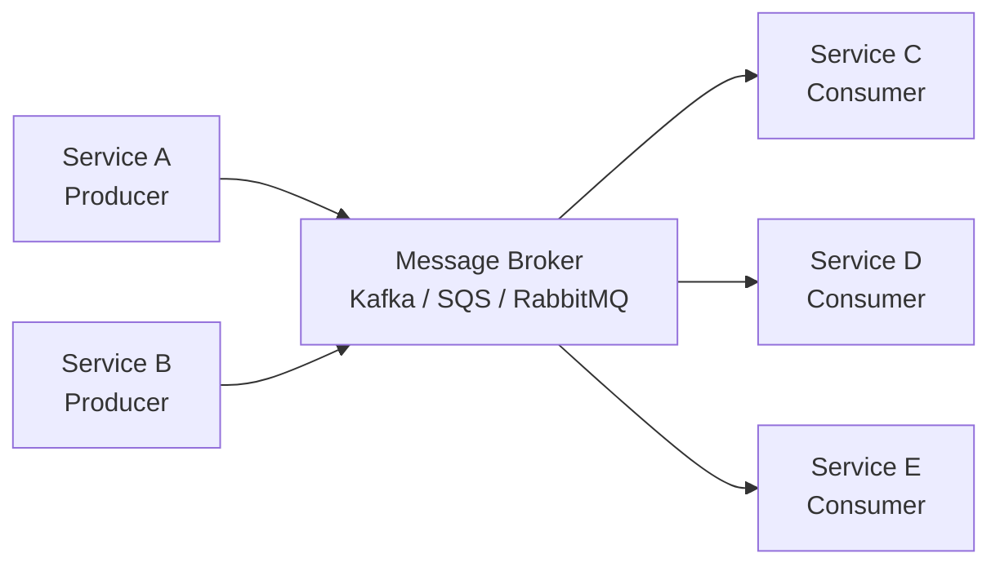

# Messaging & Events

Async messaging decouples services, enables event-driven architectures, and is essential for scaling beyond a single process. This section covers Kafka, event sourcing, the outbox pattern, and more.

## What You'll Learn

- **Concepts**: Message queues, Kafka internals, event sourcing, exactly-once semantics
- **Hands-On**: Build Kafka producers/consumers, implement the outbox pattern
- **Failure Modes**: Message ordering issues and duplicate event processing

## Where to Start

1. [Message Queue Basics](/04-messaging/concepts/message-queue-basics) — Why async messaging matters
2. [Kafka vs RabbitMQ](/04-messaging/concepts/kafka-vs-rabbitmq) — When to use each
3. [Kafka Basics: Producer & Consumer](/04-messaging/hands-on/kafka-basics-producer-consumer) — Your first Kafka program

## Topic Map

| Topic | Concepts | Hands-On | Problems at Scale | Interview Prep |
|-------|----------|----------|-------------------|----------------|
| Queue fundamentals | [message-queue-basics](/04-messaging/concepts/message-queue-basics) | [redis-job-queue](/03-redis/hands-on/redis-job-queue) | [retry-storm](/problems-at-scale/availability/retry-storm) | [message-queues-kafka-rabbitmq](/12-interview-prep/system-design/messaging-and-streaming/message-queues-kafka-rabbitmq) |
| Kafka vs RabbitMQ | [kafka-vs-rabbitmq](/04-messaging/concepts/kafka-vs-rabbitmq) | [kafka-basics-producer-consumer](/04-messaging/hands-on/kafka-basics-producer-consumer) | — | [message-queues-kafka-rabbitmq](/12-interview-prep/system-design/messaging-and-streaming/message-queues-kafka-rabbitmq) |
| Exactly-once | [kafka-exactly-once-semantics](/04-messaging/concepts/kafka-exactly-once-semantics) | [kafka-exactly-once-semantics](/04-messaging/hands-on/kafka-exactly-once-semantics) | — | — |
| Message ordering | [message-ordering-guarantees](/04-messaging/concepts/message-ordering-guarantees) | — | [message-out-of-order](/04-messaging/failures/message-out-of-order) | — |
| Backpressure | [outbox-pattern](/04-messaging/concepts/outbox-pattern) | [backpressure-queues](/04-messaging/hands-on/backpressure-queues) | [retry-storm](/problems-at-scale/availability/retry-storm) | — |
| Async processing | [stream-processing-patterns](/04-messaging/concepts/stream-processing-patterns) | [kafka-streams-real-time-processing](/04-messaging/hands-on/kafka-streams-real-time-processing) | — | [event-driven-architecture](/12-interview-prep/system-design/messaging-and-streaming/event-driven-architecture) |
