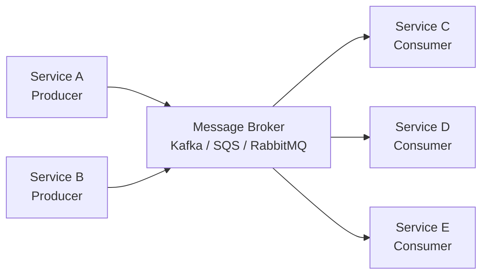

# Messaging & Events

Async messaging decouples services, enables event-driven architectures, and is essential for scaling beyond a single process. This section covers Kafka, event sourcing, the outbox pattern, and more.

## What You'll Learn

- **Concepts**: Message queues, Kafka internals, event sourcing, exactly-once semantics
- **Hands-On**: Build Kafka producers/consumers, implement the outbox pattern
- **Failure Modes**: Message ordering issues and duplicate event processing

## Where to Start

1. [Message Queue Basics](/04-messaging/concepts/message-queue-basics) — Why async messaging matters
2. [Kafka vs RabbitMQ](/04-messaging/concepts/kafka-vs-rabbitmq) — When to use each
3. [Kafka Basics: Producer & Consumer](/04-messaging/hands-on/kafka-basics-producer-consumer) — Your first Kafka program

## Navigate by Role

| I am... | Start here | Goal |
|---------|-----------|------|
| 🟢 Junior | [Message Queue Basics](./concepts/message-queue-basics) | Understand why message queues exist |
| 🟡 Mid-level | [Kafka vs RabbitMQ](./concepts/kafka-vs-rabbitmq) | Choose the right queue technology |
| 🔴 Senior / TL | [Event Sourcing Design](./concepts/event-sourcing-design) + [Failures](./failures) | Design event-driven systems at scale |
| 🏆 Interview prepping | [Messaging & Streaming questions](../../12-interview-prep/system-design/messaging-and-streaming) | Messaging & streaming interview patterns |

## Topic Map

| Topic | 📖 Concept | 🔬 Hands-On | ⚠️ Failures | 🎯 Interview |
|-------|-----------|------------|------------|-------------|
| Queue fundamentals | [message-queue-basics](./concepts/message-queue-basics) | [kafka-basics-producer-consumer](./hands-on/kafka-basics-producer-consumer) | — | [message-queues-kafka-rabbitmq](../../12-interview-prep/system-design/messaging-and-streaming/message-queues-kafka-rabbitmq) |
| Kafka vs RabbitMQ | [kafka-vs-rabbitmq](./concepts/kafka-vs-rabbitmq) | [kafka-consumer-groups-load-balancing](./hands-on/kafka-consumer-groups-load-balancing) | — | [message-queues-kafka-rabbitmq](../../12-interview-prep/system-design/messaging-and-streaming/message-queues-kafka-rabbitmq) |
| Kafka partitioning | [kafka-partitioning-design](./concepts/kafka-partitioning-design) | [kafka-performance-tuning-monitoring](./hands-on/kafka-performance-tuning-monitoring) | — | — |
| Exactly-once semantics | [kafka-exactly-once-semantics](./concepts/kafka-exactly-once-semantics) | [kafka-exactly-once-semantics](./hands-on/kafka-exactly-once-semantics) | [duplicate-event-processing](./failures/duplicate-event-processing) | — |
| Message ordering | [message-ordering-guarantees](./concepts/message-ordering-guarantees) | — | [message-out-of-order](./failures/message-out-of-order) | — |
| Event sourcing | [event-sourcing-design](./concepts/event-sourcing-design) | [event-sourcing-basics](./hands-on/event-sourcing-basics) | — | [event-driven-architecture](../../12-interview-prep/system-design/messaging-and-streaming/event-driven-architecture) |
| Outbox pattern | [outbox-pattern](./concepts/outbox-pattern) | [outbox-pattern](./hands-on/outbox-pattern) | — | — |
| Dead letter queues | [dead-letter-queue-design](./concepts/dead-letter-queue-design) | — | [duplicate-event-processing](./failures/duplicate-event-processing) | — |
| Backpressure | — | [backpressure-queues](./hands-on/backpressure-queues) | — | — |
| Stream processing | [stream-processing-patterns](./concepts/stream-processing-patterns) | [kafka-streams-real-time-processing](./hands-on/kafka-streams-real-time-processing) | — | [event-driven-architecture](../../12-interview-prep/system-design/messaging-and-streaming/event-driven-architecture) |
