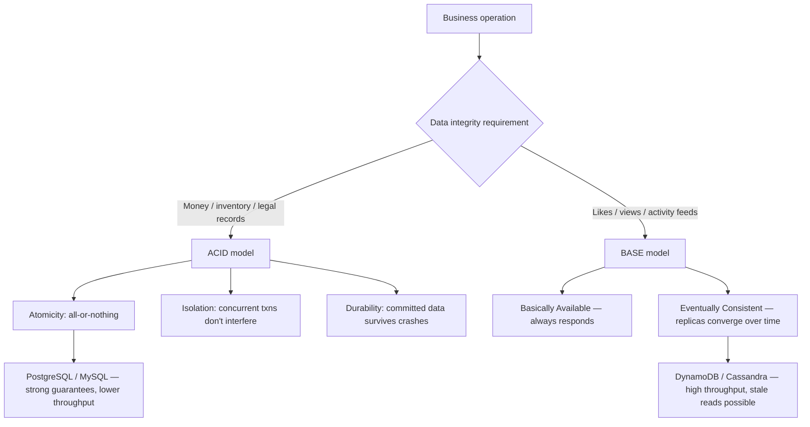
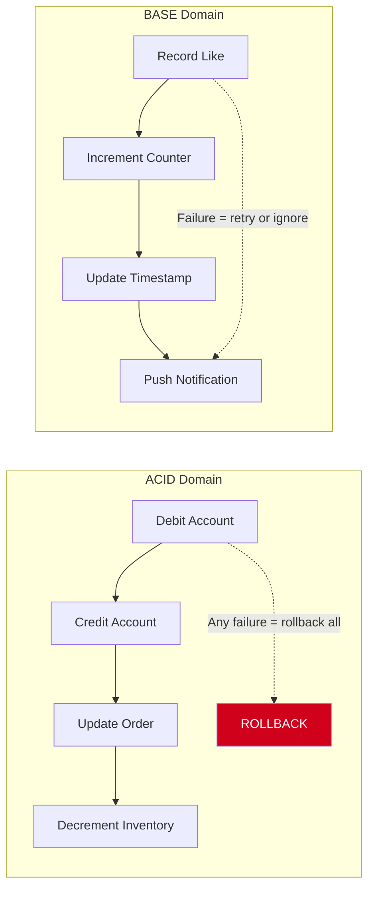
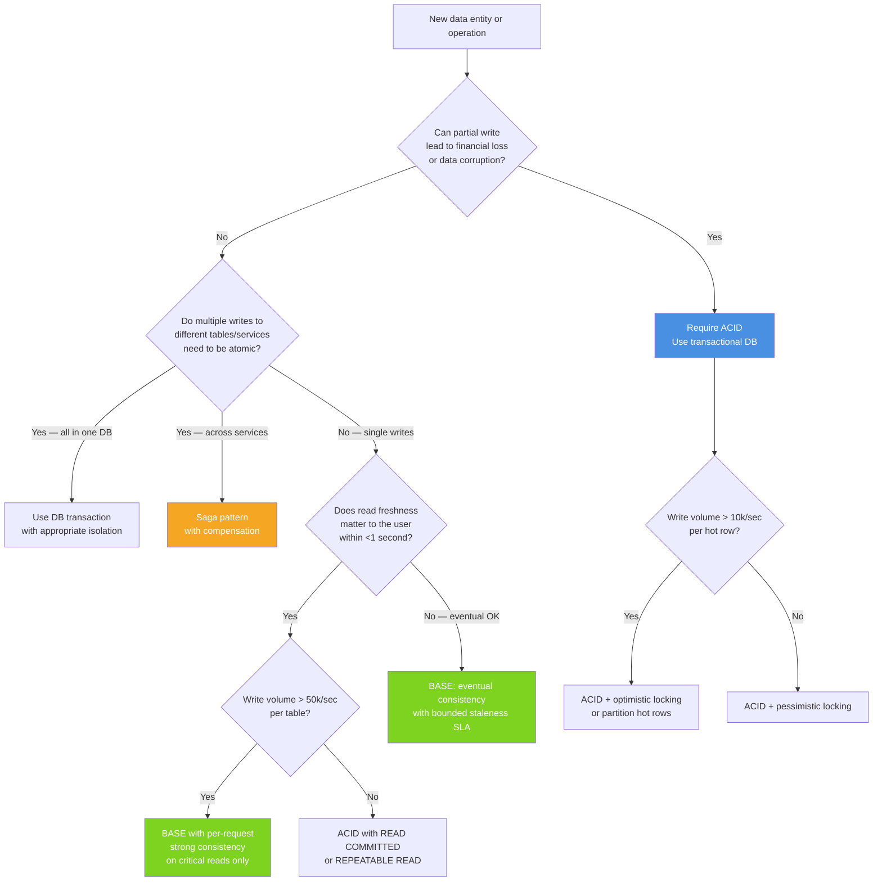

# ACID vs BASE: Transaction Models and When Eventual Consistency Is Safe

## 🗺️ Quick Overview



*ACID and BASE are not database features but business decisions. The model must match the failure cost: losing a payment is catastrophic; a stale like count is acceptable.*

**Your payment service and your activity feed cannot share the same consistency model.** One requires ACID guarantees or users lose money. The other can tolerate eventual consistency or you'll never scale past 10,000 DAU. The mistake is applying the wrong model — and both directions hurt.

Most teams default to ACID (Postgres, MySQL) without asking whether their workload requires it. Fewer teams consciously adopt BASE and design compensating controls. Staff+ engineers map business domains to transaction models before choosing technology.

---

## The Problem Class `[Mid]`

Consider two operations in an e-commerce system:

**Operation A: Payment capture**
1. Debit customer account by $150
2. Credit merchant account by $150
3. Update order status to "paid"
4. Decrement inventory by 1

All four steps must succeed atomically. Partial execution means money disappears. Every intermediate state is wrong.

**Operation B: User activity feed update**
1. Record "user A liked post B"
2. Increment post B's like counter
3. Update user A's "last active" timestamp
4. Push notification to post B's author

Step 1 failing is an error. But if step 3 fails and the like counter shows 999 instead of 1000 for 30 seconds until the next write fixes it, that's operationally acceptable.



The error: using Postgres transactions with row-level locks for the activity feed at 500,000 events/sec. The outcome: lock contention at scale, then engineers "optimize" the payment service to use async writes for speed, removing the atomicity guarantee that was the point.

---

## Why the Obvious Solution Fails `[Senior]`

### "Just use Postgres for everything"

At scale, ACID's isolation guarantees require locking. Every transaction that touches overlapping rows must either acquire locks (pessimistic) or validate at commit time (optimistic). High-throughput write workloads with hot rows (user profiles, counters, global sequences) create lock contention that caps throughput.

PostgreSQL SERIALIZABLE isolation on a hot counter row:
- Single writer: ~50,000 TPS per core
- 10 concurrent writers to same row: ~8,000 TPS (locking overhead)
- 100 concurrent writers to same row: ~1,200 TPS (severe contention)

A "likes" counter with 100,000 users simultaneously viewing a viral post cannot be a PostgreSQL row under SERIALIZABLE isolation.

### "Just use Cassandra with eventual consistency"

A payment service built on Cassandra with eventual consistency cannot guarantee that a user's balance is only debited once per successful charge. Two concurrent requests can both read balance=100, both see sufficient funds, both decrement, and both write 50 — resulting in a net debit of 50 instead of 100. The customer was charged twice but their balance only dropped once.

### The real failure: no explicit mapping

The failure mode isn't "wrong database." It's "no explicit decision made." Teams inherit a database and use it everywhere. The mapping of business domain requirements to consistency models is never written down, and the implicit assumptions become technical debt.

---

## The Solution Landscape `[Senior]`

### ACID Properties — What Each Actually Guarantees

**Atomicity:** A transaction's operations are all-or-nothing. If any operation fails, the entire transaction is rolled back. This is the "no partial writes" guarantee.

*What it doesn't guarantee:* Atomicity only applies within a single transaction against a single database. Across two databases (payment DB + notification DB), you need distributed transactions or saga pattern.

**Consistency:** The database moves from one valid state to another. Constraints (foreign keys, unique indexes, check constraints) are enforced. Business rules baked into the schema (account balance ≥ 0) are guaranteed.

*What it doesn't guarantee:* Application-level business logic consistency. If your code has a bug that computes the wrong debit amount, the database happily commits the wrong amount consistently.

**Isolation:** Concurrent transactions appear to execute serially. At SERIALIZABLE level, the result is identical to running them one at a time. Lower isolation levels (READ COMMITTED, REPEATABLE READ) trade correctness for concurrency.

*The isolation spectrum with actual anomalies:*

| Isolation Level | Dirty Read | Non-Repeatable Read | Phantom Read | Write Skew |
|---|---|---|---|---|
| READ UNCOMMITTED | Possible | Possible | Possible | Possible |
| READ COMMITTED | Prevented | Possible | Possible | Possible |
| REPEATABLE READ | Prevented | Prevented | Possible | Possible |
| SERIALIZABLE | Prevented | Prevented | Prevented | Prevented |

Write skew is the sneaky one: two transactions read the same data, make decisions based on it, and write to different rows — but the combined result violates a constraint. PostgreSQL's default (READ COMMITTED) and even REPEATABLE READ don't prevent write skew. You need SERIALIZABLE.

*Example of write skew:* On-call scheduling system requires at least 1 doctor on call. Two doctors both read: "2 doctors on call." Both decide they can take the day off. Both write their status to "off call." Result: 0 doctors on call. Both individual writes were valid in isolation.

**Durability:** Once a transaction commits, the data is persisted even if the server crashes immediately after. Typically implemented via write-ahead log (WAL) flushed to disk before commit acknowledgment.

*The durability cost:* Every commit requires an fsync. At 7,200 RPM HDDs, fsync takes 7–14ms. With SSDs, 0.1–1ms. With NVMe: 0.02–0.1ms. This is the physical lower bound on commit latency. Batching commits (group commit) amortizes this cost.

**Sizing guidance** `[Staff+]`

ACID throughput model for write-heavy workloads:

```
max_committed_TPS = (1 / fsync_latency) × group_commit_batch_size
```

PostgreSQL default (NVMe SSD, group commit=1):
```
max_TPS = (1 / 0.0001s) × 1 = 10,000 TPS per core
```

With `synchronous_commit = off` (async commit, loses last ~200ms on crash):
```
max_TPS increases to ~100,000 TPS but last ~200ms of commits not guaranteed durable
```

`synchronous_commit = off` is acceptable for session data, analytics events, audit logs. It is not acceptable for financial transactions.

### BASE Properties — What Each Actually Means

**Basically Available:** The system returns a response to every request — possibly stale, possibly an error with partial data — but never simply refuses to respond. Availability is the priority.

**Soft State:** The state of the system may change over time even without new inputs (as replicas converge). You cannot assume data you read is the "current" state.

**Eventually Consistent:** Given no new writes, all replicas converge to the same state. The time window is unbounded in theory, bounded by replica lag in practice (typically milliseconds to seconds, occasionally minutes under load).

**The "eventually" problem:** "Eventually" has no time bound in the BASE definition. Production systems need bounded staleness: "reads will see writes within 5 seconds" is a real SLA. "Reads will eventually see writes" is not.

**Configuration decisions that matter** `[Staff+]`

Cassandra consistency level selection by domain:

```
// Financial data: strong consistency within DC
session.execute(query, ConsistencyLevel.LOCAL_QUORUM);

// User preferences: eventual is fine, but we want fast reads
session.execute(query, ConsistencyLevel.LOCAL_ONE);

// Cross-DC critical path: global consistency (high latency)
session.execute(query, ConsistencyLevel.EACH_QUORUM);  // avoid if possible

// Analytics pipeline: eventual is fine, maximize throughput
session.execute(query, ConsistencyLevel.ONE);
```

### Solution 1: ACID with Optimistic Locking

For high-read, low-write contention workloads that need ACID but can't afford lock contention:

```sql
-- Optimistic locking pattern
BEGIN;
SELECT balance, version FROM accounts WHERE id = $1 FOR UPDATE SKIP LOCKED;
-- Application verifies sufficient balance
UPDATE accounts
  SET balance = balance - $amount, version = version + 1
  WHERE id = $1 AND version = $expected_version;
-- If 0 rows updated: conflict detected, retry
COMMIT;
```

Under optimistic locking:
- No locks held during the "think time" (business logic execution)
- Lock contention only at the moment of write
- Conflict rate = probability two transactions touch same row in same time window

Conflict rate calculation:
```
conflict_rate ≈ (concurrent_writers × avg_transaction_duration) / total_rows_affected
```

For 50 concurrent writers, 50ms transactions, 10,000 active account rows:
```
conflict_rate ≈ (50 × 0.05) / 10,000 = 0.025%
```
At 0.025% conflict rate, retries are infrequent. Optimistic locking is efficient.

**Sizing guidance** `[Staff+]`

When to switch from optimistic to pessimistic locking:
```
if conflict_rate > 1%: switch to pessimistic (SELECT FOR UPDATE)
if conflict_rate > 10%: redesign data model to reduce hot rows
if conflict_rate > 25%: fundamental architecture problem — hot row at this rate means the lock itself is the bottleneck
```

### Solution 2: BASE with Explicit Compensation

When eventual consistency is chosen, make the compensating logic explicit:

```javascript
// Activity feed — BASE model
async function recordLike(userId, postId) {
  // Write to Cassandra with ONE consistency — fast, may be stale
  await cassandra.execute(
    'INSERT INTO likes (user_id, post_id, created_at) VALUES (?, ?, ?)',
    [userId, postId, Date.now()],
    { consistency: 'LOCAL_ONE' }
  );

  // Counter increment — idempotent, CAS not required
  await cassandra.execute(
    'UPDATE post_counters SET like_count = like_count + 1 WHERE post_id = ?',
    [postId],
    { consistency: 'LOCAL_ONE' }
  );

  // Notification — at-least-once, idempotent consumer handles duplicates
  await kafka.produce('notifications', {
    type: 'like',
    userId,
    postId,
    idempotencyKey: `${userId}:${postId}:like`
  });
}
```

The key: every step in a BASE workflow must be either:
1. **Idempotent**: safe to execute multiple times with same result
2. **Compensatable**: have a corresponding undo operation
3. **Retriable**: failure means retry without side effects

**Failure modes** `[Staff+]`

*Compensation failure:* Step 1 succeeds (like recorded), step 2 fails (counter not incremented), compensation job runs but also fails. Counter is now permanently wrong by 1. At 100 million likes/day with 0.001% compensation failure rate: 1,000 uncorrected counter discrepancies per day. For a "likes" counter, this is cosmetic. For an account balance, this is a compliance violation.

*Eventual consistency read window:* User likes a post, immediately views the post, sees 0 likes (their like hasn't replicated yet). This is the read-your-writes violation. Fix: cache the user's own recent likes client-side, show optimistic count.

*Base state drift:* Over time, retries and partial failures cause base state to drift from expected. Without reconciliation jobs, eventual becomes "never for some records." Schedule nightly reconciliation that compares materialized state to event log.

---

## Trade-off Matrix `[Senior]` → `[Staff+]`

| Dimension | ACID | BASE |
|---|---|---|
| Write throughput | Lower (lock overhead, fsync) | Higher (async, no locks) |
| Read freshness | Always current (within transaction) | Configurable staleness |
| Failure handling | Automatic rollback | Manual compensation logic |
| Cross-system atomicity | Requires distributed transactions | Saga pattern |
| Developer complexity | Lower (DB handles consistency) | Higher (app handles conflict) |
| Horizontal scalability | Harder (shared locks, coordinator) | Easier (no coordination needed) |
| Compliance / audit | Easier (DB is the system of record) | Harder (event log reconciliation) |
| Business domains | Financial, inventory, reservations | Feeds, analytics, recommendations |

---

## Decision Framework `[Senior]` → `[Staff+]`



---

## Production Failure Story `[Staff+]`

**The Double-Charge: Mismatched isolation on a payment service**

A fintech startup ran their payment service on PostgreSQL with READ COMMITTED isolation (the default). Their charge flow:

```python
def charge_user(user_id, amount):
    with db.transaction():
        balance = db.query("SELECT balance FROM accounts WHERE id = %s", user_id)
        if balance >= amount:
            db.execute("UPDATE accounts SET balance = balance - %s WHERE id = %s", amount, user_id)
            return "success"
        return "insufficient_funds"
```

Under READ COMMITTED, two concurrent charges of $100 against a $150 balance:
- TX1 reads balance = 150 → sufficient
- TX2 reads balance = 150 → sufficient (TX1 hasn't committed yet)
- TX1 updates balance to 50 → commits
- TX2 updates balance to 50 → commits (overwrites TX1)

Result: two successful charge responses, balance went from 150 to 50 (should be -50). The user was charged $100 twice but only lost $100 from their balance.

**Why READ COMMITTED failed:** It only prevents dirty reads (reading uncommitted data). It does not prevent two transactions from making decisions based on the same pre-committed state.

**The fix:** SERIALIZABLE isolation with retry logic. PostgreSQL's SSI (Serializable Snapshot Isolation) detects this exact pattern (the write skew on the balance row) and aborts one transaction with a serialization failure, which the application retries.

**Post-fix throughput impact:** SERIALIZABLE under normal load (low conflict): ~2% overhead. Under high contention on hot rows: up to 40% overhead. Solution: partition user IDs across multiple database shards so hot rows are distributed.

---

## Observability Playbook `[Staff+]`

### ACID system health

```
# Transaction health
transaction_duration_p99              → alert if > 500ms (lock contention indicator)
transaction_rollback_rate             → alert if > 1% (application logic errors or conflicts)
deadlock_count_total                  → alert if > 0/min sustained (deadlock cycle in schema)
lock_wait_timeout_count_total         → alert if > 0.01% of transactions
serialization_failure_rate            → alert if > 5% (too much contention for SERIALIZABLE)

# Durability
wal_flush_latency_p99                 → alert if > 50ms (I/O degradation)
checkpoint_duration_seconds           → alert if > 30s (checkpoint blocking new writes)
replication_lag_bytes{replica="r1"}  → alert if > 100MB (replica falling behind)
```

### BASE system health

```
# Staleness
read_staleness_p99_seconds            → alert if > SLA (e.g., 5s)
cross_dc_replication_lag_p99_seconds  → alert if > 10s
replica_lag_seconds{replica="r1"}     → leading indicator

# Conflict and compensation
compensation_job_failure_count_total  → alert if > 0 (compensating transactions failing)
event_duplicate_processed_count       → alert if > 0.1% (idempotency logic incorrect)
reconciliation_discrepancy_count      → nightly alert if > threshold per domain

# Availability
read_availability_percent             → alert if < 99.9%
write_availability_percent            → alert if < 99.5% (BASE trades some write availability for speed)
```

---

## Architectural Evolution `[Staff+]`

### 2020–2022: Microservices without distributed transactions

Teams split monoliths into microservices and discovered that ACID transactions don't span service boundaries. The response was either:
1. Shared database (anti-pattern — defeats microservices isolation)
2. Saga pattern (choreography or orchestration) with BASE semantics

Most teams underestimated saga complexity and shipped systems with no compensation logic — effectively "fire and forget" distributed operations.

### 2023–2024: Saga pattern maturity

Frameworks like Temporal.io, Conductor, and AWS Step Functions brought explicit workflow orchestration to saga pattern. Compensation logic became first-class, with visual workflow editors and built-in retry/timeout handling. The abstraction: "describe the saga, framework handles failure."

### 2025–2026: Per-operation consistency configuration

Modern systems reject the binary ACID/BASE choice in favor of per-operation consistency:

- **TiDB / CockroachDB:** ACID across distributed nodes (Raft-based, global ACID) with configurable follower reads for stale-but-fast queries
- **MongoDB transactions + change streams:** ACID multi-document transactions for critical paths, eventual consistency change streams for event-driven processing
- **Fauna:** Calvin protocol for strict serializable distributed transactions without two-phase locking
- **PlanetScale's Vitess:** Horizontal sharding of MySQL with configurable cross-shard transaction support

**2026 direction:** The emergence of "tiered consistency" — a single API where each operation declares its consistency requirement. The database routes to the appropriate replica set and isolation level automatically. Developers annotate operations, not systems:

```typescript
// 2026 API model (Fauna-style or Neon-style)
await db.transaction({ consistency: 'serializable' }, async (tx) => {
  const balance = await tx.accounts.get(userId);
  await tx.accounts.update(userId, { balance: balance - amount });
  await tx.ledger.insert({ debit: userId, amount, timestamp: db.now() });
});

// vs.

const feed = await db.query(
  "SELECT * FROM posts ORDER BY created_at DESC LIMIT 20",
  { consistency: 'bounded_staleness', maxStaleness: '5s' }
);
```

---

## Decision Framework Checklist `[All Levels]`

- [ ] For each data entity, answer: "What is the worst-case outcome of a partial write?" If the answer involves financial loss or data corruption, require ACID.
- [ ] Identify all cross-system operations (span multiple databases or services). For each: design either distributed transaction (2PC or XA) or saga with explicit compensation.
- [ ] Choose isolation level deliberately: start with READ COMMITTED, escalate to SERIALIZABLE only when write skew anomalies are possible and unacceptable.
- [ ] For BASE systems: define bounded staleness SLA explicitly. "Eventually consistent" without a time bound is not an SLA.
- [ ] Make every BASE write idempotent or compensatable. Document which type for each operation.
- [ ] Schedule reconciliation jobs for BASE domains. Nightly at minimum, hourly for financial-adjacent.
- [ ] Load-test ACID systems under contention: run 10x normal concurrency against hot rows, measure lock wait times and conflict rates.
- [ ] Instrument compensation failure rate separately from operation failure rate — they have different causes and escalation paths.
- [ ] Review PostgreSQL default isolation (READ COMMITTED) for any financial logic — it does NOT prevent write skew anomalies.
- [ ] Document the consistency model for every API endpoint in your service. Make it explicit in the API contract.

---
*Written by Gaurav Porwal — 10+ Year Engineer | Tech Lead | Product Owner | Business-Minded Builder*
*Last updated: 2026-03-18*
