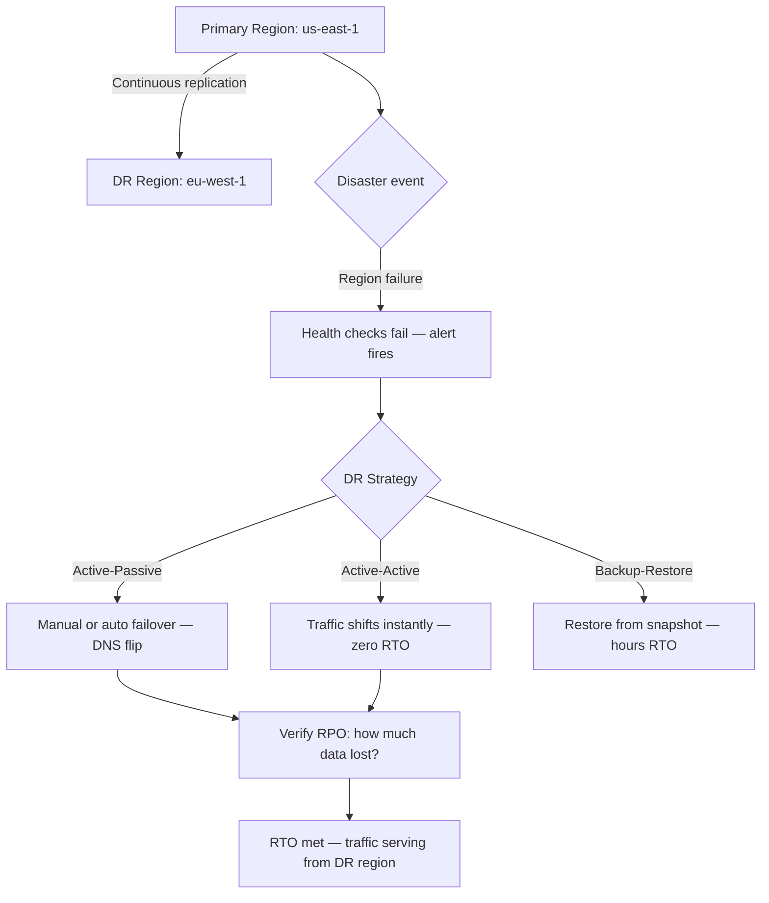
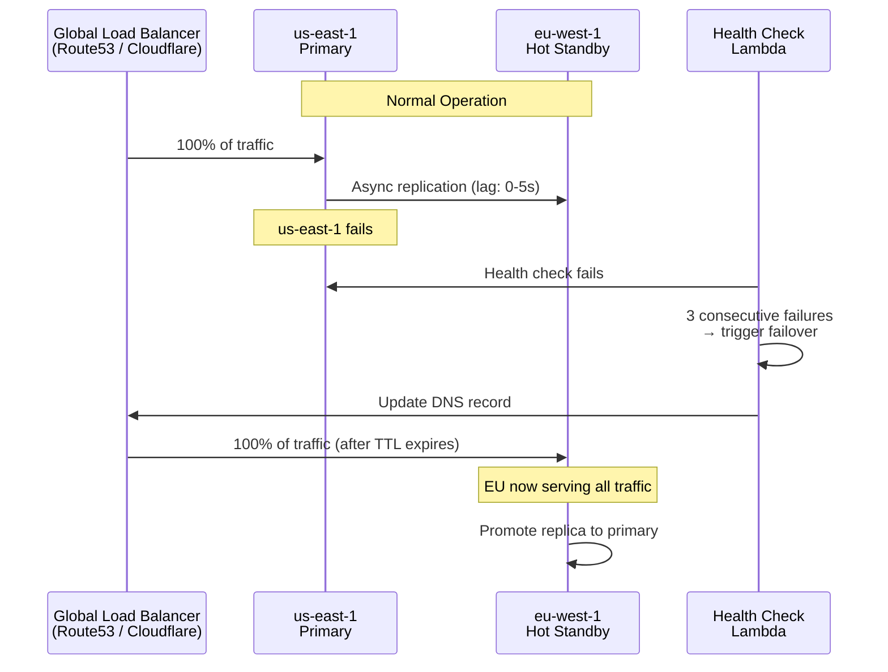
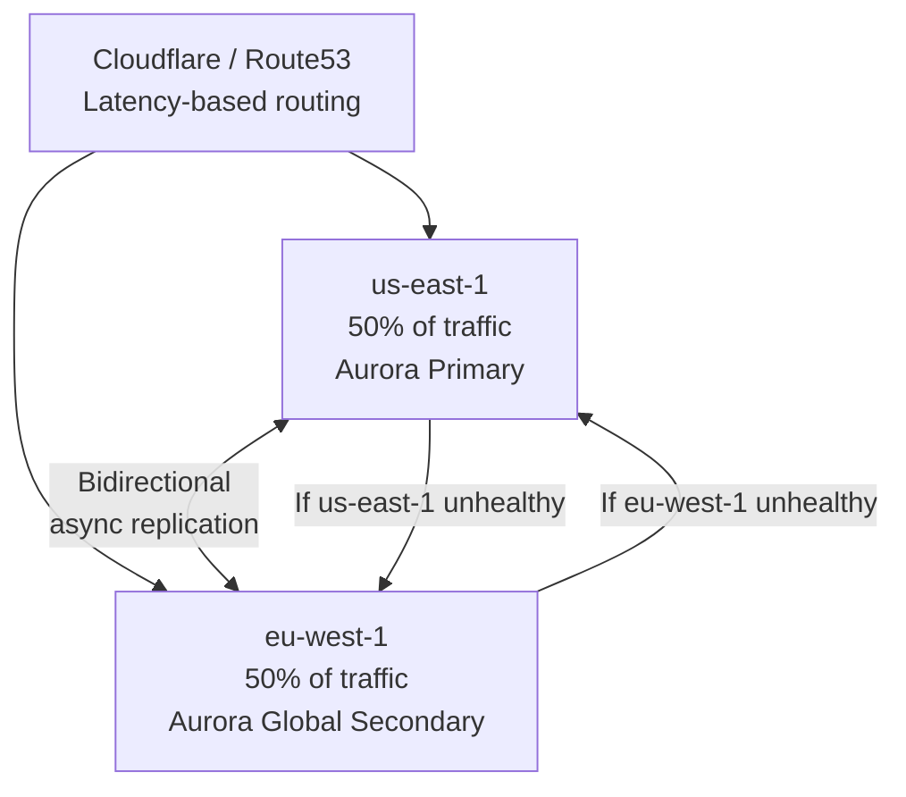

**When AWS us-east-1 goes down at 3 AM, what happens to your system? Disaster recovery design is the difference between a 2-hour outage and a 5-minute failover.**

## 🗺️ Quick Overview



*Normal path: primary serves all traffic, DR region stays warm. Trigger: region-level failure. Cascade: detection → failover decision → DNS update → traffic recovery. RPO and RTO targets determine which strategy applies.*

## The Problem

On February 28, 2017, an AWS engineer typed a command to remove a small set of servers from the us-east-1 S3 billing subsystem. He mistyped the argument and removed a much larger set of servers instead. Netflix, Slack, Expedia, Quora, and thousands of other services went partially or fully offline for over four hours.

Here is what separated the teams that recovered in minutes from those that were down for hours:

```
Team A (no DR plan):
  10:37 AM — S3 starts failing
  10:45 AM — Engineers start getting paged
  11:00 AM — Team realizes it's an AWS issue
  12:30 PM — AWS publishes status update: they're working on it
   2:45 PM — AWS restores S3
   Total downtime: 4+ hours. Zero control.

Team B (active-passive DR):
  10:37 AM — S3 starts failing, health checks fail
  10:38 AM — Automated alert fires: replication lag > threshold
  10:41 AM — On-call engineer triggers failover runbook
  10:46 AM — DNS record updated, traffic routed to eu-west-1
  10:47 AM — System is healthy in EU region
   Total downtime: ~10 minutes. Full control.
```

The fundamental question is: **when something outside your control fails, what does your system do?**

Without a DR plan, the answer is "nothing good." With one, the answer depends on which tier of DR you have implemented and what your business actually requires.

---

## How It Works

### The Core Vocabulary

Before designing anything, you need to agree on three numbers with your business stakeholders:

**RTO — Recovery Time Objective**
How long can your system be completely down before business impact is unacceptable? This is a business decision, not a technical one. "We can tolerate 4 hours of downtime per year" → RTO drives your DR tier choice.

**RPO — Recovery Point Objective**
How much data loss is acceptable? If your last backup was 24 hours ago and your database is destroyed, you've lost 24 hours of data. That is an RPO of 24 hours. "We can lose at most 5 minutes of transaction data" → RPO drives your replication strategy.

**RTA — Recovery Time Actual**
What actually happened during your last incident. This is the number you track after each DR test or real incident. RTA should be less than RTO. If it's not, you have a gap to close.

```
Example mapping to business requirements:

E-commerce checkout:
  RPO: 0 seconds (no payment data loss ever)
  RTO: 5 minutes (revenue loss ~$50K/minute at scale)
  → Needs: Active-Active with synchronous replication

Internal analytics dashboard:
  RPO: 24 hours (data already exists in source systems)
  RTO: 48 hours (nobody is blocked on this)
  → Needs: Cold standby with daily backups

User profile service:
  RPO: 1 hour (users can re-enter preferences)
  RTO: 30 minutes (degraded UX is tolerable short-term)
  → Needs: Warm standby with hourly snapshots
```

### The Four DR Tiers

```mermaid
graph TD
    subgraph Tier1["Tier 1 — Cold Standby"]
        P1[Primary Region<br/>LIVE] --> B1[(Backups<br/>S3 / Glacier)]
        DR1[DR Region<br/>NO INFRASTRUCTURE]
        B1 -.->|Restore manually<br/>hours to days| DR1
    end

    subgraph Tier2["Tier 2 — Warm Standby"]
        P2[Primary Region<br/>LIVE, full capacity] --> R2[(Replica DB<br/>async replication)]
        DR2[DR Region<br/>Scaled-down app<br/>NOT serving traffic]
        R2 -->|Scale up +<br/>redirect traffic<br/>minutes| DR2
    end

    subgraph Tier3["Tier 3 — Hot Standby (Active-Passive)"]
        P3[Primary Region<br/>LIVE, serving 100%] -->|Async replication<br/>lag: seconds| DR3
        DR3[DR Region<br/>Full capacity<br/>NOT serving traffic]
        P3 -->|Health check fails<br/>DNS failover<br/>&lt;5 min| DR3
    end

    subgraph Tier4["Tier 4 — Active-Active"]
        PA[Region A<br/>serving ~50% traffic] <-->|Sync / async<br/>replication| PB[Region B<br/>serving ~50% traffic]
        PA -->|Auto-reroute<br/>if region fails<br/>seconds| PB
    end
```



| Tier | Strategy | RTO | RPO | Cost | Use Case |
|------|----------|-----|-----|------|----------|
| 1 | Cold Standby | Hours–Days | Hours | Low (backups only) | Dev, test, low-criticality |
| 2 | Warm Standby | Minutes (5–30) | Minutes | Medium (~1.5x) | Internal tools, medium SLAs |
| 3 | Hot Standby (Active-Passive) | <5 minutes | Seconds | High (~1.8x) | Customer-facing, revenue-impacting |
| 4 | Active-Active | Seconds (automatic) | Near-zero | Very High (~2x+) | Core payment, real-time trading |

---

## Implementation

### Tier 2: Warm Standby

A warm standby keeps a scaled-down copy of your infrastructure running in a second region, replicating data continuously but not serving live traffic. When disaster strikes, you scale it up and reroute.

```
Warm Standby Architecture:

Primary (us-east-1): Full capacity
├── App servers: 20 instances
├── DB primary: db.r5.4xlarge
└── Cache: Redis cluster (6 nodes)

DR (eu-west-1): Scaled down, idle
├── App servers: 2 instances (scale up on failover)
├── DB replica: db.r5.xlarge (async replica from primary)
└── Cache: Single Redis node

Cost: ~1.3x normal infrastructure cost

Failover procedure (target: <15 minutes):
1. Detect failure (automated health check)
2. Scale up DR app servers to full capacity
3. Promote DR DB replica to primary
4. Update Route53 DNS to point to EU load balancer
5. Warm caches (pre-populate key-value pairs)
6. Verify health checks pass
7. Notify stakeholders
```

```python
# Pseudocode: automated warm standby failover script
def trigger_warm_standby_failover(primary_region, dr_region):
    logger.info(f"Starting failover from {primary_region} to {dr_region}")

    # Step 1: Scale up DR app tier
    asg = autoscaling.get_group(region=dr_region, name="app-servers-dr")
    asg.set_capacity(min=10, desired=20, max=30)
    wait_for_healthy_instances(asg, count=20, timeout_seconds=300)

    # Step 2: Promote read replica to primary
    db_replica = rds.get_instance(region=dr_region, id="db-replica")
    db_replica.promote_to_primary()
    wait_for_db_available(db_replica, timeout_seconds=120)

    # Step 3: Update DNS
    route53.update_record(
        zone="myapp.com",
        name="api.myapp.com",
        type="A",
        value=dr_load_balancer_ip,
        ttl=60  # Low TTL means DNS change propagates in ~1 minute
    )

    # Step 4: Verify
    run_health_checks(endpoint="https://api.myapp.com/health", retries=10)

    logger.info("Failover complete")
    notify_oncall("Failover to EU region complete. Monitor closely.")
```

### Tier 3: Hot Standby (Active-Passive)

The hot standby keeps a full-capacity replica running and synchronized. The only thing not happening in the DR region is serving real traffic.



```python
# Pseudocode: health check + DNS failover
class FailoverController:
    def __init__(self):
        self.failure_count = 0
        self.failure_threshold = 3
        self.dns_ttl = 60  # seconds
        self.check_interval = 30  # seconds

    def run_health_check(self, endpoint):
        try:
            response = http.get(endpoint, timeout=5)
            if response.status == 200:
                self.failure_count = 0  # Reset on success
                return True
        except Exception:
            pass
        self.failure_count += 1
        return False

    def check_and_maybe_failover(self):
        healthy = self.run_health_check("https://primary-elb/health")

        if not healthy and self.failure_count >= self.failure_threshold:
            logger.critical("Primary region unhealthy — initiating failover")
            self.execute_failover()

    def execute_failover(self):
        # Update Route53 health check routing policy
        route53.update_failover_record(
            primary_region="us-east-1",
            secondary_region="eu-west-1",
            action="PROMOTE_SECONDARY"
        )

        # Alert on-call
        pagerduty.trigger(
            title="DR FAILOVER EXECUTED",
            severity="critical",
            details={
                "from": "us-east-1",
                "to": "eu-west-1",
                "rpo_window": "last replication timestamp"
            }
        )
```

### Tier 4: Active-Active

Active-Active is architecturally the most demanding. Both regions serve real traffic simultaneously, which means you must solve the hard distributed systems problem: **concurrent writes in two places at the same time**.



```python
# Pseudocode: conflict resolution for Active-Active writes
class ConflictResolutionStrategy:
    """
    Active-Active requires deciding what happens when:
    User A updates profile in US at T=1000ms
    User A updates profile in EU at T=1001ms
    Both writes propagate to the other region — which wins?
    """

    def resolve_conflict(self, local_record, remote_record):
        # Strategy 1: Last-Write-Wins (LWW)
        # Simple, but can lose updates
        if remote_record.updated_at > local_record.updated_at:
            return remote_record
        return local_record

    def resolve_conflict_crdt(self, local_record, remote_record):
        # Strategy 2: CRDT (Conflict-free Replicated Data Types)
        # Works for counters, sets — harder for arbitrary data
        # Example: merge two shopping carts (union of items)
        merged_cart = set(local_record.items) | set(remote_record.items)
        return {"items": list(merged_cart)}

    def resolve_conflict_region_pinning(self, user_id, operation):
        # Strategy 3: Pin writes to one region per entity
        # User X always writes to US, User Y always writes to EU
        # Reads can happen anywhere
        primary_region = hash(user_id) % 2 == 0 ? "us-east-1" : "eu-west-1"
        if operation == "write" and current_region != primary_region:
            forward_to(primary_region, operation)
```

**Database options for Active-Active:**

| Database | Multi-Region Write Support | Conflict Strategy |
|----------|--------------------------|-------------------|
| Aurora Global Database | Read replicas only (1 primary writer) | Active-Passive at DB level |
| CockroachDB | True multi-region writes | Consensus-based (Raft) |
| Google Spanner | True multi-region writes | TrueTime + 2PC |
| DynamoDB Global Tables | Multi-region writes | Last-Write-Wins per item |
| Cassandra | Multi-region writes | LWW or custom reconciliation |

### Backup Strategy

Regardless of tier, backups are your last line of defense.

**The 3-2-1 Rule:**
- **3** copies of data
- **2** different storage media types
- **1** copy stored off-site (or in a different cloud region/provider)

```python
# Pseudocode: tiered backup schedule
class BackupScheduler:
    def schedule(self):
        # Continuous: transaction log shipping (RPO: seconds)
        cron("* * * * *", self.ship_transaction_logs)

        # Hourly: incremental snapshot (RPO: 1 hour if continuous fails)
        cron("0 * * * *", self.incremental_snapshot)

        # Daily: full backup (RPO: 24 hours if incrementals fail)
        cron("0 2 * * *", self.full_backup)

        # Weekly: archive to cold storage (disaster recovery baseline)
        cron("0 3 * * 0", self.archive_to_glacier)

    def full_backup(self):
        snapshot = db.create_snapshot(label=f"full-{today()}")
        s3.upload(snapshot, bucket="backups-primary", region="us-east-1")
        s3.replicate(snapshot, bucket="backups-dr", region="eu-west-1")  # 3-2-1: off-site
        glacier.archive(snapshot, vault="cold-backups")  # 3-2-1: cold media
        verify_backup_integrity(snapshot)  # CRITICAL: always verify!

    def verify_backup_integrity(self, snapshot):
        # A backup that has never been tested is not a backup.
        # Restore to isolated test environment and run assertions.
        test_env = spin_up_isolated_environment()
        restore_snapshot_to(snapshot, test_env)
        assert_data_integrity(test_env, expected_record_count=snapshot.metadata.row_count)
        teardown(test_env)
```

### Database-Specific DR

**PostgreSQL streaming replication:**
```sql
-- Monitor replication lag on primary
SELECT
  client_addr,
  state,
  sent_lsn,
  write_lsn,
  flush_lsn,
  replay_lsn,
  (sent_lsn - replay_lsn) AS replication_lag_bytes,
  write_lag,
  flush_lag,
  replay_lag
FROM pg_stat_replication;

-- Alert if lag exceeds threshold
-- If replay_lag > '30 seconds', page on-call
```

**Aurora Global Database failover:**
```python
# Aurora Global DB: secondary becomes primary in < 1 minute
# RPO: typically < 5 seconds (replication lag)
# RTO: < 1 minute with automated failover

def promote_aurora_secondary():
    cluster = rds.get_global_cluster("my-global-cluster")
    secondary = cluster.get_secondary_cluster("eu-west-1")

    # Detach from global cluster (makes it writable)
    secondary.remove_from_global_cluster()

    # Update application connection strings
    update_db_endpoint(new_endpoint=secondary.writer_endpoint)
```

**DynamoDB Global Tables:**
```python
# DynamoDB Global Tables: built-in multi-region with LWW conflict resolution
# RPO: typically < 1 second
# RTO: automatic (global load balancer level)

# Configure global table
dynamodb.create_global_table(
    TableName="Orders",
    ReplicationGroup=[
        {"RegionName": "us-east-1"},
        {"RegionName": "eu-west-1"},
        {"RegionName": "ap-southeast-1"}
    ]
)
# Each region can read and write — conflicts resolved by timestamp
```

---

## Real-World Usage

**GitHub (2018 incident)**:
GitHub experienced a 24-hour partial outage due to a network partition during a primary datacenter maintenance event. Their DR was insufficient to handle the split-brain scenario. Databases in the US and EU diverged, and they spent 24 hours reconciling inconsistencies rather than failing over cleanly. Cost: massive reputation damage, millions in SLA credits. Root cause: no tested failover runbook, DNS TTL set too high (30 minutes), and no automated conflict detection.

**AWS itself (2017, us-east-1 S3)**:
The 4-hour S3 outage affected virtually every service running in us-east-1. Teams with multi-region architectures (Netflix, Atlassian) recovered in minutes. Teams without it were completely at AWS's mercy. This single incident permanently changed how the industry thinks about multi-region dependency.

**Netflix (ongoing)**:
Netflix runs true Active-Active across multiple AWS regions using a combination of:
- Latency-based routing via Route53
- Cassandra multi-region clusters
- EVCache (a custom distributed cache) replicated across regions
- Chaos Monkey and Game Days to validate DR continuously
- RTO target: < 5 minutes for any single region failure
- RPO target: 0 for user watch history, 60 seconds for personalization

**Real SLA numbers to calibrate against:**

| Availability | Annual Downtime | Required DR Tier |
|------------|----------------|-----------------|
| 99% | 87.6 hours | Cold standby (or none) |
| 99.9% | 8.76 hours | Warm standby |
| 99.99% | 52.6 minutes | Hot standby |
| 99.999% | 5.26 minutes | Active-Active |

AWS's individual service SLAs are typically 99.9% to 99.99%. Your application SLA depends on how many services you depend on — and their failure modes compound.

---

## Trade-offs

| | Cold Standby | Warm Standby | Hot Standby (Active-Passive) | Active-Active |
|--|------------|-------------|---------------------------|--------------|
| **RTO** | Hours–Days | 5–30 min | <5 min | Seconds (automatic) |
| **RPO** | Hours | Minutes | Seconds | Near-zero |
| **Cost** | Low | ~1.3x | ~1.8x | ~2x+ |
| **Complexity** | Low | Medium | High | Very High |
| **Split-brain risk** | None | Low | Medium | High (must handle) |
| **Best for** | Dev/test, archives | Internal tools | Customer-facing | Revenue-critical |

---

## Common Pitfalls

1. **Untested backups**: "We have backups" is not the same as "we have working backups." A backup that has never been restored is hypothetical. Run a restore drill at least quarterly. Many teams discover their backup files are corrupted, incomplete, or in a format they can't read.

2. **DNS TTL too high**: If your Route53 record has a 15-minute TTL and your failover fires, DNS change propagates after 15 minutes, not instantly. Set TTL to 60 seconds for DR records. The slight overhead of more DNS lookups is worth it.

3. **Split-brain in Active-Passive**: If your primary region is "mostly down" (flapping), your health check may trigger a failover while the primary is still partially serving traffic. Now both regions are accepting writes, and you have conflicting state. Solution: implement fencing — force the primary offline before promoting the secondary.

4. **DR environment configuration drift**: Your DR environment was perfectly in sync 6 months ago when you set it up. Since then, your prod environment got 12 new environment variables, 3 new database schemas, and a different Redis version. The next time you try to fail over, the DR app won't start. **Fix**: treat your DR environment as code (Terraform), run DR deployments in CI alongside prod deployments.

5. **Forgot to test the runbook**: Having a runbook document is not the same as knowing how to execute a failover under pressure at 3 AM. Run Game Days: scheduled exercises where your team practices the entire failover procedure in a non-production environment. Measure your RTA against your RTO.

6. **Replication lag not monitored**: Async replication has lag. If your replication lag is 45 minutes and your RPO is "5 minutes of data loss," you're violating your RPO right now without knowing it. Set up alerts: if replication lag exceeds 50% of your RPO target, page on-call immediately.

---

## Key Takeaways

- RTO is "how long can we be down" — a business constraint, not a technical one. RPO is "how much data can we lose" — drives your replication strategy.
- The four DR tiers (cold, warm, hot, active-active) offer RTO from days down to seconds at increasing cost and complexity. Pick the tier that matches your actual business requirements, not the most impressive one.
- A backup that has never been tested is not a backup. Run regular restore drills and verify data integrity.
- DNS TTL is a silent killer in DR: set it to 60 seconds for failover records so changes propagate quickly.
- Active-Active requires solving conflict resolution — two regions accepting writes simultaneously means you need a deliberate strategy: Last-Write-Wins, CRDT, or region-pinned writes.
- DR environment drift is the most common reason failovers fail in practice. Treat your DR environment as code and deploy to it continuously.
- Game Days (scheduled failover drills) are the only reliable way to know your actual RTA before a real incident proves it to you.
