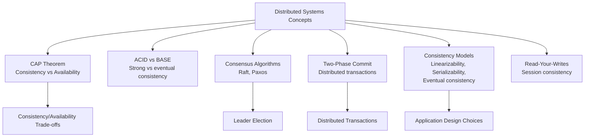

# Distributed Systems Concepts

Core theory: CAP theorem, consensus, consistency models, and distributed transactions.

```mermaid
graph TD
    CONCEPTS[Distributed Systems Concepts]
    CONCEPTS --> CAP[CAP Theorem\nConsistency vs Availability]
    CONCEPTS --> ACID[ACID vs BASE\nStrong vs eventual consistency]
    CONCEPTS --> CONSENSUS[Consensus Algorithms\nRaft, Paxos]
    CONCEPTS --> 2PC[Two-Phase Commit\nDistributed transactions]
    CONCEPTS --> CONSIST[Consistency Models\nLinearizability, Serializability,\nEventual consistency]
    CONCEPTS --> RWCONSIST[Read-Your-Writes\nSession consistency]
    CAP --> TRADEOFFS[Consistency/Availability Trade-offs]
    CONSENSUS --> LEADER[Leader Election]
    2PC --> DIST_TXN[Distributed Transactions]
    CONSIST --> APP[Application Design Choices]
```
