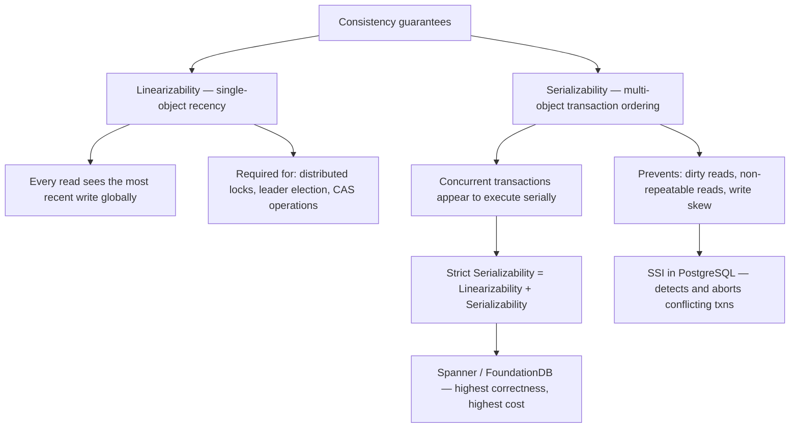
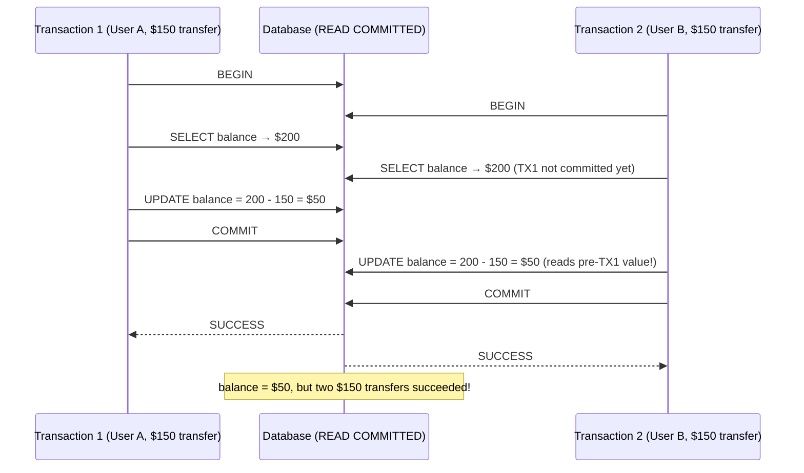
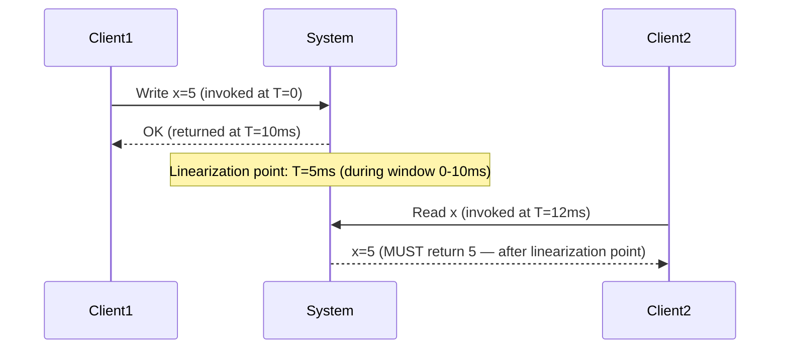
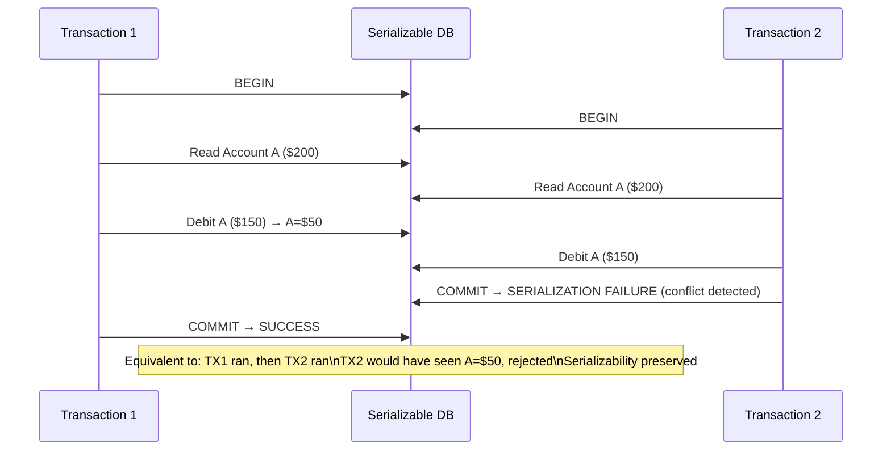
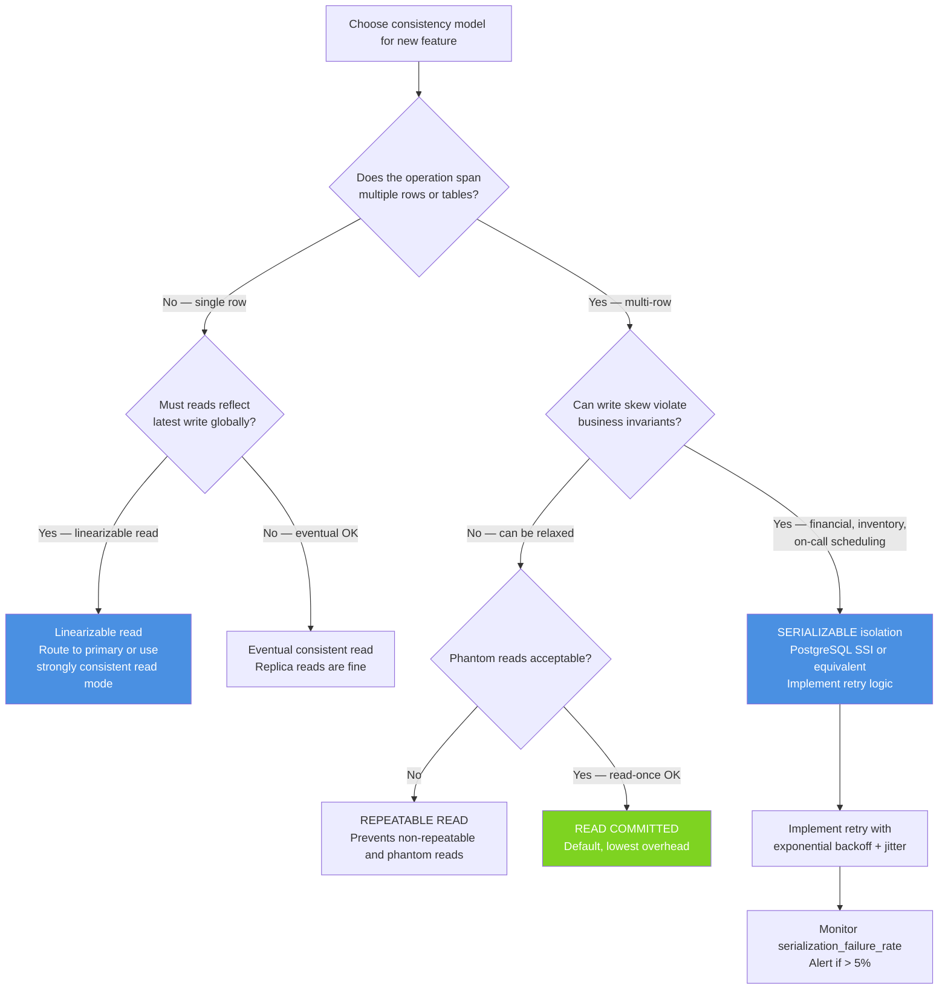

# Linearizability vs Serializability: Formal Consistency and Why It Matters

## 🗺️ Quick Overview



*Linearizability gives recency for single objects; serializability gives ordering for multi-object transactions. Most databases claiming one do not automatically provide the other.*

**The word "serializable" in your database documentation may not mean what you think it means.** PostgreSQL's `SERIALIZABLE` isolation level uses Serializable Snapshot Isolation (SSI) — a real implementation that prevents most anomalies. But MySQL's default `REPEATABLE READ` is often mislabeled as "serializable-like," and most NoSQL databases advertising "strong consistency" provide linearizability for single objects but not serializability for multi-object transactions.

Understanding the difference between these terms is the difference between a payment system that correctly handles concurrent transfers and one that occasionally creates money from nothing.

---

## The Problem Class `[Mid]`

Imagine two users simultaneously transferring money from the same joint account. Without proper isolation, both read a balance of $200, both see sufficient funds for a $150 transfer, and both succeed. The account balance goes from $200 to $50 (one debit applied) instead of -$100 (both applied). You've just allowed an overdraft that your code explicitly tried to prevent.



The diagram shows a write skew: both transactions read the same initial balance, make independent decisions, and write to the same row — producing a result that violates the business invariant (balance >= 0 after all transfers). This is not a dirty read, not a phantom read — it's a write skew that READ COMMITTED, REPEATABLE READ, and even basic Snapshot Isolation all fail to prevent.

> 💡 **What this means in practice:** Every database offers multiple isolation levels. Higher isolation prevents more anomalies but costs more in lock contention or retry overhead. Choosing the wrong isolation level for financial data means your business invariants can be violated under concurrent load — and you'll discover this in production, not in tests, because concurrent load is hard to simulate.

---

## Why the Obvious Solution Fails `[Senior]`

### "We use transactions — we're safe"

Transactions with READ COMMITTED isolation (MySQL and PostgreSQL default) prevent dirty reads (reading uncommitted data). They do not prevent:
- Non-repeatable reads: reading the same row twice in one transaction and getting different values
- Phantom reads: reading a range of rows, another transaction inserts, re-reading gives different rows
- Write skew: two transactions read overlapping data, make decisions, write to different rows

The payment example above fails with READ COMMITTED. Both transactions read the balance, make the decision independently, and both succeed.

### "We use SERIALIZABLE — we're safe"

PostgreSQL's SERIALIZABLE (SSI) does protect against write skew. But:

1. Many applications that say "we use SERIALIZABLE" actually use REPEATABLE READ (the default in many ORMs) or READ COMMITTED.
2. SERIALIZABLE transactions that conflict are aborted with a serialization error. Applications must retry these transactions — and many don't.
3. MySQL's `ISOLATION LEVEL SERIALIZABLE` uses locking (not SSI), which prevents more anomalies but with higher lock contention.

### "Strong consistency in my distributed database covers me"

ZooKeeper provides linearizability for single-key operations. Cassandra with `QUORUM` provides per-row consistency. Neither provides multi-row transactional consistency. If your invariant spans multiple rows (account balance + transaction log), per-row consistency is insufficient.

---

## The Formal Definitions `[Senior]`

### Linearizability (Single-Object Real-Time Ordering)

**Formal definition:** A system is linearizable if every operation appears to take effect atomically at some point between its invocation and its response, and all operations are totally ordered consistently with real-time ordering.

**In plain English:** From an external observer's view, each operation happens instantaneously at some point during its execution window. Once an operation completes, all subsequent reads see its effect. The ordering is consistent with real time — if operation A finishes before operation B starts, A appears before B in the total order.



Linearizability is about single objects. After Client1's write returns, any client reading x must see 5. This is the "after a write completes, all subsequent reads see it" guarantee.

Linearizability is provided by: single-master databases with synchronous reads, etcd, ZooKeeper, Spanner.

Linearizability is violated by: read replicas with async replication (stale reads), DNS caching (stale DNS), and eventually consistent databases (stale reads by design).

### Serializability (Multi-Object Transaction Ordering)

**Formal definition:** A history of concurrent transactions is serializable if it is equivalent to some serial (one-at-a-time) execution of the same transactions.

**In plain English:** Even if transactions execute concurrently, the result looks as if they ran one at a time in some order. The order might not be the order they were submitted — just any order that produces a consistent result.



With serializability, the system detects that TX1 and TX2 cannot both succeed without producing a non-serial result, and aborts one. The application must retry the aborted transaction.

Serializability is provided by: PostgreSQL SERIALIZABLE (SSI), MySQL SERIALIZABLE (locking), Spanner, CockroachDB.

### Strict Serializability (Both Guarantees)

**Formal definition:** Strict serializability combines linearizability and serializability: transactions are serializable AND the serial order is consistent with real-time ordering.

If TX1 commits before TX2 starts, TX2 must see TX1's writes, and in any equivalent serial order, TX1 comes before TX2.

Most people mean strict serializability when they say "the strongest consistency model." Spanner and CockroachDB provide this. Single-node PostgreSQL provides this for transactions that commit before the next begins.

**Configuration decisions that matter** `[Staff+]`

PostgreSQL isolation levels and what they actually prevent:

```sql
-- PostgreSQL default: READ COMMITTED
-- Prevents: dirty reads
-- Allows: non-repeatable reads, phantom reads, write skew

SET TRANSACTION ISOLATION LEVEL READ COMMITTED;

-- REPEATABLE READ
-- Prevents: dirty reads, non-repeatable reads
-- Allows: phantom reads, write skew (PostgreSQL's REPEATABLE READ actually
--          prevents phantom reads via snapshot, but allows write skew)

SET TRANSACTION ISOLATION LEVEL REPEATABLE READ;

-- SERIALIZABLE (PostgreSQL's SSI)
-- Prevents: dirty reads, non-repeatable reads, phantom reads, write skew
-- Cost: serialization failures that must be retried

SET TRANSACTION ISOLATION LEVEL SERIALIZABLE;
```

**The critical implementation detail:** PostgreSQL's SERIALIZABLE uses Serializable Snapshot Isolation (SSI). It works by tracking read/write dependencies between transactions. If a cycle is detected (TX1 read data that TX2 wrote, TX2 read data that TX1 wrote), one transaction is aborted.

The false positive rate (transactions aborted that could have been serial): typically 1-5% under high contention. Under low contention: near zero. The cost of SERIALIZABLE isolation is therefore the cost of retry logic, not just lock overhead.

### Snapshot Isolation (What Most Systems Actually Provide)

Most databases default to or are configured for Snapshot Isolation (SI), not full serializability. Under SI:
- Every transaction reads from a snapshot of the database at transaction start
- Writes don't interfere with reads (no read locks needed)
- Conflicts detected at commit time (not at read time)

SI prevents many anomalies but NOT write skew:

```sql
-- Example write skew under Snapshot Isolation
-- Business rule: At least one doctor must be on call

-- TX1 (Doctor Alice): "I want to go off call"
BEGIN;
SELECT count(*) FROM oncall WHERE status = 'active'; -- returns 2
-- "2 doctors on call, safe to go off"
UPDATE oncall SET status = 'off' WHERE doctor = 'alice';
COMMIT;

-- TX2 (Doctor Bob): "I want to go off call" (concurrent with TX1)
BEGIN;
SELECT count(*) FROM oncall WHERE status = 'active'; -- returns 2 (snapshot!)
-- "2 doctors on call, safe to go off"
UPDATE oncall SET status = 'off' WHERE doctor = 'bob';
COMMIT; -- SI allows this — different rows written, no write-write conflict!

-- Result: 0 doctors on call. Business rule violated.
```

Both transactions commit under Snapshot Isolation because they write to different rows (`doctor = 'alice'` and `doctor = 'bob'`). SI only detects write conflicts on the same rows. This write skew requires SERIALIZABLE isolation to prevent.

---

## Solution 1: SSI (PostgreSQL Serializable Snapshot Isolation)

**What it is:** PostgreSQL 9.1+ implements SSI, which extends Snapshot Isolation with dependency tracking to detect serialization cycles.

**How it actually works at depth:**

SSI tracks three types of dependencies between transactions:
- **rw-dependency:** TX1 read a value that TX2 later wrote
- **wr-dependency:** TX1 wrote a value that TX2 later read
- **ww-dependency:** TX1 wrote a value that TX2 also wrote

A serialization failure is detected when there's a cycle involving at least two "dangerous" (rw) dependencies:

```
TX1 →(rw)→ TX2 →(rw)→ TX1: CYCLE DETECTED → abort one
```

For the doctor on-call example:
- TX1 reads `count(*) WHERE status='active'` (rw-dependency: reads aggregate)
- TX2 reads `count(*) WHERE status='active'` (same)
- TX1 writes `alice → 'off'` (affects the predicate TX2 read)
- TX2 writes `bob → 'off'` (affects the predicate TX1 read)
- SSI detects: TX1 read predicate affected by TX2's write, and vice versa → cycle → abort TX2

**Sizing guidance** `[Staff+]`

SSI overhead estimation:
```
serialization_failure_rate ≈ concurrent_txns² × avg_txn_duration × hot_data_fraction
```

At 1,000 TPS, 5ms transaction duration, 10% of transactions touching the same "hot" predicate:
```
concurrent_txns = 1,000 × 0.005 = 5 concurrent transactions at any time
serialization_failure_rate ≈ 5² × 0.005 × 0.10 = 0.0125 = 1.25%
```

At 1.25% failure rate, every transaction needs retry logic. At 10,000 TPS with 10ms transactions:
```
concurrent_txns = 100
serialization_failure_rate ≈ 100² × 0.01 × 0.10 = 10%
```

At 10% failure rate, retry amplification is significant: 10,000 TPS of useful work requires 11,111 TPS of transaction attempts. This is acceptable but requires the application to handle retries gracefully.

**PostgreSQL retry pattern:**

```python
import psycopg2
import time
import random

def execute_serializable_transaction(db_conn, operations, max_retries=5):
    """Execute a transaction with SERIALIZABLE isolation and retry on conflict"""
    for attempt in range(max_retries):
        try:
            with db_conn.cursor() as cur:
                cur.execute("BEGIN TRANSACTION ISOLATION LEVEL SERIALIZABLE")
                for op in operations:
                    cur.execute(op['sql'], op.get('params'))
                cur.execute("COMMIT")
                return True
        except psycopg2.extensions.TransactionRollbackError as e:
            # Error code 40001: serialization failure
            if e.pgcode == '40001' and attempt < max_retries - 1:
                # Exponential backoff with jitter
                wait_ms = (2 ** attempt) * 10 + random.uniform(0, 10)
                time.sleep(wait_ms / 1000)
                db_conn.rollback()
                continue
            else:
                db_conn.rollback()
                raise
    raise Exception("Max retries exceeded for serializable transaction")
```

**Failure modes** `[Staff+]`

*Retry storm:* Under extreme contention, every transaction serialization-fails and retries. Retries increase concurrency, which increases serialization failure rate — a positive feedback loop. At high concurrency on hot data, SERIALIZABLE may be unstable.

Fix: application-level rate limiting on retries. Circuit breaker that trips when serialization failure rate > 20% and routes to a queue instead of immediate retry.

*False positives:* SSI conservatively aborts some transactions that could safely commit. These false positives are a performance cost, not a correctness problem. The abort rate is data-access-pattern dependent — scan-heavy workloads on PostgreSQL's SSI have higher false positive rates.

---

## Trade-off Matrix `[Senior]` → `[Staff+]`

| Model | Multi-Object Atomicity | Real-Time Ordering | Write Skew Prevention | Performance Impact |
|---|---|---|---|---|
| Read Committed | Yes (within TX) | No | No | Lowest |
| Repeatable Read | Yes (within TX) | No | No (PostgreSQL: some) | Low |
| Snapshot Isolation | Yes (within TX) | No | No | Low-Medium |
| Serializable (SSI) | Yes (within TX) | No | Yes | Medium (retries) |
| Linearizable (single obj) | No | Yes | N/A (single object) | Medium-High |
| Strict Serializable | Yes | Yes | Yes | High |

---

## Decision Framework `[Senior]` → `[Staff+]`



---

## Production Failure Story `[Staff+]`

**The Overdraft Factory: Snapshot Isolation on a Banking App**

A neo-bank built their ledger service on PostgreSQL with REPEATABLE READ isolation (not the default READ COMMITTED, not SERIALIZABLE — they had deliberately chosen REPEATABLE READ to "improve consistency").

Their account debit function:

```python
def debit_account(account_id: str, amount: float) -> bool:
    with db.transaction(isolation='REPEATABLE READ') as tx:
        account = tx.query(
            "SELECT balance FROM accounts WHERE id = %s FOR UPDATE",
            account_id
        )
        if account.balance < amount:
            return False  # Insufficient funds

        tx.execute(
            "UPDATE accounts SET balance = balance - %s WHERE id = %s",
            amount, account_id
        )
        tx.execute(
            "INSERT INTO transactions (account_id, amount, type) VALUES (%s, %s, 'debit')",
            account_id, amount
        )
        return True
```

They used `FOR UPDATE` on the account row — this acquires a lock. This actually prevents the write skew on the balance itself! But their constraint was more complex:

Daily spending limit: "User cannot spend more than $500 in a 24-hour rolling window." The check:

```python
def check_daily_limit(account_id: str, amount: float) -> bool:
    with db.transaction(isolation='REPEATABLE READ') as tx:
        daily_spent = tx.query(
            "SELECT sum(amount) FROM transactions WHERE account_id = %s "
            "AND created_at > NOW() - INTERVAL '24 hours' AND type = 'debit'",
            account_id
        )
        return daily_spent + amount <= 500.0
```

The check queries the `transactions` table (aggregate). Under REPEATABLE READ:
- TX1 reads daily_spent = $350, amount = $200 → $350 + $200 = $550 > $500 → REJECT (correct)
- But with two concurrent $250 transactions starting at the same time...
- Both read daily_spent = $200 (same snapshot)
- Both compute $200 + $250 = $450 ≤ $500 → ALLOW
- Both commit (they write to different transaction rows — no write-write conflict)
- Net result: $200 + $250 + $250 = $700 spent, limit of $500 violated

This is write skew on an aggregate. REPEATABLE READ (and even full Snapshot Isolation) doesn't prevent it. Only SERIALIZABLE (SSI) would detect that both transactions read from the same aggregate predicate and the write of one affects the read result of the other.

**Impact:** Over 6 months, ~1,400 accounts had overdraft events via daily limit bypass. Financial exposure: ~$180,000 in excess spend (most recovered via chargeback, but processing cost was significant).

**The fix:**
1. Changed daily limit check transaction to SERIALIZABLE
2. Added explicit predicate locking: `SELECT ... FOR SHARE` on the transactions aggregate (though SSI handles this automatically in PostgreSQL)
3. Added monitoring: daily_limit_violations_total counter with alert
4. Added post-hoc reconciliation job: hourly scan for violated limits with automated freeze

---

## Observability Playbook `[Staff+]`

### Isolation-level health

```
# Transaction failure modes
pg_serialization_failures_total          → alert if rate > 5% (too much SSI contention)
pg_deadlock_count_total                  → alert if > 0/minute (schema design issue)
pg_lock_wait_timeout_count               → alert if > 0.1% (contention under locking)

# Invariant violation detection (application-level)
business_invariant_violation_count{type="daily_limit_exceeded"} → alert if > 0
business_invariant_violation_count{type="negative_balance"}     → alert if > 0

# SSI overhead
transaction_retry_count_total            → alert if rate > 5% of transactions
transaction_retry_p99_count              → tail retries; alert if > 3
```

### Write skew smoke tests

```python
def test_write_skew_prevented():
    """Verify SERIALIZABLE prevents write skew on oncall scheduling"""
    # Setup: 2 doctors on call
    db.execute("INSERT INTO oncall VALUES ('alice', 'active'), ('bob', 'active')")

    # Concurrent transactions (simulated with threads)
    results = concurrent_execute([
        serializable_tx("UPDATE oncall SET status='off' WHERE doctor='alice' "
                        "AND (SELECT count(*) FROM oncall WHERE status='active') > 1"),
        serializable_tx("UPDATE oncall SET status='off' WHERE doctor='bob' "
                        "AND (SELECT count(*) FROM oncall WHERE status='active') > 1")
    ])

    # One should succeed, one should fail (serialization error)
    assert results.count('SUCCESS') == 1
    assert results.count('SERIALIZATION_FAILURE') == 1

    # Verify invariant held
    active_count = db.query("SELECT count(*) FROM oncall WHERE status='active'").scalar()
    assert active_count >= 1, "At least one doctor must be on call"
```

---

## Architectural Evolution `[Staff+]`

### 2020–2022: SSI adoption in PostgreSQL ecosystems

PostgreSQL's SSI (added in v9.1, 2011) became well-understood by 2020-2022. Guides explaining "why SERIALIZABLE is necessary for financial correctness" proliferated. ORMs began adding explicit isolation level configuration (previously hidden behind transaction() calls).

### 2023–2024: Distributed ACID via CockroachDB/Spanner

CockroachDB and Spanner provide strict serializability (ACID + linearizability) for distributed transactions. For financial systems that need global consistency, these became viable alternatives to single-node PostgreSQL.

Key difference: CockroachDB's distributed serializable transactions use timestamp-based conflict detection (not SSI), with clock uncertainty windows (500ms default) that add commit latency when transactions span nodes with clock uncertainty.

### 2025–2026: SSI in the ORM layer

**Drizzle ORM, Prisma 5.x:** Explicit transaction isolation level support with automatic retry middleware for serialization failures. The retry logic is built into the ORM layer, reducing application code burden.

```typescript
// Prisma 5.x example (2025 syntax)
const result = await prisma.$transaction(
  async (tx) => {
    const balance = await tx.account.findUnique({ where: { id: accountId } });
    if (balance.amount < transfer) throw new InsufficientFundsError();
    return tx.account.update({ where: { id: accountId }, data: { amount: { decrement: transfer } } });
  },
  {
    isolationLevel: Prisma.TransactionIsolationLevel.Serializable,
    maxWait: 5000,
    timeout: 10000,
  }
);
// Prisma retries serialization failures automatically
```

**2026 direction:** Isolation level as a request annotation (similar to consistency level in NoSQL), with automatic routing to the appropriate backend:
- `SERIALIZABLE` → PostgreSQL with SSI or CockroachDB
- `LINEARIZABLE` → Consistent read from primary or Spanner
- `EVENTUAL` → Replica or cache

---

## Decision Framework Checklist `[All Levels]`

- [ ] For every multi-row transaction that enforces a business invariant (balance check, inventory check, limit check): verify isolation level prevents write skew. If using READ COMMITTED or Snapshot Isolation: identify the write skew scenario and test it.
- [ ] Switch financial invariant checks to SERIALIZABLE. Implement retry logic with exponential backoff for serialization failures.
- [ ] Monitor serialization_failure_rate in production. Alert if > 5% (indicates high contention that may cause retry storms).
- [ ] Never conflate "linearizable" and "serializable" — they're orthogonal. You can have one without the other.
- [ ] For distributed systems: verify whether your database provides per-object linearizability or multi-object serializability. DynamoDB provides the former, not the latter.
- [ ] Test write skew explicitly in integration tests: simulate concurrent transactions and verify invariants hold.
- [ ] Document the isolation level of every transaction in your codebase. "SERIALIZABLE because daily limit check is a predicate read" as a code comment.
- [ ] For PostgreSQL: verify the pg_stat_activity or pg_locks table under load to confirm your SERIALIZABLE transactions are not degrading to lower isolation due to connection pool settings.
- [ ] For new financial systems: evaluate CockroachDB or Spanner if you need multi-region strict serializability without managing distributed transaction logic yourself.
- [ ] Understand your ORM's default isolation level — most ORMs default to READ COMMITTED, which is insufficient for financial invariants.

---
*Written by Gaurav Porwal — 10+ Year Engineer | Tech Lead | Product Owner | Business-Minded Builder*
*Last updated: 2026-03-18*
