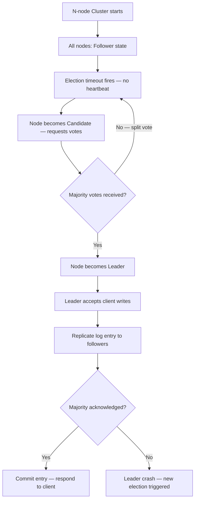
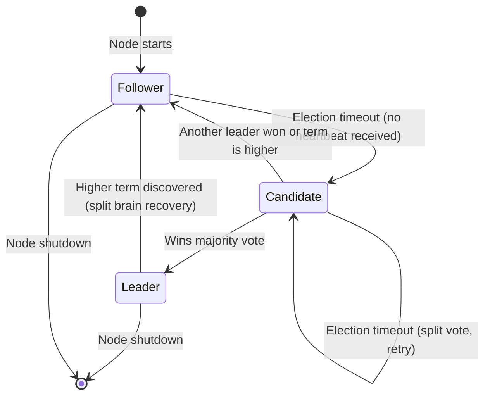
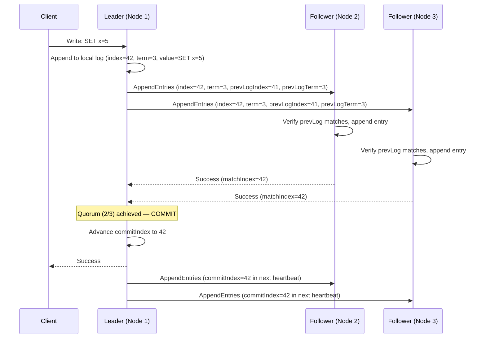
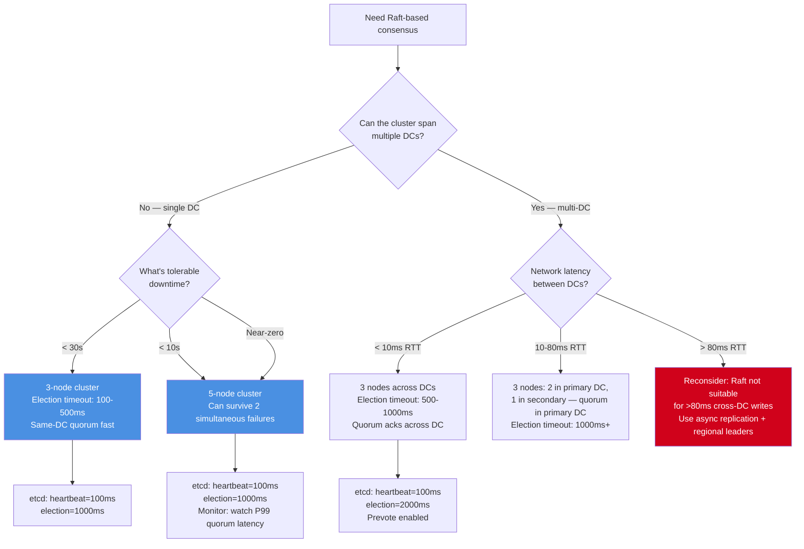

# Raft Consensus: Leader Election, Log Replication, and Cluster Sizing

## 🗺️ Quick Overview



*Leader election, log replication, and commit flow in a Raft cluster. A split vote loops back to candidate; a crashed leader restarts the election cycle.*

**Raft is designed to be understandable. It is not designed to be operationally simple.** The algorithm is elegant, but production deployments of Raft-based systems (etcd, Consul, CockroachDB, TiKV) fail in ways that require deep understanding of the protocol to diagnose. A split vote storm in a 5-node etcd cluster can bring down your entire Kubernetes cluster. Knowing why — and how to prevent it — is a Staff+ operating requirement.

---

## The Problem Class `[Mid]`

You need a distributed system where all nodes agree on a sequence of operations. The agreement must hold even if up to (N-1)/2 nodes fail simultaneously. The system must elect a single leader to coordinate writes, replicate writes to followers, and handle leader failures without losing committed entries.



The three Raft roles:
- **Follower:** Passive. Receives log entries from leader, votes in elections. If it doesn't hear from the leader within the election timeout, becomes a Candidate.
- **Candidate:** Requests votes from all nodes. If it receives votes from a majority (>N/2), becomes Leader.
- **Leader:** Accepts client requests, appends to its log, replicates to followers, commits when a majority has acknowledged.

---

## Why the Obvious Solution Fails `[Senior]`

### "Just use any consensus algorithm — they're all equivalent"

Paxos (original) is provably correct but underspecified — it doesn't define how to handle multi-Paxos (a sequence of consensus rounds), leader election, or log compaction. Every "Paxos" implementation is a different protocol. This caused correctness bugs in production systems that were supposed to implement Paxos.

Raft was explicitly designed to be fully specified. It makes the following opinionated choices:
- Strong leader model: all log entries flow through the leader
- Leader completeness: a newly elected leader has all committed entries
- Single-copy semantics: no reads from followers by default (linearizable reads require leadership confirmation)

These choices make Raft easier to implement correctly but introduce specific failure modes around leader availability.

### "5-node cluster is always better than 3-node"

More nodes = more fault tolerance (can survive 2 failures vs 1), but also:
- Higher quorum latency: P99 write latency = max(2nd fastest ack for 3-node) vs max(3rd fastest ack for 5-node)
- More network messages per write: 3-node = 2 parallel replication messages; 5-node = 4
- More complex split scenarios to manage
- Higher blast radius on leader election storms

For most workloads, 3-node is sufficient. 5-node only when you need to survive 2 simultaneous node failures (rare for most systems — focus your reliability budget on mean time between failures rather than concurrent failure count).

---

## The Solution Landscape `[Senior]`

### Solution 1: Leader Election — How It Works and Where It Breaks

**How it actually works at depth:**

Each node has an election timeout: a random duration between `[T, 2T]` after which it becomes a Candidate if it hasn't heard from the leader. The randomization is the key to avoiding split votes.

```
Election timeout: 150-300ms (Raft paper), 1000-5000ms (etcd default)
Heartbeat interval: T/2 (leader sends heartbeats at least twice per election timeout period)
```

Election process:
1. Candidate increments its current term
2. Candidate votes for itself
3. Candidate sends RequestVote RPCs to all nodes in parallel
4. A node votes YES if: (a) it hasn't voted in this term yet, AND (b) the candidate's log is at least as up-to-date as the voter's log
5. If candidate receives `(N/2)+1` votes → becomes leader, sends heartbeats immediately to reset others' timers

**The log-up-to-date check (critical correctness property):**

A candidate's log is "at least as up-to-date" as another's if:
- Its last log term is higher, OR
- Its last log terms are equal AND its log is at least as long

This ensures a leader is always elected with all committed entries.

**Sizing guidance** `[Staff+]`

Election timeout sizing:
```
min_election_timeout > 10 × max_network_round_trip_time

For same-DC (0.5ms RTT): min_election_timeout = 5ms (but 10ms safer)
For cross-DC (80ms RTT): min_election_timeout = 800ms

etcd default: 1000ms (appropriate for cross-DC deployments)
etcd recommendation for same-DC: 100-500ms
```

Too short: false elections triggered by GC pauses, network jitter, VM CPU scheduling delays
Too long: actual leader failure takes full election_timeout to detect (added to recovery time)

Heartbeat interval must be well below election timeout:
```
heartbeat_interval = election_timeout / 10 (gives 10 missed heartbeats before election)
etcd default heartbeat: 100ms (with 1000ms election timeout)
```

**Failure modes** `[Staff+]`

*Split vote storm:* If multiple candidates start elections simultaneously (equal timeouts before randomization kicks in, or simultaneous follower timeouts), they each get some votes but nobody gets majority. Each candidate increments its term and retries. Under poor timing, this can cycle for many seconds — the cluster has no leader and all writes fail.

Root cause: election timeouts that are too similar across nodes, often due to:
- All nodes starting simultaneously (initial cluster bootstrap)
- Synchronized restarts (rolling restart with identical timeouts)
- VM CPU throttling causing synchronized pauses that all expire timeouts simultaneously

Detection: `etcd_server_leader_changes_total` incrementing rapidly (> 2/minute suggests instability)

Mitigation: etcd's election timeout is already randomized internally, but JVM-based Raft implementations often need explicit jitter added.

*Disruptive follower:* A follower that gets isolated from the leader (but not from the cluster) keeps incrementing its term and sending RequestVote RPCs. When it reconnects, its high term forces the current leader to step down, triggering an unnecessary election. This is Raft's "disruptive follower" problem.

Mitigation: Pre-vote (or "prevote") extension — a follower runs a "pre-vote" round before incrementing term: it asks peers "would you vote for me?" If it gets pre-vote majority, it proceeds with actual election. This prevents isolated followers from incrementing term and disrupting a healthy cluster.

etcd enables prevote by default since v3.4.

### Solution 2: Log Replication — The Core Write Path

**How it actually works at depth:**



Key properties:
- Leader sends `AppendEntries` with the previous entry's index/term. Follower rejects if it doesn't have that previous entry — guarantees log consistency.
- Entry is committed when stored on a quorum of nodes. Committed entries are never lost (a new leader will always have them).
- `commitIndex` is communicated to followers via heartbeats/subsequent AppendEntries — followers apply committed entries to their state machine.

**Sizing guidance** `[Staff+]`

Write throughput is bounded by:
```
max_TPS = 1 / quorum_latency = 1 / (T_network_to_quorum_follower + T_fsync)
```

For same-DC, NVMe SSD:
```
max_TPS = 1 / (0.5ms + 0.1ms) = 1,667 TPS per Raft group (single entry per round)
```

With batching (pipelining multiple entries per round):
```
max_TPS = batch_size / quorum_latency = 100 / 0.6ms = 166,000 TPS
```

etcd's practical throughput: 10,000-50,000 TPS for key-value operations (with batching). CockroachDB ranges (individual Raft groups) achieve 10,000-30,000 TPS per range.

**Configuration decisions that matter** `[Staff+]`

etcd critical performance tuning:
```yaml
# etcd configuration
heartbeat-interval: 100      # ms — tune to 1/10 of election-timeout
election-timeout: 1000       # ms — tune to 10x heartbeat
snapshot-count: 10000        # entries between snapshots
quota-backend-bytes: 8GB     # max DB size before compaction required
auto-compaction-retention: "1h"  # compact old revisions
```

The `quota-backend-bytes` is critical: etcd's boltdb backend grows without bound if not compacted. At `quota-backend-bytes`, etcd stops accepting writes and enters "alarm" mode. This has brought down Kubernetes clusters when etcd fills up.

**Failure modes** `[Staff+]`

*Log divergence after partition:* During a network partition, the old leader (in the minority) can continue accepting writes (if clients can still reach it). After partition heal, these entries are in the minority leader's log but not in the quorum's log. The minority leader discovers a higher term from the majority and reverts to follower. Its uncommitted entries are overwritten by the new leader's log.

These "lost" entries were written to the old leader but never committed (no quorum ack). The old leader may have acknowledged them to clients — this is why clients should check the commit response, not just the leader append response.

*Follower falling behind:* A slow follower (I/O saturated, GC pauses, high CPU) receives AppendEntries but processes them slowly. The leader's `nextIndex` for this follower falls behind. If the follower falls more than `snapshot-count` entries behind, the leader cannot send individual entries — it must send a snapshot instead. Snapshot transfer blocks the follower's normal operation and is I/O intensive.

### Solution 3: Snapshots — Preventing Unbounded Log Growth

**How it actually works at depth:**

Raft's log grows without bound unless compacted. Snapshots capture the full state machine state at a specific log index, allowing all earlier log entries to be discarded.

```
Snapshot trigger: when log_length > snapshot-count (default: 10,000 entries in etcd)
Snapshot content: full state machine state at log index N
After snapshot: log entries [1..N] can be discarded; log retains [N+1..]
```

**The snapshot I/O blocking problem:**

etcd takes snapshots by serializing its boltdb state to disk. During this serialization:
- boltdb is locked for reading
- Incoming AppendEntries are still processed but may queue
- For large etcd databases (> 1GB), snapshot serialization can take 1-5 seconds
- During serialization, follower-catch-up operations that require the snapshot block

At 5-second snapshot time with 100ms heartbeat interval: a follower could miss 50 consecutive heartbeats during snapshot. If its election timeout is 1000ms, it may start a spurious election during snapshot.

**Sizing guidance** `[Staff+]`

Snapshot size scales with stored key-value state:
```
snapshot_size ≈ total_data_size × 1.1 (serialization overhead)
snapshot_duration ≈ snapshot_size / disk_write_throughput + serialization_CPU_time
```

For 500MB etcd database on NVMe (2GB/s sequential write):
```
snapshot_duration ≈ 500MB / 2000MB/s + ~1s CPU = ~1.25 seconds
```

For 4GB etcd database:
```
snapshot_duration ≈ 4000MB / 2000MB/s + ~4s CPU = ~6 seconds
```

At 6-second snapshot duration with 1000ms election timeout: followers will time out during snapshot. Keep etcd databases under 2GB and set `auto-compaction-retention` aggressively to prune old revisions.

---

## Trade-off Matrix `[Senior]` → `[Staff+]`

| Dimension | 3-Node Cluster | 5-Node Cluster | 7-Node Cluster |
|---|---|---|---|
| Fault tolerance | 1 node failure | 2 simultaneous failures | 3 simultaneous failures |
| Quorum size | 2 of 3 | 3 of 5 | 4 of 7 |
| Write latency | 2nd fastest node | 3rd fastest node | 4th fastest node |
| Network messages/write | 2 parallel | 4 parallel | 6 parallel |
| Split vote scenarios | 1-2 possible | 2-4 possible | 3-7 possible |
| Leader election time | Faster (fewer votes needed) | Slower | Slowest |
| Operational complexity | Low | Medium | High |
| Recommendation | Default for most systems | High-availability metadata stores | Rarely justified |

---

## Decision Framework `[Senior]` → `[Staff+]`



---

## Production Failure Story `[Staff+]`

**The Split Vote Storm: Kubernetes control plane down for 23 minutes**

A financial services company ran a production Kubernetes cluster with 3-node etcd. Their setup:
- etcd election timeout: 1000ms
- etcd heartbeat: 100ms
- All 3 etcd nodes running on the same physical host rack

On a Tuesday afternoon, a rack-level power fluctuation caused all 3 nodes to experience simultaneous CPU throttling (power management engaged). All 3 nodes missed heartbeats at the same time, all 3 started elections simultaneously (within the same ~100ms window), and all 3 entered a split vote cycle.

Cycle analysis:
- Round 1: Node A gets 1 vote, Node B gets 1 vote, Node C gets 1 vote. No majority.
- All increment term. But the jitter windows were similar (100-200ms) due to the CPU throttling causing synchronized wake-ups.
- Round 2-12: Continued split votes. 12 rounds × ~200ms average = ~2.4 seconds of election cycling.
- Round 13: Jitter finally diverged enough for Node A to win.

During the 2.4-second split vote storm: all Kubernetes API server writes failed. Running workloads continued (kubelet is not blocked by etcd), but no new deployments, no pod rescheduling, no ConfigMap/Secret updates.

Follow-on: the Kubernetes controllers queued 4 minutes of reconciliation work during the outage. After election, etcd got 20x write volume. The wave of writes triggered two more mini-elections as the new leader was overwhelmed and missed heartbeats.

Total: 23 minutes of degraded Kubernetes control plane (new deployments failing, no autoscaling).

**Root causes:**
1. Physical colocation — all 3 nodes shared rack power
2. Insufficient election timeout jitter (all nodes had similar effective timeout due to CPU throttling)
3. No alerting on etcd leader change rate

**The fix:**
- etcd nodes moved to 3 separate physical racks (separate power)
- Election timeout increased to 2000ms with wider jitter (±500ms)
- Alert: `etcd_server_leader_changes_total` > 2/5min
- etcd upgraded to version with prevote enabled
- Added a 5-node cluster for critical namespaces

---

## Observability Playbook `[Staff+]`

### etcd golden signals

```
# Leader stability (primary health indicator)
etcd_server_leader_changes_total           → alert if rate > 2/5min (instability)
etcd_server_is_leader{job="etcd"}          → gauge: 1 = is leader, 0 = follower
etcd_server_has_leader{job="etcd"}         → alert if == 0 for > 5s (leaderless cluster)

# Write performance
etcd_disk_wal_fsync_duration_seconds_p99   → alert if > 200ms (disk I/O problem)
etcd_disk_backend_commit_duration_seconds_p99 → alert if > 200ms (boltdb slow)
etcd_network_peer_round_trip_time_p99      → alert if > election_timeout / 10

# Cluster capacity
etcd_mvcc_db_total_size_in_bytes           → alert if > 4GB (approaching quota)
etcd_server_quota_backend_bytes            → compare with above
etcd_mvcc_db_total_size_in_use_in_bytes    → after compaction, what's actually used

# Snapshot health
etcd_debugging_snap_save_total             → count of snapshots (rate indicates GC pressure)
etcd_debugging_snap_save_marshalling_duration_seconds_p99 → alert if > 5s (blocking)

# Proposal health
etcd_server_proposals_failed_total         → alert if rate > 0
etcd_server_proposals_pending              → alert if > 100 (backlog building)
```

### Raft-level debugging

When election storms occur:
```bash
# Check leader change history
etcdctl endpoint status --cluster -w json | jq '.[].Status.leader'

# Check proposal state
etcdctl endpoint status -w json | jq '.[].Status.raftIndex, .[].Status.appliedIndex'
# Large gap between raftIndex and appliedIndex = slow state machine application

# Check member health
etcdctl member list
etcdctl endpoint health --cluster
```

---

## Architectural Evolution `[Staff+]`

### 2020–2022: etcd as the de-facto Kubernetes backend

Kubernetes v1.20+ made etcd critical infrastructure. Most Kubernetes operators weren't Raft experts, and operational runbooks were sparse. etcd failures caused widespread Kubernetes outages that were hard to diagnose.

### 2023–2024: Multi-Raft and learner nodes

CockroachDB and TiKV popularized "multi-Raft" — hundreds or thousands of independent Raft groups, each responsible for a data range. This provides better parallelism but requires sophisticated range rebalancing and split/merge protocols.

etcd learner nodes (v3.4+): a node that receives log entries but doesn't participate in voting. This allows safe cluster expansion: add a learner, let it catch up, promote to voter. No risk of disrupting quorum during catch-up.

### 2025–2026: Raft tuning automation and managed Raft

**Cloud-managed etcd:** AWS EKS, GKE, and AKS manage etcd internally — operators don't interact with it directly. The operational burden shifts to the cloud provider.

**Raft throughput improvements:**
- etcd v3.6 (2025): improved lease implementation, better snapshot streaming with reduced blocking, pipeline batching for 3x write throughput improvement in benchmarks
- CockroachDB 24.x: multi-Raft leadership lease optimizations reducing follower-read latency

**WireGuard-based Raft clusters:** Network partitions caused by firewall rules or misconfigured security groups are a major source of Raft instability. WireGuard VPN between cluster nodes provides encrypted, reliable peer communication that's more resistant to firewall interference.

**2026 guidance:**
- etcd: use managed Kubernetes (EKS/GKE/AKS) to avoid direct etcd operations
- CockroachDB: use cloud-hosted (CockroachDB Dedicated) to avoid Raft operational complexity
- Only run self-managed Raft clusters if you have dedicated SREs with Raft expertise
- Benchmark election timeout tuning in your specific environment before deploying to production

---

## Decision Framework Checklist `[All Levels]`

- [ ] Choose cluster size based on tolerable simultaneous failures: 3-node (1 failure), 5-node (2 simultaneous failures). Don't use 4 or 6 (even numbers can't form unambiguous quorum in a 50/50 split).
- [ ] Set election timeout = 10 × max expected network round trip time (including GC pauses).
- [ ] Set heartbeat interval = election timeout / 10.
- [ ] Enable prevote (etcd 3.4+ default). Prevents disruptive isolated followers.
- [ ] Place cluster nodes on separate physical hosts, racks, and power feeds if possible.
- [ ] Monitor `etcd_server_leader_changes_total` — more than 2 changes per 5 minutes indicates instability.
- [ ] Monitor `etcd_mvcc_db_total_size_in_bytes` — alert at 4GB, before quota alarm.
- [ ] Set `auto-compaction-retention` to prune old revisions (1h for most use cases).
- [ ] Test leader election under realistic load: simulate leader failure with `kill -9`, measure recovery time and write failure window.
- [ ] For Kubernetes: test etcd recovery procedure annually — simulate full etcd cluster loss and restore from backup. At least two engineers should know how to do this.
- [ ] Don't deploy etcd on VMs with CPU bursting (T-series on AWS, E2 on GCP) — CPU throttling causes missed heartbeats and spurious elections.

---
*Written by Gaurav Porwal — 10+ Year Engineer | Tech Lead | Product Owner | Business-Minded Builder*
*Last updated: 2026-03-18*
