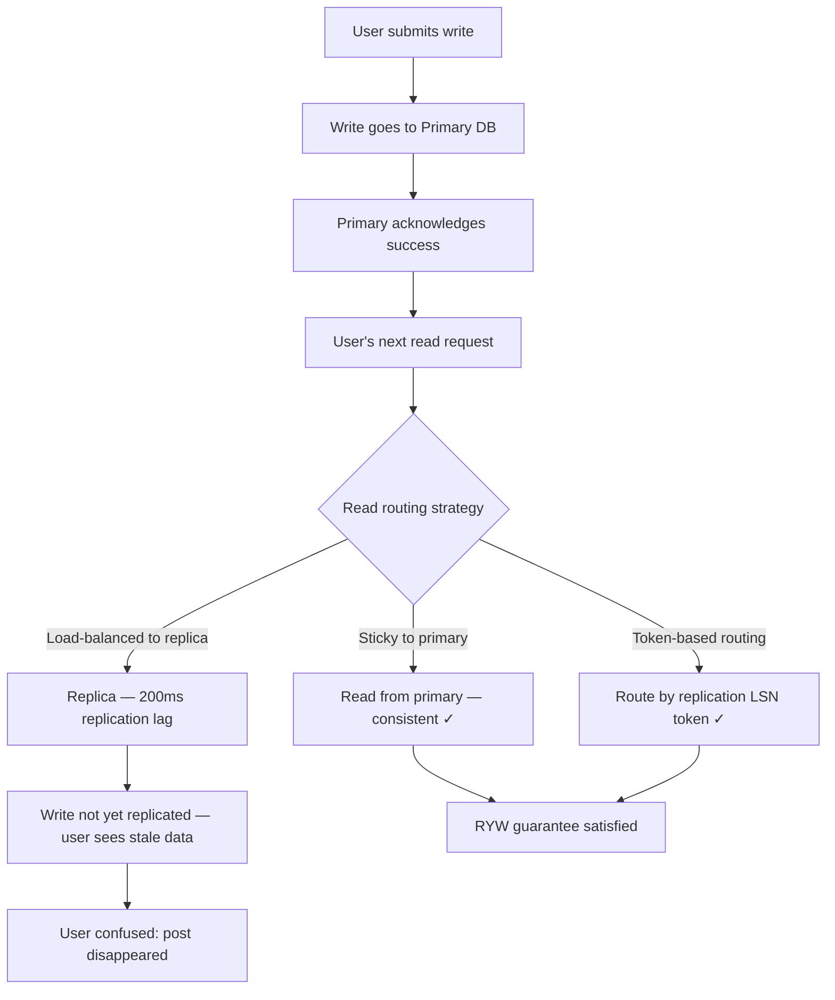
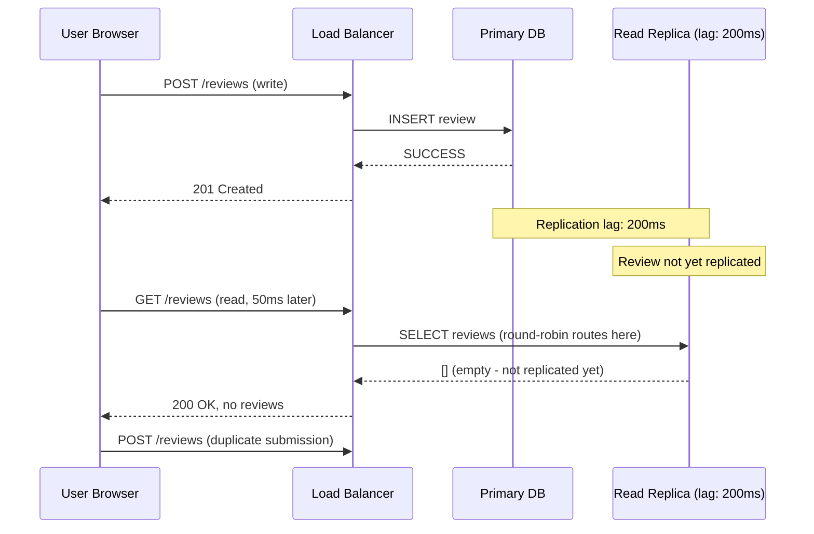
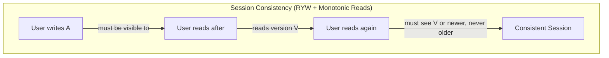
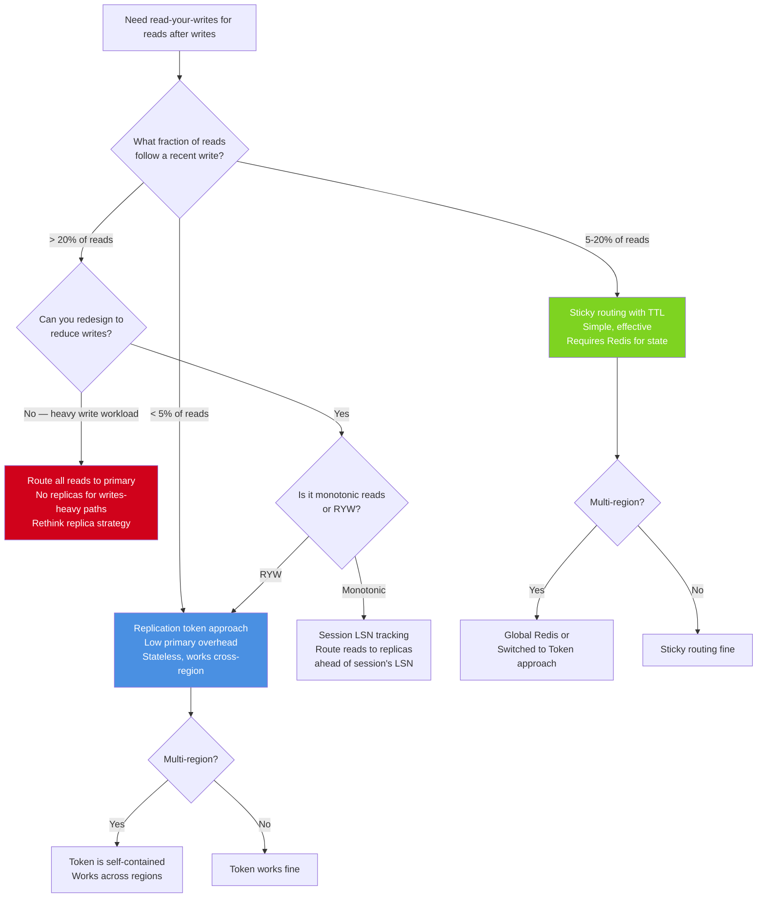

# Read-Your-Writes Consistency: Session Semantics and Sticky Routing

## 🗺️ Quick Overview



*Write goes to primary; subsequent read must see that write. Without sticky routing or LSN tokens, a replica serving the read may be behind, breaking the session guarantee.*

**You've shipped a bug before you wrote a line of code.** The moment you added read replicas to your database, you created a window where a user's write goes to the primary but the subsequent read hits a replica that hasn't received it yet. The user refreshes the page, their post is missing, and they submit it again — now you have a duplicate.

Read-your-writes consistency is a session guarantee: after a user writes data, subsequent reads by that same user should reflect the write. It sounds simple. It's surprisingly hard to guarantee at scale, and the wrong fix (route all reads to primary) destroys the latency benefit of read replicas.

---

## The Problem Class `[Mid]`

Imagine a user posts a review on a product page. The write goes to the primary database. The browser refreshes the page — the subsequent read request is load-balanced to a read replica that's 200ms behind the primary. The review isn't there. The user, confused, clicks "Submit" again. Now the review is duplicated.



The diagram shows what happens: a write goes to primary, replication hasn't propagated yet, the read hits a stale replica. This window is as long as your replication lag — typically milliseconds, but potentially seconds under load.

> 💡 **What this means in practice:** Your database might show a user their data before it's replicated, or after, depending on which replica handles their request. There's no way to guarantee consistency without explicitly routing reads for consistency guarantees.

---

## Why the Obvious Solution Fails `[Senior]`

### "Just route all reads to primary"

This works but defeats the purpose of read replicas. If you have 3 read replicas handling 70% of your read traffic, routing all writes + post-write reads to primary puts 100% of load on the primary. You've paid for 3 read replicas and get no benefit.

More importantly, this is a system-wide override. Your primary is now handling all "consistency-sensitive reads" — but every logged-in user's every read is potentially consistency-sensitive. You've essentially disabled your read replicas.

### "Just increase connection timeouts — the replica will catch up"

The user's refresh happens on the order of hundreds of milliseconds. Replication lag under load can be 1-10 seconds. Telling users "wait 10 seconds before refreshing" is not a product solution.

### "The client should retry if it doesn't see its write"

Retry logic on the client cannot reliably distinguish "replica lag" from "write failed." The client doesn't know if its write was actually persisted. Retry → potential duplicate submissions → idempotency complexity.

---

## The Solution Landscape `[Senior]`

### Understanding the Four Session Guarantees

These are the four session consistency models from the "Session Guarantees for Weakly Consistent Replicated Data" paper (1994, Douglas Terry et al.). They're listed in increasing strictness:

**1. Read-Your-Writes (RYW):** After a client writes a value, subsequent reads by the same client see that value or a more recent one.

**2. Monotonic Reads:** Once a client reads a value, subsequent reads see the same value or a more recent one (never go backwards).

**3. Monotonic Writes:** Writes by a client are applied in the order they were issued. If you write A then write B, every replica sees A before B.

**4. Writes-Follow-Reads (Piplined RAM):** Writes made by a client in a session are guaranteed to be ordered after reads in the same session. If you read X then write Y, Y is committed after whatever state X was read from.

Most systems need at least RYW + Monotonic Reads for a good user experience. The combination is called "Session Consistency."



The above shows what session consistency guarantees: after writing, you see your write, and reads only ever move forward in time — you never see an older version after seeing a newer one.

### Solution 1: Sticky Session Routing (Primary Read After Write)

**What it is:** After a user performs a write, route their subsequent reads to the primary database for a configurable window (e.g., 5 seconds).

**How it actually works at depth:**

```python
class ReadRoutingMiddleware:
    def __init__(self, primary_db, replica_pool, ryw_window_seconds=5):
        self.primary = primary_db
        self.replicas = replica_pool
        self.ryw_window = ryw_window_seconds
        self.cache = Redis()  # Track recent writes per user

    def handle_write(self, user_id: str, operation):
        result = self.primary.execute(operation)
        # Record that this user wrote recently
        self.cache.setex(
            f"ryw:{user_id}",
            self.ryw_window,  # TTL in seconds
            "1"
        )
        return result

    def handle_read(self, user_id: str, query):
        if self.cache.exists(f"ryw:{user_id}"):
            # User wrote recently — route to primary for RYW guarantee
            return self.primary.execute(query)
        else:
            # No recent write — can use replica for load distribution
            replica = self.replicas.get_healthy_replica()
            return replica.execute(query)
```

**Sizing guidance** `[Staff+]`

Primary read load increase:
```
primary_extra_load_fraction = (write_rate × ryw_window) / (read_rate × avg_session_duration)
```

Example: 1,000 writes/sec, 5-second RYW window, 100,000 reads/sec, 30-second average session:
```
users_with_ryw_flag = 1,000 × 5 = 5,000 users at any time
fraction_of_users_in_ryw = 5,000 / (100,000 reads/sec ÷ (session_reads / session_duration))
```

Practically: if 10% of users write within any 5-second window, 10% of reads are routed to primary. Primary load increase = 10% on top of its existing write load.

Rule of thumb: If your write:read ratio > 1:10, sticky routing becomes expensive. Consider token-based routing instead.

**Failure modes** `[Staff+]`

*Redis failure takes down RYW:* The cache that tracks "user wrote recently" is unavailable. What's the safe default? Route all reads to primary (consistent, expensive) or route all reads to replicas (inconsistent, fast). Define this explicitly and test it.

*Cross-region write, same-region read:* User writes from a browser hitting US-West. Their mobile app reads from US-East. The RYW key in Redis US-West doesn't exist for the US-East read path. RYW guarantee is violated. Multi-region RYW requires a cross-region cache or a different approach (see token-based below).

### Solution 2: Replication Position Token (Timestamp-Based Routing)

**What it is:** Include a replication position token (LSN in PostgreSQL, GTID in MySQL) in the write response. The client includes this token in subsequent read requests. The read router ensures reads only go to replicas that have applied that position.

**How it actually works at depth:**

```python
# Write handler: return the replication position
def write_user_post(user_id: str, content: str) -> dict:
    with primary_db.connection() as conn:
        conn.execute(
            "INSERT INTO posts (user_id, content) VALUES (%s, %s)",
            (user_id, content)
        )
        # PostgreSQL: get current WAL LSN
        lsn = conn.execute("SELECT pg_current_wal_lsn()").scalar()
        return {
            "post_id": ...,
            "_consistency_token": str(lsn)  # e.g., "0/16B3748"
        }

# Read router: wait for replica to catch up to LSN
def route_read_with_token(query: str, consistency_token: str):
    if consistency_token is None:
        return replica_pool.get_any().execute(query)

    target_lsn = parse_lsn(consistency_token)

    for replica in replica_pool.get_all_replicas():
        # Check if this replica has applied the required LSN
        replica_lsn = replica.execute(
            "SELECT pg_last_wal_replay_lsn()"
        ).scalar()

        if replica_lsn >= target_lsn:
            return replica.execute(query)

    # No replica has caught up yet — fall back to primary
    return primary_db.execute(query)
```

PostgreSQL's `pg_last_wal_replay_lsn()` returns the LSN up to which the replica has replayed. If it's >= the write LSN, the replica has your write.

**The non-obvious advantage over sticky routing:** The token approach is stateless — no Redis cache needed. The client carries the token. It works across regions (the client includes the token in all requests, regardless of which region handles them). It works across sessions (bookmark a page with your post, share the URL — the recipient gets eventually consistent view, but you get RYW because your client sends the token).

**Sizing guidance** `[Staff+]`

Replica catch-up latency (the P99 time between write and token being satisfied by any replica):
```
P99 catch-up time ≈ replication_lag_p99 ≈ typically 50-200ms under normal load
```

Under load (high write rate, replica I/O saturation):
```
catch-up time may increase to 1-5 seconds → fall back to primary for most reads
```

Build in a timeout:
```python
MAX_REPLICA_WAIT_MS = 500
if no_replica_caught_up_after(MAX_REPLICA_WAIT_MS):
    return primary_db.execute(query)  # Fallback, not a failure
```

**Failure modes** `[Staff+]`

*Token expiry:* The client stores the token in a cookie with a 1-hour expiry. If the user returns after 1 hour, the token still routes to primary unnecessarily (the replica has long since caught up). Tokens should have short validity (< 60 seconds) or the router should detect "all replicas are past this LSN" and ignore the token.

*Client doesn't send token:* A new API client or mobile app version doesn't include the token. Silently falls back to replica routing without RYW. Define the API contract explicitly: requests without a token get no RYW guarantee.

### Solution 3: Monotonic Reads via Replica Selection

**The problem:** Even without the RYW issue, if read requests are round-robined across replicas, a user might see version V on one request and version V-1 on the next (if the second replica is more behind). This is a monotonic reads violation.

**The fix:**

```python
def route_read_monotonic(user_id: str, query: str, session_last_seen_lsn: str):
    """Ensure reads never go backward — monotonic reads guarantee"""
    for replica in replica_pool.sorted_by_lsn_desc():
        replica_lsn = replica.get_current_lsn()
        if replica_lsn >= parse_lsn(session_last_seen_lsn):
            result = replica.execute(query)
            # Update the session's "minimum acceptable" LSN for next read
            update_session_lsn(user_id, replica_lsn)
            return result

    return primary_db.execute(query)
```

The session tracks the highest LSN it has seen. All future reads must go to replicas at or ahead of that LSN. As replicas converge, more replicas become eligible. The session LSN only ever increases.

---

## Trade-off Matrix `[Senior]` → `[Staff+]`

| Approach | Complexity | Primary Load Increase | Cross-Region | Stateless |
|---|---|---|---|---|
| Read-all from Primary | None | 100% (no replicas used) | Yes | Yes |
| Sticky routing (Redis TTL) | Low | Proportional to write:read ratio | No (needs cross-region cache) | No |
| Replication position token | Medium | Only when no replica caught up | Yes | Yes |
| Application-level version check | High | Minimal | Yes | No |

---

## Decision Framework `[Senior]` → `[Staff+]`



---

## Production Failure Story `[Staff+]`

**The Forum Duplicate Post: No RYW Guarantee on a Social Platform**

A social platform's forum feature had a well-known bug: users frequently submitted duplicate posts. The assumption was "users double-click submit." Investigation revealed a different root cause.

The write flow:
1. User submits post → write to primary PostgreSQL
2. Browser redirects to thread view
3. Thread view reads from one of 3 read replicas
4. If post not visible (stale replica): JavaScript pagination code finds 0 posts matching user's recently posted content
5. JavaScript re-enables the submit button (it disabled it on submit to prevent duplicates)
6. User, seeing blank state where their post should be, clicks submit again

The re-enable logic was a client-side guard against a server-side consistency problem. It failed because the client couldn't distinguish "post not yet visible due to replication lag" from "post failed to submit."

Metrics:
- Replication lag P99: 180ms
- Thread view page load time: ~300ms (including round-trip)
- Combined: post visible within ~480ms of submit
- Double-submit window: 200-500ms (users who clicked very fast after redirect)
- Duplicate post rate: ~0.3% of posts (300 duplicates per 100,000 posts/day)

**The fix:**
1. Write response included PostgreSQL LSN token: `{"post_id": 12345, "_lsn": "0/1A3F400"}`
2. Thread view redirect URL included the LSN token as a query parameter
3. Read router checked each replica's replay LSN — routed to primary if no replica had caught up
4. Re-enable button logic: "if the post is visible, re-enable submit; else wait for visibility with 2-second timeout"
5. Added idempotency key on post submission (user_id + content_hash + 1-minute window) for defense-in-depth

Post-fix duplicate rate: 0.001% (down from 0.3%), remaining duplicates caused by intentional user double-submission (copy-paste of their own post, not a consistency issue).

---

## Observability Playbook `[Staff+]`

### RYW guarantee validation

```
# Synthetic RYW monitoring (write then read within 500ms)
ryw_test_violation_rate           → alert if > 0 (write not visible after 500ms)
ryw_test_latency_p99_ms           → how long until write is visible

# Replication health (precursor to RYW violations)
replica_lag_seconds{replica="r1"}  → alert if > 5s (RYW window exceeded)
primary_fallback_rate              → fraction of reads routed to primary due to token
```

### Session consistency metrics

```
# Monotonic read violations (requires client-side instrumentation)
monotonic_read_violation_count_total  → client detected version going backward
session_lsn_advancement_rate         → healthy metric: should monotonically increase

# User experience impact
double_submit_rate                    → alert if > 0.01% (RYW symptom)
post_not_visible_complaints_total     → correlate with replica lag
```

### Replication position tracking

```sql
-- PostgreSQL: check all replicas' replay position vs primary
SELECT
  client_addr,
  state,
  sent_lsn,
  write_lsn,
  flush_lsn,
  replay_lsn,
  (sent_lsn - replay_lsn) AS replication_lag_bytes
FROM pg_stat_replication
ORDER BY replication_lag_bytes DESC;

-- Alert if any replica lag > 100MB (risk of long catch-up time)
```

---

## Architectural Evolution `[Staff+]`

### 2020–2022: Round-robin replicas, duplicate-prevention as a product afterthought

Most systems added read replicas for capacity and didn't design for session consistency. Duplicate submissions and "phantom posts" were treated as user error or frontend bugs.

### 2023–2024: ProxySQL and Pgpool-II with read/write splitting

Database proxies added built-in read/write splitting with configurable consistency modes. ProxySQL's `mysql-wait_timeout_wr_to_rd_routing_switch_sec` routes reads to primary for N seconds after a write from the same session. Pgpool-II's `delay_threshold` delays replica reads until replica lag drops below a threshold.

These tools moved RYW configuration from application code to infrastructure.

### 2025–2026: Application-tier session consistency as a service

**Neon (Serverless PostgreSQL):** Provides LSN-based `pg_wait_for_lsn` API. Applications call this to wait for a specific LSN to be replayed on a replica, enabling token-based RYW with minimal application code.

**PlanetScale:** Per-request `X-PS-Refresh-Token` header that triggers primary fallback when included. Built directly into the HTTP API.

**Turso (libSQL):** Client-side library that tracks "last write LSN" automatically and includes it in subsequent read requests. RYW is transparent to the application developer.

**2026 direction:** RYW is increasingly handled by the database driver or a thin middleware layer rather than application code. Developers declare consistency semantics in configuration, not in every read path:

```yaml
# Database connection config
consistency:
  default_read: replica
  after_write_window: 5s  # Route reads to primary for 5s after any write
  cross_region: token-based  # Use LSN tokens for cross-region RYW
```

---

## Decision Framework Checklist `[All Levels]`

- [ ] Identify every user-visible write in your application. For each: does the user immediately read the written data?
- [ ] Calculate your write:read ratio. If > 1:20, sticky routing becomes expensive — consider token-based RYW.
- [ ] Implement replication lag monitoring with alert threshold < 5 seconds.
- [ ] Define a "safe fallback" for when your RYW mechanism fails (Redis down, token expired): primary fallback or replica with explicit "might be stale" flag.
- [ ] Test replication lag under load: benchmark your write throughput and measure replica lag at P99. Does RYW hold under that lag?
- [ ] For mobile/multi-region: use token-based RYW (stateless, works across regions) over sticky routing (stateful, region-scoped).
- [ ] Implement monotonic reads if your UI has multi-step flows that read the same data across multiple requests.
- [ ] Add a synthetic RYW test: write a test value, immediately read it from each replica path, measure time until visible.
- [ ] Treat duplicate submissions as a consistency indicator: if duplicate rate > 0.1%, your RYW implementation has gaps.
- [ ] Document your session consistency model for each API endpoint: "this endpoint provides RYW for the authenticated user" should be in your API documentation.

---
*Written by Gaurav Porwal — 10+ Year Engineer | Tech Lead | Product Owner | Business-Minded Builder*
*Last updated: 2026-03-18*
