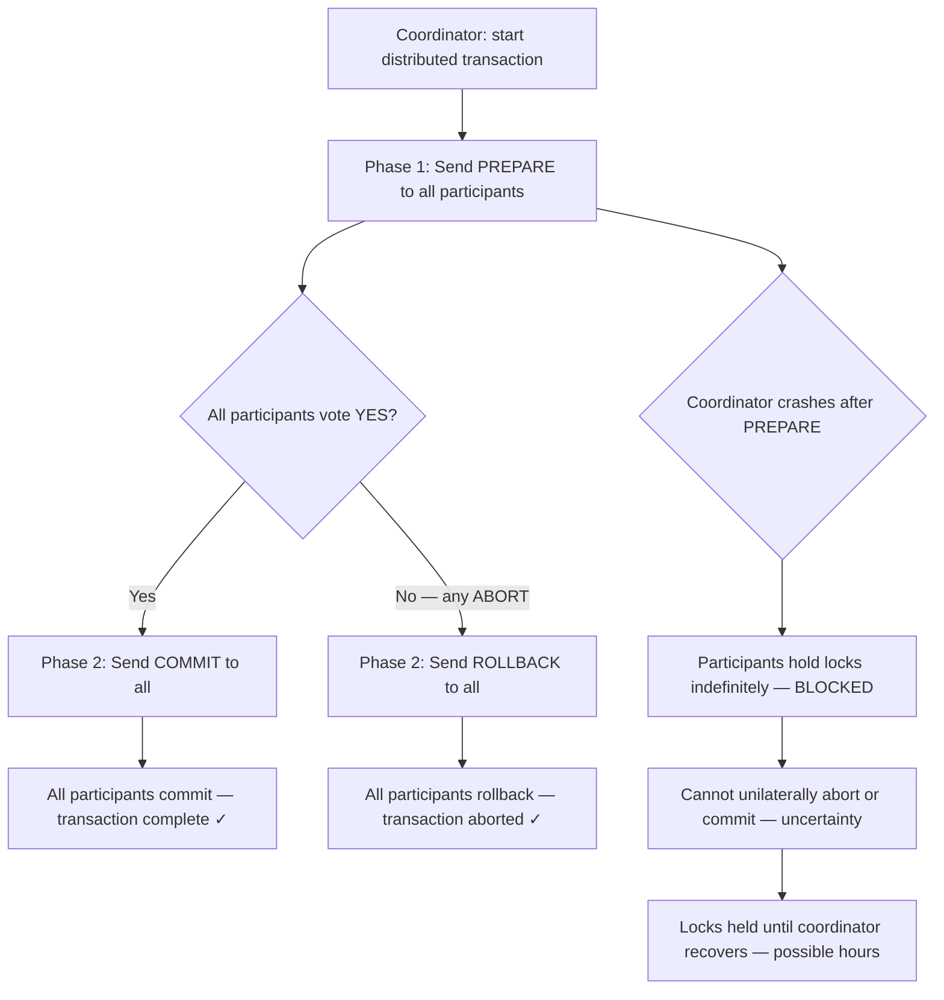
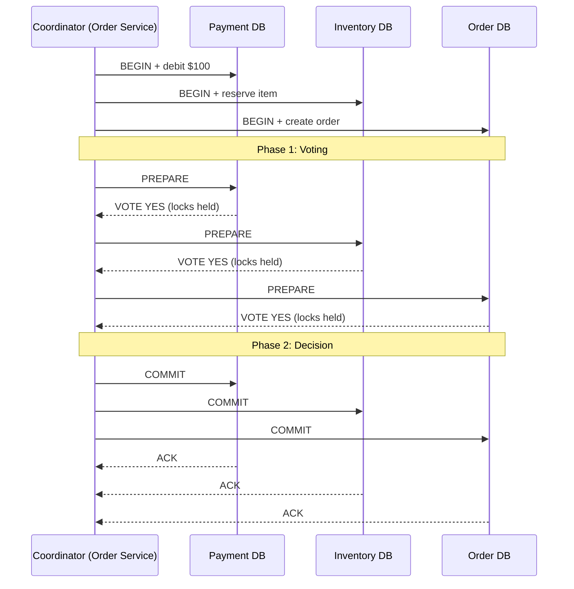
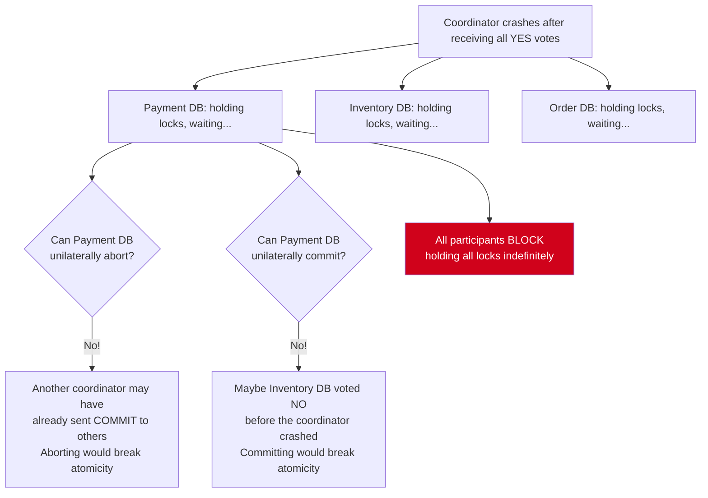
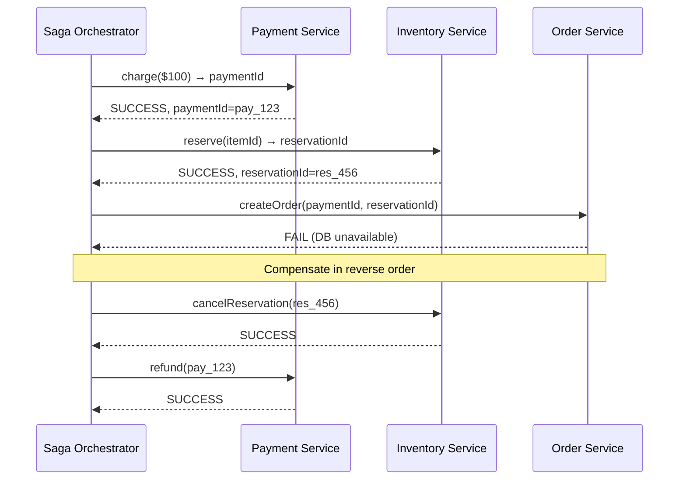
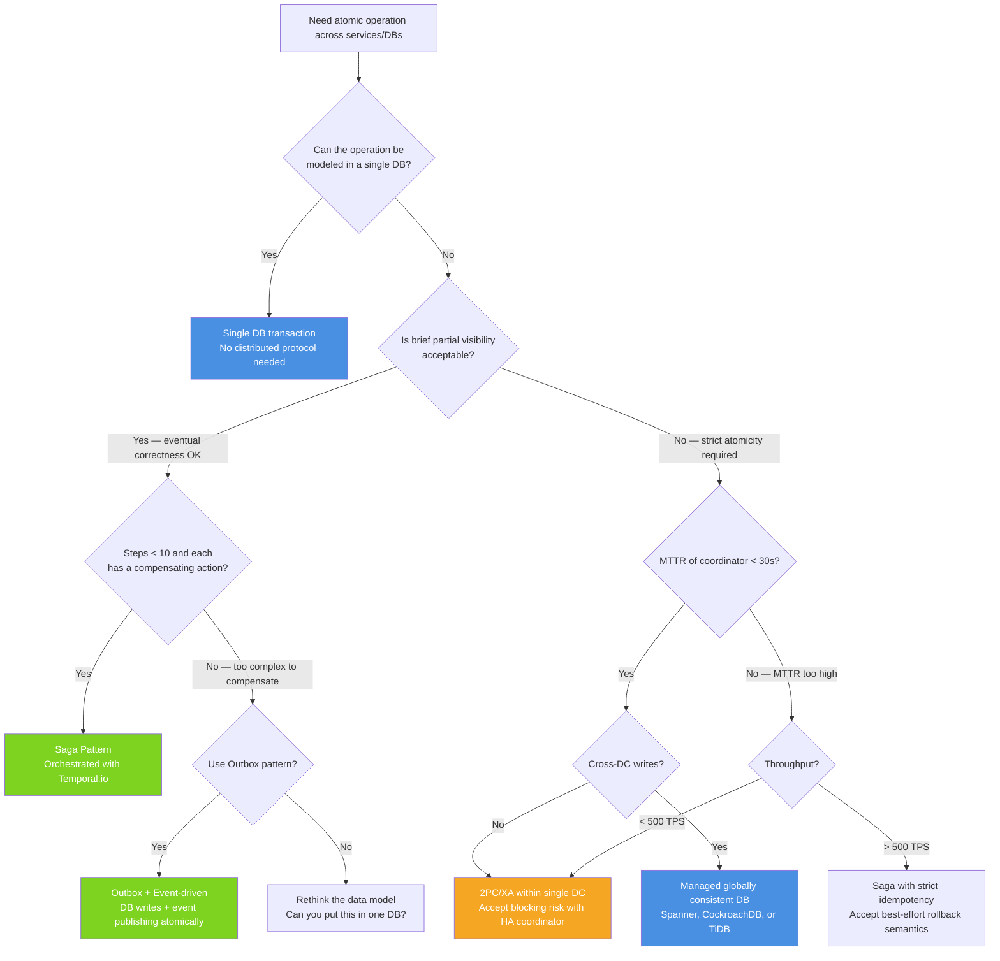

# Two-Phase Commit: Blocking Protocol, Failure Modes, and Modern Alternatives

## 🗺️ Quick Overview



*Coordinator sends PREPARE, waits for votes, then COMMIT or ROLLBACK. If coordinator crashes after participants vote YES, they hold locks forever with no safe unilateral resolution.*

**Two-phase commit is the only protocol that provides true atomicity across independent databases — and it has a fundamental flaw that makes it unsuitable for high-availability systems.** A coordinator failure after participants vote "prepared" leaves every participant holding locks indefinitely, with no safe way to unilaterally abort or commit. The window is bounded by your MTTR, but at 3 AM with an on-call who doesn't know the system, that window can be hours.

Understanding 2PC is mandatory not because you should use it, but because every "distributed transaction" abstraction eventually reduces to either 2PC semantics, saga pattern, or a coordination service that implements a safer variant.

---

## The Problem Class `[Mid]`

An order service must atomically:
1. Charge the customer's account (Payment DB)
2. Reserve inventory (Inventory DB)
3. Create the order record (Order DB)

All three must succeed or all three must roll back. Partial success (payment charged but inventory not reserved) creates a financial inconsistency that requires manual reconciliation.



This works perfectly when everything is healthy. The protocol breaks under coordinator failure between Phase 1 and Phase 2.

---

## Why the Obvious Solution Fails `[Senior]`

### The blocking problem in detail

After all participants vote YES in Phase 1, each participant is in the "prepared" state:
- It has written all changes to a durable log (WAL)
- It is holding all locks required for the transaction
- It **cannot unilaterally commit or abort** — only the coordinator can make that decision

If the coordinator crashes at this point:



The participants are stuck. They cannot decide. All row-level locks they hold are blocking every other transaction that needs those rows. Your entire Payment DB is now unable to process any transaction touching those accounts.

### How long does this actually block?

```
blocking_duration = time_from_coordinator_crash_to_recovery

Optimistic (automated failover): 30-60 seconds
Realistic (on-call response required): 5-30 minutes
Pessimistic (on-call unavailable, unfamiliar with system): 1-4 hours
```

At 1,000 transactions/minute, a 5-minute block means 5,000 transactions queued or failed. At P99 transaction time of 500ms, a 30-second block causes a spike of 60,000 concurrent lock waiters — likely crashing your connection pool before coordinator recovery.

### The "obvious fix" that doesn't work: Participant Timeout

Participants cannot safely abort on timeout. Consider:
1. Coordinator sends COMMIT to Payment DB (succeeds)
2. Coordinator crashes before sending COMMIT to Inventory DB
3. Inventory DB times out, tries to abort
4. Result: Payment committed, Inventory aborted — broken atomicity

Any unilateral action by a participant risks inconsistency. This is the fundamental theoretical result: **2PC is a blocking protocol and cannot be made non-blocking while maintaining safety.**

---

## The Solution Landscape `[Senior]`

### Solution 1: 2PC Itself — When to Actually Use It

**What it is:** XA transactions (the industry-standard 2PC implementation) across multiple databases.

**When 2PC is acceptable:**

```
Acceptable:
- Short transactions (< 100ms total)
- Coordinators with automatic failover (< 30s MTTR)
- Systems where temporary unavailability is tolerable (internal batch processes)
- Scenarios where the alternative (manual reconciliation) is more expensive

Not acceptable:
- User-facing writes with latency SLAs
- High-throughput writes (> 1000 TPS across participants)
- Cross-public-cloud or cross-datacenter transactions (network partition probability too high)
- Any scenario where coordinator MTTR > maximum acceptable lock hold time
```

**How it actually works at depth:**

PostgreSQL XA transactions:

```sql
-- Coordinator: Phase 1
XA START 'txn-001';
UPDATE payment_accounts SET balance = balance - 100 WHERE id = 42;
XA END 'txn-001';
XA PREPARE 'txn-001';  -- Write to pg_prepared_xacts, hold locks

-- If coordinator crashes here, 'txn-001' sits in pg_prepared_xacts
-- Query to find orphaned prepared transactions:
SELECT * FROM pg_prepared_xacts WHERE prepared < NOW() - INTERVAL '5 minutes';
-- These must be manually resolved: XA COMMIT 'txn-001' or XA ROLLBACK 'txn-001'

-- Phase 2 (coordinator decides):
XA COMMIT 'txn-001';   -- Or: XA ROLLBACK 'txn-001';
```

**Sizing guidance** `[Staff+]`

2PC overhead per transaction:
```
2PC_latency = prepare_latency + commit_latency
           = max(participant_prepare_p99) + max(participant_commit_p99)
           = 2 × max(single_DB_write_latency)
```

For 3 participants at 5ms each: 2PC adds ~10ms vs single-DB ~5ms. Latency doubles.

At 10,000 TPS, prepare phase holds locks for the prepare_latency window:
```
concurrent_prepared_txns = TPS × prepare_latency = 10,000 × 0.005 = 50
```

50 concurrently prepared transactions is manageable. At 100,000 TPS × 50ms prepare latency = 5,000 concurrent prepared transactions — this is approaching connection pool limits.

**Configuration decisions that matter** `[Staff+]`

Coordinator heartbeat / transaction timeout:
- Too short (< 5s): false timeouts on transient network issues, unnecessary aborts
- Too long (> 60s): participants block too long on coordinator failure
- Recommended: 10-15s timeout with 3-retry coordinator election

PostgreSQL prepared transaction cleanup:
```sql
-- Alert if any prepared transaction is > 10 minutes old
SELECT count(*) FROM pg_prepared_xacts WHERE prepared < NOW() - INTERVAL '10 minutes';
-- Runbook: these must be manually resolved (cannot auto-resolve safely)
```

**Failure modes** `[Staff+]`

*Heuristic decisions:* Some databases allow participants to make a "heuristic" decision (commit or abort) after timeout, violating the protocol's atomicity guarantee. MySQL's XA has a `XA ROLLBACK` that can be called even in PREPARED state. This should only be used when you've confirmed the transaction outcome from coordinator logs and are intentionally accepting the potential inconsistency.

*Network partition during Phase 2:* Coordinator sends COMMIT to Payment DB (succeeds), network partitions, Inventory DB never receives COMMIT. Payment committed, Inventory in limbo. On partition heal, Inventory still has the prepared transaction; coordinator must re-send the COMMIT decision from durable log.

*Coordinator log loss:* Coordinator crashed without flushing its decision to durable storage. It doesn't know whether it decided COMMIT or ABORT. Nobody knows. This is why coordinator decisions must be fsynced before sending Phase 2 messages. If coordinator log is lost, the system is permanently inconsistent for that transaction.

### Solution 2: Three-Phase Commit (3PC)

**What it is:** Adds a pre-commit phase between prepare and commit, allowing participants to unilaterally abort after timeout (because they know the pre-commit state tells them all other participants were prepared).

**The additional phase:**
1. CanCommit (like 2PC's prepare, but no locks held yet)
2. PreCommit (locks acquired, participants know all voted yes)
3. DoCommit (actual commit)

In PreCommit state, if a participant times out, it can safely commit because it knows all participants were prepared (they all entered PreCommit). This breaks the blocking property.

**Why 3PC isn't used in practice:**

3PC is safe only under the assumption of no network partitions. With a network partition during PreCommit, a participant can't distinguish "coordinator crashed" from "coordinator is alive but can't reach me." Unilateral commit after timeout can violate atomicity if some participants aborted and others committed during the partition.

3PC trades the blocking problem for a partition-safety problem. Most production systems prefer blocking (visible, bounded by MTTR) over silent inconsistency.

### Solution 3: Saga Pattern — Avoiding 2PC Entirely

**What it is:** Decompose a distributed transaction into a sequence of local transactions, each with a corresponding compensating transaction. No distributed locking, no coordinator blocking.

**How it actually works at depth:**



The saga guarantees that either all steps complete or compensating transactions undo all completed steps. The intermediate state (payment charged, inventory reserved, order not created) is visible to the system briefly — this is the BASE nature of sagas.

**Sizing guidance** `[Staff+]`

Saga complexity scales with step count:
```
max_compensation_steps = N (number of forward steps)
saga_state_size = N × (step_result + compensation_data) ≈ N × 2KB
retry_budget_per_step = compensation_cost × probability_of_failure × TPS

At 1000 TPS, 0.1% step failure rate, 3-step saga:
retries_per_sec = 1000 × 0.001 × 3 = 3 compensation executions/sec
```

Compensation execution rate is low under normal conditions. Under cascading failures: if Inventory Service degrades and fails 10% of requests:
```
compensation_rate = 1000 × 0.10 × 2 (undo steps 1-2) = 200 compensation calls/sec
```

Payment Service must handle 1,000 forward charges/sec + 200 refund calls/sec = 1,200 calls/sec total. Size each downstream service for this burst.

**Configuration decisions that matter** `[Staff+]`

Compensating transaction idempotency: compensating transactions must be idempotent (safe to call multiple times). Stripe's refund API is idempotent — calling `refund(pay_123)` twice results in one refund. Design your internal APIs the same way.

Saga state persistence: saga state must be durable. If the orchestrator crashes mid-saga, it must recover its position and continue (or compensate). Use a persistent store (Postgres, DynamoDB) for saga state, not in-memory.

Timeout and dead letter: each step needs a timeout. Steps that timeout go to a dead letter queue for manual review — some failures cannot be automatically compensated (e.g., a physical shipment that's already in transit).

**Failure modes** `[Staff+]`

*Compensation failure:* The compensation itself fails (e.g., payment service is down during the refund). Now you have a forward step succeeded and a failed compensation. This requires a dead letter queue and manual resolution process. The saga guarantees atomicity only when compensations succeed — compensation failures require human intervention.

*Lost saga state:* Orchestrator crashes and saga state is not persisted. The saga is orphaned — forward steps may have completed but no compensation will run. This is the most dangerous failure mode. Mitigation: persist saga state before each step execution, use idempotency keys per step.

*Semantic mismatch:* The compensation for a successful operation may not be semantically equivalent to "it never happened." A reservation cancelled after 5 minutes may trigger a cancellation fee. A refund processed through a payment network takes 3-5 days to appear. The business must accept these "best-effort rollback" semantics.

### Solution 4: Paxos Commit / Google Spanner's TrueTime Approach

**What it is:** Instead of a single coordinator, use a Paxos group per participant. The coordinator is itself highly available (not a SPOF). Each participant commits only when its Paxos group agrees.

Used in: Google Spanner, CockroachDB, TiDB.

**Why it matters:** Spanner's external consistency (strict serializability globally) is achieved without 2PC blocking — if any Paxos group member is alive, the transaction can proceed. Coordinator failure just changes which Paxos member acts as coordinator, with automatic failover in ~10ms.

**The TrueTime insight:** Spanner uses GPS/atomic clock synchronized time (TrueTime API, error bound < 7ms) to commit-wait: a transaction's commit timestamp is assigned in the future (now + epsilon), and the system waits until TrueTime confirms the current time has passed the commit timestamp. This provides global ordering without 2PC's coordinator dependency.

**Why you can't use this directly:** TrueTime requires GPS/atomic clock hardware in every data center. AWS/GCP approximate this with "instance-level" time synchronized to GPS, but the error bounds are larger (AWS: ~1ms, vs Google's <7ms). CockroachDB approximates TrueTime with HLC (Hybrid Logical Clocks) and a configurable "uncertainty interval" (default 500ms) — transactions within the uncertainty interval have serialization overhead.

---

## Trade-off Matrix `[Senior]` → `[Staff+]`

| Dimension | 2PC (XA) | Saga | Paxos Commit (Spanner) |
|---|---|---|---|
| Atomicity guarantee | Strong (all-or-nothing) | Eventual (compensations may lag) | Strong |
| Coordinator SPOF | Yes — blocks on failure | No — orchestrator can be HA | No — Paxos group |
| Lock hold duration | Entire 2-phase window | Local transaction only | Local transaction only |
| Partial visibility | No | Yes (during forward phase) | No |
| Compensation needed | No | Yes, for every step | No |
| Cross-DC overhead | High (2 × network round trips) | Low (async between steps) | Medium (Paxos rounds) |
| Suitable throughput | < 1000 TPS (lock contention) | Any (no distributed locks) | > 100,000 TPS (Spanner) |
| Developer complexity | Low (DB handles it) | High (design compensations) | Low (if using managed service) |

---

## Decision Framework `[Senior]` → `[Staff+]`



---

## Production Failure Story `[Staff+]`

**The Blocking Incident: 2PC coordinator OOM on Black Friday**

A payments platform used XA transactions across a payment_accounts DB and a ledger DB. Both were PostgreSQL instances. The coordinator was a Java service with in-heap transaction state.

Timeline (Black Friday, 11:47 AM):
- T+0: Traffic spike to 8x normal (pre-sale started)
- T+30s: Coordinator heap utilization reaches 85% (GC pressure)
- T+45s: Coordinator JVM pauses for 8 seconds (full GC)
- T+53s: During GC pause, 2PC prepare phases for ~4,000 transactions complete on both DBs. Coordinator returns from GC, begins processing Phase 2 ACKs.
- T+53s: JVM crashes with OOM — heap exhausted during GC compaction.
- T+53s onwards: 4,000 transactions in PREPARED state on both databases. All row locks held. New transactions attempting to modify those accounts: LOCK_TIMEOUT.

Blast radius:
- Every account touched by the 4,000 pending transactions was locked
- ~85,000 accounts (estimated based on 4,000 transactions × average 21 account rows/transaction)
- Lock timeout cascaded to connection pool exhaustion: 2 minutes after OOM, both databases accepted no new connections
- Total outage: 47 minutes (including coordinator restart, prepared transaction resolution, connection pool recovery)

**Root causes:**
1. Coordinator was a SPOF — no hot standby
2. Coordinator state was in-heap — not externally durable
3. No alerting on pg_prepared_xacts age
4. No automated recovery for coordinator failure

**The fix:**
- Migrated to Temporal.io-based saga orchestration
- Eliminated 2PC entirely — payment and ledger writes now via outbox pattern
- Payment debit + ledger insert in same DB transaction (consolidated onto Aurora)
- Zero blocking incidents post-migration; 3-month saga correctness testing period

---

## Observability Playbook `[Staff+]`

### 2PC health signals

```
# Prepared transaction monitoring (critical for 2PC systems)
pg_prepared_xacts_age_max_seconds          → alert if > 60s (coordinator failure indicator)
pg_prepared_xacts_count                    → alert if > 100 (stuck transactions accumulating)

# Coordinator health
coordinator_active_transactions_count      → alert if > expected_TPS × avg_duration × 2
coordinator_phase2_timeout_count_total     → alert if > 0.1% of transactions
coordinator_recovery_time_seconds          → SLA: < 30s for automated failover

# Lock contention (indicator of 2PC blocking)
lock_wait_count_total                      → alert if > 1% of queries
lock_timeout_count_total                   → alert if > 0 (queries failing due to locks)
deadlock_count_total                       → alert if > 0/minute
```

### Saga health signals

```
# Saga execution
saga_step_failure_rate_by_service          → per-service; alert if > 0.5%
saga_compensation_trigger_rate             → alert if > 0.1% (forward steps failing)
saga_compensation_failure_count            → alert if > 0 (dead letter queue building)
saga_duration_p99_seconds                  → alert if > SLA (10s for payments)

# Dead letter queue (failed compensations requiring manual resolution)
dlq_message_count                          → alert if > 0 with severity based on saga type
dlq_message_age_max_seconds                → alert if > 300s (backlog not being processed)
```

---

## Architectural Evolution `[Staff+]`

### 2020–2022: 2PC in microservices (widespread mistake)

Teams moving to microservices discovered they needed cross-service transactions and reached for XA/2PC. The distributed monolith emerged: microservices sharing a database or tightly coupled via 2PC.

### 2023–2024: Saga pattern as the solution

Temporal.io and AWS Step Functions brought saga pattern to mainstream. The understanding solidified: microservices should avoid distributed transactions via event-driven design, outbox pattern, and saga orchestration.

### 2025–2026: Globally distributed ACID

CockroachDB, TiDB, and PlanetScale Vitess offer distributed ACID without 2PC blocking for many workloads. The "choose saga or 2PC" decision is now sometimes "use CockroachDB and get both."

**2026 guidance:**
- For new systems: evaluate if CockroachDB or TiDB's distributed ACID covers your needs before implementing saga pattern
- For existing PostgreSQL: Citus (distributed Postgres) + Temporal for cross-shard sagas
- For high-throughput financial: Stripe's model (single Paxos-replicated DB per account, sagas only for cross-account operations)
- Avoid: XA transactions across separate microservice databases — MTTR risk is not worth it

The trend: distributed ACID is becoming commodity (via CockroachDB/Spanner-style systems), reducing the need for saga pattern complexity in most use cases. Saga remains essential for cross-organizational boundaries and long-running workflows.

---

## Decision Framework Checklist `[All Levels]`

- [ ] Identify every operation that requires atomicity across multiple data stores or services.
- [ ] For each: can it be redesigned to use a single data store? If yes, eliminate the distributed transaction.
- [ ] For remaining cross-service atomicity needs: evaluate saga pattern with Temporal.io or AWS Step Functions.
- [ ] For saga: design compensating transaction for every forward step before implementation. If you can't design a compensation, you cannot use saga.
- [ ] If 2PC is chosen: measure and document coordinator MTTR. Define maximum acceptable lock hold time. Verify MTTR < lock hold time.
- [ ] Set up monitoring for pg_prepared_xacts (or equivalent) with alert threshold < 60 seconds age.
- [ ] Never use 2PC coordinator state stored only in-memory — all coordinator state must be durable before Phase 2.
- [ ] Test coordinator failure explicitly: kill coordinator after Phase 1 completes, verify system behavior and recovery time.
- [ ] For saga dead letter queue: define ownership and SLA for manual resolution. Who gets paged when compensations fail?
- [ ] Evaluate managed globally distributed databases (Spanner, CockroachDB) before implementing custom saga complexity for new systems.

---
*Written by Gaurav Porwal — 10+ Year Engineer | Tech Lead | Product Owner | Business-Minded Builder*
*Last updated: 2026-03-18*
