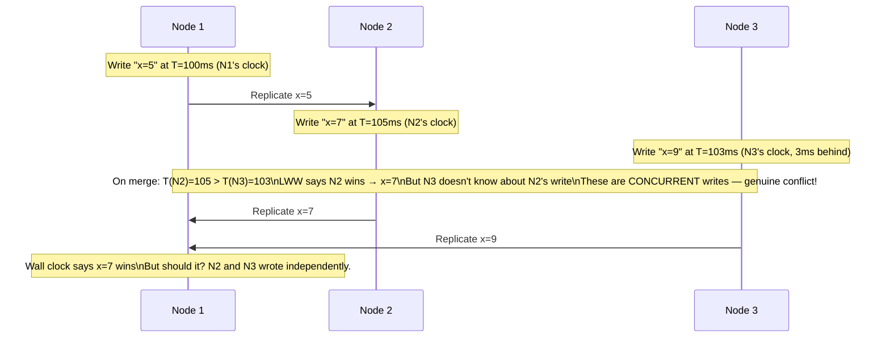
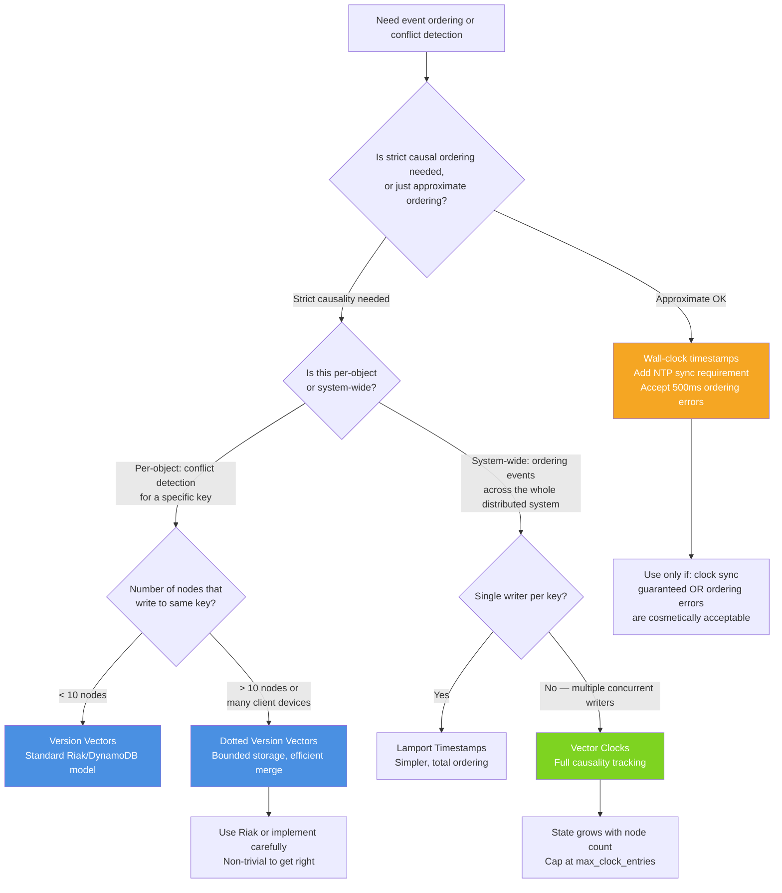

# Vector Clocks and Logical Time: Causality, Ordering, and Conflict Detection

## 🗺️ Quick Overview

```mermaid
graph TD
    A[Node 1: write x=5, VC=[1,0,0]] --> B[Replicate to Node 2]
    B --> C[Node 2: write x=7, VC=[1,1,0]]
    A --> D[Node 3: write x=9, VC=[1,0,1] — concurrent!]
    C --> E{Compare VCs on merge}
    D --> E
    E -->|One dominates the other| F[Causal — later write wins]
    E -->|Neither dominates| G[Concurrent — genuine conflict]
    G --> H[Conflict resolution required: LWW / CRDT / app logic]
    F --> I[Safe to discard older write]
```

*Vector clocks track causal history per node. When two writes' VCs are incomparable, they are concurrent; when one dominates, causal order is established without wall-clock coordination.*

**You cannot trust wall-clock time for ordering events in a distributed system.** NTP drift of 100-500ms is normal. VM time jumps of seconds occur during live migration. An event with timestamp T+100 may have happened before an event with timestamp T+50, depending on which server's clock you're reading. Vector clocks provide a causal ordering mechanism that doesn't depend on synchronized clocks — instead, they track "what a node knew when it generated an event."

The practical value: vector clocks let you distinguish "these two writes conflict and need resolution" from "write B happened after write A and supersedes it" — without any coordination between nodes.

---

## The Problem Class `[Mid]`

A distributed key-value store has 3 nodes. A value is written on Node 1, replicated to Node 2, then Node 2 modifies it. Node 3 also modifies the original value from Node 1. On merge, are these two updates in conflict, or does one causally follow the other?



The wall-clock ordering is misleading. Node 3's write at T=103 is concurrent with Node 2's write at T=105 — they both branched from Node 1's original write and proceeded independently. LWW silently picks one and discards the other.

With vector clocks, the system can detect: "these two writes are concurrent" and trigger application-defined conflict resolution instead of silent data loss.

---

## Why the Obvious Solution Fails `[Senior]`

### "NTP is good enough — drift is small"

NTP on a well-maintained server is accurate to within 1-10ms under normal conditions. However:

**VM live migration:** When a virtual machine is live-migrated between physical hosts, its clock can jump forward or backward by hundreds of milliseconds to seconds. AWS, GCP, and Azure all perform live migration without rebooting instances. After migration, NTP corrects gradually (usually 500ms adjustment per second to avoid "backward jumps"), meaning the VM's clock can be off by seconds for minutes after migration.

**Leap seconds:** Twice per year, a leap second is inserted into UTC. Many systems handle this poorly — Linux used to "smear" the second over 24 hours, meaning your time was slightly off for 24 hours every 6 months.

**Time zone bugs:** Developers log wall-clock time in local time zones, compare across systems in different time zones, and produce nonsensical orderings.

**The fundamental issue:** Wall-clock time answers "when did this happen on this server?" Vector clocks answer "what did this process know when it made this decision?" The second question is what matters for causality.

### "Lamport timestamps are enough"

Leslie Lamport's logical clocks are a simpler alternative:

```python
class LamportClock:
    def __init__(self):
        self.time = 0

    def send_event(self):
        self.time += 1
        return self.time

    def receive_event(self, message_time: int):
        self.time = max(self.time, message_time) + 1
        return self.time
```

Lamport timestamps give you a total ordering. If event A happened before event B (A causally precedes B), then `lamport(A) < lamport(B)`.

**What Lamport clocks don't tell you:** The converse is not guaranteed. If `lamport(A) < lamport(B)`, it doesn't mean A happened before B — A and B might be concurrent, and A just happened to get a smaller number due to clock initialization order.

Lamport clocks can detect "happened-before" but cannot distinguish "concurrent" from "causally ordered in the other direction." For conflict detection, you need to know whether two events are concurrent. For that, you need vector clocks.

---

## The Solution Landscape `[Senior]`

### Solution 1: Vector Clocks

**What it is:** Each node maintains a vector of counters, one per node in the system. On each event, a node increments its own counter. When sending a message, it includes its full vector. When receiving a message, it takes the element-wise maximum and increments its own counter.

**How it actually works at depth:**

```python
from typing import Dict
from copy import deepcopy

class VectorClock:
    def __init__(self, node_id: str, all_nodes: list):
        self.node_id = node_id
        self.clock: Dict[str, int] = {node: 0 for node in all_nodes}

    def increment(self):
        """Called before a local event or before sending a message"""
        self.clock[self.node_id] += 1
        return deepcopy(self.clock)

    def receive(self, received_clock: Dict[str, int]):
        """Called when receiving a message with the sender's vector clock"""
        for node_id, ts in received_clock.items():
            self.clock[node_id] = max(self.clock[node_id], ts)
        self.clock[self.node_id] += 1  # Increment own on receive
        return deepcopy(self.clock)

    def happened_before(self, vc_a: Dict, vc_b: Dict) -> bool:
        """Returns True if vc_a happened-before vc_b"""
        # A happened before B if: all A[i] <= B[i] AND at least one A[i] < B[i]
        all_leq = all(vc_a[n] <= vc_b[n] for n in vc_a)
        some_lt = any(vc_a[n] < vc_b[n] for n in vc_a)
        return all_leq and some_lt

    def concurrent(self, vc_a: Dict, vc_b: Dict) -> bool:
        """Returns True if vc_a and vc_b are concurrent (neither happened before the other)"""
        return (not self.happened_before(vc_a, vc_b) and
                not self.happened_before(vc_b, vc_a))

# Example: Riak-style conflict detection
node1 = VectorClock("n1", ["n1", "n2", "n3"])
node2 = VectorClock("n2", ["n1", "n2", "n3"])
node3 = VectorClock("n3", ["n1", "n2", "n3"])

# Node 1 writes x=5
vc_after_write1 = node1.increment()  # {"n1": 1, "n2": 0, "n3": 0}
# Replicate to Node 2
vc_at_node2_after_recv = node2.receive(vc_after_write1)  # {"n1": 1, "n2": 1, "n3": 0}

# Node 2 modifies x=7
vc_write2 = node2.increment()  # {"n1": 1, "n2": 2, "n3": 0}

# Node 3 (which only received the original replication) modifies x=9
node3.receive(vc_after_write1)   # Node 3 received the original write
vc_write3 = node3.increment()    # {"n1": 1, "n2": 0, "n3": 1}

# On merge: are vc_write2 and vc_write3 concurrent?
vc2 = {"n1": 1, "n2": 2, "n3": 0}
vc3 = {"n1": 1, "n2": 0, "n3": 1}

# happened_before(vc2, vc3)?
# vc2[n2]=2 > vc3[n2]=0 → NOT all vc2[i] <= vc3[i] → False
# happened_before(vc3, vc2)?
# vc3[n3]=1 > vc2[n3]=0 → NOT all vc3[i] <= vc2[i] → False
# concurrent? → True → CONFLICT DETECTED
```

**Sizing guidance** `[Staff+]`

Vector clock storage: O(N) where N = number of nodes that ever modified the key.

For a shopping cart in Riak (a key modified by 3 customer device replicas):
```
vector_clock_size = N_devices × 8 bytes = 3 × 8 = 24 bytes per version
sibling_count × vector_clock_size = typically < 1KB
```

At scale with many client devices modifying the same key, vector clocks grow: 100 client devices × 8 bytes = 800 bytes per version vector. This is manageable. The problem is **sibling explosion**: if conflicts are never resolved, each modification creates a new sibling, and reads must return all siblings for conflict resolution.

Sibling count control:
- Define max_siblings (Riak default: 100) — beyond this, the system refuses writes
- Implement conflict resolution on every read (read-repair pattern)
- Schedule background reconciliation for long-tail unresolved conflicts

**Failure modes** `[Staff+]`

*Sibling accumulation (the "sibling bomb"):* A client that always writes without first reading current state (and thus without including the current vector clock) creates new siblings on every write. After 1,000 writes, the key has 1,000 siblings. Every read must return all 1,000 siblings. Read latency balloons. This is a common Riak operational problem.

Mitigation: enforce "read before write" pattern in client libraries. Include the current vector clock metadata in every write.

*Clock amnesia:* A node restores from an old backup. Its vector clock is behind all other nodes. When it writes, its vector clock appears concurrent with all recent writes, creating spurious conflicts with every recent modification.

Mitigation: When restoring from backup, reset the node's vector clock entries to match the most current state from other replicas before accepting writes.

### Solution 2: Version Vectors (Distributed Version Control)

**What it is:** A variant of vector clocks used specifically for tracking which version of an object each node has seen. Used in DynamoDB, Riak, and Amazon's shopping cart paper.

The difference from vector clocks: version vectors track per-replica version of a specific object, not per-event causality across the whole system. One version vector per object (or per key), not per message.

**How it actually works at depth (DynamoDB's model):**

```
DynamoDB's vector clock (simplified):
key: "cart:user123"
versions:
  - data: [{sku: "A", qty: 2}]
    versionVector: {"node_a": 3, "node_b": 2}
  - data: [{sku: "A", qty: 2}, {sku: "B", qty: 1}]  ← concurrent write
    versionVector: {"node_a": 3, "node_c": 1}
```

When reading, DynamoDB returns both siblings. The application chooses which one to keep (or merges them) and writes back with both version vectors merged:

```
merged write:
  data: [{sku: "A", qty: 2}, {sku: "B", qty: 1}]  ← application merged
  versionVector: {"node_a": 3, "node_b": 2, "node_c": 1}  ← element-wise max
```

**Configuration decisions that matter** `[Staff+]`

DynamoDB's conflict detection vs. Cassandra's:

- DynamoDB (with conditional expressions): optimistic concurrency control. You read the current version, write with a condition that the version hasn't changed. This is not truly concurrent conflict detection — it's conflict prevention via retry.

- Cassandra (Lightweight Transactions): uses Paxos-based CAS (Compare And Swap) for conditional writes. Slower than regular writes (3x latency) but prevents concurrent write conflicts entirely.

For high-conflict scenarios (hot keys with many concurrent writers), Cassandra LWT or Redlock is safer than version-vector-based retry loops with O(N) retry probability.

### Solution 3: Dotted Version Vectors (Riak's Model)

**The problem with plain version vectors:** In a database with many clients and many nodes, plain version vectors grow unbounded. Every client that ever wrote a key adds an entry to the vector.

**What dotted version vectors solve:** They track causality more efficiently by associating each write with a specific (node, counter) pair called a "dot." Only dots that are still causally relevant need to be tracked.

```
Standard version vector for a key with 3 concurrent writes:
{"n1": 5, "n2": 3, "n3": 7}

Dotted version vector:
dot: (n1, 6)  ← this specific write
causal context: {"n1": 5, "n2": 3, "n3": 7}  ← what this write knew about
```

The dot allows the system to compactly represent "this specific version" without enumerating all siblings. Merging is efficient: two writes with dots that causally dominate each other can be merged without the full causal context comparison.

---

## Trade-off Matrix `[Senior]` → `[Staff+]`

| Mechanism | Causal Ordering | Concurrent Detection | Storage Cost | Implementation Complexity |
|---|---|---|---|---|
| Wall-clock (NTP) | Approximate only | Cannot detect | None | Trivial |
| Lamport Timestamps | Yes (partial) | No (cannot distinguish concurrent from ordered) | 8 bytes/event | Low |
| Vector Clocks | Yes | Yes | O(N) per event | Medium |
| Version Vectors | Yes (per-object) | Yes | O(N) per key | Medium |
| Dotted Version Vectors | Yes (per-object) | Yes, compactly | O(N) bounded | High |
| TrueTime (Spanner) | Yes (bounded uncertainty) | N/A (CP system) | ~7ms commit wait | Very High (hardware required) |

---

## Decision Framework `[Senior]` → `[Staff+]`



---

## Production Failure Story `[Staff+]`

**The NTP Drift Incident: Silent data loss on a message ordering service**

A message ordering service at a mid-size tech company used wall-clock timestamps to determine message delivery order. Messages were stored in Cassandra with wall-clock timestamps as the sort key. Multiple producer instances wrote messages simultaneously.

Infrastructure event: An AWS availability zone had a network anomaly that caused NTP sync failures on 30% of instances for 18 minutes. During those 18 minutes, affected instances accumulated a clock drift of up to 3.2 seconds (NTP was not correcting because it couldn't reach the time server).

Observed behavior:
- Messages produced on drifted instances had timestamps 3.2 seconds in the past
- When Cassandra applied LWW for same-key conflicts (Cassandra uses LWW on the clustering key by default), messages from drifted instances appeared to be "older"
- Consumer queues read messages ordered by timestamp → messages from drifted instances were interleaved 3.2 seconds out of order
- Some messages with identical keys were overwritten by "newer" (correctly-timed) messages

Impact: ~2,300 messages out of ~400,000 during the window were either out-of-order delivered or silently dropped due to key collision with later-timestamped messages.

The business impact: a real-time bidding system that depended on this message queue made 2,300 incorrect bid decisions. Total revenue impact: $47,000 in overpaid bids.

**Root cause:** The architecture assumed NTP reliability. No validation of message ordering semantics under clock skew scenarios.

**The fix:**
1. Replaced wall-clock sort key with Lamport-style monotonic counter per producer
2. Added sequence number (producer_id, sequence_number) as message identity — Cassandra insert uniqueness
3. NTP health check added as a pre-condition for producer startup
4. CloudWatch metric for NTP offset: alert if > 100ms on any producer instance

Post-fix: zero message ordering violations over 8 months. The Lamport counter approach doesn't require NTP at all for ordering — only for the human-readable "when did this happen" metadata.

---

## Observability Playbook `[Staff+]`

### Clock health metrics

```
# NTP drift monitoring (collect from all nodes)
node_timex_offset_seconds          → alert if abs(offset) > 100ms
node_timex_sync_status             → alert if status != TIME_OK (1)
node_timex_estimated_error_seconds → alert if > 10ms

# AWS-specific: EC2 time sync service status
chronyc tracking | grep "System time"  → RMS offset should be < 1ms on EC2 with chrony
```

### Vector clock / version vector health

```
# Riak-specific: sibling accumulation
riak.node.siblings.mean            → alert if > 5 (most keys should have 1)
riak.node.siblings.max             → alert if > 50 (sibling bomb indicator)
riak.node.get.objsize.mean         → alert if growing unbounded (stored siblings)

# Custom: conflict detection rate
conflict_detected_count_total{key_pattern="cart:*"} → track by key pattern
conflict_auto_resolved_count_total                  → auto-resolved by merge function
conflict_manual_review_count_total                  → requires human review

# Latency impact of concurrent detection
read_with_siblings_latency_p99 vs read_without_siblings_latency_p99
# Large gap indicates sibling processing overhead
```

### Testing causal correctness

Automated test for every new distributed write path:

```python
def test_causal_ordering():
    """Verify that a write causally following another is not flagged as concurrent"""
    key = f"test:{uuid.uuid4()}"

    # Write 1 on Node A
    vc1 = node_a.write(key, "value1")

    # Propagate to Node B (simulate replication)
    node_b.receive_replication(key, "value1", vc1)

    # Write 2 on Node B (causally after Write 1)
    vc2 = node_b.write(key, "value2")

    # Merge: vc2 should dominate vc1 (happened-after)
    assert not is_concurrent(vc1, vc2), "Causally ordered writes should not be concurrent"
    assert happened_before(vc1, vc2), "vc1 should be before vc2"

def test_concurrent_detection():
    """Verify that independent concurrent writes are detected as concurrent"""
    key = f"test:{uuid.uuid4()}"

    # Both nodes start from same state
    node_a.seed(key, "value0", {"n_a": 1, "n_b": 1})
    node_b.seed(key, "value0", {"n_a": 1, "n_b": 1})

    # Concurrent independent writes (no replication between)
    vc_a = node_a.write(key, "value_a")  # {"n_a": 2, "n_b": 1}
    vc_b = node_b.write(key, "value_b")  # {"n_a": 1, "n_b": 2}

    assert is_concurrent(vc_a, vc_b), "Independent concurrent writes must be detected"
```

---

## Architectural Evolution `[Staff+]`

### 2020–2022: Timestamps everywhere, conflicts ignored

Most teams used wall-clock timestamps for ordering and LWW for conflict resolution. Conflict detection was not a priority because conflicts were assumed rare and the business impact was assumed low.

### 2023–2024: Conflict awareness in collaboration tools

Figma, Notion, and collaborative apps needed real conflict detection. The industry rediscovered vector clocks and CRDTs. Libraries like Automerge and Yjs made them accessible.

### 2025–2026: HLC (Hybrid Logical Clocks) as the practical middle ground

Hybrid Logical Clocks combine wall-clock time and Lamport timestamps:
- `HLC = max(wall_clock, received_HLC) + logical_component`
- HLC values are monotonically increasing (like Lamport) and close to wall-clock (unlike pure Lamport)
- HLC drift from wall clock is bounded (typically < 1 second)

CockroachDB uses HLC internally. NTP-bounded HLC allows timestamp-based ordering with a bounded uncertainty interval — close to wall-clock time but monotonically correct.

**2026 practical guidance:**
- For event ordering: use HLC (CockroachDB's implementation is open-source) — better than wall-clock, simpler than vector clocks for total ordering
- For conflict detection: use version vectors per object — simpler than full vector clocks for the per-object use case
- For collaborative editing: use Automerge 2.0 (CRDT-based, handles causality internally)
- Avoid: implementing custom vector clock logic for new projects — use well-tested libraries
- Observe: TrueTime via Spanner/CockroachDB Cloud for systems where bounded uncertainty is sufficient

---

## Decision Framework Checklist `[All Levels]`

- [ ] Never use wall-clock timestamps as a tiebreaker for concurrent writes without acknowledging NTP drift risk.
- [ ] For any system where write conflicts can occur: define conflict semantics explicitly (LWW, merge, CRDT).
- [ ] If conflict detection is needed: use version vectors per object (simpler than full vector clocks for per-key tracking).
- [ ] If system-wide causal ordering is needed: use Lamport timestamps (single writer per key) or vector clocks (multiple concurrent writers).
- [ ] Set NTP monitoring alerts: P99 offset > 10ms on same-DC, P99 > 100ms on any node.
- [ ] For Riak/vector-clock-based systems: monitor sibling count per key. Alert if mean > 5 or max > 50.
- [ ] Implement read-before-write in all clients that use version vectors — never write without including the current version vector.
- [ ] Test conflict detection with actual concurrent writes in staging (not just unit tests). Verify merge behavior.
- [ ] For collaborative tools: evaluate Automerge or Yjs before implementing custom vector clock logic.
- [ ] Document the causality model for your system: "writes are causally tracked per-object using version vectors" as architecture documentation.

---
*Written by Gaurav Porwal — 10+ Year Engineer | Tech Lead | Product Owner | Business-Minded Builder*
*Last updated: 2026-03-18*
