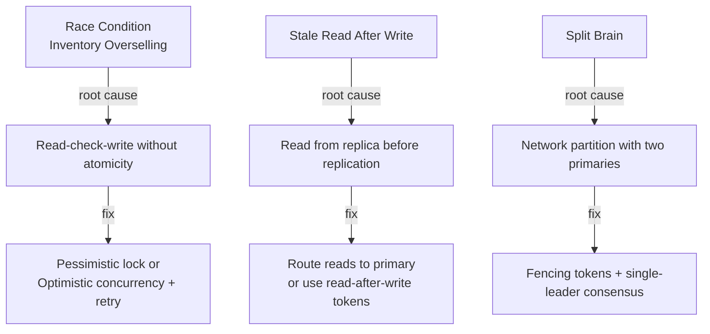

# Distributed Systems Failure Modes

Race conditions, double charges, stale reads — real production disasters explained.

```mermaid
graph TD
    RACE[Race Condition\nInventory Overselling] -->|root cause| NOLOCK[Read-check-write without atomicity]
    NOLOCK -->|fix| PESSIMISTIC[Pessimistic lock or\nOptimistic concurrency + retry]
    STALE[Stale Read After Write] -->|root cause| REPLICA[Read from replica before replication]
    REPLICA -->|fix| READPRIMARY[Route reads to primary\nor use read-after-write tokens]
    SPLIT[Split Brain] -->|root cause| NETPART[Network partition with two primaries]
    NETPART -->|fix| FENCE[Fencing tokens + single-leader consensus]
```
