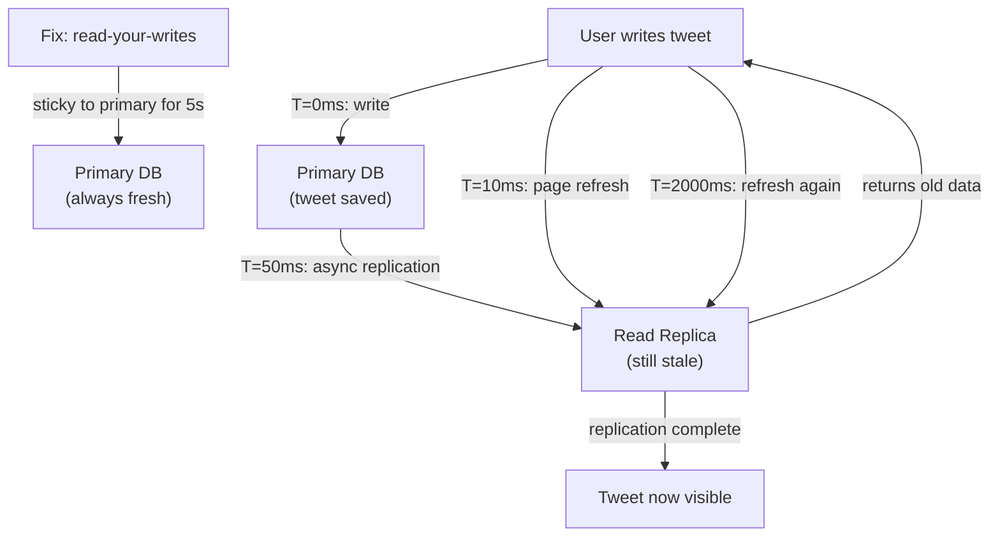

# Stale Read After Write - The Ghost Update Problem

> **Category:** Consistency
> **Frequency:** Very common in cached/replicated systems
> **Detection Difficulty:** Hard (users report "my changes disappeared")
> **Impact:** User frustration, data confusion, support tickets

## 🗺️ Quick Overview



*The writer reads from a replica that hasn't yet received the replication — the gap between primary write and replica sync causes the ghost update.*

## The Twitter Problem: "Where Did My Tweet Go?"

**Real User Experience Pattern:**

```
Timeline:
T=0.00s: User posts tweet "Hello World!"
T=0.05s: Success message shown
T=0.10s: Page refreshes to show timeline
T=0.15s: Tweet is NOT visible! 😱
T=2.00s: User refreshes again
T=2.05s: Tweet appears

What happened:
├── Write went to primary database (success)
├── Read went to read replica (stale)
├── Replica was 2 seconds behind primary
└── User saw outdated data

User perception: "Twitter lost my tweet!"
Reality: Tweet exists, just not replicated yet
```

**The problem:** In distributed systems, the writer's view of data can differ from what they read back immediately after.

---

## Why Stale Reads Happen

### Cause 1: Read Replicas Lag

```
Architecture:
┌─────────────┐     ┌─────────────┐
│   Primary   │────►│   Replica   │
│  (Writes)   │     │  (Reads)    │
└─────────────┘     └─────────────┘
       │                   │
       │ Replication       │
       │ Lag: 50-500ms     │
       │                   │

Timeline:
T=0:    Write to Primary ──────► "Data v2"
T=50ms: Replication starts
T=100ms: Read from Replica ────► "Data v1" (STALE!)
T=150ms: Replication completes
T=200ms: Read from Replica ────► "Data v2" (correct)
```

### Cause 2: Cache Invalidation Delay

```
┌─────────┐     ┌───────┐     ┌──────────┐
│   App   │────►│ Cache │     │ Database │
└─────────┘     └───────┘     └──────────┘

Write flow:
1. App writes to Database ─────────────────► "Data v2"
2. App invalidates Cache ──────► (deleted)
3. Race condition: another read happens
4. Cache miss → Read from Replica ─────────► "Data v1" (stale!)
5. Stale data cached again ◄───────────────

Result: User sees old data, cache has wrong value
```

### Cause 3: CDN/Edge Cache Staleness

```
User → CDN → API → Database

Write:
T=0:    User updates profile (via API)
T=10ms: Database updated
T=50ms: User reloads page
T=55ms: CDN serves cached (old) version!
T=300s: CDN cache expires
T=305s: Fresh data finally visible

CDN caching is invisible to most developers
```

### Cause 4: Eventually Consistent Storage

```
DynamoDB, Cassandra, MongoDB (default reads):

Write to Node A ──► Acknowledged
                    │
                    ▼ (async replication)
Nodes B, C still have old data

Read from Node B ──► Returns stale data!

Eventually (100-500ms): All nodes consistent
```

---

## Detection: How to Identify the Problem

### Symptom 1: User Reports

```
Common user complaints:
├── "I updated my profile but it still shows old info"
├── "My comment disappeared after posting"
├── "The page shows wrong data, refresh fixes it"
├── "My order shows 'processing' but I already received it"
└── "Settings don't save" (they do, just not visible)
```

### Symptom 2: Metrics Patterns

```javascript
// Track read-after-write staleness
async function trackStaleness(userId, resourceId, expectedVersion) {
  const startTime = Date.now();
  let attempts = 0;

  while (attempts < 10) {
    const data = await read(resourceId);
    attempts++;

    if (data.version >= expectedVersion) {
      metrics.histogram('staleness.read_attempts', attempts);
      metrics.histogram('staleness.latency_ms', Date.now() - startTime);
      return data;
    }

    await sleep(100 * attempts); // Exponential backoff
  }

  metrics.increment('staleness.timeout');
  return null;
}

// Alert if staleness exceeds threshold
// IF p99(staleness.latency_ms) > 500ms THEN alert
```

### Symptom 3: Version Mismatches

```sql
-- Find records where cache version != database version
SELECT
  cache.key,
  cache.version AS cache_version,
  db.version AS db_version,
  db.updated_at
FROM cache_entries cache
JOIN resources db ON cache.resource_id = db.id
WHERE cache.version < db.version
AND db.updated_at > NOW() - INTERVAL '5 minutes';
```

---

## Prevention Strategies

### Strategy 1: Read-Your-Writes Consistency

```javascript
// Route reads to primary after recent writes
class ReadYourWritesRouter {
  constructor(primary, replica, cache) {
    this.primary = primary;
    this.replica = replica;
    this.cache = cache;
    this.stickyWindowMs = 5000; // 5 seconds
  }

  async read(userId, resourceId) {
    // Check if user recently wrote to this resource
    const lastWrite = await this.cache.get(`last_write:${userId}:${resourceId}`);

    if (lastWrite) {
      const timeSinceWrite = Date.now() - parseInt(lastWrite);

      if (timeSinceWrite < this.stickyWindowMs) {
        // Read from primary to ensure consistency
        return await this.primary.query(resourceId);
      }
    }

    // Safe to read from replica
    return await this.replica.query(resourceId);
  }

  async write(userId, resourceId, data) {
    // Write to primary
    const result = await this.primary.write(resourceId, data);

    // Track write timestamp
    await this.cache.set(
      `last_write:${userId}:${resourceId}`,
      Date.now().toString(),
      'EX',
      this.stickyWindowMs / 1000
    );

    return result;
  }
}
```

### Strategy 2: Session Stickiness with Version

```javascript
// Include version in response, require on next request
class VersionAwareAPI {
  async updateProfile(userId, data) {
    const result = await db.update('profiles', userId, data);

    // Return version with response
    return {
      ...result,
      _version: result.version,
      _readAfter: Date.now() + 5000 // Tell client when safe to read from cache
    };
  }

  async getProfile(userId, options = {}) {
    const { minVersion } = options;

    // If client requires minimum version, use primary
    if (minVersion) {
      const data = await this.primaryDb.query(userId);

      if (data.version < minVersion) {
        // Data not yet replicated - wait or error
        throw new StaleDataError('Data not yet available', { retryAfter: 500 });
      }

      return data;
    }

    // No version requirement - replica is fine
    return await this.replicaDb.query(userId);
  }
}

// Client side
async function updateAndRefresh(userId, profileData) {
  const result = await api.updateProfile(userId, profileData);

  // Wait until safe, or pass version requirement
  const profile = await api.getProfile(userId, {
    minVersion: result._version
  });

  return profile;
}
```

### Strategy 3: Optimistic UI with Background Sync

```javascript
// Show user their data immediately, sync in background
class OptimisticUpdateService {
  async updateProfile(userId, data) {
    // Immediately update local state (optimistic)
    this.localStore.set(`profile:${userId}`, {
      ...data,
      _pending: true,
      _localVersion: Date.now()
    });

    // Notify UI immediately
    this.emit('profile:updated', { userId, data, pending: true });

    try {
      // Persist to server
      const result = await api.updateProfile(userId, data);

      // Confirm with server version
      this.localStore.set(`profile:${userId}`, {
        ...result,
        _pending: false
      });

      this.emit('profile:confirmed', { userId, data: result });
    } catch (error) {
      // Rollback on failure
      this.emit('profile:failed', { userId, error });
    }
  }
}
```

### Strategy 4: Write-Through Cache

```javascript
// Update cache synchronously with database
class WriteThroughCache {
  async update(resourceId, data) {
    // Transaction: update both DB and cache
    const result = await this.db.transaction(async (trx) => {
      // 1. Update database
      const record = await trx.update('resources', resourceId, data);

      // 2. Update cache in same transaction scope
      await this.cache.set(
        `resource:${resourceId}`,
        JSON.stringify(record),
        'EX',
        3600
      );

      return record;
    });

    return result;
  }

  async read(resourceId) {
    // Read from cache first
    const cached = await this.cache.get(`resource:${resourceId}`);
    if (cached) {
      return JSON.parse(cached);
    }

    // Fallback to database
    const record = await this.db.query('resources', resourceId);
    await this.cache.set(`resource:${resourceId}`, JSON.stringify(record), 'EX', 3600);
    return record;
  }
}
```

### Strategy 5: Invalidate Before Write Completes

```javascript
// Delete cache entry before write, not after
async function updateWithPreInvalidation(resourceId, data) {
  // 1. Invalidate cache FIRST
  await cache.del(`resource:${resourceId}`);

  // 2. Write to database
  const result = await db.update('resources', resourceId, data);

  // 3. Populate cache with new value
  await cache.set(`resource:${resourceId}`, JSON.stringify(result), 'EX', 3600);

  return result;
}

// Why this helps:
// - Any read during write will miss cache
// - Miss goes to primary (or waits for replication)
// - No stale value can be cached during the write window
```

---

## Real-World Solutions

### How Facebook Handles It

```
Facebook's approach for profile updates:

1. User updates profile
2. Write goes to primary MySQL
3. TAO cache invalidation is synchronous with write
4. User's session is marked "sticky to primary" for 20 seconds
5. All reads for this user go to primary during sticky window
6. After 20 seconds, replicas are caught up, back to normal routing

Result: User always sees their own writes immediately
```

### How DynamoDB Handles It

```
DynamoDB ConsistentRead option:

// Eventually consistent (default) - might be stale
const item = await dynamo.get({
  TableName: 'users',
  Key: { id: userId }
}).promise();

// Strongly consistent - always fresh
const item = await dynamo.get({
  TableName: 'users',
  Key: { id: userId },
  ConsistentRead: true  // Read from primary
}).promise();

Trade-off:
├── Eventually consistent: 0.5 RCU, faster
└── Strongly consistent: 1.0 RCU, always fresh
```

### How MongoDB Handles It

```javascript
// Read preference with write concern

// Write with majority acknowledgment
await collection.updateOne(
  { _id: userId },
  { $set: { name: 'New Name' } },
  { writeConcern: { w: 'majority' } }
);

// Read with primary preference after write
const user = await collection.findOne(
  { _id: userId },
  { readPreference: 'primary' }  // Don't use secondaries
);
```

---

## Quick Win: Fix Stale Reads Today

```javascript
// Express middleware for read-your-writes consistency
const recentWritesCache = new Map();

function readYourWritesMiddleware(replicaDb, primaryDb) {
  return async (req, res, next) => {
    const userId = req.user?.id;
    if (!userId) return next();

    // Check for recent writes
    const recentWrite = recentWritesCache.get(userId);
    const isRecent = recentWrite && (Date.now() - recentWrite < 5000);

    // Attach appropriate database connection
    req.db = isRecent ? primaryDb : replicaDb;

    next();
  };
}

// Track writes
function trackWriteMiddleware(req, res, next) {
  const originalJson = res.json.bind(res);

  res.json = function(body) {
    if (['POST', 'PUT', 'PATCH', 'DELETE'].includes(req.method)) {
      const userId = req.user?.id;
      if (userId) {
        recentWritesCache.set(userId, Date.now());

        // Cleanup old entries
        setTimeout(() => recentWritesCache.delete(userId), 10000);
      }
    }
    return originalJson(body);
  };

  next();
}

app.use(trackWriteMiddleware);
app.use(readYourWritesMiddleware(replicaPool, primaryPool));
```

---

## Key Takeaways

### Prevention Checklist

```
□ Route reads to primary for X seconds after user writes
□ Include version numbers in write responses
□ Client requests minimum version on critical reads
□ Cache invalidation happens before write, not after
□ Use optimistic UI for immediate feedback
□ Monitor replication lag and alert on spikes
```

### The Rules

| Scenario | Solution | Trade-off |
|----------|----------|-----------|
| User viewing own data after edit | Sticky session to primary | Higher primary load |
| Critical reads (payments, orders) | Always read from primary | No read scaling |
| Social feeds, timelines | Accept eventual consistency | Occasional staleness |
| Cached API responses | Version-aware cache | Complexity |

---

## Related Content

- [Cache Invalidation Race Condition](/problems-at-scale/consistency/cache-invalidation-race)
- [Caching Strategies](/02-caching/concepts/caching-strategies)
- [Read Replicas](/01-databases/concepts/read-replicas)
- [POC #17: Read Replicas](/01-databases/hands-on/database-read-replicas)

---

**Remember:** Users expect to see their own changes immediately. Design your read path to ensure write-read consistency for the user who just wrote, even if other users see slightly stale data. The key question: "Who made this write, and where are they reading from?"
