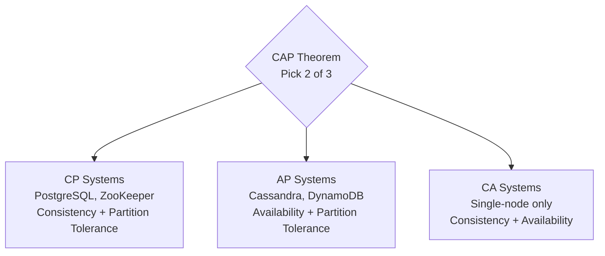

# Distributed Systems

Distributed systems are hard. Partial failures, network partitions, and clock skew create problems that don't exist in single-node systems. This section gives you the mental models to reason about them.

## What You'll Learn

- **Concepts**: CAP theorem, consensus algorithms, consistency models, two-phase commit
- **Failure Modes**: Race conditions, double charges, stale reads — real production disasters

## Where to Start

1. [CAP Theorem (Practical)](/05-distributed-systems/concepts/cap-theorem-practical) — The fundamental trade-off
2. [ACID vs BASE](/05-distributed-systems/concepts/acid-vs-base) — Consistency guarantees explained
3. [Double Booking](/05-distributed-systems/failures/double-booking) — The classic distributed system failure
4. [Raft Consensus](/05-distributed-systems/concepts/raft-consensus) — How distributed agreement works

## Navigate by Role

| I am... | Start here | Goal |
|---------|-----------|------|
| 🟢 Junior | [cap-theorem-practical](./concepts/cap-theorem-practical) | Understand the fundamental distributed systems trade-offs |
| 🟡 Mid-level | [acid-vs-base](./concepts/acid-vs-base) | Reason about consistency in real systems |
| 🔴 Senior / TL | [raft-consensus](./concepts/raft-consensus) + [failures](./failures) | Deep dive: consensus, clocks, production failures |
| 🏆 Interview prepping | [scale-and-reliability questions](../../12-interview-prep/system-design/scale-and-reliability) | Distributed systems interview patterns |

## Topic Map

| Topic | 📖 Concept | ⚠️ Failures | 🎯 Interview |
|-------|-----------|------------|-------------|
| Distributed consensus | [distributed-consensus](./concepts/distributed-consensus), [raft-consensus](./concepts/raft-consensus) | — | [service-discovery](../../12-interview-prep/system-design/scale-and-reliability/service-discovery) |
| Consistency models | [cap-theorem-practical](./concepts/cap-theorem-practical), [linearizability-vs-serializability](./concepts/linearizability-vs-serializability) | — | [cdn-from-scratch](../../12-interview-prep/system-design/scale-and-reliability/cdn-from-scratch) |
| ACID vs BASE | [acid-vs-base](./concepts/acid-vs-base) | — | — |
| Distributed transactions | [two-phase-commit](./concepts/two-phase-commit) | [double-charge-payment](./failures/double-charge-payment), [duplicate-orders](./failures/duplicate-orders) | — |
| Stale reads | [read-your-writes-consistency](./concepts/read-your-writes-consistency) | [stale-read-after-write](./failures/stale-read-after-write) | — |
| Eventual consistency | [eventual-consistency-patterns](./concepts/eventual-consistency-patterns) | — | — |
| Race conditions | — | [counter-race](./failures/counter-race), [race-condition-inventory](./failures/race-condition-inventory), [stock-order-matching-race](./failures/stock-order-matching-race) | — |
| Double booking | — | [double-booking](./failures/double-booking) | — |
| Orphaned records | — | [orphaned-records](./failures/orphaned-records) | — |
| Vector clocks | [vector-clocks-logical-time](./concepts/vector-clocks-logical-time) | — | — |
| Disaster recovery | [disaster-recovery-design](./concepts/disaster-recovery-design) | — | [monolith-to-microservices](../../12-interview-prep/system-design/scale-and-reliability/monolith-to-microservices) |
