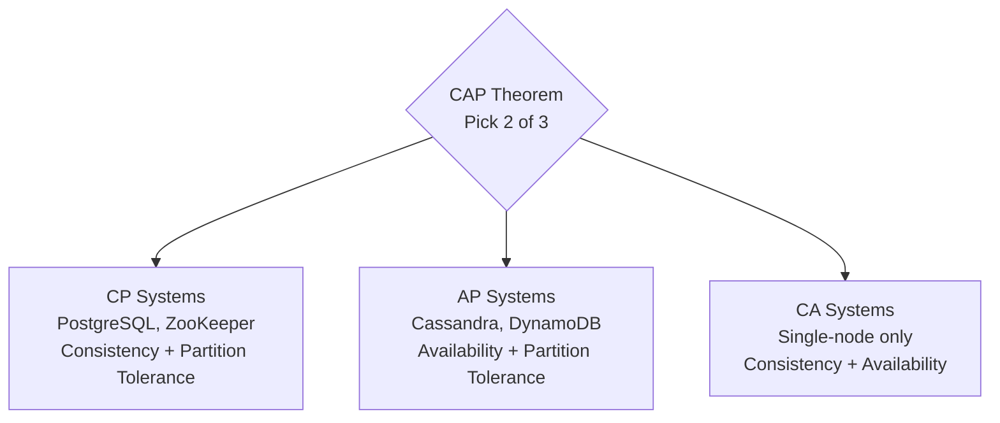

# Distributed Systems

Distributed systems are hard. Partial failures, network partitions, and clock skew create problems that don't exist in single-node systems. This section gives you the mental models to reason about them.

## What You'll Learn

- **Concepts**: CAP theorem, consensus algorithms, consistency models, two-phase commit
- **Failure Modes**: Race conditions, double charges, stale reads — real production disasters

## Where to Start

1. [CAP Theorem (Practical)](/05-distributed-systems/concepts/cap-theorem-practical) — The fundamental trade-off
2. [ACID vs BASE](/05-distributed-systems/concepts/acid-vs-base) — Consistency guarantees explained
3. [Double Booking](/05-distributed-systems/failures/double-booking) — The classic distributed system failure
4. [Raft Consensus](/05-distributed-systems/concepts/raft-consensus) — How distributed agreement works

## Topic Map

| Topic | Concepts | Hands-On | Problems at Scale | Interview Prep |
|-------|----------|----------|-------------------|----------------|
| Distributed consensus | [distributed-consensus](/05-distributed-systems/concepts/distributed-consensus), [raft-consensus](/05-distributed-systems/concepts/raft-consensus) | [redis-distributed-lock](/03-redis/hands-on/redis-distributed-lock) | [split-brain](/problems-at-scale/availability/split-brain) | — |
| Stale reads | [read-your-writes-consistency](/05-distributed-systems/concepts/read-your-writes-consistency) | — | [stale-read-after-write](/problems-at-scale/consistency/stale-read-after-write) | — |
| Cache consistency | [eventual-consistency-patterns](/05-distributed-systems/concepts/eventual-consistency-patterns) | — | [cache-invalidation-race](/problems-at-scale/consistency/cache-invalidation-race) | — |
| Distributed transactions | [two-phase-commit](/05-distributed-systems/concepts/two-phase-commit) | — | — | [saga-pattern](/12-interview-prep/system-design/business-and-advanced/saga-pattern) |
| CAP & consistency | [cap-theorem-practical](/05-distributed-systems/concepts/cap-theorem-practical), [linearizability-vs-serializability](/05-distributed-systems/concepts/linearizability-vs-serializability) | — | — | — |
