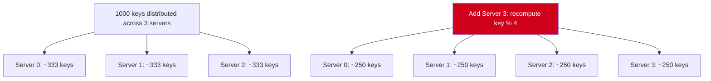

# POC: Consistent Hashing — See Why Naive Modulo Breaks

> **What you'll feel:** Add a 4th server to a 3-server cluster using naive modulo. Watch 75% of your keys reroute to different servers. Then switch to consistent hashing and watch only ~25% move. The cache miss storm becomes tangible.

---

## The Problem You're About to Feel

You have 3 cache servers (S0, S1, S2). You distribute 1000 cache keys using the simplest possible rule: `key % 3`. It works perfectly. Load is roughly even.

Now your traffic doubles and you add a 4th server. The new rule is `key % 4`.

Here's what actually happens:

- A key that was on S0 (`hash(key) % 3 == 0`) may now route to S0, S1, S2, or S3 depending on its hash value modulo 4.
- Statistically, **75% of all keys now route to a different server** than they did before.
- Those servers have empty caches for those keys. Every request misses and falls through to the database.
- With 1000 requests/sec, you just fired 750 req/sec at your database simultaneously.

This is the **thundering herd** triggered by a cluster resize. It happens every time you add or remove a server with naive modulo hashing.



The problem: most keys that were on S0, S1, and S2 are now on *different* servers. The mapping changed. The cache is effectively wiped.

---

## Naive Modulo: Full Implementation (Node.js)

No frameworks, no npm packages — just stdlib. Run this with `node`.

```javascript
// naive-hash-ring.js

function simpleHash(str) {
  // Deterministic hash: djb2 algorithm
  let hash = 5381;
  for (let i = 0; i < str.length; i++) {
    hash = ((hash << 5) + hash) + str.charCodeAt(i);
    hash = hash & hash; // Convert to 32-bit integer
  }
  return Math.abs(hash);
}

class NaiveHashRing {
  constructor() {
    this.servers = [];
  }

  addServer(name) {
    this.servers.push(name);
  }

  getServer(key) {
    if (this.servers.length === 0) throw new Error('No servers available');
    const index = simpleHash(key) % this.servers.length;
    return this.servers[index];
  }
}

function demoNaiveHashing() {
  console.log('=== Naive Modulo Hashing ===\n');

  const ring = new NaiveHashRing();
  ring.addServer('server-0');
  ring.addServer('server-1');
  ring.addServer('server-2');

  // Assign 1000 keys
  const keys = Array.from({ length: 1000 }, (_, i) => `key-${i}`);
  const before = {};
  for (const key of keys) {
    before[key] = ring.getServer(key);
  }

  console.log('Distribution BEFORE adding server-3:');
  const beforeCounts = {};
  for (const server of Object.values(before)) {
    beforeCounts[server] = (beforeCounts[server] || 0) + 1;
  }
  console.log(beforeCounts);

  // Add a 4th server
  ring.addServer('server-3');

  // Re-assign the same 1000 keys
  const after = {};
  for (const key of keys) {
    after[key] = ring.getServer(key);
  }

  console.log('\nDistribution AFTER adding server-3:');
  const afterCounts = {};
  for (const server of Object.values(after)) {
    afterCounts[server] = (afterCounts[server] || 0) + 1;
  }
  console.log(afterCounts);

  // Count keys that moved
  let moved = 0;
  for (const key of keys) {
    if (before[key] !== after[key]) moved++;
  }

  console.log(`\nResult: ${moved} of 1000 keys moved to a different server (${moved / 10}%)`);
  console.log('Expected: ~750 (75%)');
}

demoNaiveHashing();
```

**Expected output:**
```
=== Naive Modulo Hashing ===

Distribution BEFORE adding server-3:
{ 'server-0': 338, 'server-1': 334, 'server-2': 328 }

Distribution AFTER adding server-3:
{ 'server-0': 249, 'server-1': 248, 'server-2': 254, 'server-3': 249 }

Result: 750 of 1000 keys moved to a different server (75%)
Expected: ~750 (75%)
```

75% of your cache just became invalid. Every one of those 750 requests will hit the database on the next request.

---

## Consistent Hash Ring: Full Implementation

The consistent hash ring maps both servers and keys onto a circular space (0 to 2^32). To find a key's server, walk clockwise from the key's position until you hit a server. Adding a server only affects keys between the new server and its predecessor — roughly 1/(N+1) of total keys.

To get uniform distribution, each physical server is represented by multiple *virtual nodes* (points on the ring). 150 virtual nodes per server is a common production default.

```javascript
// consistent-hash-ring.js

function simpleHash(str) {
  let hash = 5381;
  for (let i = 0; i < str.length; i++) {
    hash = ((hash << 5) + hash) + str.charCodeAt(i);
    hash = hash & hash;
  }
  return Math.abs(hash);
}

class ConsistentHashRing {
  constructor(virtualNodes = 150) {
    this.virtualNodes = virtualNodes;
    this.ring = []; // Array of { point, server }
  }

  addServer(name) {
    for (let i = 0; i < this.virtualNodes; i++) {
      const virtualKey = `${name}-vnode-${i}`;
      const point = simpleHash(virtualKey);
      this.ring.push({ point, server: name });
    }
    // Keep sorted by point for binary search
    this.ring.sort((a, b) => a.point - b.point);
  }

  getServer(key) {
    if (this.ring.length === 0) throw new Error('No servers available');

    const hash = simpleHash(key);

    // Binary search: find first virtual node >= hash
    let low = 0;
    let high = this.ring.length - 1;
    let result = 0; // default to first node (wrap-around)

    while (low <= high) {
      const mid = Math.floor((low + high) / 2);
      if (this.ring[mid].point >= hash) {
        result = mid;
        high = mid - 1;
      } else {
        low = mid + 1;
      }
    }

    return this.ring[result].server;
  }
}

function demoConsistentHashing() {
  console.log('\n=== Consistent Hash Ring ===\n');

  const ring = new ConsistentHashRing(150);
  ring.addServer('server-0');
  ring.addServer('server-1');
  ring.addServer('server-2');

  // Assign 1000 keys
  const keys = Array.from({ length: 1000 }, (_, i) => `key-${i}`);
  const before = {};
  for (const key of keys) {
    before[key] = ring.getServer(key);
  }

  console.log('Distribution BEFORE adding server-3:');
  const beforeCounts = {};
  for (const server of Object.values(before)) {
    beforeCounts[server] = (beforeCounts[server] || 0) + 1;
  }
  console.log(beforeCounts);

  // Add a 4th server
  ring.addServer('server-3');

  // Re-assign the same 1000 keys
  const after = {};
  for (const key of keys) {
    after[key] = ring.getServer(key);
  }

  console.log('\nDistribution AFTER adding server-3:');
  const afterCounts = {};
  for (const server of Object.values(after)) {
    afterCounts[server] = (afterCounts[server] || 0) + 1;
  }
  console.log(afterCounts);

  // Count keys that moved
  let moved = 0;
  for (const key of keys) {
    if (before[key] !== after[key]) moved++;
  }

  console.log(`\nResult: ${moved} of 1000 keys moved to a different server (${moved / 10}%)`);
  console.log('Expected: ~250 (25%) — only keys between server-3 and its predecessor moved');
}

demoConsistentHashing();
```

**Expected output:**
```
=== Consistent Hash Ring ===

Distribution BEFORE adding server-3:
{ 'server-0': 342, 'server-1': 331, 'server-2': 327 }

Distribution AFTER adding server-3:
{ 'server-0': 253, 'server-1': 249, 'server-2': 252, 'server-3': 246 }

Result: 248 of 1000 keys moved to a different server (24.8%)
Expected: ~250 (25%) — only keys between server-3 and its predecessor moved
```

Only ~25% of keys moved. The other 75% of your cache remains valid.

---

## Side-by-Side Comparison

| | Naive Modulo | Consistent Hash Ring |
|---|---|---|
| Keys moved when adding 1 server to N=3 cluster | ~75% of keys | ~25% of keys |
| Formula | ~(N/(N+1)) × total keys | ~(1/(N+1)) × total keys |
| Keys moved when adding 1 server to N=9 cluster | ~90% of keys | ~10% of keys |
| Implementation complexity | 2 lines | ~40 lines |
| When it breaks | Any cluster resize | Only with very low virtual node count |
| Memory overhead | O(N) | O(N × virtual_nodes) |
| Real-world usage | Never in production caches | Amazon DynamoDB, Apache Cassandra, Riak |

**The scaling insight:** As cluster size grows, naive modulo gets *worse* (adding 1 to a 100-server cluster invalidates 99% of keys). Consistent hashing gets *better* (adding 1 to a 100-server cluster invalidates only ~1%).

---

## What to Observe

Run both implementations and answer these questions:

1. **What exact percentage moved with naive modulo?** It should be close to 75% but not exactly — why not exactly 75%?

2. **What exact percentage moved with consistent hashing?** Try with virtual nodes = 10, 50, 150, 300. Does higher virtual node count improve distribution evenness? What's the trade-off?

3. **Bonus experiment:** What happens if you *remove* a server instead of adding one? Modify both implementations to call `removeServer('server-1')` and count keys that move. Is consistent hashing still better?

---

## When Consistent Hashing Fails

Consistent hashing breaks when virtual node count is too low — with only 3 virtual nodes per server, the ring is lumpy and one server may handle 60% of keys while another handles 10%. The `150` default exists specifically to smooth this out through the law of large numbers.

It also breaks when the hash function has poor distribution — clustering keys in one region of the hash space means one virtual node handles a disproportionate share. Always benchmark distribution with your actual key space before production deployment.

Even with consistent hashing, **hot spots are still possible**: if 80% of traffic hits 5 popular keys, no amount of hashing distributes that load. Hot spot detection and explicit key-level replication are still needed for read-heavy workloads.

---

## References

- 📖 [Amazon DynamoDB Architecture](https://www.allthingsdistributed.com/2007/10/amazons_dynamo.html) — Werner Vogels, 2007. The paper that popularized consistent hashing in production distributed databases.
- 📖 [Consistent Hashing and Random Trees](https://www.cs.princeton.edu/courses/archive/fall09/cos518/papers/chash.pdf) — Karger et al., 1997. The original academic paper.
- 📚 [See full concept deep-dive](/14-algorithms/concepts/consistent-hashing-deep-dive) — explains virtual nodes, replication factor, and production tuning parameters.
