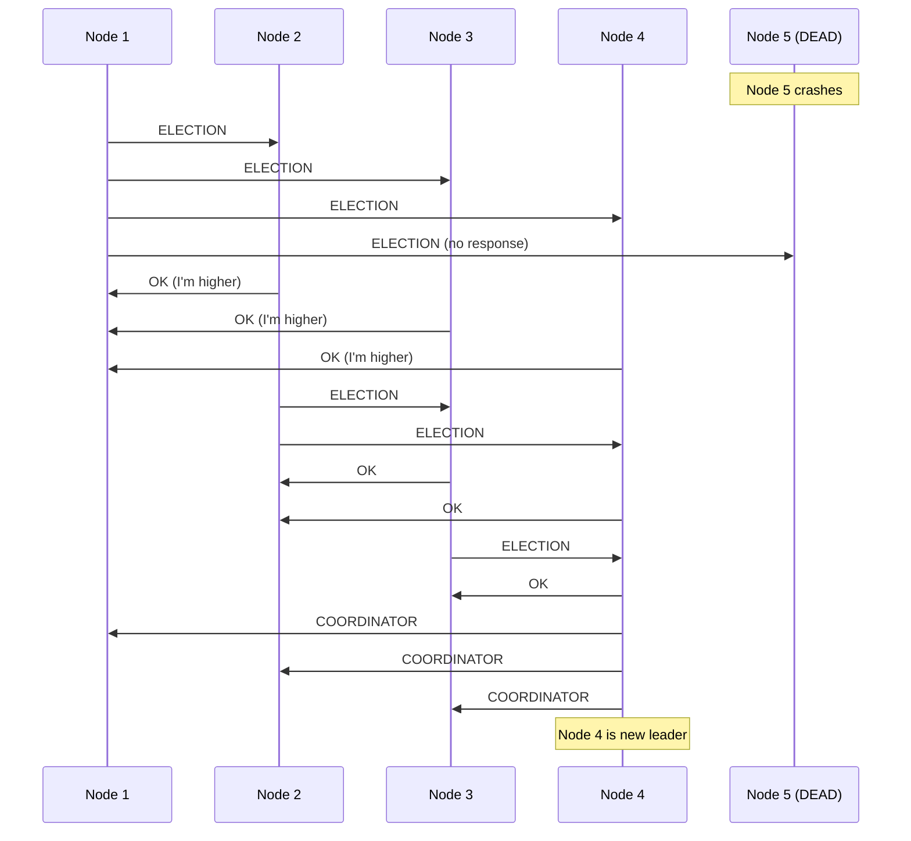

# POC: Leader Election — Bully Algorithm with Split-Brain

> **What you'll feel:** Kill the leader node. Watch every other node start sending `ELECTION` messages. Count the message flood. Then simulate a network partition and watch two nodes simultaneously declare themselves leader — a split-brain. The Bully Algorithm makes consensus visible.

---

## The Problem: Who Is In Charge?

A 5-node cluster. Node 5 (highest ID) is the leader — it handles all writes, holds the distributed lock, schedules cron jobs. At 3:47 AM, Node 5 crashes.

Within 200 milliseconds, every other node must agree on who the new leader is — without a central coordinator (because there isn't one; the coordinator *was* the leader that just died). If they don't agree, two nodes might try to write simultaneously, corruption ensues. If they take too long, the system is unavailable.

This is leader election. The **Bully Algorithm** is the simplest to understand and implement. It works correctly in fully connected networks, and it fails in exactly the way that motivates Raft — which makes it the perfect learning tool.



---

## The Bully Algorithm — Rules

1. **Any node can start an election** when it stops hearing from the leader (heartbeat timeout — typically 150-300ms).

2. **A node starting an election sends `ELECTION`** to all nodes with a higher ID than itself. If you're Node 2, you message Nodes 3, 4, and 5.

3. **If no higher node responds within a timeout**, the sender has "won by default" — no one outranked it. It declares itself leader and broadcasts `COORDINATOR` to all nodes.

4. **If a higher node receives `ELECTION`**, it sends `OK` (bullying the lower node out of contention) and starts its own election with nodes above itself.

The highest *alive* node always wins — it will never receive an `OK` response because there's no one higher. It broadcasts `COORDINATOR` and becomes leader.

---

## Full Implementation (Node.js, Simulated Message Passing)

No real networking — messages are function calls between in-memory Node instances. This keeps the algorithm visible without TCP noise.

```javascript
// leader-election.js

const ELECTION_TIMEOUT_MS = 50; // How long to wait for OK responses before declaring victory

class Node {
  constructor(id, cluster) {
    this.id = id;
    this.cluster = cluster;
    this.isAlive = true;
    this.isLeader = false;
    this.currentLeader = null;
    this.electionTimer = null;
    this.pendingOKs = new Set(); // Which higher nodes we're waiting on
  }

  // Simulate sending a message (immediate delivery in simulation)
  sendMessage(toId, type, data = {}) {
    const target = this.cluster.getNode(toId);
    if (!target || !target.isAlive) {
      this.cluster.log(`  [MSG] Node ${this.id} -> Node ${toId}: ${type} (DROPPED — node dead)`);
      return false;
    }
    this.cluster.log(`  [MSG] Node ${this.id} -> Node ${toId}: ${type}`);
    target.receiveMessage(this.id, type, data);
    return true;
  }

  receiveMessage(fromId, type, data = {}) {
    if (!this.isAlive) return;

    switch (type) {
      case 'ELECTION':
        this.onElectionReceived(fromId);
        break;
      case 'OK':
        this.onOKReceived(fromId);
        break;
      case 'COORDINATOR':
        this.onCoordinatorReceived(fromId, data);
        break;
    }
  }

  startElection() {
    this.cluster.log(`\nNode ${this.id}: Starting election (I haven't heard from the leader)`);

    // Find all nodes with higher IDs
    const higherNodes = this.cluster.getAllNodes()
      .filter(n => n.id > this.id && n.isAlive);

    if (higherNodes.length === 0) {
      // No higher nodes — I'm the winner
      this.cluster.log(`Node ${this.id}: No higher nodes alive. I win!`);
      this.declareVictory();
      return;
    }

    // Send ELECTION to all higher nodes
    this.pendingOKs = new Set(higherNodes.map(n => n.id));

    for (const node of higherNodes) {
      const delivered = this.sendMessage(node.id, 'ELECTION');
      if (!delivered) {
        this.pendingOKs.delete(node.id);
      }
    }

    // If all higher nodes are dead (no OK received), win by timeout
    if (this.pendingOKs.size === 0) {
      this.cluster.log(`Node ${this.id}: All higher nodes unreachable. I win!`);
      this.declareVictory();
    }
  }

  onElectionReceived(fromId) {
    this.cluster.log(`Node ${this.id}: Received ELECTION from Node ${fromId}. Sending OK (I'm higher).`);
    // Bully the lower node — tell them to back off
    this.sendMessage(fromId, 'OK');
    // Start my own election if I'm not already running one
    this.startElection();
  }

  onOKReceived(fromId) {
    this.cluster.log(`Node ${this.id}: Received OK from Node ${fromId}. Backing down.`);
    this.pendingOKs.delete(fromId);
    // A higher node is alive and running their own election — I step back
    // (In a full implementation, we'd wait for COORDINATOR. Simplified here.)
  }

  onCoordinatorReceived(fromId, data) {
    this.currentLeader = fromId;
    this.isLeader = false;
    this.cluster.log(`Node ${this.id}: Acknowledges Node ${fromId} as new leader.`);
  }

  declareVictory() {
    this.isLeader = true;
    this.currentLeader = this.id;
    this.cluster.log(`\n*** Node ${this.id} declares itself LEADER ***`);

    // Broadcast COORDINATOR to all other alive nodes
    const otherNodes = this.cluster.getAllNodes().filter(n => n.id !== this.id && n.isAlive);
    for (const node of otherNodes) {
      this.sendMessage(node.id, 'COORDINATOR', { leaderId: this.id });
    }
  }
}

class Cluster {
  constructor(size) {
    this.nodes = new Map();
    this.logs = [];

    // Create nodes with IDs 1 through size
    for (let i = 1; i <= size; i++) {
      this.nodes.set(i, new Node(i, this));
    }
  }

  log(message) {
    this.logs.push(message);
    console.log(message);
  }

  getNode(id) {
    return this.nodes.get(id);
  }

  getAllNodes() {
    return Array.from(this.nodes.values());
  }

  killNode(id) {
    const node = this.nodes.get(id);
    if (node) {
      node.isAlive = false;
      node.isLeader = false;
      this.log(`\n[CLUSTER] Node ${id} has CRASHED (simulating process death)`);
    }
  }

  getLeader() {
    return this.getAllNodes().find(n => n.isLeader && n.isAlive) || null;
  }

  status() {
    console.log('\n--- Cluster Status ---');
    for (const node of this.getAllNodes()) {
      const state = !node.isAlive ? 'DEAD' : node.isLeader ? 'LEADER' : 'follower';
      console.log(`  Node ${node.id}: ${state}${node.currentLeader ? ` (knows leader: ${node.currentLeader})` : ''}`);
    }
    console.log('----------------------\n');
  }
}

// ============================================================
// DEMO 1: Normal election after leader crash
// ============================================================
function demoNormalElection() {
  console.log('========================================');
  console.log('DEMO 1: Leader crash → election → new leader');
  console.log('========================================\n');

  const cluster = new Cluster(5);

  // Node 5 (highest ID) starts as leader
  cluster.getNode(5).isLeader = true;
  cluster.getNode(5).currentLeader = 5;
  for (const node of cluster.getAllNodes()) {
    if (node.id !== 5) node.currentLeader = 5;
  }

  console.log('Initial state:');
  cluster.status();

  // Leader crashes
  cluster.killNode(5);

  // Node 1 (lowest) detects the failure and starts election
  // This is the "worst case" — produces the most messages
  console.log('Node 1 detects leader failure, starts election:');
  cluster.getNode(1).startElection();

  console.log('\nFinal state:');
  cluster.status();

  const leader = cluster.getLeader();
  console.log(`NEW LEADER: Node ${leader ? leader.id : 'NONE'} (expected: Node 4)`);
}

// ============================================================
// DEMO 2: Network partition → split-brain
// ============================================================
function demoSplitBrain() {
  console.log('\n========================================');
  console.log('DEMO 2: Network partition → SPLIT BRAIN');
  console.log('========================================\n');

  const cluster = new Cluster(5);

  // Simulate partition: nodes 1-2 cannot see nodes 3-5
  // We do this by creating two sub-clusters with separate routing
  const partitionA = new Set([1, 2]);
  const partitionB = new Set([3, 4, 5]);

  // Override sendMessage to enforce partition boundary
  for (const node of cluster.getAllNodes()) {
    const originalSend = node.sendMessage.bind(node);
    node.sendMessage = (toId, type, data) => {
      const fromPartition = partitionA.has(node.id) ? 'A' : 'B';
      const toPartition = partitionA.has(toId) ? 'A' : 'B';
      if (fromPartition !== toPartition) {
        cluster.log(`  [BLOCKED by partition] Node ${node.id} -> Node ${toId}: ${type} (cross-partition message dropped)`);
        return false;
      }
      return originalSend(toId, type, data);
    };
  }

  console.log('Network partition created:');
  console.log('  Partition A: Nodes 1, 2 (cannot reach 3, 4, 5)');
  console.log('  Partition B: Nodes 3, 4, 5 (cannot reach 1, 2)\n');

  // Both partitions think the leader is gone and start elections
  console.log('Both partitions start elections simultaneously:\n');
  console.log('[PARTITION A] Node 1 starts election...');
  cluster.getNode(1).startElection();

  console.log('\n[PARTITION B] Node 3 starts election...');
  cluster.getNode(3).startElection();

  // Check results
  console.log('\n--- Result ---');
  const leadersElected = cluster.getAllNodes().filter(n => n.isLeader && n.isAlive);
  for (const leader of leadersElected) {
    const partition = partitionA.has(leader.id) ? 'A' : 'B';
    console.log(`LEADER in Partition ${partition}: Node ${leader.id}`);
  }

  if (leadersElected.length > 1) {
    console.log(`\n!!! SPLIT BRAIN: Node ${leadersElected[0].id} thinks it's leader. Node ${leadersElected[1].id} thinks it's leader. !!!`);
    console.log('\nWhat happens when the partition heals:');
    console.log('  With Bully: Both nodes are "leader". No automatic resolution.');
    console.log('  Both will try to write. Data corruption is likely.');
    console.log('  Fix (Raft): Elections require a QUORUM majority (3 of 5 nodes).');
    console.log('  Partition A (2 nodes) cannot win — no quorum. Only Partition B elects a leader.');
  }
}

demoNormalElection();
demoSplitBrain();
```

**Expected output (Demo 1):**
```
DEMO 1: Leader crash → election → new leader

[CLUSTER] Node 5 has CRASHED

Node 1: Starting election
  [MSG] Node 1 -> Node 2: ELECTION
  [MSG] Node 1 -> Node 3: ELECTION
  [MSG] Node 1 -> Node 4: ELECTION
  [MSG] Node 1 -> Node 5: ELECTION (DROPPED — node dead)
Node 2: Received ELECTION from Node 1. Sending OK.
  [MSG] Node 2 -> Node 1: OK
Node 3: Received ELECTION from Node 1. Sending OK.
  [MSG] Node 3 -> Node 1: OK
Node 4: Received ELECTION from Node 1. Sending OK.
  [MSG] Node 4 -> Node 1: OK
... (elections cascade upward) ...
*** Node 4 declares itself LEADER ***

NEW LEADER: Node 4 (expected: Node 4)
```

**Expected output (Demo 2):**
```
!!! SPLIT BRAIN: Node 2 thinks it's leader. Node 5 thinks it's leader. !!!

What happens when the partition heals:
  With Bully: Both nodes are "leader". No automatic resolution.
  Both will try to write. Data corruption is likely.
  Fix (Raft): Elections require a QUORUM majority (3 of 5 nodes).
  Partition A (2 nodes) cannot win — no quorum. Only Partition B elects a leader.
```

---

## What to Observe

After running both demos, think through these questions:

1. **Message count:** How many messages did the Demo 1 election generate? Count the `[MSG]` lines. In a 10-node cluster, worst-case election (Node 1 starts) would generate O(n²) messages. Why does this scale poorly? What's the exact message count for n=10?

2. **The highest alive node wins — but how does it know it won?** It wins because *no one sent it an OK* (there's nobody above it). This is a protocol that detects the absence of response as victory. Why is this fragile in real networks with message loss?

3. **Split-brain resolution:** The Bully Algorithm has no mechanism to resolve split-brain when the partition heals. What two things would you need to add to make it safe? (Hint: one is quorum, the other is term numbers — concepts that Raft formalizes.)

---

## References

- 📖 [Raft Consensus Algorithm Visualizer](https://raft.github.io/) — Diego Ongaro's interactive demo. After running the Bully POC, go here and watch what Raft does differently during split-brain.
- 📖 [In Search of an Understandable Consensus Algorithm (Raft Paper)](https://raft.github.io/raft.pdf) — Ongaro & Ousterhout, 2014. Section 5.2 covers leader election specifically.
- 📚 [See concept article](../concepts/distributed-consensus) — covers Raft, Paxos, and when to use each.
