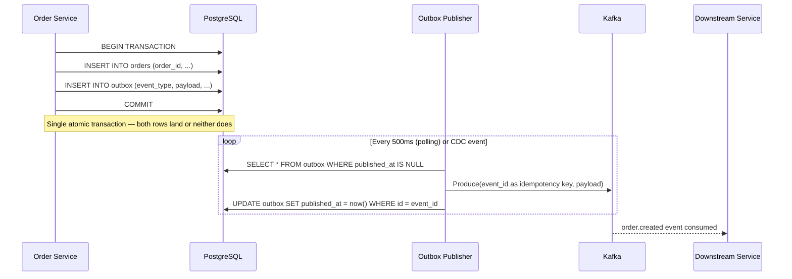

# POC: Transactional Outbox Pattern

## 🗺️ Quick Overview



*Order creation and the outbox event are committed atomically; a separate publisher drains the outbox to Kafka so a Kafka failure never loses the event.*

## What You'll Build

A runnable Node.js order service backed by PostgreSQL that writes orders and outbox events in a single transaction. You will run two publisher approaches side-by-side:

1. **Polling publisher** — a process that queries `outbox WHERE published_at IS NULL` every 500 ms and pushes to Kafka.
2. **Debezium CDC publisher** — Debezium reads PostgreSQL WAL and streams outbox inserts to Kafka with sub-100 ms latency.

You will then kill Kafka mid-flight to verify that the outbox row survives and is replayed once Kafka restarts — proving zero event loss even under partial failure.

## Why This Matters

- **Eventuate (Chris Richardson)**: The canonical open-source framework for the outbox pattern. Eventuate Tram is used by dozens of microservices shops to guarantee at-least-once delivery without distributed transactions.
- **Uber**: Uber's order-dispatch pipeline uses an outbox-style table to decouple ride creation from downstream pricing and driver-matching events, surviving Kafka restarts without losing rides.
- **Shopify**: The checkout service writes order state + domain events atomically; a background worker reads the event log and fans out to inventory, email, and fraud systems.

---

## Prerequisites

- Docker Desktop installed and running
- Node.js 18+ (for the order service and polling publisher)
- 10-15 minutes
- Ports 5432, 9092, 8083 free on localhost

## Setup

```yaml
# docker-compose.yml
version: '3.8'

services:
  postgres:
    image: postgres:15
    environment:
      POSTGRES_DB: orders
      POSTGRES_USER: app
      POSTGRES_PASSWORD: secret
    ports:
      - "5432:5432"
    command: >
      postgres
        -c wal_level=logical
        -c max_replication_slots=4
        -c max_wal_senders=4
    volumes:
      - pg_data:/var/lib/postgresql/data
      - ./init.sql:/docker-entrypoint-initdb.d/init.sql

  zookeeper:
    image: confluentinc/cp-zookeeper:7.5.0
    environment:
      ZOOKEEPER_CLIENT_PORT: 2181
    ports:
      - "2181:2181"

  kafka:
    image: confluentinc/cp-kafka:7.5.0
    depends_on: [zookeeper]
    environment:
      KAFKA_BROKER_ID: 1
      KAFKA_ZOOKEEPER_CONNECT: zookeeper:2181
      KAFKA_ADVERTISED_LISTENERS: PLAINTEXT://localhost:9092
      KAFKA_OFFSETS_TOPIC_REPLICATION_FACTOR: 1
      KAFKA_AUTO_CREATE_TOPICS_ENABLE: "true"
    ports:
      - "9092:9092"

  debezium:
    image: debezium/connect:2.4
    depends_on: [kafka, postgres]
    environment:
      BOOTSTRAP_SERVERS: kafka:9092
      GROUP_ID: debezium-outbox
      CONFIG_STORAGE_TOPIC: debezium_configs
      OFFSET_STORAGE_TOPIC: debezium_offsets
      STATUS_STORAGE_TOPIC: debezium_statuses
    ports:
      - "8083:8083"

volumes:
  pg_data:
```

```bash
docker-compose up -d
# Wait ~20 seconds for Kafka and Debezium to be ready
docker-compose ps   # All services should show "Up"
```

---

## Step-by-Step

### Step 1: Create the Database Schema

```bash
# init.sql — automatically executed when the postgres container first starts
# You can also run it manually:
docker exec -i $(docker-compose ps -q postgres) psql -U app -d orders << 'SQL'

CREATE TABLE orders (
  id          UUID PRIMARY KEY DEFAULT gen_random_uuid(),
  customer_id TEXT NOT NULL,
  amount      NUMERIC(10,2) NOT NULL,
  status      TEXT NOT NULL DEFAULT 'pending',
  created_at  TIMESTAMPTZ NOT NULL DEFAULT now()
);

CREATE TABLE outbox (
  id             UUID PRIMARY KEY DEFAULT gen_random_uuid(),
  aggregate_type TEXT NOT NULL,          -- e.g. 'Order'
  aggregate_id   TEXT NOT NULL,          -- matches orders.id
  event_type     TEXT NOT NULL,          -- e.g. 'order.created'
  payload        JSONB NOT NULL,
  created_at     TIMESTAMPTZ NOT NULL DEFAULT now(),
  published_at   TIMESTAMPTZ            -- NULL = not yet published
);

-- Index for the polling publisher — only scans unpublished rows
CREATE INDEX idx_outbox_unpublished ON outbox (created_at)
  WHERE published_at IS NULL;

SQL

# Expected: CREATE TABLE, CREATE TABLE, CREATE INDEX
```

### Step 2: Write an Order with an Atomic Outbox Event

Create `order-service.js`:

```javascript
// order-service.js
const { Pool } = require('pg');

const pool = new Pool({
  host: 'localhost', port: 5432,
  database: 'orders', user: 'app', password: 'secret'
});

async function createOrder(customerId, amount) {
  const client = await pool.connect();
  try {
    await client.query('BEGIN');

    // 1. Write the business record
    const orderRes = await client.query(
      `INSERT INTO orders (customer_id, amount)
       VALUES ($1, $2)
       RETURNING id`,
      [customerId, amount]
    );
    const orderId = orderRes.rows[0].id;

    // 2. Write the outbox event — SAME transaction
    await client.query(
      `INSERT INTO outbox (aggregate_type, aggregate_id, event_type, payload)
       VALUES ('Order', $1, 'order.created', $2)`,
      [orderId, JSON.stringify({ orderId, customerId, amount, status: 'pending' })]
    );

    await client.query('COMMIT');
    console.log(`[order-service] Created order ${orderId}`);
    return orderId;
  } catch (err) {
    await client.query('ROLLBACK');
    throw err;
  } finally {
    client.release();
  }
}

// Create 5 test orders
(async () => {
  for (let i = 1; i <= 5; i++) {
    await createOrder(`customer-${i}`, (i * 29.99).toFixed(2));
  }
  await pool.end();
})();
```

```bash
npm install pg kafkajs   # one-time install

node order-service.js
# Expected output:
# [order-service] Created order 3f8a...
# [order-service] Created order 72c1...
# [order-service] Created order a9d4...
# [order-service] Created order b3e7...
# [order-service] Created order c5f2...

# Verify both rows exist for each order:
docker exec -i $(docker-compose ps -q postgres) psql -U app -d orders \
  -c "SELECT o.id, o.amount, x.event_type, x.published_at FROM orders o JOIN outbox x ON x.aggregate_id = o.id::text;"
# Expected: 5 rows, published_at = NULL (not yet sent to Kafka)
```

### Step 3: Run the Polling Publisher

Create `polling-publisher.js`:

```javascript
// polling-publisher.js — Approach A: simple polling every 500ms
const { Pool } = require('pg');
const { Kafka } = require('kafkajs');

const pool = new Pool({
  host: 'localhost', port: 5432,
  database: 'orders', user: 'app', password: 'secret'
});

const kafka = new Kafka({ brokers: ['localhost:9092'] });
const producer = kafka.producer();

async function publishPendingEvents() {
  const client = await pool.connect();
  try {
    // Lock rows so multiple publisher instances don't double-publish
    const res = await client.query(
      `SELECT * FROM outbox
       WHERE published_at IS NULL
       ORDER BY created_at
       LIMIT 100
       FOR UPDATE SKIP LOCKED`
    );

    if (res.rows.length === 0) return;

    await producer.send({
      topic: 'orders',
      messages: res.rows.map(row => ({
        key: row.aggregate_id,          // partition by order ID
        value: JSON.stringify(row.payload),
        headers: {
          eventId: row.id,              // idempotency key — dedup in consumer
          eventType: row.event_type
        }
      }))
    });

    // Mark as published only AFTER successful Kafka ack
    const ids = res.rows.map(r => r.id);
    await client.query(
      `UPDATE outbox SET published_at = now() WHERE id = ANY($1)`,
      [ids]
    );

    console.log(`[polling-publisher] Published ${ids.length} event(s)`);
  } finally {
    client.release();
  }
}

(async () => {
  await producer.connect();
  console.log('[polling-publisher] Running — polling every 500ms');
  setInterval(publishPendingEvents, 500);
})();
```

```bash
node polling-publisher.js &
# Expected output every 500ms until all 5 events are drained:
# [polling-publisher] Published 5 event(s)
# [polling-publisher] Running — polling every 500ms (then silence = no new events)

# Confirm outbox rows are now marked:
docker exec -i $(docker-compose ps -q postgres) psql -U app -d orders \
  -c "SELECT id, event_type, published_at FROM outbox ORDER BY created_at;"
# Expected: all 5 rows have published_at set
```

### Step 4: Kill Kafka and Prove the Outbox Survives

```bash
# 1. Stop Kafka — simulates a broker crash
docker-compose stop kafka
# Expected: kafka container stops

# 2. Create 3 more orders while Kafka is DOWN
node order-service.js
# Expected: orders written to DB successfully (Kafka is not involved in the write path)

# 3. Verify outbox rows are persisted (published_at = NULL)
docker exec -i $(docker-compose ps -q postgres) psql -U app -d orders \
  -c "SELECT id, event_type, published_at FROM outbox WHERE published_at IS NULL;"
# Expected: 3 rows with published_at = NULL

# 4. Restart Kafka
docker-compose start kafka
sleep 15   # wait for Kafka to be ready

# 5. The polling publisher automatically catches up — watch its output:
# [polling-publisher] Published 3 event(s)

# 6. Confirm all rows published:
docker exec -i $(docker-compose ps -q postgres) psql -U app -d orders \
  -c "SELECT COUNT(*) FROM outbox WHERE published_at IS NULL;"
# Expected: count = 0
```

### Step 5: Register Debezium Connector (Approach B — CDC)

Debezium watches the PostgreSQL WAL and publishes outbox inserts to Kafka with near-real-time latency (< 100 ms vs polling's 500 ms).

```bash
# Register the Debezium PostgreSQL connector
curl -X POST http://localhost:8083/connectors \
  -H "Content-Type: application/json" \
  -d '{
    "name": "outbox-connector",
    "config": {
      "connector.class": "io.debezium.connector.postgresql.PostgresConnector",
      "database.hostname": "postgres",
      "database.port": "5432",
      "database.user": "app",
      "database.password": "secret",
      "database.dbname": "orders",
      "database.server.name": "orders-db",
      "table.include.list": "public.outbox",
      "transforms": "outbox",
      "transforms.outbox.type": "io.debezium.transforms.outbox.EventRouter",
      "transforms.outbox.route.topic.replacement": "orders",
      "transforms.outbox.table.field.event.id": "id",
      "transforms.outbox.table.field.event.key": "aggregate_id",
      "transforms.outbox.table.field.event.payload": "payload",
      "transforms.outbox.table.field.event.type": "event_type",
      "key.converter": "org.apache.kafka.connect.storage.StringConverter",
      "value.converter": "org.apache.kafka.connect.json.JsonConverter",
      "value.converter.schemas.enable": "false"
    }
  }'

# Verify connector is running:
curl -s http://localhost:8083/connectors/outbox-connector/status | python3 -m json.tool
# Expected: "state": "RUNNING"

# Create a new order — Debezium will capture the outbox INSERT via WAL:
node -e "
const { Pool } = require('pg');
const pool = new Pool({ host:'localhost', port:5432, database:'orders', user:'app', password:'secret' });
pool.query('BEGIN').then(() =>
  pool.query('INSERT INTO orders(customer_id,amount) VALUES(\$1,\$2) RETURNING id',['cdc-test',99.99])
).then(r => {
  const id = r.rows[0].id;
  return pool.query('INSERT INTO outbox(aggregate_type,aggregate_id,event_type,payload) VALUES(\$1,\$2,\$3,\$4)',
    ['Order', id, 'order.created', JSON.stringify({orderId:id, amount:99.99})]);
}).then(() => pool.query('COMMIT')).then(() => pool.end());
"
# Debezium publishes the event within ~100ms (vs 500ms for polling)
```

### Step 6: Consume Events and Observe Idempotency

```javascript
// consumer.js — demonstrates deduplication using the event ID header
const { Kafka } = require('kafkajs');

const kafka = new Kafka({ brokers: ['localhost:9092'] });
const consumer = kafka.consumer({ groupId: 'downstream-service' });

const processedEvents = new Set(); // In production: Redis SET or DB unique constraint

(async () => {
  await consumer.connect();
  await consumer.subscribe({ topic: 'orders', fromBeginning: true });

  await consumer.run({
    eachMessage: async ({ message }) => {
      const eventId = message.headers?.eventId?.toString();

      // Idempotency check — publisher retries can produce duplicates
      if (processedEvents.has(eventId)) {
        console.log(`[consumer] Skipping duplicate event ${eventId}`);
        return;
      }

      processedEvents.add(eventId);
      const payload = JSON.parse(message.value.toString());
      console.log(`[consumer] Processing order.created for order ${payload.orderId}`);
      // ... handle downstream logic
    }
  });
})();
```

```bash
node consumer.js
# Expected — replays all events from the beginning:
# [consumer] Processing order.created for order 3f8a...
# [consumer] Processing order.created for order 72c1...
# ... (one per order, no duplicates)
```

---

## What to Observe

| Metric | Polling Publisher | Debezium CDC |
|--------|------------------|--------------|
| Publish latency | ~500 ms (poll interval) | < 100 ms (WAL stream) |
| DB load | Extra SELECT every 500 ms | Replication slot (low overhead) |
| Complexity | ~40 lines of Node.js | Kafka Connect + config |
| Exactly-once | At-least-once + consumer dedup | At-least-once + consumer dedup |
| Failure recovery | Auto — next poll catches missed rows | Auto — offset resume after restart |

Watch the outbox table shrink in real time:
```bash
watch -n 1 "docker exec -i \$(docker-compose ps -q postgres) \
  psql -U app -d orders -c \
  'SELECT COUNT(*) AS unpublished FROM outbox WHERE published_at IS NULL;'"
```

## What Breaks It

### Break 1 — Unbounded Outbox Table Growth

Without a cleanup job the outbox table grows forever, eventually slowing the polling query even with the partial index.

```bash
# Simulate: create 10,000 orders without a cleanup job running
node -e "
const {Pool}=require('pg');const p=new Pool({host:'localhost',port:5432,database:'orders',user:'app',password:'secret'});
const q=[];for(let i=0;i<10000;i++)q.push(p.query('INSERT INTO outbox(aggregate_type,aggregate_id,event_type,payload) VALUES(\$1,\$2,\$3,\$4)',['Order','test-'+i,'order.created','{}']));
Promise.all(q).then(()=>p.end());
"

# Check table size:
docker exec -i $(docker-compose ps -q postgres) psql -U app -d orders \
  -c "SELECT pg_size_pretty(pg_total_relation_size('outbox')) AS size;"
# Outbox rows accumulate — EXPLAIN on the polling query gets slower

# Fix: add a scheduled cleanup job
docker exec -i $(docker-compose ps -q postgres) psql -U app -d orders \
  -c "DELETE FROM outbox WHERE published_at < now() - interval '1 day';"
# In production: run this as a cron job every hour
```

### Break 2 — Missing `FOR UPDATE SKIP LOCKED`

Run two polling publisher instances without `SKIP LOCKED` and observe duplicate Kafka messages (both publishers read the same rows before either marks them published).

```bash
# Start two publishers simultaneously
node polling-publisher-no-lock.js &   # version without SKIP LOCKED
node polling-publisher-no-lock.js &
# Consumer will log: [consumer] Skipping duplicate event <id>  — proves why dedup is mandatory
```

### Break 3 — Publisher Crashes After Kafka Write but Before DB Update

The publisher sends to Kafka successfully but crashes before the `UPDATE outbox SET published_at = now()`. On restart it re-publishes the same events — this is the **at-least-once** scenario. Idempotency in the consumer (Step 6) is the only defense.

```bash
# Simulate: add a deliberate crash after Kafka send in polling-publisher.js
# ... after producer.send(), throw new Error('simulated crash')
# Restart publisher — observe duplicate events in consumer
# Consumer's processedEvents Set deduplicates them silently
```

## Extend It

1. **Add a cleanup cron**: Schedule `DELETE FROM outbox WHERE published_at < now() - interval '1 day'` as a Node.js `setInterval` or a PostgreSQL `pg_cron` job and verify table size stays bounded.
2. **Partition the outbox table**: Run `CREATE TABLE outbox_2024_01 PARTITION OF outbox FOR VALUES FROM ('2024-01-01') TO ('2024-02-01')` and observe partition pruning in `EXPLAIN` — dramatically faster cleanup via `DROP PARTITION` vs row DELETE.
3. **Replace polling with Debezium for all events**: Disable the polling publisher, register the Debezium connector, and measure end-to-end latency from order creation to consumer receipt — typically < 100 ms vs 500 ms polling.
4. **Test consumer deduplication at scale**: Replay the Kafka topic from offset 0 with `fromBeginning: true` and verify your idempotency store (Redis `SETNX` or DB unique index on `event_id`) rejects all duplicates without side effects.
5. **Add a dead-letter queue**: If Kafka publish fails 3 times move the outbox row to an `outbox_dlq` table and alert — prevents a bad event from blocking all subsequent events.

## Key Takeaways

- The outbox pattern eliminates the dual-write problem: the order row and the event row are committed atomically in a single PostgreSQL transaction — Kafka failure cannot lose the event.
- Polling publisher adds ~500 ms latency and an extra DB read every poll interval; Debezium CDC reduces this to < 100 ms by streaming the WAL directly, with no polling overhead.
- The outbox event `id` must be used as the Kafka message's idempotency key; publishers retry on failure, so consumers will see duplicates and must check this key before processing.
- Without a cleanup job `DELETE FROM outbox WHERE published_at < now() - interval '1 day'` the outbox table grows without bound — even a partial index degrades past ~10 M published rows.
- `FOR UPDATE SKIP LOCKED` is mandatory when running multiple publisher replicas: without it two publishers race to publish the same rows, generating guaranteed duplicates downstream.

## References

- [Chris Richardson — Pattern: Transactional Outbox](https://microservices.io/patterns/data/transactional-outbox.html) — canonical definition and motivation
- [Debezium Outbox Event Router](https://debezium.io/documentation/reference/stable/transformations/outbox-event-router.html) — official CDC approach configuration guide
- [Eventuate Tram framework](https://github.com/eventuate-tram/eventuate-tram-core) — open-source implementation of the outbox pattern used in production microservices
