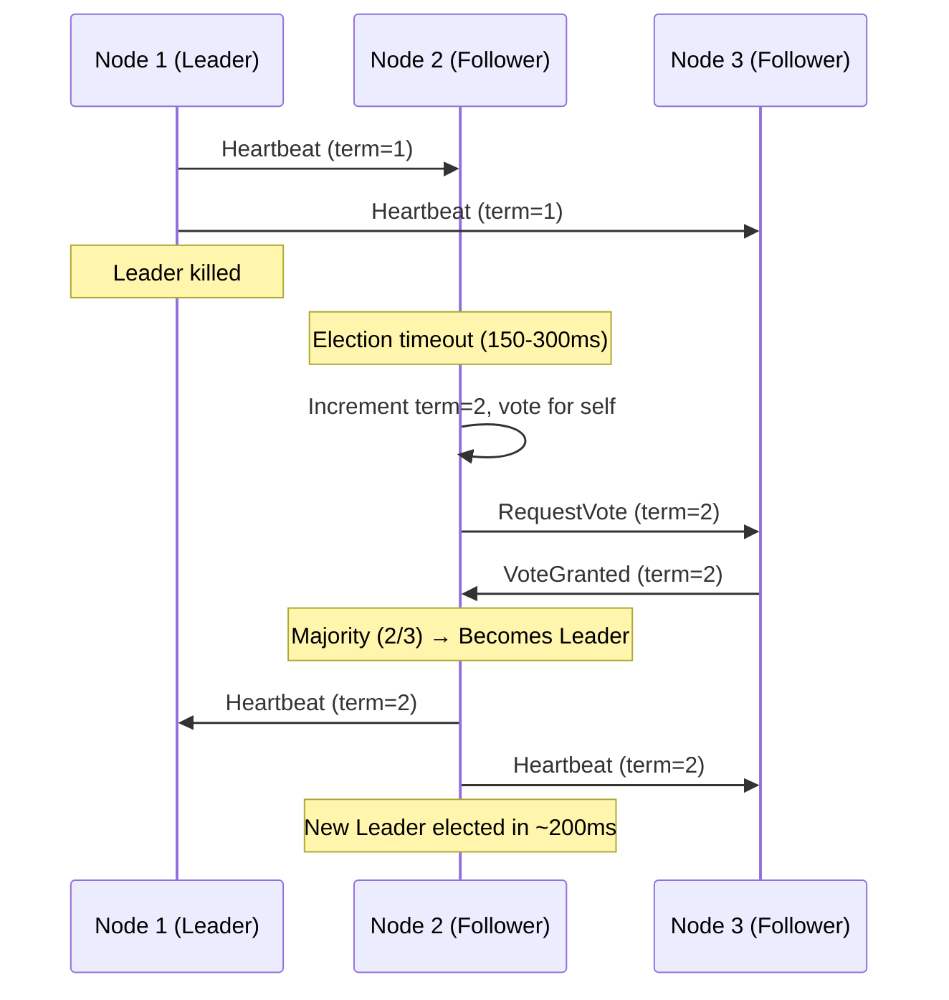

# POC: Raft Leader Election

## Quick Overview



*Three-node cluster: leader dies, election timeout fires, new leader elected with majority vote within 150-300ms.*

## What You'll Build

A 3-node etcd cluster running in Docker that demonstrates Raft consensus in action:
- **Normal operation**: 1 leader accepting writes, 2 followers replicating
- **Leader failure**: Kill the leader, watch election timeout fire, observe new leader elected in under 300ms
- **Split vote**: Partition 2 nodes from each other so neither gets majority, cluster goes read-only
- **Recovery**: Restore network, watch Raft resolve the election

You will interact with the cluster via `etcdctl` to write keys, read from followers, and observe term numbers advancing with each election.

## Why This Matters

- **etcd (Kubernetes)**: Every Kubernetes cluster uses etcd for all control plane state. Raft ensures no split-brain. etcd handles 10k ops/sec on a 3-node cluster with <10ms write latency on same-DC nodes.
- **CockroachDB**: Uses Raft per range partition (16MB chunks) so it runs thousands of independent Raft groups simultaneously — each range elects its own leader independently.
- **TiKV (PingCAP)**: Stores 100+ TB at Meituan/ByteDance using Multi-Raft; a single hardware failure triggers hundreds of parallel elections, all completing in under 500ms without human intervention.

---

## Prerequisites

- Docker Desktop installed and running
- `docker-compose` v2.x+
- `etcdctl` CLI (installed in Step 1 via Docker or Homebrew)
- 5-10 minutes

---

## Setup

```yaml
# docker-compose.yml  — save this as raft-poc/docker-compose.yml
version: '3.8'

networks:
  raft-net:
    driver: bridge
    ipam:
      config:
        - subnet: 172.20.0.0/24

services:
  etcd1:
    image: quay.io/coreos/etcd:v3.5.12
    container_name: etcd1
    networks:
      raft-net:
        ipv4_address: 172.20.0.11
    environment:
      ETCD_NAME: etcd1
      ETCD_DATA_DIR: /etcd-data
      ETCD_LISTEN_CLIENT_URLS: http://0.0.0.0:2379
      ETCD_ADVERTISE_CLIENT_URLS: http://172.20.0.11:2379
      ETCD_LISTEN_PEER_URLS: http://0.0.0.0:2380
      ETCD_INITIAL_ADVERTISE_PEER_URLS: http://172.20.0.11:2380
      ETCD_INITIAL_CLUSTER: etcd1=http://172.20.0.11:2380,etcd2=http://172.20.0.12:2380,etcd3=http://172.20.0.13:2380
      ETCD_INITIAL_CLUSTER_STATE: new
      ETCD_INITIAL_CLUSTER_TOKEN: raft-poc-token
      ETCD_HEARTBEAT_INTERVAL: 100
      ETCD_ELECTION_TIMEOUT: 500
    ports:
      - "2379:2379"
    volumes:
      - etcd1-data:/etcd-data

  etcd2:
    image: quay.io/coreos/etcd:v3.5.12
    container_name: etcd2
    networks:
      raft-net:
        ipv4_address: 172.20.0.12
    environment:
      ETCD_NAME: etcd2
      ETCD_DATA_DIR: /etcd-data
      ETCD_LISTEN_CLIENT_URLS: http://0.0.0.0:2379
      ETCD_ADVERTISE_CLIENT_URLS: http://172.20.0.12:2379
      ETCD_LISTEN_PEER_URLS: http://0.0.0.0:2380
      ETCD_INITIAL_ADVERTISE_PEER_URLS: http://172.20.0.12:2380
      ETCD_INITIAL_CLUSTER: etcd1=http://172.20.0.11:2380,etcd2=http://172.20.0.12:2380,etcd3=http://172.20.0.13:2380
      ETCD_INITIAL_CLUSTER_STATE: new
      ETCD_INITIAL_CLUSTER_TOKEN: raft-poc-token
      ETCD_HEARTBEAT_INTERVAL: 100
      ETCD_ELECTION_TIMEOUT: 500
    ports:
      - "2381:2379"
    volumes:
      - etcd2-data:/etcd-data

  etcd3:
    image: quay.io/coreos/etcd:v3.5.12
    container_name: etcd3
    networks:
      raft-net:
        ipv4_address: 172.20.0.13
    environment:
      ETCD_NAME: etcd3
      ETCD_DATA_DIR: /etcd-data
      ETCD_LISTEN_CLIENT_URLS: http://0.0.0.0:2379
      ETCD_ADVERTISE_CLIENT_URLS: http://172.20.0.13:2379
      ETCD_LISTEN_PEER_URLS: http://0.0.0.0:2380
      ETCD_INITIAL_ADVERTISE_PEER_URLS: http://172.20.0.13:2380
      ETCD_INITIAL_CLUSTER: etcd1=http://172.20.0.11:2380,etcd2=http://172.20.0.12:2380,etcd3=http://172.20.0.13:2380
      ETCD_INITIAL_CLUSTER_STATE: new
      ETCD_INITIAL_CLUSTER_TOKEN: raft-poc-token
      ETCD_HEARTBEAT_INTERVAL: 100
      ETCD_ELECTION_TIMEOUT: 500
    ports:
      - "2383:2379"
    volumes:
      - etcd3-data:/etcd-data

volumes:
  etcd1-data:
  etcd2-data:
  etcd3-data:
```

```bash
# Create directory and start the cluster
mkdir raft-poc && cd raft-poc
# (paste docker-compose.yml above into this directory)
docker-compose up -d

# Verify all 3 nodes are running
docker-compose ps
# Expected: etcd1, etcd2, etcd3 all showing "Up"
```

---

## Step-by-Step

### Step 1: Verify Cluster Health and Identify Leader

```bash
# Check cluster health from node 1
docker exec etcd1 etcdctl \
  --endpoints=http://172.20.0.11:2379,http://172.20.0.12:2379,http://172.20.0.13:2379 \
  endpoint health

# Expected output:
# http://172.20.0.11:2379 is healthy: successfully committed proposal: took = 2.3ms
# http://172.20.0.12:2379 is healthy: successfully committed proposal: took = 1.9ms
# http://172.20.0.13:2379 is healthy: successfully committed proposal: took = 2.1ms

# Find the current leader
docker exec etcd1 etcdctl \
  --endpoints=http://172.20.0.11:2379,http://172.20.0.12:2379,http://172.20.0.13:2379 \
  endpoint status --write-out=table

# Expected output (leader column shows true for one node):
# +-----------------------------+------------------+---------+---------+-----------+------------+-----------+
# |          ENDPOINT           |        ID        | VERSION | DB SIZE | IS LEADER | IS LEARNER | RAFT TERM |
# +-----------------------------+------------------+---------+---------+-----------+------------+-----------+
# | http://172.20.0.11:2379     | 8e9e05c52164694d |  3.5.12 |   20 kB |      true |      false |         2 |
# | http://172.20.0.12:2379     | 91bc3c398fb3c146 |  3.5.12 |   20 kB |     false |      false |         2 |
# | http://172.20.0.13:2379     | fd422379fda50e48 |  3.5.12 |   20 kB |     false |      false |         2 |
# +-----------------------------+------------------+---------+---------+-----------+------------+-----------+
# Note: RAFT TERM = 2 means one election happened during startup
```

### Step 2: Normal Operation — Write to Leader, Read from Followers

```bash
# Write a key to the cluster (goes to leader, replicated to followers)
docker exec etcd1 etcdctl \
  --endpoints=http://172.20.0.11:2379 \
  put /config/db-host "postgres-primary.prod.internal"

# Expected: OK

# Read the key directly from each follower (demonstrates replication)
docker exec etcd1 etcdctl \
  --endpoints=http://172.20.0.12:2379 \
  get /config/db-host
# Expected: /config/db-host\npostgres-primary.prod.internal

docker exec etcd1 etcdctl \
  --endpoints=http://172.20.0.13:2379 \
  get /config/db-host
# Expected: /config/db-host\npostgres-primary.prod.internal

# Write several keys to observe replication lag (should be <5ms on localhost)
for i in $(seq 1 10); do
  docker exec etcd1 etcdctl \
    --endpoints=http://172.20.0.11:2379 \
    put /test/key-$i "value-$i"
done
# Expected: 10 lines of "OK"

# Confirm all keys are replicated
docker exec etcd1 etcdctl \
  --endpoints=http://172.20.0.13:2379 \
  get /test/ --prefix --keys-only
# Expected: /test/key-1 through /test/key-10 (all 10 keys)
```

### Step 3: Kill the Leader — Trigger New Election

```bash
# Record the current Raft term before killing the leader
docker exec etcd1 etcdctl \
  --endpoints=http://172.20.0.11:2379,http://172.20.0.12:2379,http://172.20.0.13:2379 \
  endpoint status --write-out=fields | grep "Raft Term"
# Note the term number — it will increment after the election

# Kill the leader (assuming etcd1 is leader — check Step 1 output)
docker stop etcd1
# If etcd2 was leader instead, run: docker stop etcd2

# Watch the election happen in real time (run this IMMEDIATELY after stopping)
# Election timeout is 500ms, so the new election completes within ~1 second
watch -n 0.5 "docker exec etcd2 etcdctl \
  --endpoints=http://172.20.0.12:2379,http://172.20.0.13:2379 \
  endpoint status --write-out=table 2>/dev/null"

# Within ~500-1000ms you will see:
# - IS LEADER flips to true on one of the remaining nodes
# - RAFT TERM increments by 1 (e.g., 2 → 3), proving a new election completed
# Press Ctrl+C to exit watch

# Verify the cluster still accepts writes with only 2 nodes (quorum = 2 of 3)
docker exec etcd2 etcdctl \
  --endpoints=http://172.20.0.12:2379 \
  put /test/post-election "cluster still works"
# Expected: OK — writes succeed because 2 nodes = majority of 3
```

### Step 4: Observe Logs to See Election Messages

```bash
# Stream logs from the surviving nodes to see Raft election messages
docker logs etcd2 --tail=30 2>&1 | grep -E "election|leader|term|vote"

# Expected log lines (approximate — etcd v3.5 log format):
# {"level":"info","msg":"starting campaign","term":3}
# {"level":"info","msg":"became candidate at term 3"}
# {"level":"info","msg":"received MsgVoteResp","from":"fd422379fda50e48","term":3,"granted":true}
# {"level":"info","msg":"became leader at term 3"}

# Check what term we are now in
docker exec etcd2 etcdctl \
  --endpoints=http://172.20.0.12:2379,http://172.20.0.13:2379 \
  endpoint status --write-out=table
# IS LEADER=true for exactly ONE node, RAFT TERM is now 3 (or higher)
```

### Step 5: Restore the Dead Node — Follower Rejoins

```bash
# Bring etcd1 back up
docker start etcd1

# Wait 2-3 seconds for it to sync, then check cluster status
sleep 3
docker exec etcd1 etcdctl \
  --endpoints=http://172.20.0.11:2379,http://172.20.0.12:2379,http://172.20.0.13:2379 \
  endpoint status --write-out=table

# Expected: etcd1 rejoins as FOLLOWER (IS LEADER = false)
# All 3 nodes show the SAME RAFT TERM number (e.g., 3)
# etcd1 does NOT reclaim leadership — Raft does not do "leader re-election on rejoin"

# Confirm etcd1 has all the data written while it was down
docker exec etcd1 etcdctl \
  --endpoints=http://172.20.0.11:2379 \
  get /test/post-election
# Expected: post-election\ncluster still works
# etcd1 caught up via log replication automatically
```

### Step 6: Simulate Split Vote (Network Partition)

```bash
# Partition etcd2 and etcd3 from each other using iptables inside containers
# This simulates a network split where each node can only reach etcd1 (now a minority)
# and etcd2 / etcd3 cannot talk to each other

# Drop traffic between etcd2 (172.20.0.12) and etcd3 (172.20.0.13)
docker exec etcd2 iptables -A INPUT -s 172.20.0.13 -j DROP
docker exec etcd2 iptables -A OUTPUT -d 172.20.0.13 -j DROP
docker exec etcd3 iptables -A INPUT -s 172.20.0.12 -j DROP
docker exec etcd3 iptables -A OUTPUT -d 172.20.0.12 -j DROP

# Now also stop etcd1 to remove the third voter
docker stop etcd1

# etcd2 and etcd3 each try to elect themselves:
#   etcd2 votes for itself, requests vote from etcd3 → no response (partitioned)
#   etcd3 votes for itself, requests vote from etcd2 → no response (partitioned)
#   Neither gets 2 votes (majority of 3) → no leader elected → split vote

# Observe: cluster refuses writes (no quorum)
sleep 2
docker exec etcd2 etcdctl \
  --endpoints=http://172.20.0.12:2379 \
  put /test/split "will this work?" --dial-timeout=2s --command-timeout=3s
# Expected: Error: context deadline exceeded (no leader available)

# Observe: RAFT TERM keeps incrementing as failed elections pile up
docker exec etcd2 etcdctl \
  --endpoints=http://172.20.0.12:2379 \
  endpoint status --write-out=fields 2>/dev/null | grep "Raft Term"
# Wait 5 seconds and check again — term will have increased multiple times
# Each failed election attempt increments the term
sleep 5
docker exec etcd2 etcdctl \
  --endpoints=http://172.20.0.12:2379 \
  endpoint status --write-out=fields 2>/dev/null | grep "Raft Term"
# Term number is now much higher — shows repeated failed election attempts
```

### Step 7: Heal the Partition — Election Resolves

```bash
# Remove the iptables rules to restore network connectivity
docker exec etcd2 iptables -D INPUT -s 172.20.0.13 -j DROP
docker exec etcd2 iptables -D OUTPUT -d 172.20.0.13 -j DROP
docker exec etcd3 iptables -D INPUT -s 172.20.0.12 -j DROP
docker exec etcd3 iptables -D OUTPUT -d 172.20.0.12 -j DROP

# Restart etcd1 as well
docker start etcd1
sleep 3

# Now all 3 nodes can communicate again → election completes in <500ms
docker exec etcd1 etcdctl \
  --endpoints=http://172.20.0.11:2379,http://172.20.0.12:2379,http://172.20.0.13:2379 \
  endpoint status --write-out=table
# Expected: exactly 1 leader, all nodes on same (high) RAFT TERM

# Cluster accepts writes again
docker exec etcd1 etcdctl \
  --endpoints=http://172.20.0.11:2379 \
  put /test/recovered "partition healed"
# Expected: OK

echo "Cluster is healthy again. Partition scenario complete."
```

---

## What to Observe

| Metric | Expected Value | How to Check |
|--------|---------------|--------------|
| Election duration | 500-1000ms (our config) | Timestamp `docker stop` vs IS LEADER flip in `watch` |
| Raft term after election | Increments by 1 | `endpoint status --write-out=table` |
| Writes during split vote | Error: deadline exceeded | Step 6 `put` command |
| Term during split vote | Rapid increments | Check term every 5s in Step 6 |
| Recovery after partition heal | Leader elected within 1s | Step 7 `endpoint status` |
| Follower sync after rejoin | All keys present | Step 5 `get /test/post-election` |

**Key numbers to internalize:**
- etcd default election timeout: **150-300ms** in production (we use 500ms to make it observable)
- etcd default heartbeat interval: **50ms** in production (we use 100ms)
- etcd 3-node cluster throughput: **10,000 ops/sec** on same-datacenter nodes
- Writes complete in: **<10ms** P99 on LAN, **<50ms** P99 cross-AZ
- Minimum cluster for fault tolerance: **3 nodes** (tolerates 1 failure)
- 5-node cluster: tolerates 2 simultaneous failures

---

## What Breaks It

### Scenario A: 2-Node Cluster (Never Do This)
```bash
# Stop etcd3 permanently to simulate a 2-node cluster
docker stop etcd3

# The 2 remaining nodes CANNOT form quorum if either fails
# quorum for 2-node cluster = 2 (both nodes must agree)
docker stop etcd1

# etcd2 alone cannot elect itself — it needs 2 votes total
docker exec etcd2 etcdctl \
  --endpoints=http://172.20.0.12:2379 \
  put /test/two-node "works?" --command-timeout=3s
# Expected: Error — no leader. A single node is NOT a majority of 2.

# Lesson: Always use odd-numbered clusters (3, 5, 7).
# Even-numbered clusters provide no extra fault tolerance over the odd number below.
# A 4-node cluster tolerates 1 failure (same as 3-node) but requires 3 nodes for quorum.
docker start etcd1 etcd3  # restore
```

### Scenario B: Slow Heartbeat → Spurious Elections
```bash
# In docker-compose.yml, try increasing ETCD_HEARTBEAT_INTERVAL to 1000 (1 second)
# and ETCD_ELECTION_TIMEOUT to 2000 (2 seconds)
# On a loaded host, heartbeats may arrive late → followers think leader died → election fires
# This is the #1 cause of instability in etcd under CPU pressure
# Production recommendation: heartbeat = 100ms, election timeout = 1000ms on cloud VMs
```

### Scenario C: Stale Leader (Network Delay, Not Partition)
```bash
# If the leader's heartbeats are delayed (not dropped) by >election_timeout,
# followers start an election. The old leader sees a higher term from new leader
# and immediately steps down (Raft rule: higher term always wins).
# The old leader then replays any uncommitted entries from the new leader's log.
# Result: no data loss, brief write unavailability (~election_timeout duration).
```

---

## Extend It

1. **Tune election timeout to production values**: Change `ETCD_ELECTION_TIMEOUT` to 1000ms and `ETCD_HEARTBEAT_INTERVAL` to 100ms, then measure actual election duration using `date` before/after `docker stop`.

2. **Watch etcd metrics in Prometheus**: Add a Prometheus + Grafana container to docker-compose.yml. etcd exposes `/metrics` on port 2381. The `etcd_server_leader_changes_seen_total` counter increments on every election — alert on this in production.

3. **Simulate high write load during election**: Run a background write loop (`while true; do etcdctl put /load/$(date +%s%N) x; done`) and kill the leader mid-run. Observe that writes during the election gap return errors, then resume automatically after the new leader is elected.

4. **Compare 3-node vs 5-node cluster**: Rebuild with 5 etcd nodes. Stop 2 simultaneously. Confirm the cluster remains healthy with 3 nodes (quorum = 3 of 5). This demonstrates why Kubernetes recommends 5-node etcd for production.

5. **Implement simplified Raft in Python** (no library): Use threading + sockets to build a 3-node state machine. Implement only RequestVote and AppendEntries RPCs. This cements understanding of why the log index and term number together uniquely identify the "most up-to-date" candidate.

---

## Key Takeaways

- **Election completes in 150-300ms** in production etcd clusters (heartbeat=50ms, election_timeout=150-300ms); our POC uses 500ms timeout to make it observable with human eyes.
- **Raft term is a logical clock**: every election increments it, and any node that sees a higher term immediately steps down — this is how split-brain is prevented without a separate lock service.
- **Quorum = floor(N/2) + 1**: a 3-node cluster requires 2 votes; losing 2 nodes means no election can complete, cluster goes read-only (never serves stale data — it refuses rather than lying).
- **Always use odd node counts (3, 5, 7)**: a 4-node cluster tolerates exactly 1 failure (same as 3-node) with 50% more hardware cost and no benefit.
- **etcd handles 10k ops/sec** on a 3-node same-datacenter cluster; cross-AZ latency (5-20ms) reduces throughput by ~40% — plan your etcd topology before deployment.

---

## Cleanup

```bash
cd raft-poc
docker-compose down -v
# Removes all containers and named volumes (etcd1-data, etcd2-data, etcd3-data)
```
