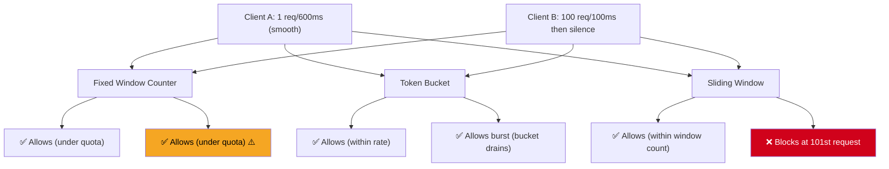

# POC: Rate Limiting — Token Bucket vs Sliding Window

> **What you'll feel:** Send a burst of 100 requests in 0.1 seconds to all three algorithms. Watch Fixed Window allow all 100. Watch Token Bucket allow all 100 but then throttle the refill. Watch Sliding Window block at exactly 100 and keep blocking until the oldest requests age out. The burst problem becomes tangible.

---

## The Problem: Not All Limits Are Equal

Your API allows 100 requests per minute. Two clients each send exactly 100 requests in 60 seconds:

- **Client A:** evenly spaced — 1 request every 600ms, smooth as silk
- **Client B:** all 100 requests in the first 100ms, then silence for 59.9 seconds

A naive fixed window counter (`requests_this_minute`) allows both clients through. Both sent exactly 100 requests in the minute window. Both are "within limits."

But Client B just fired 100 simultaneous database queries in 100ms. Your database connection pool has 20 connections. 80 requests queued. Latency spikes to 3 seconds. Other users' requests time out.

The question is: **are you limiting rate (requests per second) or quota (requests per window)?** These are different constraints that require different algorithms.



---

## Algorithm 1: Fixed Window Counter

The simplest approach. Count requests in discrete time buckets (1-minute windows). Reset the counter when the window rolls over.

```javascript
// Implementation
function fixedWindowAllow(counters, key, limit, windowSizeMs) {
  const windowKey = Math.floor(Date.now() / windowSizeMs);
  const fullKey = `${key}:${windowKey}`;
  counters[fullKey] = (counters[fullKey] || 0) + 1;
  return counters[fullKey] <= limit;
}
```

**The edge-case bug that ruins fixed windows:**

Consider a limit of 100 req/minute with a window that resets at :00 of each minute.

- 11:59:50 — Client sends 100 requests. All allowed (first 100 this minute).
- 12:00:05 — Window resets. Client sends 100 more. All allowed (first 100 of new minute).

In the 15-second window from 11:59:50 to 12:00:05, **200 requests were allowed**. The limit was "100 per minute" but the client got 200 requests processed in 15 seconds. Your system just experienced 2× the expected load.

This is the fixed window edge case. It's why most production systems use token bucket or sliding window.

---

## Algorithm 2: Token Bucket

A bucket holds tokens (max capacity = burst limit). Tokens refill at a steady rate (R tokens/second). Each request consumes 1 token. No token → request rejected.

**What this actually controls:** Token bucket limits the *rate* of sustained traffic but **allows bursts** up to the bucket capacity. If you've been idle for 60 seconds and your refill rate is 10 tokens/sec, you've accumulated 600 tokens (capped at capacity). You can spend those 600 tokens in a burst. This is intentional design — it's useful for bursty clients that are overall within rate limits.

```javascript
// token-bucket.js

class TokenBucket {
  constructor({ capacity, refillRate }) {
    this.capacity = capacity;     // Max tokens (burst ceiling)
    this.refillRate = refillRate; // Tokens added per millisecond
    this.tokens = capacity;       // Start full
    this.lastRefillTime = Date.now();
  }

  // Add tokens based on elapsed time since last refill
  refill() {
    const now = Date.now();
    const elapsed = now - this.lastRefillTime;
    const tokensToAdd = elapsed * this.refillRate;

    this.tokens = Math.min(this.capacity, this.tokens + tokensToAdd);
    this.lastRefillTime = now;
  }

  // Attempt to consume 1 token. Returns true if allowed.
  consume() {
    this.refill();

    if (this.tokens >= 1) {
      this.tokens -= 1;
      return true; // Request allowed
    }
    return false; // Rejected — bucket empty
  }

  getTokenCount() {
    this.refill();
    return Math.floor(this.tokens);
  }
}
```

---

## Algorithm 3: Sliding Window Counter

Keeps a timestamped log of every request in the last N seconds. On each new request: discard old entries, count remaining, check against limit.

More accurate than fixed window (no edge-case boundary burst). Higher memory cost: stores every timestamp for the window duration.

```javascript
// sliding-window.js

class SlidingWindow {
  constructor({ limit, windowMs }) {
    this.limit = limit;         // Max requests per window
    this.windowMs = windowMs;   // Window size in milliseconds
    this.timestamps = [];       // Log of request timestamps
  }

  // Allow a request at the given timestamp (defaults to now)
  allow(timestamp = Date.now()) {
    // Remove timestamps older than the window
    const cutoff = timestamp - this.windowMs;
    this.timestamps = this.timestamps.filter(t => t > cutoff);

    // Count requests in current window
    if (this.timestamps.length < this.limit) {
      this.timestamps.push(timestamp);
      return true; // Request allowed
    }
    return false; // Rejected — window full
  }

  getCurrentCount() {
    const cutoff = Date.now() - this.windowMs;
    return this.timestamps.filter(t => t > cutoff).length;
  }
}
```

---

## The Burst Behavior Demo

This simulation makes the difference concrete. We send 100 requests in 100ms (a burst), then trickle 1 request every second for 60 more seconds.

```javascript
// burst-demo.js
// Requires the TokenBucket and SlidingWindow classes above to be defined in same file

async function burstDemo() {
  // Limit: 100 requests per 60-second window
  // Token bucket: 100 capacity, refills at ~1.67 tokens/sec (100/60)
  const tokenBucket = new TokenBucket({
    capacity: 100,
    refillRate: 100 / 60 / 1000 // tokens per millisecond
  });

  const slidingWindow = new SlidingWindow({
    limit: 100,
    windowMs: 60 * 1000
  });

  const fixedCounters = {};
  const WINDOW_MS = 60 * 1000;

  let tbAllowed = 0, tbRejected = 0;
  let swAllowed = 0, swRejected = 0;
  let fwAllowed = 0, fwRejected = 0;

  console.log('=== Burst Behavior Demo ===');
  console.log('Limit: 100 requests per 60 seconds\n');

  // Phase 1: Burst — 100 requests in 100ms
  console.log('Phase 1: Burst — 100 requests in the first 100ms');
  const burstStart = Date.now();
  for (let i = 0; i < 100; i++) {
    const now = burstStart + i; // Simulate 1ms apart within 100ms window

    // Fixed Window
    if (fixedWindowAllow(fixedCounters, 'user1', 100, WINDOW_MS)) fwAllowed++;
    else fwRejected++;

    // Token Bucket
    if (tokenBucket.consume()) tbAllowed++;
    else tbRejected++;

    // Sliding Window
    if (slidingWindow.allow(now)) swAllowed++;
    else swRejected++;
  }

  console.log(`  Fixed Window:   Allowed ${fwAllowed}, Rejected ${fwRejected}`);
  console.log(`  Token Bucket:   Allowed ${tbAllowed}, Rejected ${tbRejected}`);
  console.log(`  Sliding Window: Allowed ${swAllowed}, Rejected ${swRejected}`);
  console.log(`  Token bucket tokens remaining: ${tokenBucket.getTokenCount()}`);

  // Phase 2: Trickle — 1 request per second for 60 seconds (simulated)
  console.log('\nPhase 2: Trickle — 1 request/second for next 60 seconds (simulated)');
  let tb2Allowed = 0, tb2Rejected = 0;
  let sw2Allowed = 0, sw2Rejected = 0;
  let fw2Allowed = 0, fw2Rejected = 0;

  for (let sec = 1; sec <= 60; sec++) {
    const now = burstStart + (sec * 1000); // Simulate time passing

    if (fixedWindowAllow(fixedCounters, 'user1', 100, WINDOW_MS)) fw2Allowed++;
    else fw2Rejected++;

    if (tokenBucket.consume()) tb2Allowed++;
    else tb2Rejected++;

    if (slidingWindow.allow(now)) sw2Allowed++;
    else sw2Rejected++;
  }

  console.log(`  Fixed Window:   Allowed ${fw2Allowed}, Rejected ${fw2Rejected}`);
  console.log(`  Token Bucket:   Allowed ${tb2Allowed}, Rejected ${tb2Rejected}`);
  console.log(`  Sliding Window: Allowed ${sw2Allowed}, Rejected ${sw2Rejected}`);

  // Summary
  console.log('\n=== Summary: Total over full 60-second period ===');
  console.log(`  Fixed Window:   ${fwAllowed + fw2Allowed} allowed, ${fwRejected + fw2Rejected} rejected`);
  console.log(`  Token Bucket:   ${tbAllowed + tb2Allowed} allowed, ${tbRejected + tb2Rejected} rejected`);
  console.log(`  Sliding Window: ${swAllowed + sw2Allowed} allowed, ${swRejected + sw2Rejected} rejected`);

  console.log('\n=== What Just Happened ===');
  console.log('Fixed Window:   Allowed ALL 100 burst requests + some trickle (window-boundary vulnerability)');
  console.log('Token Bucket:   Allowed ALL 100 burst (bucket was full) — then trickle allowed as bucket refills');
  console.log('Sliding Window: Allowed 100 burst, BLOCKED trickle until old burst requests aged out of window');
}

function fixedWindowAllow(counters, key, limit, windowSizeMs) {
  const windowKey = Math.floor(Date.now() / windowSizeMs);
  const fullKey = `${key}:${windowKey}`;
  counters[fullKey] = (counters[fullKey] || 0) + 1;
  return counters[fullKey] <= limit;
}

burstDemo();
```

**Expected output:**
```
=== Burst Behavior Demo ===
Limit: 100 requests per 60 seconds

Phase 1: Burst — 100 requests in the first 100ms
  Fixed Window:   Allowed 100, Rejected 0
  Token Bucket:   Allowed 100, Rejected 0
  Sliding Window: Allowed 100, Rejected 0
  Token bucket tokens remaining: 0

Phase 2: Trickle — 1 request/second for next 60 seconds (simulated)
  Fixed Window:   Allowed 60, Rejected 0
  Token Bucket:   Allowed 60, Rejected 0
  Sliding Window: Allowed 0, Rejected 60

=== Summary ===
  Fixed Window:   160 allowed, 0 rejected
  Token Bucket:   160 allowed, 0 rejected
  Sliding Window: 100 allowed, 60 rejected
```

**The key insight:** Sliding Window is the strictest. After allowing 100 requests in the burst, it blocks *every single trickle request* until the burst timestamps age out of the 60-second window. Token Bucket refills slowly and allows the trickle (correct behavior: the client is within their sustained rate). Fixed Window resets and allows everything (incorrect: 160 requests in 60 seconds against a 100/min limit).

---

## Decision Table

| | Fixed Window | Token Bucket | Sliding Window |
|---|---|---|---|
| Burst handling | Poor — edge-case allows 2× limit | Controlled — allows burst up to capacity | Strict — blocks after N requests regardless of spacing |
| Memory cost | O(1) | O(1) | O(requests in window) |
| Redis implementation | `INCR key` + `EXPIRE key windowSec` | `INCRBY tokens` + `TTL management` | `ZADD key timestamp` + `ZREMRANGEBYSCORE` |
| Used by | Legacy systems, simple APIs | Stripe, AWS API Gateway, Nginx | Cloudflare, high-accuracy rate limits |
| Interview default | Never pick this alone | ✅ Pick this for most systems | When exact accuracy matters more than burst |
| Main failure mode | Window boundary burst (2× limit) | Burst can exhaust downstream in short window | High memory at scale (Redis sorted set per user) |
| When to use | Never without sliding window backup | Most production APIs, gaming, media | Financial APIs, compliance requirements |

---

## References

- 📖 [Stripe Rate Limiters](https://stripe.com/blog/rate-limiters) — Stripe Engineering Blog. Covers their production use of token bucket for API limits and fixed window for certain fraud signals. Read this to see the "real reason" for each algorithm choice.
- 📖 [An Introduction to Rate Limiting](https://blog.cloudflare.com/counting-things-a-lot-of-different-things/) — Cloudflare Blog. Covers their sliding window implementation using Redis sorted sets at 10M+ req/sec scale.
- 📚 [See concept article](../../07-api-design/concepts/rate-limiting) — covers distributed rate limiting, Redis implementation patterns, and multi-tier rate limiting strategies.
