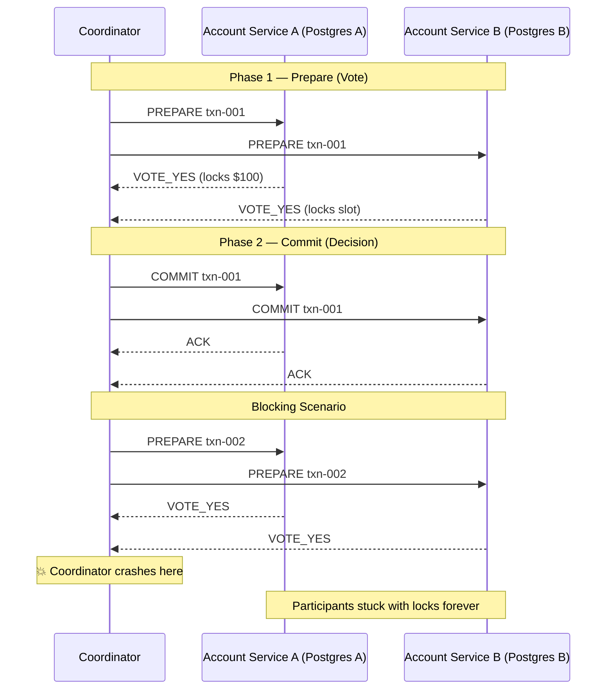

# POC: Two-Phase Commit — Distributed Transactions and the Blocking Problem

## 🗺️ Quick Overview



*Phase 1 locks funds on both participants; Phase 2 commits atomically — coordinator crash between phases leaves participants blocked indefinitely.*

## What You'll Build

A Node.js simulation of a distributed $100 transfer from Account Service A (Postgres A) to Account Service B (Postgres B). You will implement a coordinator and two participant services, observe the full happy path, then deliberately kill the coordinator after Phase 1 to witness the blocking problem. Finally, you will add a timeout-based recovery coordinator that reads the transaction log to resume the outcome, and compare this against the Saga compensating-transaction alternative that avoids blocking entirely.

## Why This Matters

- **Google Spanner**: Uses 2PC internally across Paxos groups for cross-shard transactions; adds ~14ms latency per cross-region commit.
- **PostgreSQL**: Has native `PREPARE TRANSACTION` / `COMMIT PREPARED` — the only case where 2PC is safe to use in production without a custom coordinator.
- **Apache Flink / Kafka**: Exactly-once semantics use a 2PC variant (two-phase commit sink protocol) where the broker is the coordinator.

---

## Prerequisites

- Docker Desktop installed and running
- Node.js 18+ (`node --version`)
- `curl` or any HTTP client for testing
- 10-15 minutes

---

## Setup

### docker-compose.yml

```yaml
version: '3.8'

services:
  postgres-a:
    image: postgres:15-alpine
    container_name: 2pc_postgres_a
    environment:
      POSTGRES_DB: accounts_a
      POSTGRES_USER: user_a
      POSTGRES_PASSWORD: pass_a
    ports:
      - "5433:5432"
    volumes:
      - ./init-a.sql:/docker-entrypoint-initdb.d/init.sql
    healthcheck:
      test: ["CMD-SHELL", "pg_isready -U user_a -d accounts_a"]
      interval: 5s
      timeout: 5s
      retries: 5

  postgres-b:
    image: postgres:15-alpine
    container_name: 2pc_postgres_b
    environment:
      POSTGRES_DB: accounts_b
      POSTGRES_USER: user_b
      POSTGRES_PASSWORD: pass_b
    ports:
      - "5434:5432"
    volumes:
      - ./init-b.sql:/docker-entrypoint-initdb.d/init.sql
    healthcheck:
      test: ["CMD-SHELL", "pg_isready -U user_b -d accounts_b"]
      interval: 5s
      timeout: 5s
      retries: 5

  coordinator:
    build:
      context: .
      dockerfile: Dockerfile.coordinator
    container_name: 2pc_coordinator
    ports:
      - "3000:3000"
    environment:
      DB_A_HOST: postgres-a
      DB_A_PORT: 5432
      DB_A_NAME: accounts_a
      DB_A_USER: user_a
      DB_A_PASS: pass_a
      DB_B_HOST: postgres-b
      DB_B_PORT: 5432
      DB_B_NAME: accounts_b
      DB_B_USER: user_b
      DB_B_PASS: pass_b
    depends_on:
      postgres-a:
        condition: service_healthy
      postgres-b:
        condition: service_healthy
```

### Database Init Scripts

**init-a.sql** — Account Service A (sender):

```sql
-- init-a.sql
CREATE TABLE accounts (
  id       SERIAL PRIMARY KEY,
  name     TEXT NOT NULL,
  balance  NUMERIC(12,2) NOT NULL CHECK (balance >= 0)
);

CREATE TABLE transaction_log (
  txn_id    TEXT PRIMARY KEY,
  state     TEXT NOT NULL,  -- PREPARED | COMMITTED | ABORTED
  amount    NUMERIC(12,2),
  created_at TIMESTAMPTZ DEFAULT NOW(),
  updated_at TIMESTAMPTZ DEFAULT NOW()
);

INSERT INTO accounts (name, balance) VALUES ('Alice', 500.00);
```

**init-b.sql** — Account Service B (receiver):

```sql
-- init-b.sql
CREATE TABLE accounts (
  id       SERIAL PRIMARY KEY,
  name     TEXT NOT NULL,
  balance  NUMERIC(12,2) NOT NULL CHECK (balance >= 0)
);

CREATE TABLE transaction_log (
  txn_id    TEXT PRIMARY KEY,
  state     TEXT NOT NULL,  -- PREPARED | COMMITTED | ABORTED
  amount    NUMERIC(12,2),
  created_at TIMESTAMPTZ DEFAULT NOW(),
  updated_at TIMESTAMPTZ DEFAULT NOW()
);

INSERT INTO accounts (name, balance) VALUES ('Bob', 200.00);
```

### Coordinator Service — coordinator.js

```javascript
// coordinator.js  — Two-Phase Commit coordinator
const express = require('express');
const { Pool } = require('pg');
const { v4: uuidv4 } = require('uuid');

const app = express();
app.use(express.json());

// ── Connection pools ─────────────────────────────────────────────────────────
const poolA = new Pool({
  host:     process.env.DB_A_HOST || 'localhost',
  port:     parseInt(process.env.DB_A_PORT || '5433'),
  database: process.env.DB_A_NAME || 'accounts_a',
  user:     process.env.DB_A_USER || 'user_a',
  password: process.env.DB_A_PASS || 'pass_a',
});

const poolB = new Pool({
  host:     process.env.DB_B_HOST || 'localhost',
  port:     parseInt(process.env.DB_B_PORT || '5434'),
  database: process.env.DB_B_NAME || 'accounts_b',
  user:     process.env.DB_B_USER || 'user_b',
  password: process.env.DB_B_PASS || 'pass_b',
});

// ── In-memory coordinator log (production: durable storage) ──────────────────
const coordinatorLog = {};  // txnId -> { state, amount }

// ── Helper: read balances ─────────────────────────────────────────────────────
async function getBalances() {
  const [rowA] = (await poolA.query('SELECT name, balance FROM accounts WHERE id=1')).rows;
  const [rowB] = (await poolB.query('SELECT name, balance FROM accounts WHERE id=1')).rows;
  return { a: rowA, b: rowB };
}

// ─────────────────────────────────────────────────────────────────────────────
// HAPPY PATH — Full 2PC
// POST /transfer  { amount: 100 }
// ─────────────────────────────────────────────────────────────────────────────
app.post('/transfer', async (req, res) => {
  const { amount } = req.body;
  const txnId = `txn-${uuidv4().slice(0,8)}`;
  console.log(`\n[${txnId}] Starting transfer of $${amount}`);

  // ── Phase 1: PREPARE ────────────────────────────────────────────────────────
  console.log(`[${txnId}] Phase 1 — sending PREPARE to both participants`);

  let clientA, clientB;
  try {
    clientA = await poolA.connect();
    clientB = await poolB.connect();

    // Participant A: debit $amount — use PostgreSQL PREPARE TRANSACTION
    await clientA.query('BEGIN');
    const balA = (await clientA.query('SELECT balance FROM accounts WHERE id=1 FOR UPDATE')).rows[0].balance;
    if (parseFloat(balA) < amount) {
      await clientA.query('ROLLBACK');
      clientA.release();
      clientB.release();
      return res.status(400).json({ error: 'Insufficient funds', txnId, vote: 'VOTE_NO' });
    }
    await clientA.query('UPDATE accounts SET balance = balance - $1 WHERE id=1', [amount]);
    await clientA.query(`INSERT INTO transaction_log(txn_id, state, amount) VALUES($1,'PREPARED',$2)`, [txnId, amount]);
    await clientA.query(`PREPARE TRANSACTION '${txnId}-a'`);
    console.log(`[${txnId}] Participant A: VOTE_YES (locked $${amount})`);

    // Participant B: credit $amount
    await clientB.query('BEGIN');
    await clientB.query('UPDATE accounts SET balance = balance + $1 WHERE id=1', [amount]);
    await clientB.query(`INSERT INTO transaction_log(txn_id, state, amount) VALUES($1,'PREPARED',$2)`, [txnId, amount]);
    await clientB.query(`PREPARE TRANSACTION '${txnId}-b'`);
    console.log(`[${txnId}] Participant B: VOTE_YES`);

    // Coordinator writes intent BEFORE sending commit (crash-safe log)
    coordinatorLog[txnId] = { state: 'PREPARED', amount };
    console.log(`[${txnId}] Coordinator log: PREPARED`);

  } catch (err) {
    console.error(`[${txnId}] Phase 1 FAILED:`, err.message);
    // Abort any prepared transactions
    try { await poolA.query(`ROLLBACK PREPARED '${txnId}-a'`); } catch (_) {}
    try { await poolB.query(`ROLLBACK PREPARED '${txnId}-b'`); } catch (_) {}
    if (clientA) clientA.release();
    if (clientB) clientB.release();
    return res.status(500).json({ error: 'Phase 1 failed', txnId });
  }

  // ── Phase 2: COMMIT ─────────────────────────────────────────────────────────
  console.log(`[${txnId}] Phase 2 — sending COMMIT to both participants`);
  try {
    await poolA.query(`COMMIT PREPARED '${txnId}-a'`);
    await poolA.query(`UPDATE transaction_log SET state='COMMITTED', updated_at=NOW() WHERE txn_id=$1`, [txnId]);
    console.log(`[${txnId}] Participant A: COMMITTED`);

    await poolB.query(`COMMIT PREPARED '${txnId}-b'`);
    await poolB.query(`UPDATE transaction_log SET state='COMMITTED', updated_at=NOW() WHERE txn_id=$1`, [txnId]);
    console.log(`[${txnId}] Participant B: COMMITTED`);

    coordinatorLog[txnId].state = 'COMMITTED';

    const balances = await getBalances();
    res.json({
      txnId,
      result: 'COMMITTED',
      balances,
      timing: '~2 round trips ≈ 4ms same-DC',
    });
  } catch (err) {
    console.error(`[${txnId}] Phase 2 FAILED (partial commit — INCONSISTENT):`, err.message);
    res.status(500).json({ error: 'Phase 2 partial failure — manual recovery needed', txnId });
  } finally {
    if (clientA) clientA.release();
    if (clientB) clientB.release();
  }
});

// ─────────────────────────────────────────────────────────────────────────────
// BLOCKING DEMO — Prepare only, coordinator "crashes" before Phase 2
// POST /transfer-blocking  { amount: 100 }
// After calling this, check pg_prepared_xacts to see locked transactions
// ─────────────────────────────────────────────────────────────────────────────
app.post('/transfer-blocking', async (req, res) => {
  const { amount } = req.body;
  const txnId = `txn-blocked-${uuidv4().slice(0,8)}`;
  console.log(`\n[${txnId}] BLOCKING DEMO — Phase 1 only (simulating coordinator crash)`);

  let clientA, clientB;
  try {
    clientA = await poolA.connect();
    clientB = await poolB.connect();

    await clientA.query('BEGIN');
    const balA = (await clientA.query('SELECT balance FROM accounts WHERE id=1 FOR UPDATE')).rows[0].balance;
    if (parseFloat(balA) < amount) {
      await clientA.query('ROLLBACK');
      clientA.release(); clientB.release();
      return res.status(400).json({ error: 'Insufficient funds' });
    }
    await clientA.query('UPDATE accounts SET balance = balance - $1 WHERE id=1', [amount]);
    await clientA.query(`PREPARE TRANSACTION '${txnId}-a'`);
    console.log(`[${txnId}] Participant A: VOTE_YES — funds LOCKED`);

    await clientB.query('BEGIN');
    await clientB.query('UPDATE accounts SET balance = balance + $1 WHERE id=1', [amount]);
    await clientB.query(`PREPARE TRANSACTION '${txnId}-b'`);
    console.log(`[${txnId}] Participant B: VOTE_YES — slot LOCKED`);

    // Coordinator "crashes" — never sends Phase 2
    coordinatorLog[txnId] = { state: 'PREPARED', amount };
    console.log(`[${txnId}] 💥 Coordinator CRASH simulated — participants BLOCKED`);

    res.json({
      txnId,
      state: 'BLOCKED',
      message: 'Coordinator crashed after Phase 1. Both participants are holding locks.',
      recovery_hint: `POST /recover with { "txnId": "${txnId}", "decision": "COMMIT" or "ABORT" }`,
    });
  } catch (err) {
    res.status(500).json({ error: err.message });
  } finally {
    if (clientA) clientA.release();
    if (clientB) clientB.release();
  }
});

// ─────────────────────────────────────────────────────────────────────────────
// RECOVERY COORDINATOR — reads log and finalizes a blocked transaction
// POST /recover  { txnId: "...", decision: "COMMIT" | "ABORT" }
// ─────────────────────────────────────────────────────────────────────────────
app.post('/recover', async (req, res) => {
  const { txnId, decision } = req.body;
  console.log(`\n[${txnId}] Recovery coordinator: applying ${decision}`);

  try {
    if (decision === 'COMMIT') {
      await poolA.query(`COMMIT PREPARED '${txnId}-a'`);
      await poolB.query(`COMMIT PREPARED '${txnId}-b'`);
      console.log(`[${txnId}] Recovery COMMITTED both participants`);
    } else {
      await poolA.query(`ROLLBACK PREPARED '${txnId}-a'`);
      await poolB.query(`ROLLBACK PREPARED '${txnId}-b'`);
      console.log(`[${txnId}] Recovery ABORTED both participants`);
    }

    if (coordinatorLog[txnId]) coordinatorLog[txnId].state = decision;
    const balances = await getBalances();
    res.json({ txnId, result: decision, balances });
  } catch (err) {
    res.status(500).json({ error: err.message, txnId });
  }
});

// ─────────────────────────────────────────────────────────────────────────────
// SAGA ALTERNATIVE — compensating transactions, no blocking
// POST /transfer-saga  { amount: 100 }
// ─────────────────────────────────────────────────────────────────────────────
app.post('/transfer-saga', async (req, res) => {
  const { amount } = req.body;
  const txnId = `saga-${uuidv4().slice(0,8)}`;
  console.log(`\n[${txnId}] SAGA — step 1: debit A`);

  const steps = [];

  try {
    // Step 1: Debit A (local ACID transaction — no distributed lock)
    const resultA = await poolA.query('BEGIN');
    const balA = (await poolA.query('SELECT balance FROM accounts WHERE id=1 FOR UPDATE')).rows[0].balance;
    if (parseFloat(balA) < amount) {
      await poolA.query('ROLLBACK');
      return res.status(400).json({ error: 'Insufficient funds', txnId });
    }
    await poolA.query('UPDATE accounts SET balance = balance - $1 WHERE id=1', [amount]);
    await poolA.query('COMMIT');
    steps.push({ service: 'A', action: 'DEBIT', amount, compensate: 'CREDIT' });
    console.log(`[${txnId}] Step 1 OK: debited $${amount} from A`);

    // Step 2: Credit B (local ACID transaction)
    // Simulate failure: uncomment to test compensation
    // throw new Error('Service B is down!');

    await poolB.query('BEGIN');
    await poolB.query('UPDATE accounts SET balance = balance + $1 WHERE id=1', [amount]);
    await poolB.query('COMMIT');
    steps.push({ service: 'B', action: 'CREDIT', amount, compensate: 'DEBIT' });
    console.log(`[${txnId}] Step 2 OK: credited $${amount} to B`);

    const balances = await getBalances();
    res.json({
      txnId,
      result: 'SAGA_COMMITTED',
      steps,
      balances,
      advantage: 'No distributed locks held. No blocking on coordinator failure.',
    });

  } catch (err) {
    console.error(`[${txnId}] SAGA step failed:`, err.message);
    console.log(`[${txnId}] Running compensating transactions...`);

    // Compensate completed steps in reverse order
    for (const step of steps.reverse()) {
      if (step.service === 'A' && step.action === 'DEBIT') {
        await poolA.query('BEGIN');
        await poolA.query('UPDATE accounts SET balance = balance + $1 WHERE id=1', [step.amount]);
        await poolA.query('COMMIT');
        console.log(`[${txnId}] Compensated: re-credited $${step.amount} to A`);
      }
    }

    const balances = await getBalances();
    res.status(500).json({
      txnId,
      result: 'SAGA_COMPENSATED',
      error: err.message,
      balances,
      note: 'Compensation complete — no funds lost, no locks held',
    });
  }
});

// ── Status endpoints ──────────────────────────────────────────────────────────
app.get('/balances', async (_req, res) => {
  const balances = await getBalances();
  res.json(balances);
});

app.get('/prepared', async (_req, res) => {
  const preparedA = (await poolA.query('SELECT gid, prepared FROM pg_prepared_xacts')).rows;
  const preparedB = (await poolB.query('SELECT gid, prepared FROM pg_prepared_xacts')).rows;
  res.json({
    postgres_a_prepared: preparedA,
    postgres_b_prepared: preparedB,
    coordinator_log: coordinatorLog,
  });
});

app.get('/health', (_req, res) => res.json({ status: 'ok' }));

const PORT = process.env.PORT || 3000;
app.listen(PORT, () => console.log(`Coordinator listening on :${PORT}`));
```

### package.json

```json
{
  "name": "2pc-poc",
  "version": "1.0.0",
  "main": "coordinator.js",
  "scripts": {
    "start": "node coordinator.js"
  },
  "dependencies": {
    "express": "^4.18.2",
    "pg": "^8.11.3",
    "uuid": "^9.0.0"
  }
}
```

### Dockerfile.coordinator

```dockerfile
FROM node:18-alpine
WORKDIR /app
COPY package.json .
RUN npm install
COPY coordinator.js .
EXPOSE 3000
CMD ["node", "coordinator.js"]
```

Start everything:

```bash
docker-compose up -d
# Wait ~10s for Postgres to initialize, then:
curl http://localhost:3000/health
# Expected: {"status":"ok"}
```

---

## Step-by-Step

### Step 1: Check Initial Balances

```bash
curl http://localhost:3000/balances
# Expected output:
# {
#   "a": { "name": "Alice", "balance": "500.00" },
#   "b": { "name": "Bob",   "balance": "200.00" }
# }
```

### Step 2: Happy Path — Full 2PC Transfer

```bash
curl -s -X POST http://localhost:3000/transfer \
  -H "Content-Type: application/json" \
  -d '{"amount": 100}' | jq .
# Expected output:
# {
#   "txnId": "txn-a1b2c3d4",
#   "result": "COMMITTED",
#   "balances": {
#     "a": { "name": "Alice", "balance": "400.00" },
#     "b": { "name": "Bob",   "balance": "300.00" }
#   },
#   "timing": "~2 round trips ≈ 4ms same-DC"
# }
```

Watch coordinator logs to see Phase 1 and Phase 2 printed separately:

```bash
docker logs 2pc_coordinator -f
# [txn-a1b2c3d4] Phase 1 — sending PREPARE to both participants
# [txn-a1b2c3d4] Participant A: VOTE_YES (locked $100)
# [txn-a1b2c3d4] Participant B: VOTE_YES
# [txn-a1b2c3d4] Coordinator log: PREPARED
# [txn-a1b2c3d4] Phase 2 — sending COMMIT to both participants
# [txn-a1b2c3d4] Participant A: COMMITTED
# [txn-a1b2c3d4] Participant B: COMMITTED
```

### Step 3: Trigger the Blocking Problem

Reset balances first (stop/rm/restart docker-compose), then trigger the blocking scenario:

```bash
curl -s -X POST http://localhost:3000/transfer-blocking \
  -H "Content-Type: application/json" \
  -d '{"amount": 50}' | jq .
# Expected output:
# {
#   "txnId": "txn-blocked-e5f6g7h8",
#   "state": "BLOCKED",
#   "message": "Coordinator crashed after Phase 1. Both participants are holding locks.",
#   "recovery_hint": "POST /recover with { \"txnId\": \"txn-blocked-e5f6g7h8\", \"decision\": \"COMMIT\" or \"ABORT\" }"
# }
```

### Step 4: Observe Locks Held by Participants

```bash
curl http://localhost:3000/prepared | jq .
# Expected output — participants are STUCK:
# {
#   "postgres_a_prepared": [
#     { "gid": "txn-blocked-e5f6g7h8-a", "prepared": "2026-05-31T..." }
#   ],
#   "postgres_b_prepared": [
#     { "gid": "txn-blocked-e5f6g7h8-b", "prepared": "2026-05-31T..." }
#   ],
#   "coordinator_log": {
#     "txn-blocked-e5f6g7h8": { "state": "PREPARED", "amount": 50 }
#   }
# }
# These rows will stay here forever until a coordinator resolves them.
# Any new transaction trying to UPDATE accounts on A or B will be blocked
# by the row-level lock held by the prepared transaction.
```

The key observation: both Postgres instances hold locks on the `accounts` row. Any concurrent `UPDATE accounts` will hang, waiting for the prepared transaction to be resolved. With a 30-minute coordinator downtime, that is a 30-minute blocking window for all dependent transactions.

### Step 5: Recovery Coordinator Resolves the Block

```bash
# Replace txnId with actual value from Step 3 output
curl -s -X POST http://localhost:3000/recover \
  -H "Content-Type: application/json" \
  -d '{"txnId": "txn-blocked-e5f6g7h8", "decision": "COMMIT"}' | jq .
# Expected:
# {
#   "txnId": "txn-blocked-e5f6g7h8",
#   "result": "COMMIT",
#   "balances": {
#     "a": { "name": "Alice", "balance": "450.00" },
#     "b": { "name": "Bob",   "balance": "250.00" }
#   }
# }
```

```bash
# Verify locks are gone
curl http://localhost:3000/prepared | jq .postgres_a_prepared
# Expected: []  — locks released
```

### Step 6: Saga Alternative — No Blocking

```bash
curl -s -X POST http://localhost:3000/transfer-saga \
  -H "Content-Type: application/json" \
  -d '{"amount": 75}' | jq .
# Expected:
# {
#   "txnId": "saga-i9j0k1l2",
#   "result": "SAGA_COMMITTED",
#   "steps": [...],
#   "balances": { ... },
#   "advantage": "No distributed locks held. No blocking on coordinator failure."
# }
```

To test Saga compensation (Step 2 failure), uncomment the `throw new Error(...)` line in `coordinator.js` and rebuild:

```bash
docker-compose build coordinator && docker-compose up -d coordinator
curl -s -X POST http://localhost:3000/transfer-saga \
  -H "Content-Type: application/json" \
  -d '{"amount": 75}' | jq .
# Expected:
# {
#   "result": "SAGA_COMPENSATED",
#   "error": "Service B is down!",
#   "note": "Compensation complete — no funds lost, no locks held"
# }
```

---

## What to Observe

| Metric | Expected Value |
|--------|---------------|
| 2PC happy-path round trips | 2 (PREPARE + COMMIT) |
| Additional latency vs single-DB | ~4ms same-DC (2 × 2ms RTT) |
| `pg_prepared_xacts` after blocking demo | 2 rows (one per participant) |
| Blocking window duration | Equals coordinator downtime — unbounded |
| `pg_prepared_xacts` after recovery | 0 rows |
| Saga: concurrent lock contention | None — each step is a short local ACID tx |

Check coordinator logs for the phase-by-phase trace:

```bash
docker logs 2pc_coordinator --tail 40
```

Verify Postgres A's prepared transactions directly:

```bash
docker exec -it 2pc_postgres_a \
  psql -U user_a -d accounts_a \
  -c "SELECT gid, prepared, transaction FROM pg_prepared_xacts;"
```

---

## What Breaks It

**Blocking problem**: Run `/transfer-blocking`, then try a concurrent transfer via `/transfer`. The second transfer will hang indefinitely on `SELECT ... FOR UPDATE` because Postgres A's row is locked by the prepared transaction. Use `pg_stat_activity` to confirm:

```bash
docker exec -it 2pc_postgres_a \
  psql -U user_a -d accounts_a \
  -c "SELECT pid, state, wait_event, query FROM pg_stat_activity WHERE state='active';"
# Shows the second transfer waiting on 'relation' lock
```

**Participant failure after VOTE_YES**: If Participant B crashes after sending `VOTE_YES` but before receiving `COMMIT`, the coordinator must retry Phase 2 indefinitely (or until B recovers). The coordinator cannot unilaterally abort — Participant A already voted YES.

**Network partition during Phase 2**: If the coordinator sends `COMMIT` to A but not B (due to partition), A commits and B stays prepared. Now A and B are inconsistent. Coordinator must retry B when the partition heals. This is the fundamental limitation of 2PC: it is not partition-tolerant.

**PostgreSQL `max_prepared_transactions`**: Defaults to 0 on most installations. Enable it:

```sql
-- postgresql.conf (or override in docker-compose environment)
max_prepared_transactions = 100
```

If this is 0, `PREPARE TRANSACTION` throws `prepared transactions are disabled`.

---

## Extend It

1. **Add a timeout watchdog**: Add a background loop in the coordinator that polls `pg_prepared_xacts` for transactions older than 30 seconds and automatically commits or aborts them based on the coordinator log. This is how real recovery coordinators work.

2. **Simulate network partition**: Add `tc netem` delay/drop rules inside the Docker network between coordinator and Postgres B after Phase 1. Observe that Participant A stays blocked until the partition heals.

3. **PostgreSQL native 2PC**: Remove the coordinator and call `PREPARE TRANSACTION` / `COMMIT PREPARED` directly from a single application using two separate Postgres connections to simulate a real use case — e.g., syncing a local DB with an external audit DB.

4. **Saga choreography vs orchestration**: Extend the Saga endpoint to use an event bus (add a Redis container) instead of direct calls. Each service listens for events and publishes completion/failure events — this is the choreography pattern vs the orchestration pattern shown here.

5. **Three-participant 2PC**: Add a third Postgres instance (Postgres C — audit log service) and extend the coordinator to handle a 3-way prepare/commit. Observe that latency grows linearly with participants.

---

## Key Takeaways

- **2PC adds 2 round trips**: Same-datacenter ~4ms overhead (2 × 2ms RTT); cross-region 2PC adds 200-600ms — avoid it across regions.
- **Blocking window = coordinator downtime**: If the coordinator crashes after Phase 1, participants hold row-level locks indefinitely — there is no timeout at the protocol level. A 10-minute coordinator outage means a 10-minute lock on every row touched by prepared transactions.
- **PostgreSQL supports 2PC natively**: `PREPARE TRANSACTION` / `COMMIT PREPARED` with `max_prepared_transactions > 0` — the only production-safe use of 2PC without a custom fault-tolerant coordinator.
- **Saga avoids blocking**: Each step is a short local ACID transaction; no distributed locks. Failure triggers compensating transactions. Eventual consistency — no atomicity guarantee across services.
- **2PC is not partition-tolerant**: If the network splits during Phase 2, the coordinator must wait for the partition to heal before retrying. Saga fails fast and compensates, making it the better choice for microservices across unreliable networks.

---

## References

- 📚 [PostgreSQL PREPARE TRANSACTION docs](https://www.postgresql.org/docs/current/sql-prepare-transaction.html)
- 📖 [Google Spanner: 2PC over Paxos groups (OSDI 2012)](https://static.googleusercontent.com/media/research.google.com/en//archive/spanner-osdi2012.pdf)
- 📺 [Martin Kleppmann — Distributed Systems (Cambridge)](https://www.youtube.com/watch?v=noUNH3jDLC0) — Lecture 7 covers 2PC and the blocking problem in detail
- 📖 [Saga Pattern (Chris Richardson)](https://microservices.io/patterns/data/saga.html) — authoritative reference on compensating transactions
- 📖 [Exactly-once in Apache Kafka (2PC sink protocol)](https://www.confluent.io/blog/exactly-once-semantics-are-possible-heres-how-apache-kafka-does-it/)
