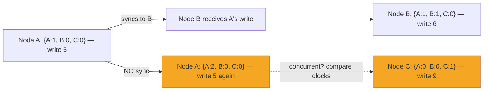

# POC: Vector Clocks — Detecting Concurrent Writes

> **What you'll feel:** Two nodes write to the same key without communicating. The code prints `CONCURRENT: conflict detected`. You'll see, concretely, why wall-clock timestamps can't tell you which write was "later" in a distributed system — and why that matters for your data.

---

## The Problem: Who Wrote Last?

Two users open the same document at the same time. User A (on Node A) increments a shared counter from 4 to 5. User B (on Node B) increments the same counter from 4 to 7. Both changes are valid locally.

When Node A and Node B sync, you have two versions of the same document:
- Node A's version: counter = 5
- Node B's version: counter = 7

**Which one is correct?** The instinct is to use timestamps — "pick the one written later." But:

- Node A's clock says 14:32:05.002
- Node B's clock says 14:32:04.998

Node A looks newer by 4ms. But Node B's NTP daemon last synced 3 hours ago and is drifting 200ms. Node B's write actually happened *after* Node A's write in physical time, but its clock shows an earlier timestamp.

**Wall clocks in distributed systems are unreliable.** NTP drift alone can be 100–500ms. In any time window shorter than that, timestamps tell you nothing meaningful about ordering.

Vector clocks solve a different problem: they tell you **whether events have a causal relationship**. If Event X causally precedes Event Y (X happened, was sent to the other node, and Y happened after), vector clocks can prove it. If they *don't* have a causal relationship — they happened concurrently, with no communication between them — vector clocks tell you that too. And "concurrent" means: **conflict. Resolve it.**



When the orange nodes sync, neither happened-before the other. That's a conflict.

---

## Vector Clock Rules

Three rules. Every node in the system follows all three:

1. **Each node maintains its own counter in a shared vector.** For a 3-node system with nodes A, B, C: each node stores `{A: 0, B: 0, C: 0}`. Only the node's own counter increments; others track what was last heard from each peer.

2. **On every local event (write, state change), the node increments only its own counter.** Node A after its first write: `{A: 1, B: 0, C: 0}`. After its second: `{A: 2, B: 0, C: 0}`.

3. **On message receive (sync from another node), the receiver takes the element-wise maximum of each counter, then increments its own counter.** Node B receives `{A: 1, B: 0, C: 0}` from Node A. B's clock before: `{A: 0, B: 0, C: 0}`. After merge: `max(0,1)=1`, `max(0,0)=0`, `max(0,0)=0` → `{A: 1, B: 0, C: 0}`. Then B increments its own: `{A: 1, B: 1, C: 0}`.

---

## Happens-Before Comparison

Event X **happened-before** Event Y (written X → Y) if and only if:
- Every counter in X's vector clock is ≤ the corresponding counter in Y's vector clock
- At least one counter in X is strictly less than Y's

Formally: `X → Y` iff `∀i: X[i] ≤ Y[i]` and `∃i: X[i] < Y[i]`

If neither `X → Y` nor `Y → X`, then X and Y are **concurrent**. They have no causal relationship. You cannot determine which happened "first" in any meaningful sense. This is a conflict: the application must decide how to merge them.

---

## Full Implementation (Node.js)

```javascript
// vector-clocks.js

class VectorClock {
  constructor(nodeIds) {
    // Initialize all counters to 0
    this.clock = {};
    for (const id of nodeIds) {
      this.clock[id] = 0;
    }
  }

  // Increment this node's own counter on a local event
  tick(nodeId) {
    if (!(nodeId in this.clock)) {
      this.clock[nodeId] = 0;
    }
    this.clock[nodeId]++;
    return this;
  }

  // Merge incoming clock (element-wise max), then tick own counter
  merge(otherClock, myNodeId) {
    // Element-wise max
    for (const nodeId of Object.keys(otherClock.clock)) {
      this.clock[nodeId] = Math.max(
        this.clock[nodeId] || 0,
        otherClock.clock[nodeId] || 0
      );
    }
    // Then increment own counter (we processed this event)
    this.tick(myNodeId);
    return this;
  }

  // Is this clock strictly happened-before other?
  // Returns true if every counter here <= other, and at least one is strictly less
  happensBefore(other) {
    const allIds = new Set([
      ...Object.keys(this.clock),
      ...Object.keys(other.clock)
    ]);

    let atLeastOneSmaller = false;

    for (const id of allIds) {
      const mine = this.clock[id] || 0;
      const theirs = other.clock[id] || 0;
      if (mine > theirs) return false; // I'm larger in some dimension — not before
      if (mine < theirs) atLeastOneSmaller = true;
    }

    return atLeastOneSmaller;
  }

  // Are these clocks concurrent? (neither happened before the other)
  isConcurrent(other) {
    return !this.happensBefore(other) && !other.happensBefore(this);
  }

  // Create a deep copy
  clone() {
    const copy = new VectorClock([]);
    copy.clock = { ...this.clock };
    return copy;
  }

  toString() {
    const entries = Object.entries(this.clock)
      .sort(([a], [b]) => a.localeCompare(b))
      .map(([k, v]) => `${k}:${v}`)
      .join(', ');
    return `{${entries}}`;
  }
}

// ============================================================
// DEMO: 3-node scenario with causal and concurrent events
// ============================================================
function demo() {
  const nodes = ['A', 'B', 'C'];

  // Each node has its own clock
  const clockA = new VectorClock(nodes);
  const clockB = new VectorClock(nodes);
  const clockC = new VectorClock(nodes);

  console.log('=== Vector Clocks: 3-Node Demo ===\n');
  console.log('Initial state:');
  console.log(`  Node A: ${clockA}`);
  console.log(`  Node B: ${clockB}`);
  console.log(`  Node C: ${clockC}`);

  // Step 1: Node A writes (local event)
  clockA.tick('A');
  const writeA1 = clockA.clone(); // Capture state at this point
  console.log('\nStep 1 — Node A writes (local event):');
  console.log(`  Node A clock after write: ${clockA}`);
  console.log(`  (A incremented only its own counter)`);

  // Step 2: Node A sends message to Node B
  // Node B receives A's clock, takes element-wise max, ticks its own counter
  clockB.merge(writeA1, 'B');
  const writeB1 = clockB.clone(); // Capture state
  console.log('\nStep 2 — Node A syncs to Node B (B merges A\'s clock):');
  console.log(`  Node B clock after merge: ${clockB}`);
  console.log(`  (B sees A=1, sets its own counter to 1)`);

  // Step 3: Now we create a FORK — A and C write without syncing
  // Node A writes a second time (no sync with C)
  clockA.tick('A');
  const writeA2 = clockA.clone();
  console.log('\nStep 3a — Node A writes again (no sync with C):');
  console.log(`  Node A clock: ${clockA}`);

  // Node C writes independently (no sync with anyone)
  clockC.tick('C');
  const writeC1 = clockC.clone();
  console.log('\nStep 3b — Node C writes independently (no sync with A):');
  console.log(`  Node C clock: ${clockC}`);

  // Step 4: Compare writeA1 and writeB1 — causal relationship
  console.log('\n=== Causality Analysis ===\n');

  console.log(`Event write_A1: ${writeA1}`);
  console.log(`Event write_B1: ${writeB1}`);
  if (writeA1.happensBefore(writeB1)) {
    console.log('RESULT: write_A1 → write_B1 (happened-before: A caused B)');
    console.log('(B received A\'s message, so A causally precedes B\'s write)');
  }

  // Step 5: Compare writeA2 and writeC1 — concurrent
  console.log(`\nEvent write_A2: ${writeA2}`);
  console.log(`Event write_C1: ${writeC1}`);
  if (writeA2.isConcurrent(writeC1)) {
    console.log('RESULT: CONCURRENT — conflict detected!');
    console.log('(Neither happened-before the other: no causal link between A and C\'s second writes)');
    console.log('Application must resolve: which value wins? Or merge both?');
  }

  // Step 6: Node B receives C's update
  clockB.merge(writeC1, 'B');
  console.log(`\nStep 6 — Node B receives C\'s update:`);
  console.log(`  Node B clock after merge: ${clockB}`);
  console.log(`  (B now knows about both A and C's writes)`);

  // Step 7: Final state summary
  console.log('\n=== Final Clock State ===');
  console.log(`  Node A: ${clockA}`);
  console.log(`  Node B: ${clockB}`);
  console.log(`  Node C: ${clockC}`);

  console.log('\n=== Interpretation ===');
  console.log('Node B has the most complete view of history (it received syncs from both A and C).');
  console.log('Node A and C are still unaware of each other\'s latest writes.');
  console.log('When A and C eventually sync, a conflict resolution strategy must be applied.');
}

demo();
```

**Expected output:**
```
=== Vector Clocks: 3-Node Demo ===

Initial state:
  Node A: {A:0, B:0, C:0}
  Node B: {A:0, B:0, C:0}
  Node C: {A:0, B:0, C:0}

Step 1 — Node A writes (local event):
  Node A clock after write: {A:1, B:0, C:0}

Step 2 — Node A syncs to Node B:
  Node B clock after merge: {A:1, B:1, C:0}

Step 3a — Node A writes again (no sync with C):
  Node A clock: {A:2, B:0, C:0}

Step 3b — Node C writes independently:
  Node C clock: {A:0, B:0, C:1}

=== Causality Analysis ===

Event write_A1: {A:1, B:0, C:0}
Event write_B1: {A:1, B:1, C:0}
RESULT: write_A1 → write_B1 (happened-before: A caused B)

Event write_A2: {A:2, B:0, C:0}
Event write_C1: {A:0, B:0, C:1}
RESULT: CONCURRENT — conflict detected!
Application must resolve: which value wins? Or merge both?

Step 6 — Node B receives C's update:
  Node B clock after merge: {A:1, B:2, C:1}

=== Final Clock State ===
  Node A: {A:2, B:0, C:0}
  Node B: {A:1, B:2, C:1}
  Node C: {A:0, B:0, C:1}
```

---

## What to Observe

After running the demo, think through these questions:

1. **Can you tell which write was "last" when two events are concurrent?** Look at `write_A2: {A:2, B:0, C:0}` and `write_C1: {A:0, B:0, C:1}`. Neither dominates the other. There is no answer to "which is later." This is the point — concurrent writes have no ordering. Any choice you make is arbitrary.

2. **What does Amazon Dynamo do with concurrent writes?** It returns *all conflicting versions* to the client and asks the client to merge them. For a shopping cart, this means "add all items from all versions" (which is safe — you'd rather over-count than lose items). For a bank balance, this approach fails — you must prevent concurrent writes through linearizable transactions instead.

3. **What's the scalability problem with vector clocks in a 1000-node cluster?** Every event carries a 1000-element vector. Every message includes this vector. Storage and bandwidth cost is O(N) per event. At 1,000 nodes and 10,000 events/second per node, you're transmitting 10 million integers per second just in clock overhead. This is why Amazon Dynamo added vector clock pruning (dropping entries for nodes not seen recently) and eventually moved to a simpler causality tracking mechanism.

---

## References

- 📖 [Amazon Dynamo Paper](https://www.allthingsdistributed.com/files/amazon-dynamo-sosp2007.pdf) — Section 4.4 covers the exact shopping cart merge use case. Read it after running this POC to see how the theory maps to production.
- 📖 [Time, Clocks, and the Ordering of Events in a Distributed System](https://lamport.azurewebsites.net/pubs/time-clocks.pdf) — Lamport, 1978. The original paper. Vector clocks extend Lamport clocks to detect concurrency, not just ordering.
- 📚 [See concept article](../concepts/vector-clocks-logical-time) — covers dotted version vectors, hybrid logical clocks, and how CRDTs replace conflict detection with conflict-free merging.
