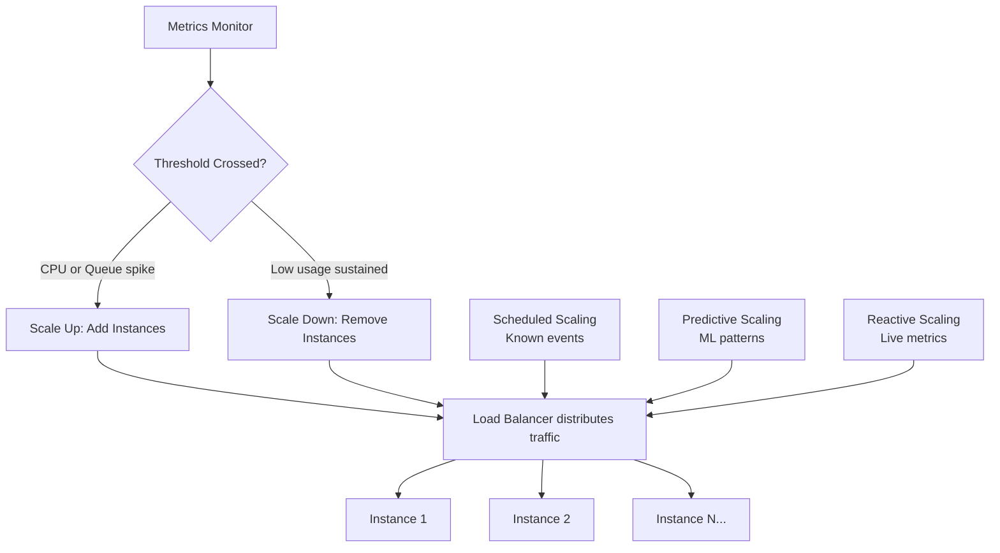

# Auto-scaling Patterns - Scale on Demand, Pay for What You Use

> **Reading Time:** 20 minutes
> **Difficulty:** Intermediate
> **Impact:** Handle 10x traffic spikes without over-provisioning (and wasting money)

## 🗺️ Quick Overview



*Three complementary strategies — scheduled, predictive, and reactive — layer together so capacity always matches demand without manual intervention.*

## The Problem: Static Capacity

```
Traditional approach: Provision for peak

                Peak (Black Friday)
                     ▼
Capacity:  ████████████████████████  ← Always running
Traffic:   ▁▂▃▄▅█▅▃▂▁▂▃▄▅▆▇██▅▃▂▁

Wasted:    ████████░░████████░░████  ← Paying for idle servers

Cost of over-provisioning:
  10 servers at $500/month = $5,000/month
  But average utilization: 30%
  You're wasting $3,500/month on idle servers

Cost of under-provisioning:
  Black Friday: 10x traffic spike
  5 servers max out
  Site goes down
  Revenue loss: $100,000+ per hour
```

**The answer: Auto-scaling — automatically adjust capacity to match demand.**

---

## Auto-scaling Strategies

### Strategy 1: Reactive Scaling (Metrics-Based)

```
Monitor metrics → Threshold crossed → Scale up/down

Example: CPU-based scaling
┌─────────────────────────────────────────────────┐
│                                                 │
│  CPU Target: 70%                                │
│  Scale up: CPU > 80% for 2 minutes              │
│  Scale down: CPU < 40% for 10 minutes           │
│                                                 │
│  12:00  CPU: 45%  → 3 instances (no change)     │
│  12:15  CPU: 72%  → 3 instances (monitoring)    │
│  12:18  CPU: 85%  → SCALE UP → 5 instances      │
│  12:20  CPU: 62%  → 5 instances (settled)       │
│  13:00  CPU: 35%  → 5 instances (monitoring)    │
│  13:10  CPU: 32%  → SCALE DOWN → 3 instances    │
│                                                 │
└─────────────────────────────────────────────────┘

Scaling Metrics:
├── CPU Utilization (most common)
├── Memory Usage
├── Request Rate (requests/sec)
├── Queue Depth (messages waiting)
├── Response Latency (P99)
└── Custom Metrics (orders/sec, active users)
```

**Pros:** Simple, well-understood, works for steady growth
**Cons:** Reactive (2-5 min lag), can't handle instant spikes

### Strategy 2: Predictive Scaling (ML-Based)

```
Analyze historical patterns → Predict traffic → Pre-scale

Historical data:
  Mon-Fri: Traffic peaks 9am-11am, 2pm-4pm
  Saturday: 50% of weekday traffic
  Black Friday: 10x normal traffic
  Game day (sports app): 20x during live events

┌─────────────────────────────────────────────────┐
│  Predicted vs Actual Traffic                     │
│                                                 │
│  Capacity ────────────────────────               │
│           ╱     Predicted ─·─·─                  │
│          ╱    Actual ─────                       │
│         ╱                                        │
│  ──────╱                                         │
│  Pre-scale                                       │
│  happens HERE                                    │
│  (30 min before)                                 │
└─────────────────────────────────────────────────┘

AWS Predictive Scaling:
- Analyzes 14 days of historical data
- Predicts capacity needs
- Pre-provisions instances 30 minutes ahead
- Combines with reactive scaling as safety net
```

**Pros:** No lag, handles predictable patterns
**Cons:** Can't predict unexpected events, needs historical data

### Strategy 3: Scheduled Scaling

```
Pre-defined schedule for known events:

# Scale up for business hours
schedule:
  - name: "business-hours-up"
    cron: "0 8 * * MON-FRI"    # 8am weekdays
    min_instances: 10
    max_instances: 50

  - name: "business-hours-down"
    cron: "0 20 * * MON-FRI"   # 8pm weekdays
    min_instances: 3
    max_instances: 10

  - name: "black-friday"
    cron: "0 0 25 11 *"        # Nov 25
    min_instances: 100
    max_instances: 500

  - name: "black-friday-end"
    cron: "0 0 27 11 *"        # Nov 27
    min_instances: 10
    max_instances: 50
```

**Pros:** Precise, no lag, predictable costs
**Cons:** Rigid, needs manual management, doesn't handle surprises

### Best Practice: Layer All Three

```
┌─────────────────────────────────────────────────┐
│            Multi-layer Auto-scaling              │
│                                                 │
│  Layer 1: Scheduled (known events)              │
│  ├── Business hours baseline                     │
│  └── Holiday/event pre-scaling                   │
│                                                 │
│  Layer 2: Predictive (ML-based)                 │
│  ├── Daily traffic patterns                      │
│  └── Weekly seasonality                          │
│                                                 │
│  Layer 3: Reactive (safety net)                 │
│  ├── CPU > 80% → add instances                  │
│  └── Queue > 10K → add consumers                │
│                                                 │
│  Result: Handles everything from daily           │
│  patterns to unexpected viral moments            │
└─────────────────────────────────────────────────┘
```

---

## Kubernetes Horizontal Pod Autoscaler (HPA)

### Basic CPU-Based Scaling

```yaml
apiVersion: autoscaling/v2
kind: HorizontalPodAutoscaler
metadata:
  name: order-service-hpa
spec:
  scaleTargetRef:
    apiVersion: apps/v1
    kind: Deployment
    name: order-service
  minReplicas: 3
  maxReplicas: 50
  metrics:
    - type: Resource
      resource:
        name: cpu
        target:
          type: Utilization
          averageUtilization: 70
  behavior:
    scaleUp:
      stabilizationWindowSeconds: 60    # Wait 1 min before scaling up
      policies:
        - type: Pods
          value: 4                       # Add max 4 pods at a time
          periodSeconds: 60
    scaleDown:
      stabilizationWindowSeconds: 300   # Wait 5 min before scaling down
      policies:
        - type: Percent
          value: 25                      # Remove max 25% at a time
          periodSeconds: 60
```

### Custom Metrics Scaling

```yaml
apiVersion: autoscaling/v2
kind: HorizontalPodAutoscaler
metadata:
  name: order-service-hpa
spec:
  scaleTargetRef:
    apiVersion: apps/v1
    kind: Deployment
    name: order-service
  minReplicas: 3
  maxReplicas: 100
  metrics:
    # Scale on CPU
    - type: Resource
      resource:
        name: cpu
        target:
          type: Utilization
          averageUtilization: 70

    # Scale on request rate (custom metric from Prometheus)
    - type: Pods
      pods:
        metric:
          name: http_requests_per_second
        target:
          type: AverageValue
          averageValue: 1000    # 1000 req/sec per pod

    # Scale on queue depth (external metric)
    - type: External
      external:
        metric:
          name: sqs_queue_depth
          selector:
            matchLabels:
              queue: order-processing
        target:
          type: AverageValue
          averageValue: 100     # 100 messages per pod
```

### Vertical Pod Autoscaler (VPA)

```yaml
# VPA: Automatically adjust CPU/memory requests
apiVersion: autoscaling.k8s.io/v1
kind: VerticalPodAutoscaler
metadata:
  name: order-service-vpa
spec:
  targetRef:
    apiVersion: apps/v1
    kind: Deployment
    name: order-service
  updatePolicy:
    updateMode: "Auto"    # Automatically resize pods
  resourcePolicy:
    containerPolicies:
      - containerName: order-service
        minAllowed:
          cpu: 100m
          memory: 128Mi
        maxAllowed:
          cpu: 4
          memory: 8Gi

# VPA observes actual usage and adjusts:
# If pod requested 2 CPU but only uses 0.5 → reduce to 0.7
# If pod requested 256Mi RAM but uses 400Mi → increase to 512Mi
```

---

## AWS Auto Scaling

### EC2 Auto Scaling Group

```
┌─────────────────────────────────────────────────┐
│              Auto Scaling Group                  │
│                                                 │
│  Desired: 5    Min: 2    Max: 20                │
│                                                 │
│  ┌─────┐ ┌─────┐ ┌─────┐ ┌─────┐ ┌─────┐      │
│  │ EC2 │ │ EC2 │ │ EC2 │ │ EC2 │ │ EC2 │      │
│  │  1  │ │  2  │ │  3  │ │  4  │ │  5  │      │
│  └──┬──┘ └──┬──┘ └──┬──┘ └──┬──┘ └──┬──┘      │
│     └───────┴───────┴───────┴───────┘           │
│                     │                            │
│              Load Balancer                       │
└─────────────────────────────────────────────────┘

Scaling Policies:
├── Target Tracking: "Keep CPU at 70%"
├── Step Scaling: "CPU 70-80% → +2, 80-90% → +4, >90% → +8"
└── Simple Scaling: "CPU > 80% → +2 instances"
```

### Application Auto Scaling (Beyond EC2)

```
AWS services that auto-scale:

ECS (Fargate):
  Scale containers based on CPU/memory/request count

DynamoDB:
  Scale read/write capacity units automatically
  On-Demand mode: Truly automatic, pay per request

Aurora:
  Scale read replicas 1-15 based on CPU
  Serverless v2: Scales compute automatically (0.5-128 ACU)

Lambda:
  Scales automatically (0 to 10,000 concurrent)
  No configuration needed

SQS + Lambda:
  Queue gets messages → Lambda scales to consume
  Empty queue → Lambda scales to 0
  No idle cost!
```

---

## Scaling Patterns for Different Workloads

### Web/API Servers

```
Scale on: Request rate, CPU, latency

┌────────────┐
│   Users    │
└─────┬──────┘
      ▼
┌────────────┐    Metric: Requests/sec > 1000/pod
│    ALB     │    Action: Add pod
└─────┬──────┘
      ▼
┌──┬──┬──┬──┐
│P1│P2│P3│P4│    Scales: 2 → 20 pods
└──┴──┴──┴──┘

Key settings:
  Min: 2 (always available)
  Max: 20 (cost limit)
  Target: 70% CPU or 1000 req/sec/pod
  Cool-down: Scale up 1 min, scale down 5 min
```

### Background Workers

```
Scale on: Queue depth, consumer lag

┌────────────┐
│   Queue    │  Queue depth: 50,000 messages
│            │  Target: 100 messages per worker
└─────┬──────┘
      ▼
┌──┬──┬──┬──┐
│W1│W2│W3│W4│  Need: 50,000/100 = 500 workers
└──┴──┴──┴──┘  (scale up to handle backlog)

# KEDA: Kubernetes Event-Driven Autoscaler
apiVersion: keda.sh/v1alpha1
kind: ScaledObject
metadata:
  name: order-processor
spec:
  scaleTargetRef:
    name: order-processor
  minReplicaCount: 1
  maxReplicaCount: 100
  triggers:
    - type: kafka
      metadata:
        bootstrapServers: kafka:9092
        consumerGroup: order-processors
        topic: orders
        lagThreshold: "100"    # Scale when lag > 100
```

### Database Connections

```
Problem: More app instances = more DB connections

10 pods × 20 connections each = 200 connections
50 pods × 20 connections each = 1000 connections
PostgreSQL max_connections: 500 ← CRASH!

Solution: Connection pooler (PgBouncer/ProxySQL)

┌──┬──┬──┬──┬──┬──┐
│P1│P2│P3│P4│P5│P6│  50 pods, 20 conn each = 1000
└──┴──┴──┴──┴──┴──┘
         │
    ┌────▼────┐
    │PgBouncer│  Pools connections: 1000 → 100
    └────┬────┘
         │
    ┌────▼────┐
    │PostgreSQL│  Only 100 real connections
    └─────────┘

Rule: Always plan for max_pods × connections_per_pod
```

---

## Scaling Anti-Patterns

### 1. Scaling Too Fast

```
❌ Bad: Scale instantly on any metric change
   12:00 CPU: 75% → Add 10 instances
   12:01 CPU: 30% → Remove 8 instances
   12:02 CPU: 72% → Add 8 instances
   Result: "Thrashing" - constant scaling, unstable

✅ Good: Stabilization windows
   Scale up: Wait 60 seconds of sustained high metrics
   Scale down: Wait 300 seconds of sustained low metrics
   Result: Smooth, stable scaling
```

### 2. No Scale-Down Strategy

```
❌ Scale up on spike, never scale down
   Monday: 5 instances
   Tuesday sale: Scale to 20 instances
   Wednesday: Still 20 instances (sale over)
   $$$: Paying for 15 idle instances

✅ Scale down policy:
   - Gradual: Remove 25% every 5 minutes
   - Minimum: Never below 3 instances
   - Cool-down: Wait 10 min after last scale-down
```

### 3. Not Designing for Scale-Down

```
❌ App stores state in memory
   Scale down → Instance terminated → Data lost!

   Session data in memory → User logged out
   Upload progress in memory → Upload lost
   Cache in local memory → Cache miss storm

✅ Externalize all state:
   Sessions → Redis
   Uploads → S3 with resume tokens
   Cache → Redis/Memcached
   Temp files → Shared storage (EFS)

   Now any instance can be safely terminated
```

### 4. Same Scaling Rules for Everything

```
❌ All services: "Scale on CPU > 70%"

But:
  API servers → CPU-bound (scaling on CPU makes sense)
  Workers → I/O-bound (CPU is low even when overloaded)
  ML inference → GPU-bound (CPU metric is irrelevant)

✅ Right metric per workload:
  API servers → CPU + request rate
  Workers → Queue depth + consumer lag
  ML inference → GPU utilization + request queue
  Database → Connection count + query latency
```

---

## Cost Optimization

### Right-Sizing Before Auto-Scaling

```
Before auto-scaling, ensure instances are right-sized:

Step 1: Monitor actual usage
  Instance: m5.2xlarge (8 vCPU, 32GB RAM)
  Actual CPU: 15% average
  Actual RAM: 4GB average
  → Over-provisioned by 4x!

Step 2: Right-size
  Change to: m5.large (2 vCPU, 8GB RAM)
  Save: 75% on compute cost

Step 3: Then auto-scale
  2 × m5.large at baseline
  Scale to 10 × m5.large at peak
  vs. 2 × m5.2xlarge with no scaling
  Cost: Less even at peak!
```

### Spot Instances for Scale-Out

```
Regular On-Demand: $0.192/hour per instance
Spot Instance: $0.058/hour (70% cheaper!)

Strategy: Mix instance types

┌──────────────────────────────────────────┐
│          Auto Scaling Group              │
│                                          │
│  Base (On-Demand):  3 instances          │
│  ├── Always running                      │
│  └── Handles minimum traffic             │
│                                          │
│  Burst (Spot):      0-17 instances       │
│  ├── Added during peaks                  │
│  └── Can be interrupted (2 min warning)  │
│                                          │
│  Max: 20 instances                       │
│  Cost: 50-70% cheaper than all On-Demand │
└──────────────────────────────────────────┘

Requirements for Spot:
✅ Stateless applications
✅ Can handle interruptions gracefully
✅ Use multiple instance types (m5, m5a, m5n)
✅ Spread across Availability Zones
```

### Serverless: Ultimate Auto-Scaling

```
AWS Lambda: Scale from 0 to 10,000 concurrent

When to go serverless:
✅ Variable/unpredictable traffic
✅ Event-driven workloads
✅ Short-lived tasks (< 15 min)
✅ Want zero idle cost

Cost comparison (1M requests/day, avg 200ms):
  EC2 (3× m5.large, always on): $420/month
  Lambda: $85/month (save 80%)

Cost comparison (100M requests/day, avg 200ms):
  EC2 (30× m5.large, auto-scaled): $3,200/month
  Lambda: $8,500/month (Lambda loses at scale)

Rule of thumb:
  < 10M requests/day → Serverless wins on cost
  > 50M requests/day → Containers/EC2 wins on cost
  Between → Depends on traffic pattern
```

---

## Real-World Example: Netflix

```
Netflix Auto-Scaling Architecture:

┌─────────────────────────────────────────────────┐
│  Titus (Container Platform)                     │
│                                                 │
│  Scaling triggers:                              │
│  1. Streaming demand (predictive)               │
│     - Scales up before prime time (7-10 PM)     │
│     - Country-specific patterns                 │
│     - New release day predictions               │
│                                                 │
│  2. Encoding pipeline (reactive)                │
│     - New content uploaded → Scale encoding     │
│     - 1000s of transcoding jobs in parallel     │
│     - Scale to 0 when done                      │
│                                                 │
│  3. A/B testing (scheduled)                     │
│     - Scale test infrastructure for experiments │
│     - 100+ concurrent A/B tests running         │
│                                                 │
│  Scale: 0 → 100,000+ containers in minutes      │
│  Cost saving: ~40% vs static provisioning       │
└─────────────────────────────────────────────────┘
```

---

## Key Takeaways

```
1. Layer your scaling strategies
   Scheduled + Predictive + Reactive = comprehensive

2. Use the right metric per workload
   API → CPU/requests, Workers → queue depth,
   ML → GPU, Database → connections

3. Scale down is as important as scale up
   Prevent cost waste with proper cool-down policies

4. Design for termination
   Externalize state, handle SIGTERM gracefully

5. Right-size before auto-scaling
   Scaling wrong-sized instances wastes money

6. Mix instance types for cost optimization
   On-demand base + spot burst = 50-70% savings

7. Monitor scaling behavior
   Track: scaling events, costs, utilization
   Alert on: thrashing, max capacity, scaling failures
```
