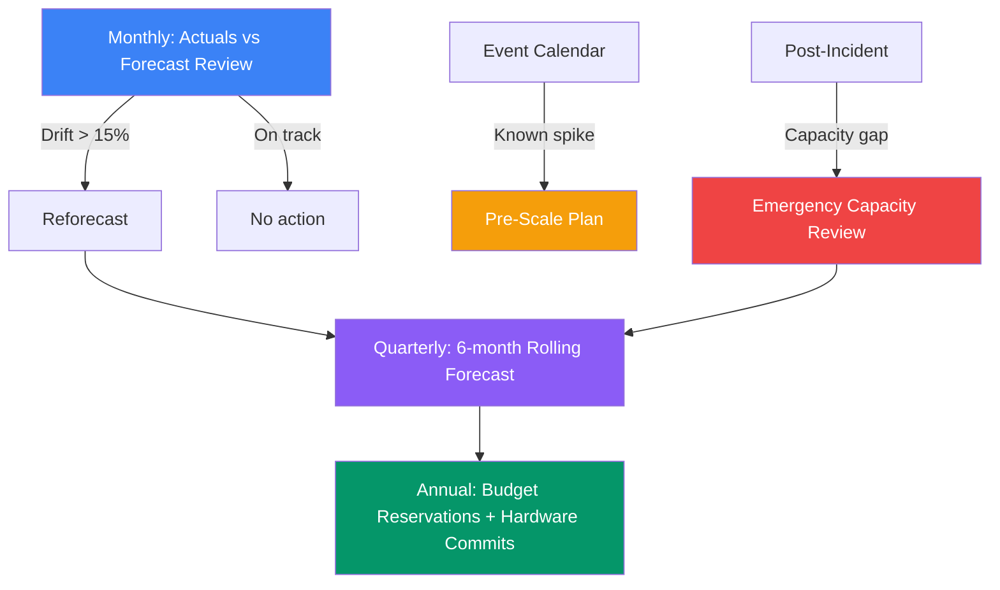
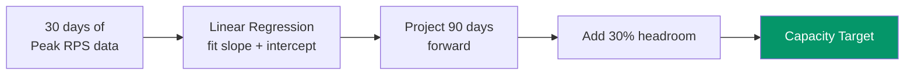
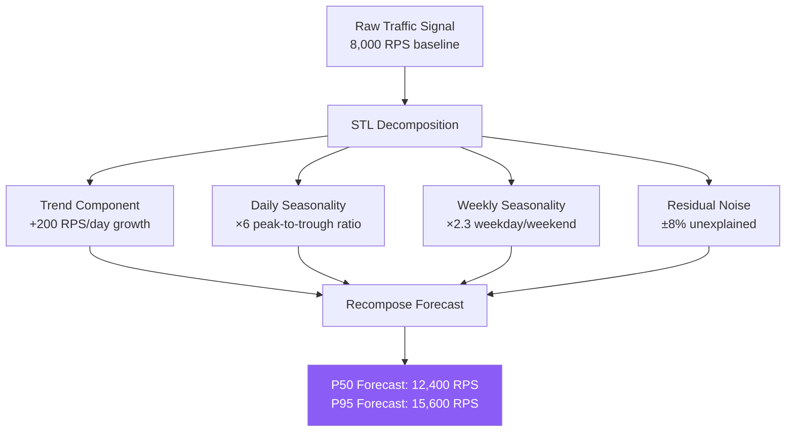
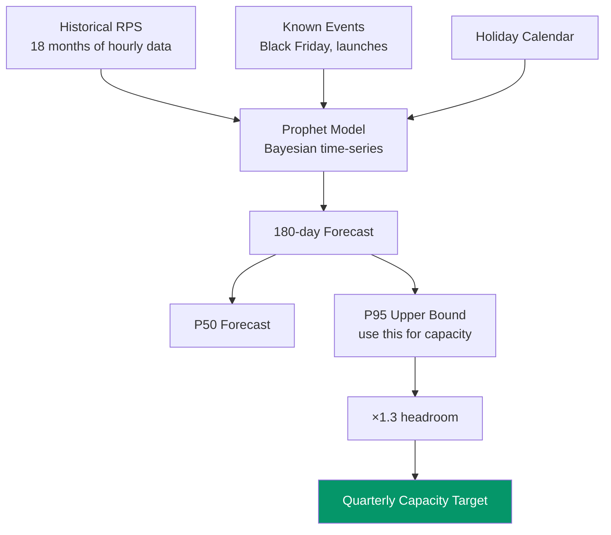
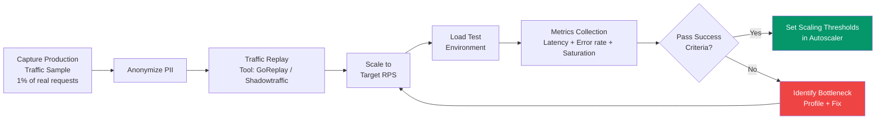

# Capacity Planning and Traffic Forecasting

---

## Level 1 — Surface (2-minute read)

### What Is It?

Capacity planning is the discipline of ensuring your system has enough compute, memory, storage, and network resources to handle current and future traffic — before that traffic arrives. Traffic forecasting is the quantitative model that tells you how much traffic to plan for.

Without it, you get a 3am PagerDuty alert because your database CPU spiked to 100% during a routine product launch and your on-call engineer is scrambling to provision servers while users see 503s.

### When Do You Do Capacity Planning?

| Trigger | Horizon | Action |
|---------|---------|--------|
| Pre-launch (new product / feature) | Next 90 days | Baseline sizing + 3x headroom |
| Quarterly review | Next 6 months | Validate actuals vs forecast |
| Post-incident | Immediate + 30 days | Gap analysis + corrective reservation |
| Known traffic event | Event day | Pre-scale 1-2h before, keep spare capacity |
| Annual budget cycle | Next 12-18 months | Commitment-based reservations |

### The 3x Rule

For services **without reliable autoscaling** (databases, stateful services, on-prem hardware), provision **3x your expected peak**:

- **1x** handles the expected load
- **1x** buffer for forecast error (traffic models are wrong by 30-50% on unusual days)
- **1x** buffer for failure scenarios (one AZ goes down, one shard hot-spots)

For services **with autoscaling** (stateless compute, Lambda, managed services), maintain at least **2x current utilization** as your scaling headroom so autoscaling can react before you breach 100%.

### The 5 Core Metrics You Must Track

1. **CPU utilization** — target 70% at peak, scale out at 80%
2. **Memory utilization** — keep 30% free (GC spikes, OS page cache)
3. **Storage growth rate** — measure last 6 months, project 18 months
4. **Network throughput** — stay below 50% of NIC capacity at peak
5. **Request rate (RPS)** — the primary leading indicator for all others

### Capacity Review Cadence



### Quick Decision Guide

| Use this approach | When |
|------------------|------|
| Linear extrapolation | Stable growth, 1-3 month horizon |
| Seasonal decomposition (STL) | Clear daily/weekly cycles, 3-12 month horizon |
| ML forecasting (Prophet) | Complex multi-seasonality, 6-18 month horizon |
| Event-based pre-scaling | Super Bowl, product launch, viral marketing |
| Chaos + load test | Validating capacity claims before they matter |

---

## Level 2 — Deep Dive

### Problem Statement

You run a payment API processing 8,000 RPS on a typical Tuesday. Your marketing team announces a flash sale for next Friday. They tell you "it'll be big." On the day of the sale, traffic peaks at 47,000 RPS — 5.9x your baseline. Your payment service falls over at 12,000 RPS because that's where the database connection pool saturates.

The failure was not a code bug. It was a planning failure. You had the data to prevent it. You just didn't run the numbers.

This section gives you the frameworks to never be in that position.

---

### Approach A — Linear Extrapolation

**Best for**: Stable growth curves, 1-3 month horizon, teams new to forecasting

**How it works**: Fit a linear regression on your last 30-90 days of peak-hour RPS. Project forward with a confidence interval.

```
RPS(t) = a * t + b

Where:
  t = days from now
  a = daily growth rate (slope)
  b = current baseline

Example:
  Current peak: 8,000 RPS
  30-day growth: +200 RPS/day average
  
  RPS(30 days) = 200 * 30 + 8000 = 14,000 RPS
  Capacity needed: 14,000 * 1.3 (headroom) = ~18,200 RPS
```

**Implementation in Python (3 lines)**:

```python
import numpy as np
days = np.arange(len(peak_rps_series))
slope, intercept = np.polyfit(days, peak_rps_series, 1)
forecast_30d = slope * (len(peak_rps_series) + 30) + intercept
```



**Trade-offs**:

| | Linear Extrapolation |
|--|---------------------|
| Accuracy (1 month) | Good (±15%) |
| Accuracy (6 months) | Poor (±50%+) |
| Handles seasonality | No |
| Handles event spikes | No |
| Implementation effort | 1 hour |
| Requires data science | No |

**When it fails**: New year traffic, holiday shopping, day-of-week variation. Linear extrapolation will give you the wrong number any time the growth curve bends.

---

### Approach B — Seasonal Decomposition (STL)

**Best for**: Services with clear daily/weekly/monthly patterns. 3-12 month horizon.

STL (Seasonal-Trend decomposition using LOESS) separates your traffic signal into three components:

```
Traffic(t) = Trend(t) + Seasonality(t) + Residual(t)
```

- **Trend**: Long-term growth direction (user base growth)
- **Seasonality**: Repeating patterns (peak at 10am weekdays, low on Sunday 3am)
- **Residual**: Noise + unexplained variation

A typical web service shows three layers of seasonality:
- **Daily**: 6-8x difference between peak hour (10am-2pm) and trough (3am-5am)
- **Weekly**: 2-3x difference between Monday peak and Sunday trough (B2B) or reverse (consumer)
- **Annual**: Q4 shopping, summer travel, back-to-school



**Real capacity number from this model**: Plan for the P95 forecast, not the P50. You will be wrong by 40% on unusual weeks. P95 gives you a 95% chance of having enough capacity even with model error.

**Implementation**:

```python
from statsmodels.tsa.seasonal import STL
import pandas as pd

# Hourly RPS for last 90 days
stl = STL(hourly_rps_series, period=24, seasonal=7)
result = stl.fit()

# Extract components
trend = result.trend
seasonal = result.seasonal
residual = result.resid

# Build forecast: project trend forward, apply seasonal pattern
next_30_days = project_trend(trend, days=30) + seasonal_pattern_next_30()
capacity_target = next_30_days.quantile(0.95) * 1.3  # P95 + 30% headroom
```

**Trade-offs**:

| | STL Decomposition |
|--|------------------|
| Accuracy (3 months) | Good (±20%) |
| Accuracy (12 months) | Moderate (±35%) |
| Handles daily/weekly cycles | Yes |
| Handles event spikes | No |
| Implementation effort | 1-2 days |
| Requires data science | Basic |

---

### Approach C — ML-Based Forecasting (Meta's Prophet)

**Best for**: Complex multi-seasonality, irregular holiday effects, 6-18 month horizon with regular retraining.

Prophet (open-sourced by Meta) is a Bayesian time-series model that handles:
- Multiple seasonalities simultaneously (daily + weekly + yearly)
- Holidays and known events as explicit regressors
- Trend changepoints (when growth rate shifts)
- Uncertainty intervals out of the box

```python
from prophet import Prophet
import pandas as pd

# Prophet expects columns: ds (datetime), y (metric)
df = pd.DataFrame({'ds': timestamps, 'y': peak_rps})

# Add known events as holidays
events = pd.DataFrame({
    'holiday': ['black_friday', 'super_bowl', 'product_launch'],
    'ds': pd.to_datetime(['2024-11-29', '2025-02-09', '2025-03-15']),
    'lower_window': [-1, 0, 0],    # days before
    'upper_window': [1, 0, 2],     # days after
})

model = Prophet(
    holidays=events,
    seasonality_mode='multiplicative',  # traffic scales proportionally
    changepoint_prior_scale=0.05,       # sensitivity to trend changes
    interval_width=0.95                 # 95% confidence interval
)
model.fit(df)

# Forecast 180 days forward
future = model.make_future_dataframe(periods=180)
forecast = model.predict(future)

# Extract capacity target: yhat_upper is the P95 upper bound
capacity_target_rps = forecast['yhat_upper'].max() * 1.3
```



**Trade-offs**:

| | Prophet ML Forecasting |
|--|----------------------|
| Accuracy (6 months) | Good (±20-25%) |
| Accuracy (18 months) | Moderate (±40%) |
| Handles complex seasonality | Yes |
| Handles explicit events | Yes (as regressors) |
| Implementation effort | 1-2 weeks + infra |
| Requires data science | Moderate |
| Needs retraining | Monthly |

**When Prophet is overkill**: If your team doesn't already have an ML platform, the operational overhead of retraining and serving Prophet forecasts is often not worth it over STL for services under 100k RPS.

---

### Approach D — Event-Driven Pre-Scaling

Linear models and ML models all share one fatal flaw: they extrapolate from history. A product launch that goes viral, a Super Bowl tweet, a Reddit front page hit — none of these appear in your historical data.

**The framework for known events**:

```
1. Classify event type
   - Organic viral: unknown timing → can't pre-scale
   - Scheduled event: known timing → must pre-scale
   
2. Estimate peak multiplier
   - Look at comparable past events
   - Add 2x safety margin on the multiplier
   - Example: "We think Black Friday will be 5x" → provision for 10x
   
3. Define the time window
   - When does load start rising? (pre-event buildup)
   - When does it peak?
   - When does it taper? (for scale-in planning)
   
4. Build the pre-scale runbook
   - T-1h: Scale out to N instances
   - T-30min: Run smoke test at 120% expected load
   - T-0: Event starts, monitoring dashboards open
   - T+2h: Confirm load tapering, begin scale-in
```

**Comparison of all four approaches**:

| | Linear | STL | Prophet | Event-Based |
|--|--------|-----|---------|-------------|
| Best horizon | 1-3 months | 3-12 months | 6-18 months | Point events |
| Handles seasonality | No | Yes | Yes | N/A |
| Handles spikes | No | No | Partial | Yes |
| Implementation time | Hours | Days | Weeks | Hours (runbook) |
| Ongoing ops cost | Low | Low | Medium | Low |
| Accuracy | ±15-30% | ±20-35% | ±20-40% | Depends on estimate |

---

### Resource Modeling Framework

Once you have a traffic forecast (RPS), you need to translate it into actual infrastructure requirements.

#### CPU Headroom Targets

```
CPU Rule:
  - Target utilization at P95 traffic: 70%
  - Scale-out trigger: 80%
  - Scale-in trigger: 40% (sustained 10 minutes)
  - Never let sustained CPU exceed 85% (leaves no room for GC, deployment spikes)

Calculation:
  Servers needed = ceil(peak_cpu_cores_required / 0.70)
  
  Example:
    1 RPS requires 0.5ms of CPU time
    100,000 RPS * 0.5ms = 50,000ms = 50 CPU-seconds per second = 50 cores
    At 70% target: 50 / 0.70 = 72 cores
    On c6g.4xlarge (16 cores): 72 / 16 = 4.5 → 5 instances minimum
    With AZ redundancy (3 AZs): 6 instances (2 per AZ)
```

#### Memory Headroom Targets

```
Memory Rule:
  - Keep 30% free at peak
  - JVM services: add 2x the expected heap size (permgen, metaspace, off-heap buffers)
  - Node.js services: RSS can be 3-4x the heap limit under load
  
Calculation:
  Memory per instance = peak_working_set / 0.70
  
  Common trap: measuring memory in staging (cold JVM) vs production (warm JVM + full page cache)
  Always measure from production metrics, not synthetic load tests.
```

#### Storage Growth Projection

```
Storage Rule:
  - Measure P99 daily write volume over last 6 months
  - Calculate month-over-month growth rate
  - Project 18 months forward with 2x safety buffer
  - Add buffer for: backups, WAL/redo logs, temp space, index growth
  
Formula:
  storage_month_n = current_storage * (1 + monthly_growth_rate)^n
  
  Example:
    Current: 2TB
    Monthly growth: 8%
    Month 18: 2TB * (1.08)^18 = 2TB * 3.99 = ~8TB
    With 2x buffer: 16TB provisioned
    
  Critical: Storage growth is often superlinear if you add new data types.
  Re-run this calculation whenever you add a new high-volume write path.
```

#### Network Throughput Targets

```
Network Rule:
  - Stay below 50% of NIC capacity at peak (burst headroom)
  - Typical 10 Gbps instance: use max 5 Gbps sustained
  
  Why 50%? TCP retransmit storms at >80% utilization can cause latency spikes
  that look like application bugs. 50% leaves room for incast congestion patterns.
  
Calculation:
  Bandwidth per RPS = average_response_size_bytes * 8 / 1_000_000  (Mbps per RPS)
  
  Example:
    Average response: 4KB
    100,000 RPS * 4KB = 400MB/s = 3.2 Gbps
    At 50% NIC target: need 6.4 Gbps NIC capacity
    One 10 Gbps instance handles this with headroom
```

---

### Load Testing Methodology

Capacity planning tells you what you need. Load testing verifies you have it.

**Step 1: Define success criteria before you run a single test**

```
Success criteria example:
  - P50 latency < 20ms at target RPS
  - P99 latency < 150ms at target RPS
  - P99.9 latency < 500ms at target RPS
  - Error rate < 0.1% at target RPS
  - System handles 120% of target RPS (20% spike headroom) without failing
  - System recovers within 60 seconds after traffic drops from 120% back to 100%
```

If you don't define these upfront, you'll argue about whether the test "passed" after the fact.

**Step 2: Build a realistic traffic profile**

The most common load testing mistake is generating uniform traffic. Real traffic follows:

- **Zipf distribution for keys**: 20% of keys get 80% of requests. If your cache hit test doesn't model this, you'll see better cache hit rates in tests than in production.
- **Diurnal patterns for time**: Traffic ramps up over 30-60 minutes, not instantly. A synthetic 0→100k RPS spike in 10 seconds will fail in ways real traffic never would.
- **Mixed read/write ratio**: Real services have a skewed read/write ratio (often 90/10 or 95/5). Pure read tests miss write amplification.



**Step 3: Ramp-up pattern**

```
Recommended load profile for a capacity validation test:

  0-5 min:   Warm-up at 10% of target RPS (JVM JIT compilation, cache warm)
  5-15 min:  Linear ramp from 10% to 100% of target RPS
  15-30 min: Sustained at 100% (measure steady-state)
  30-35 min: Spike to 120% (measure spike handling)
  35-40 min: Drop back to 100% (measure recovery)
  40-45 min: Linear ramp from 100% to 150% (find the breaking point)
  45-50 min: Cool-down
  
  Record: the exact RPS where P99 latency exceeds SLA → that's your hard ceiling
```

**Step 4: Analyze results and set scaling thresholds**

```
From load test results, derive autoscaling policy:

  If breaking point = 80,000 RPS at P99 SLA breach:
    Scale-out trigger = 80,000 * 0.65 = 52,000 RPS  (65% of ceiling)
    Target capacity  = 80,000 * 0.80 = 64,000 RPS  (80% of ceiling = "target")
    Scale-in trigger = 80,000 * 0.40 = 32,000 RPS  (40% of ceiling)
    
  This gives you 35% reaction room before you hit the ceiling.
```

**Common load testing mistakes**:

| Mistake | Impact | Fix |
|---------|--------|-----|
| Uniform key distribution | Overestimates cache hit rate by 20-40% | Use Zipf(s=1.1) for key selection |
| Instant ramp to full load | False bottleneck at TCP connect layer | Ramp over 10+ minutes |
| Same test machine and app machine | NIC contention skews results | Use dedicated load generators in separate AZ |
| Ignoring warm-up | First 5 minutes artificially slow (JIT) | Always discard first 5 minutes |
| Not testing failure modes | Miss cascading failure pattern | Include: pod kill, AZ failure, DB slow query injection |
| Testing the wrong environment | Staging has different cache ratios, DB size | Use production traffic replay on a production shard |

---

### Cost Modeling

Capacity decisions are also cost decisions. Provisioning 3x peak "just to be safe" with no cost analysis is engineering irresponsibility.

#### $/RPS for Common Architectures

The following numbers are approximate AWS us-east-1 2024 pricing for comparison:

| Architecture | Machine Type | RPS Capacity | On-Demand $/hour | $/RPS/month |
|--|--|--|--|--|
| Stateless API (Go/Node) | c6g.2xlarge (8 vCPU) | ~8,000 RPS | $0.272 | $0.0012 |
| Stateless API (Java) | c6g.4xlarge (16 vCPU) | ~6,000 RPS | $0.544 | $0.0027 |
| Redis cache node | cache.r7g.large | 100,000 RPS (read) | $0.166 | $0.00005 |
| PostgreSQL primary | db.r6g.2xlarge | ~2,000 complex QPS | $0.480 | $0.0069 |
| ALB (managed LB) | — | 1M RPS | $0.008/LCU | ~$0.00001 |

Key insight: **Database is usually 5-10x more expensive per RPS than stateless compute**. Every query you can answer from cache instead of database cuts your cost-per-RPS dramatically.

#### Reserved vs On-Demand Break-Even

```
Reserved Instance (1-year) discount: ~38% off on-demand
Reserved Instance (3-year) discount: ~57% off on-demand

Break-even calculation:
  On-demand: $0.272/hr
  1-year reserved: $0.168/hr (38% off)
  
  Break-even utilization for reserved:
  If you use it > (reserved_cost / on_demand_cost) of the time = 0.62 = 62% of the time
  → Reserve if you expect >62% average utilization over the year
  → At 80% average utilization: reserved saves 30% of your compute bill
  
Rule of thumb: Reserve 60-70% of your steady-state capacity.
Use on-demand or spot for the variable top 30-40%.
```

#### Spot Instances for Stateless Workers

Spot instances (AWS) or Preemptible VMs (GCP) offer 70-90% discounts for stateless, fault-tolerant workloads:

```
Good candidates for spot:
  - Background job workers (video transcoding, batch ML, log processing)
  - Read-only analytics queries
  - Load test infrastructure
  - Autoscaling surge capacity (stateless API workers with proper drain logic)

Bad candidates for spot:
  - Databases, stateful services
  - Services with >30 second request duration
  - Services that can't handle mid-request termination
  
Cost example:
  1,000 c6g.2xlarge * $0.272 on-demand = $272/hr
  700 on-demand + 300 spot ($0.03/hr) = $190 + $9 = $199/hr
  Monthly savings: ($272 - $199) * 730h = ~$53,000/month
```

---

### Real Company Examples

#### Example 1: Twitter Super Bowl 2014

The 2014 Super Bowl (Seattle vs Denver) was the biggest tweeting moment in history at the time: **24.9 million tweets during the game**, with a peak of **380,000 tweets per minute** during the final play.

**What Twitter did**:

1. **4 weeks before**: Engineering leads identified the Super Bowl as a critical event. The game had a defined 4-hour window with a predictable peak pattern (scores, turnovers, final whistle).

2. **2 weeks before**: Load testing at 2x estimated peak. Identified that the Flock DB (follow graph database) became a bottleneck at 220,000 tweets/minute. Added read replicas.

3. **1 week before**: Staged capacity additions. Pre-provisioned hardware in co-located data centers (Twitter was not yet fully on AWS). Arranged with vendors for emergency hardware if needed.

4. **Day of the game**: Pre-scaled 1 hour before kickoff. On-call war room staffed with engineers from Timeline, Search, and Infrastructure teams. Pre-positioned runbooks for known failure modes.

5. **Result**: System handled the peak load with P99 latency under SLA. The pre-scaling decision — not the code — was what made it work.

**Capacity number**: Peak throughput was ~4x the average Sunday baseline. Had they relied on autoscaling alone (which had a 5-10 minute lag in their infra at the time), the surge would have exceeded capacity before new capacity was available.

#### Example 2: Netflix Stranger Things Season 5 Launch

Netflix handles ~250 million subscriber accounts. A major original series launch can generate a 15-25% global traffic spike within the first hour after release.

**What Netflix does**:

1. **36 hours before release**: Every on-call team confirms capacity targets are met. Spinnaker (their deployment and scaling platform) is configured with pre-scale rules specific to the release window.

2. **2 weeks before**: Chaos engineering tests run against the scaled-up configuration. FIT (Fault Injection Testing) validates that the CDN tier, API gateway, and transcoding pipeline all degrade gracefully under failure.

3. **CDN pre-warming**: Netflix uses a "pre-population" strategy where the most-likely-to-be-requested segments of new episodes are pushed to CDN edge nodes 1-2 hours before release. This prevents the CDN from being a cold cache during the first 30 minutes.

4. **Traffic shaping**: New releases are not simultaneously available to all time zones. The rolling "rollout by region" smooths the global peak into a series of smaller regional peaks.

5. **Result**: A show like Stranger Things adds roughly 1.5 million concurrent streams within 15 minutes of availability. The infrastructure handles this without incident because it was planned — not because it was automatically elastic.

**Key insight from Netflix**: They separate "scaling for growth" (handled by autoscaling) from "scaling for launch events" (handled by pre-scaling runbooks). These require different processes.

#### Example 3: Stripe Black Friday

Stripe processes payments for hundreds of thousands of e-commerce businesses. Black Friday is their Super Bowl.

**What Stripe does**:

1. **6 weeks before**: Capacity review meeting with SRE, infrastructure, and business teams. Historical Black Friday data is analyzed. Growth-adjusted baseline is established.

2. **4 weeks before**: Reserved instance purchases finalized. Stripe reserves **3x their estimated Black Friday peak** on the critical payment processing path. This is non-negotiable: the cost of over-provisioning ($X in unused compute) is trivial vs. the cost of a payment outage ($Y per second in merchant revenue + long-term trust damage).

3. **2 weeks before**: Full load test at 3x steady-state. Payment APIs, fraud detection ML inference, and ledger writes are all validated at peak load simultaneously (not in isolation).

4. **1 week before**: Freeze on non-critical deploys. Only critical fixes allowed to the payment path. Reduces blast radius of deploy-related incidents.

5. **Day of**: Pre-scale to 2.5x steady-state at T-2 hours (before US east coast merchants open). Keep reserved capacity ready to activate within 5 minutes.

**Cost philosophy**: For Stripe's critical path, the cost of a 3-hour outage on Black Friday — in merchant churn, support cost, and regulatory risk — exceeds the annual compute cost of the reserved capacity they pre-provision. The break-even is clear. Over-provision the path where downtime has existential business consequences.

---

### Staff-Level Interview Questions on Capacity Planning

These questions appear in staff engineer, principal engineer, and engineering manager interviews. The answers below reflect what senior hiring committees expect.

---

**Q1: "How would you capacity plan for a new service that has no historical traffic data?"**

**Expected answer framework**:

Start from business requirements, not traffic:
1. Ask: what is the target user count at launch? What is the expected DAU/MAU?
2. Convert users to sessions: industry average is 2-4 sessions/day for mobile, 1-2 for desktop
3. Convert sessions to RPS: session * average_requests_per_session / 86400 seconds
4. Apply a diurnal factor: peak hour is typically 5-10x average (assume 8x for B2C)
5. Apply a safety multiplier: 3x for unknown variance

Example math:
- Target: 100,000 DAU at launch
- 3 sessions/day, 50 requests/session = 150 requests/user/day
- 100,000 * 150 / 86400 = 174 RPS average
- Peak: 174 * 8 = ~1,400 RPS
- Capacity target: 1,400 * 3 = 4,200 RPS

Then load test the service to find the actual capacity per instance, and back-calculate instance count.

---

**Q2: "Our service has a memory leak that's fixed in the next release. It's Black Friday in 3 days. What do you do?"**

**Expected answer**:

This is a risk vs. speed trade-off with capacity as the mitigation:

1. Quantify the leak rate: MB/hour per instance. Calculate time-to-OOM at peak Black Friday load.
2. If time-to-OOM > 8 hours: deploy an automated restart policy (restart every 6 hours), run Black Friday, ship the fix after.
3. If time-to-OOM < 4 hours at peak: capacity mitigation alone won't work. You must either ship the fix (risky, 3-day window) or degrade gracefully (shed non-critical features to reduce memory pressure).
4. If time-to-OOM is 4-8 hours: combine restart policy + pre-provision 2x instances so that the rolling restart of pods never takes you below minimum capacity simultaneously.

Never say "we'll just monitor it." Monitoring is not mitigation.

---

**Q3: "How do you decide between autoscaling and pre-scaling for an event?"**

**Expected answer**:

Autoscaling has a reaction time: typically 3-10 minutes (metric collection → scale policy trigger → instance launch → health check → traffic routing). For events where traffic rises faster than the autoscaler can react, pre-scaling is mandatory.

Use the formula:
```
pre_scale_threshold = ramp_rate (RPS/minute) * autoscaler_lag (minutes) > headroom (RPS)
```

If your Super Bowl traffic rises by 5,000 RPS/minute and your autoscaler takes 8 minutes, that's 40,000 RPS of unhandled traffic before new capacity is online. If your headroom is only 20,000 RPS, you will breach SLA. Pre-scale.

Pre-scaling is also appropriate when:
- Autoscaling adds stateful resources (DB read replicas take 5-15 minutes to warm up)
- The event has a hard start time and predictable peak shape
- Warm-up time matters (JVM, large model loading, cache warming)

---

**Q4: "Walk me through how you'd estimate the cost impact of adding a new feature that makes 3 extra DB queries per request at 50,000 RPS."**

**Expected answer**:

1. Current load: 50,000 RPS, assume current query mix handled by N DB instances
2. New load: +3 queries/request = +150,000 QPS on the database layer
3. Query cost: assume simple indexed reads at ~0.5ms CPU time each
   - 150,000 QPS * 0.5ms = 75,000ms CPU/second = 75 vCPUs additional DB load
4. Instance sizing: db.r6g.4xlarge (16 vCPU) handles ~40,000 QPS at 70% target utilization
   - 150,000 / 40,000 = 3.75 → 4 additional DB instances (or equivalent read replicas)
5. Cost: 4 * db.r6g.4xlarge on-demand = 4 * $0.960/hr = $3.84/hr = $2,765/month

Present the trade-off: Is the feature worth $2,765/month in DB cost? Can we cache 80% of these queries and reduce to 1 instance? Can we batch the queries? The capacity estimate drives the engineering decision.

---

**Q5: "Your traffic forecast was off by 3x — you provisioned for 30,000 RPS but peak hit 90,000 RPS. What do you do in the post-mortem?"**

**Expected answer**:

A 3x forecast error is a systems failure, not a one-time mistake. The post-mortem must address root cause at the process level, not the people level.

Diagnose the forecast failure:
1. Was the event type new (no historical data) or recurring (should have had data)?
2. Was the model type wrong (linear model for exponential growth)?
3. Was the input data wrong (wrong metric tracked, wrong time window)?
4. Was there a missing signal (product team didn't communicate the viral marketing campaign)?

Systemic fixes:
1. **Communication protocol**: Product/marketing must file a capacity impact request for any campaign that could drive >20% traffic delta. Engineering reviews it with a 2-week lead time.
2. **Model validation**: Compare last 3 months of forecasts vs actuals. If MAPE > 30%, upgrade the forecasting model.
3. **Headroom recalibration**: If 3x errors are possible, the 3x headroom rule becomes the baseline, and you use 5x for high-stakes paths (payment, authentication).
4. **Circuit breakers**: For next time — if traffic exceeds 150% of provisioned capacity, graceful degradation should kick in (shed non-critical features, return cached/stale data, rate limit new connections) rather than hard failure.

---

### Key Takeaways / TL;DR

- **The 3x rule applies to stateful services**: provision 3x expected peak for databases, stateful caches, and on-prem hardware where autoscaling is slow or impossible.
- **Match your forecasting model to your horizon**: linear for 1-3 months, STL seasonal decomposition for 3-12 months, Prophet for 6-18 months. All models fail on novel events.
- **Load test at 120% of target RPS**: find your hard ceiling before users do. Set autoscale triggers at 65% of the breaking point RPS, not at a CPU percentage.
- **Pre-scale for scheduled events**: autoscalers have a 3-10 minute lag. If traffic ramps faster than that, you will breach SLA before new capacity is available.
- **Every capacity decision is a cost decision**: at 80% steady-state utilization, reserved instances save 38% vs on-demand. Spot instances save 70-90% for stateless workers with proper drain logic.
- **Post-mortem forecast errors at the process level**: a 3x miss means the forecasting process is broken, not that the engineer made a mistake. Fix the communication protocol, the model, and the headroom multiplier.

---

## References

- 📖 [Netflix: Auto-scaling the Spinnaker Platform](https://netflixtechblog.com/auto-scaling-the-netflix-spinnaker-platform-a96c8e74e6a3) — how Netflix manages capacity for its deployment platform at scale
- 📖 [Twitter: Super Bowl 2014 Engineering](https://blog.twitter.com/engineering/en_us/a/2014/the-2014-super-bowl-the-biggest-tweeting-moment-ever) — real-world capacity planning for a 4x traffic spike with a known time window
- 📚 [Google SRE Book — Capacity Planning](https://sre.google/sre-book/software-engineering-in-sre/#capacity-planning) — the canonical reference for demand forecasting and supply provisioning in production systems
- 📖 [Meta Prophet: Forecasting at Scale](https://research.facebook.com/blog/2017/2/prophet-forecasting-at-scale/) — open-source tool for time-series forecasting with multiple seasonality
- 📚 [AWS Compute Optimizer](https://aws.amazon.com/compute-optimizer/) — tooling for right-sizing EC2, ECS, and Lambda based on historical utilization
- 📖 [Stripe Engineering: Scaling Payment Infrastructure](https://stripe.com/blog/engineering) — Stripe's engineering blog covers capacity and reliability planning patterns
