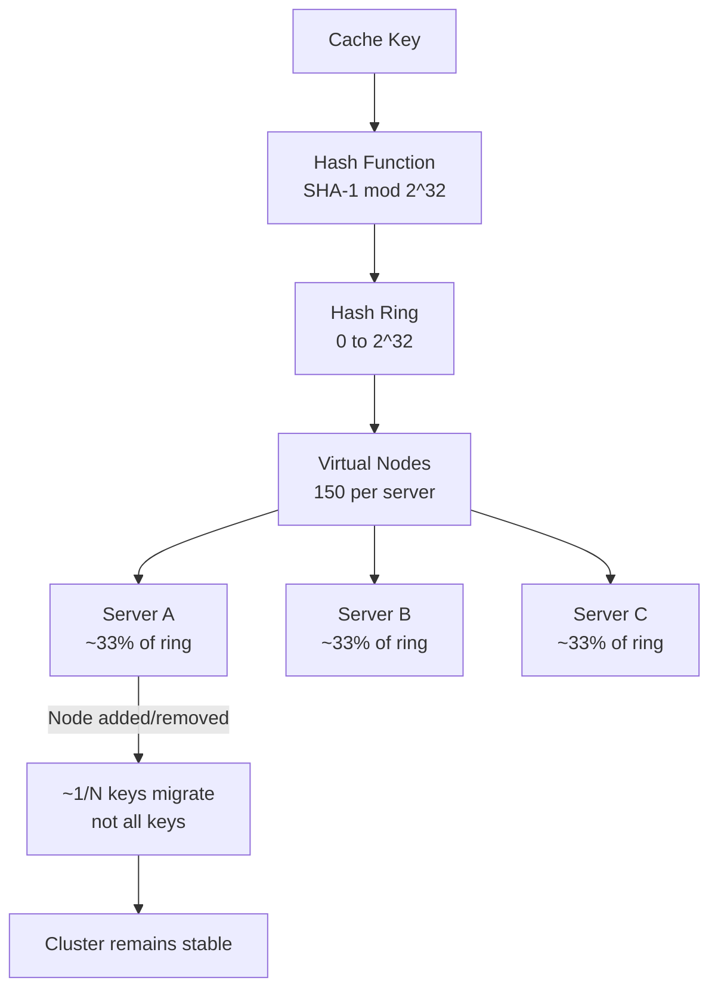
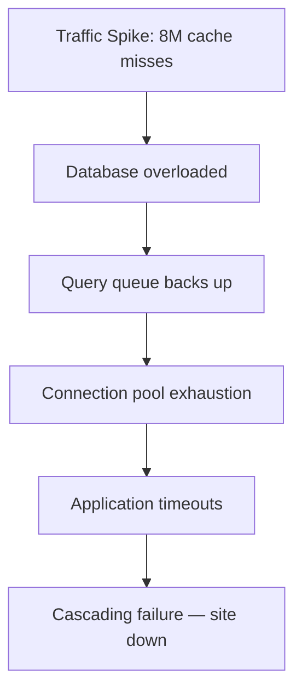
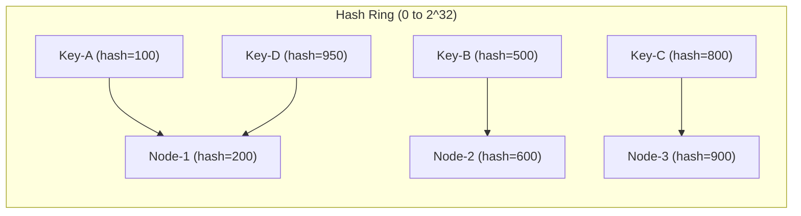
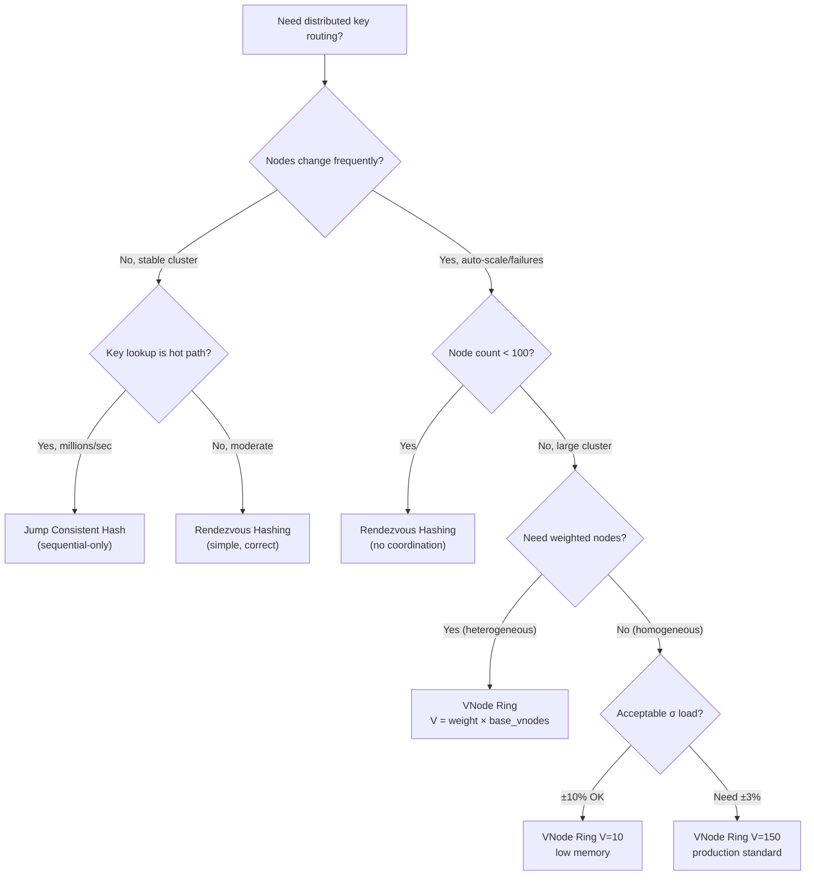

# Consistent Hashing: Virtual Nodes, Rehashing Cost, and Hot Spot Avoidance

## 🗺️ Quick Overview



*Virtual nodes spread each server across the ring so adding or removing one server migrates only 1/N of keys instead of rehashing everything.*

**Consistent hashing is one of those topics every engineer thinks they understand — until they have to size virtual nodes, explain why a node removal causes a thundering herd, or debug why 30% of keys land on one shard.**

This is the deep-dive that fills those gaps.

---

## The Problem Class `[Mid]`

You have a distributed cache with 4 nodes. Your application hashes keys using `hash(key) % N` and routes to the correct node. This works perfectly — until you add a 5th node.

```
Before (N=4): hash("user:1001") % 4 = 3  → Node-3
After  (N=5): hash("user:1001") % 5 = 1  → Node-1  ← CACHE MISS
```

With modulo hashing, adding 1 node invalidates ~80% of all cached keys simultaneously. At 10M cached objects, that's 8M cache misses hitting your database in seconds.



The situation compounds when you auto-scale: elastically adding cache nodes during a traffic spike causes the very load you're trying to absorb to hit your database directly. This is the **rehashing thundering herd**.

**Real numbers from a production incident (2024):**
- Cache cluster: 12 nodes, 40M keys, ~2TB of cached data
- Event: Added 2 nodes to handle traffic growth
- Outcome: 33% of keys remapped → 13M cache misses in 90 seconds
- Database: went from 2k QPS baseline to 180k QPS
- Recovery time: 47 minutes (database caught up gradually)

---

## Why the Obvious Solution Fails `[Senior]`

### Modulo Hashing Failure Analysis

```
N=4 nodes: keys assigned to node (hash(key) % 4)
Adding 1 node (N=5): fraction of keys that move = 1 - (N_old/N_new)
                                                  = 1 - (4/5)
                                                  = 80% of all keys
```

This isn't a bug — it's the mathematical property of modular arithmetic. Every cache layer, every sharded database, every distributed queue that uses `% N` routing has this problem.

**Why you can't just "be careful about resizing":**
- Auto-scaling policies resize on demand — they don't know about cache topology
- Node failures are unplanned — a dead node effectively changes N
- Traffic-driven auto-scaling and cache stability are fundamentally at odds with modulo hashing

---

## The Solution Landscape `[Senior]`

### Solution 1: Basic Consistent Hashing (Ring)

**What it is**

Map both nodes and keys onto a circular hash space (0 to 2^32 - 1). A key belongs to the first node clockwise from its position on the ring.



**How it actually works at depth**

```python
import hashlib
import bisect

class ConsistentHashRing:
    def __init__(self, nodes=None):
        self.ring = {}          # hash_position -> node_name
        self.sorted_keys = []   # sorted list of positions

        if nodes:
            for node in nodes:
                self.add_node(node)

    def _hash(self, key: str) -> int:
        return int(hashlib.md5(key.encode()).hexdigest(), 16)

    def add_node(self, node: str):
        position = self._hash(node)
        self.ring[position] = node
        bisect.insort(self.sorted_keys, position)

    def remove_node(self, node: str):
        position = self._hash(node)
        del self.ring[position]
        self.sorted_keys.remove(position)

    def get_node(self, key: str) -> str:
        if not self.ring:
            return None
        position = self._hash(key)
        # Find first node clockwise
        idx = bisect.bisect(self.sorted_keys, position) % len(self.sorted_keys)
        return self.ring[self.sorted_keys[idx]]
```

**Sizing guidance** `[Staff+]`

With N nodes and K keys, adding 1 node redistributes approximately K/N_new keys:

```
N=4 nodes, K=1,000,000 keys:
  Add 1 node → ~200,000 keys remapped (20%)

Compare to modulo:
  Add 1 node → ~800,000 keys remapped (80%)

Improvement factor: 4x fewer remappings
```

**The hidden problem:** With only N points on the ring, the distribution is highly non-uniform. With 4 nodes, one node can end up responsible for 60% of the keyspace if nodes happen to cluster on one side of the ring. This is the load imbalance problem that virtual nodes solve.

---

### Solution 2: Virtual Nodes (vnodes) `[Staff+]`

**What it is**

Instead of placing each physical node once on the ring, place it V times with different hash seeds. Each physical node "owns" V positions on the ring, and the keyspace is divided more evenly.

**How it actually works at depth**

```python
class VNodeConsistentHashRing:
    def __init__(self, nodes=None, vnodes=150):
        self.vnodes = vnodes
        self.ring = {}
        self.sorted_keys = []

        if nodes:
            for node in nodes:
                self.add_node(node)

    def _hash(self, key: str) -> int:
        return int(hashlib.md5(key.encode()).hexdigest(), 16)

    def add_node(self, node: str):
        for i in range(self.vnodes):
            vnode_key = f"{node}#vnode{i}"
            position = self._hash(vnode_key)
            self.ring[position] = node
            bisect.insort(self.sorted_keys, position)

    def remove_node(self, node: str):
        for i in range(self.vnodes):
            vnode_key = f"{node}#vnode{i}"
            position = self._hash(vnode_key)
            if position in self.ring:
                del self.ring[position]
                self.sorted_keys.remove(position)

    def get_node(self, key: str) -> str:
        if not self.ring:
            return None
        position = self._hash(key)
        idx = bisect.bisect(self.sorted_keys, position) % len(self.sorted_keys)
        return self.ring[self.sorted_keys[idx]]
```

**Sizing guidance** `[Staff+]`

The vnode count (V) controls the balance vs. memory trade-off:

```
Standard deviation of load across N nodes:
  σ = 1 / sqrt(N × V)

Examples (N=10 nodes):
  V=1:   σ ≈ 31.6% — one node can carry 63% more than average
  V=10:  σ ≈ 10.0% — max imbalance roughly ±10%
  V=100: σ ≈ 3.2%  — max imbalance roughly ±3%
  V=150: σ ≈ 2.6%  — production-standard for Cassandra/DynamoDB
  V=300: σ ≈ 1.8%  — diminishing returns above ~200

Memory overhead per vnode entry (in-process ring):
  ~200 bytes × V × N nodes

  V=150, N=10:  ~300 KB (negligible)
  V=150, N=100: ~3 MB (negligible)
  V=300, N=1000: ~60 MB (acceptable)
```

**Configuration decisions that matter** `[Staff+]`

1. **Heterogeneous node weights**: Assign vnodes proportional to node capacity.
   ```python
   # 4-core node gets 100 vnodes, 16-core node gets 400 vnodes
   node_weights = {"small-1": 100, "large-1": 400}
   for node, weight in node_weights.items():
       ring.add_node(node, vnodes=weight)
   ```

2. **Replication factor interaction**: With replication factor R=3, a key is stored on the next R distinct physical nodes clockwise. With vnodes, this usually means 3 different physical nodes even with high V — but you must verify your implementation enforces "distinct physical nodes" not "distinct vnode positions."

3. **Vnode count changes**: Changing V requires full data redistribution — treat it like a schema migration. Set V at system design time and don't change it.

**Failure modes** `[Staff+]`

- **Node addition imbalance**: When adding a node, it takes over vnodes from multiple existing nodes. Traffic drops immediately on those nodes but rises on the new one. Monitor node-level CPU/memory during scaling events for 5–10 minutes to ensure no overload.
- **Cold node joins**: A newly added node has no warm cache. With V=150 vnodes taking 1.5% each of the keyspace from 150 different existing nodes, the new node serves cold cache for all its keys simultaneously. Mitigate with pre-warming or gradual token assignment.
- **Thundering herd on node failure**: When a node fails, all its vnodes' keys land on the next clockwise node. With V=150, the successor node absorbs ~150/total_vnodes fraction of extra load, spread evenly. Compared to non-vnode rings where one neighbor absorbs everything, this is better but still requires headroom in your sizing.

**Observability** `[Staff+]`

```python
# Metrics to expose on your consistent hash router
ring_metrics = {
    "ring.node_count": len(physical_nodes),
    "ring.vnode_count": len(ring.sorted_keys),
    "ring.keys_per_node_p50": median(node_key_counts),
    "ring.keys_per_node_p99": p99(node_key_counts),
    "ring.load_imbalance_ratio": max(node_key_counts) / mean(node_key_counts),
    "ring.redistribution_events_total": redistribution_counter,
    "ring.keys_redistributed_total": keys_moved_counter,
}
# Alert: ring.load_imbalance_ratio > 1.3 (one node carrying 30% more than average)
```

---

### Solution 3: Rendezvous Hashing (Highest Random Weight) `[Staff+]`

**What it is**

For each key, compute a score for every node using `hash(key + node_id)`. The key goes to the node with the highest score. No ring data structure required.

```python
def get_node_rendezvous(key: str, nodes: list) -> str:
    scores = {
        node: int(hashlib.md5(f"{key}{node}".encode()).hexdigest(), 16)
        for node in nodes
    }
    return max(scores, key=scores.get)
```

**When to choose rendezvous over ring:**
- Node list is small and changes rarely (< 100 nodes)
- You want zero coordination overhead — no shared ring state
- Lookup cost O(N) is acceptable (N = node count, not key count)
- You need deterministic node selection with no configuration

**Sizing guidance** `[Staff+]`

```
Lookup cost: O(N) per key access
  N=10:  ~10 hash operations — sub-microsecond
  N=100: ~100 hash operations — ~1 microsecond
  N=1000: ~1000 hash operations — ~10 microseconds (reconsider above this)

Redistribution on node add/remove: exactly K/N keys move (optimal)
Memory: O(N) — just the node list
```

---

### Solution 4: Jump Consistent Hash `[Staff+]`

**What it is**

Google's 2014 algorithm that maps keys to buckets with O(1) time, O(1) space, and minimal redistribution. Only useful when nodes can be numbered sequentially (0 to N-1) and you never need to remove a non-last node.

```python
def jump_consistent_hash(key: int, num_buckets: int) -> int:
    b, j = -1, 0
    while j < num_buckets:
        b = j
        key = ((key * 2862933555777941757) + 1) & 0xFFFFFFFFFFFFFFFF
        j = int((b + 1) * (1 << 31) / ((key >> 33) + 1))
    return b
```

**When to use it**: Batch processing systems where you control the number of workers and always add/remove from the end. Not suitable for caches with arbitrary node failures.

---

## Trade-off Matrix `[Senior]` → `[Staff+]`

| Dimension | Modulo | Basic Ring | VNode Ring | Rendezvous | Jump |
|---|---|---|---|---|---|
| **Keys moved on resize** | ~(N-1)/N | ~1/N | ~1/N | ~1/N | ~1/N |
| **Load balance** | Perfect | Poor | Good (V≥100) | Perfect | Perfect |
| **Lookup time** | O(1) | O(log N) | O(log VN) | O(N) | O(1) |
| **Memory** | O(1) | O(N) | O(VN) | O(N) | O(1) |
| **Arbitrary remove** | Yes | Yes | Yes | Yes | No |
| **Weighted nodes** | No | Hard | Yes | Yes | No |
| **Implementation complexity** | Trivial | Low | Medium | Low | Low |

---

## Decision Framework `[Senior]` → `[Staff+]`



---

## Production Failure Story `[Staff+]`

**Company**: Mid-size e-commerce platform, Redis cluster used for session + product cache
**Scale**: 8 Redis nodes, 120M keys, 4TB cached data
**Incident trigger**: Auto-scaling policy added 2 nodes when memory > 75% at 11 AM Black Friday

**What happened:**

1. Auto-scaler adds Node-9 and Node-10 at 11:02 AM
2. Application restarts with new node list — basic ring (no vnodes) in use
3. ~25% of keys remapped (2 new nodes / 10 total = 20%, but ring imbalance made it worse)
4. 30M cache misses flood the PostgreSQL primary in 120 seconds
5. PostgreSQL connection pool (max=500) saturated at second 45
6. Application health checks begin failing at second 90
7. Load balancer removes unhealthy app servers — traffic concentrates on fewer servers
8. Cascading failure: remaining servers hit DB harder, DB further degrades

**Recovery:**

- Manual intervention: rolled back node count to 8 (reverted auto-scale)
- Cache warmed naturally over 25 minutes as DB responded slowly
- Total outage: 38 minutes, revenue loss estimated $420K

**Root cause analysis:**

1. No vnode implementation — basic ring caused 3x worse redistribution than theoretical optimum
2. Auto-scaling policy had no awareness of cache topology
3. No pre-warming strategy for new cache nodes
4. No circuit breaker between application and DB to handle miss storm

**What they changed:**

1. Migrated to vnode ring with V=200 — redistribution volume dropped 6x
2. Auto-scaling policy now triggers cache pre-warming job before traffic shifts
3. Added DB-layer circuit breaker: rate-limit reads to 10k QPS max, return stale/empty on trip
4. Cache cluster now scales only during off-peak windows (2–5 AM) unless in emergency mode

---

## Observability Playbook `[Staff+]`

```yaml
# Metrics to track for consistent hashing health
metrics:
  ring_topology:
    - ring_node_count_total          # alert: unexpected changes
    - ring_vnode_count_total         # alert: drops below N * V
    - ring_load_imbalance_ratio      # alert: > 1.25 (25% above average)

  redistribution_events:
    - ring_node_added_total          # counter
    - ring_node_removed_total        # counter
    - ring_keys_redistributed_total  # counter, alert: spike > 10M/min

  cache_health:
    - cache_hit_ratio_by_node        # alert: any node < 0.7 for > 5 min
    - cache_miss_absolute_rate       # alert: > 5x baseline
    - cache_get_latency_p99          # alert: > 10ms (hot node indicator)

dashboards:
  - "Ring topology map" — visual ring with node positions + load %
  - "Key distribution histogram" — keys per node ± σ band
  - "Redistribution timeline" — overlay node changes with cache miss rate

alerts:
  critical:
    - cache_miss_rate > 10x baseline for 60s → PagerDuty
    - ring_node_count drops unexpectedly → PagerDuty
  warning:
    - load_imbalance_ratio > 1.3 for 5 minutes → Slack
    - cache_hit_ratio < 0.8 on any node for 10 minutes → Slack
```

---

## Architectural Evolution `[Staff+]`

```
Stage 1 (< 1M keys, 3-5 nodes):
  Simple ring, no vnodes
  Acceptable — manual scaling during maintenance windows

Stage 2 (10M+ keys, 5-20 nodes):
  VNode ring, V=100-150
  Automated scaling with pre-warming

Stage 3 (100M+ keys, 20-100 nodes, auto-scale):
  VNode ring, V=150-300, weighted nodes
  Coordinated scaling: cache topology changes propagate before traffic shifts
  Blue-green cache cluster rotation for zero-disruption resizes

Stage 4 (1B+ keys, multi-region):
  Separate ring per region
  Cross-region replication for hot keys only (top 0.1% by access frequency)
  Rendezvous hashing for the hot-key routing tier (small, stable node list)
  VNode ring for the cold tier (large, dynamic node list)
```

---

## Decision Framework Checklist `[All Levels]`

- [ ] What fraction of keys will be redistributed when I add or remove a node? Have I calculated this number?
- [ ] Is load balance acceptable with my current vnode count? (σ < 5% of mean for production)
- [ ] Do my nodes have heterogeneous capacity? If so, am I using weighted vnodes?
- [ ] Does my auto-scaling policy coordinate with my ring topology before shifting traffic?
- [ ] Do I have a cache pre-warming strategy for new nodes?
- [ ] Is my database protected from cache miss storms? (circuit breaker, rate limiter, or both)
- [ ] Am I monitoring load imbalance ratio per node, not just aggregate cache hit ratio?
- [ ] Is my replication factor enforced on distinct physical nodes (not just distinct vnodes)?
- [ ] Have I set vnode count V at design time and treated it as immutable?
- [ ] Do I have a runbook for emergency node removal that includes cache impact assessment?

*Written by Gaurav Porwal — 10+ Year Engineer | Tech Lead | Product Owner | Business-Minded Builder*
*Last updated: 2026-03-18*
