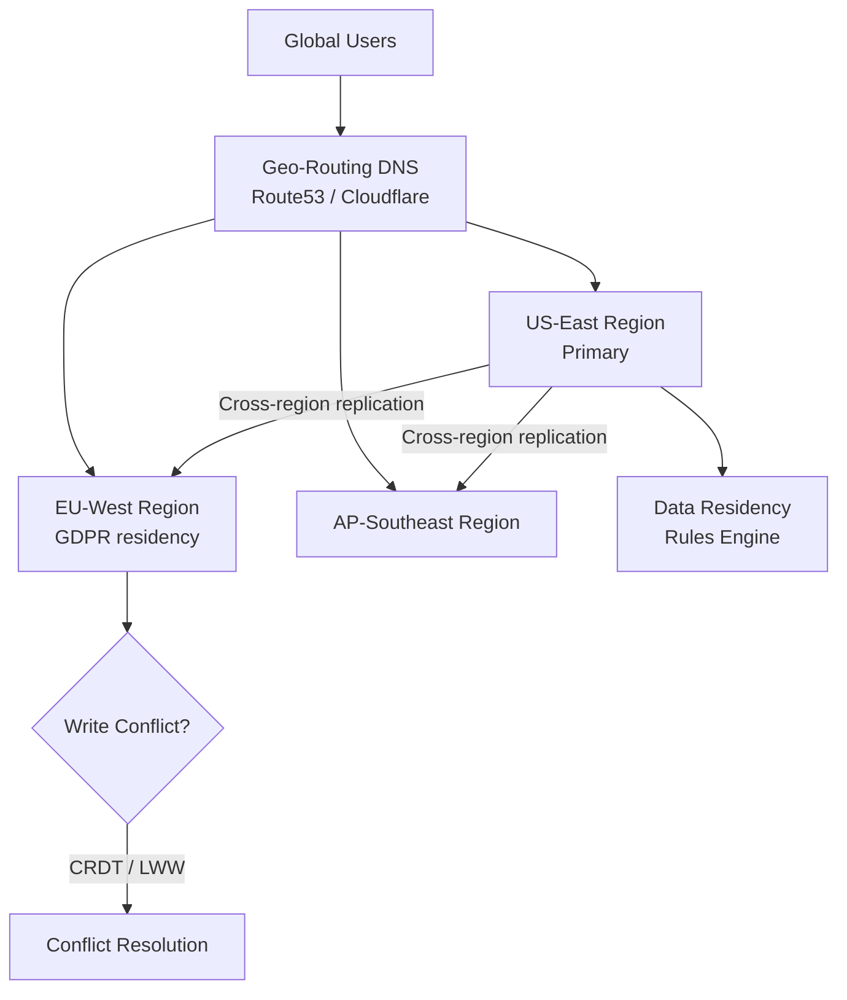
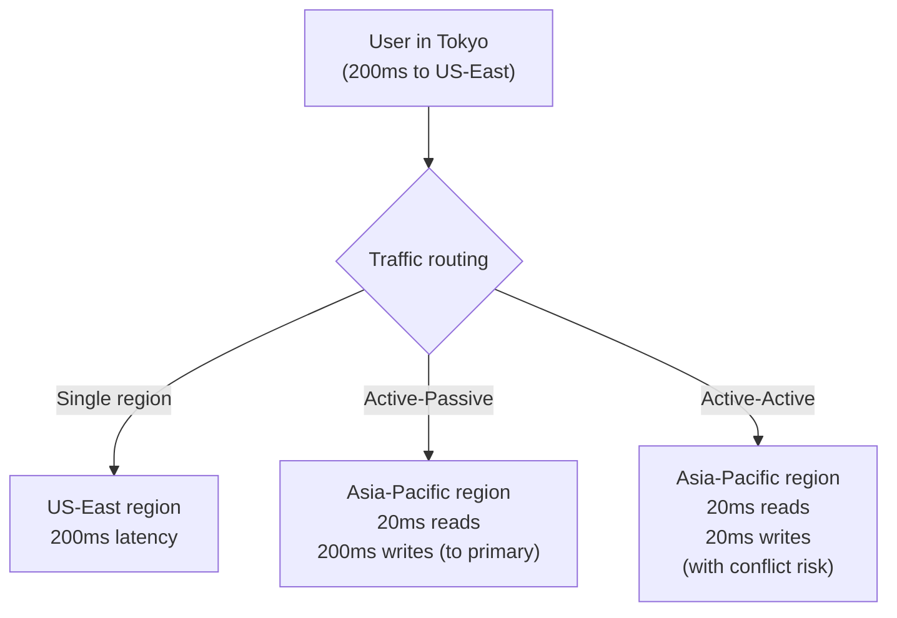
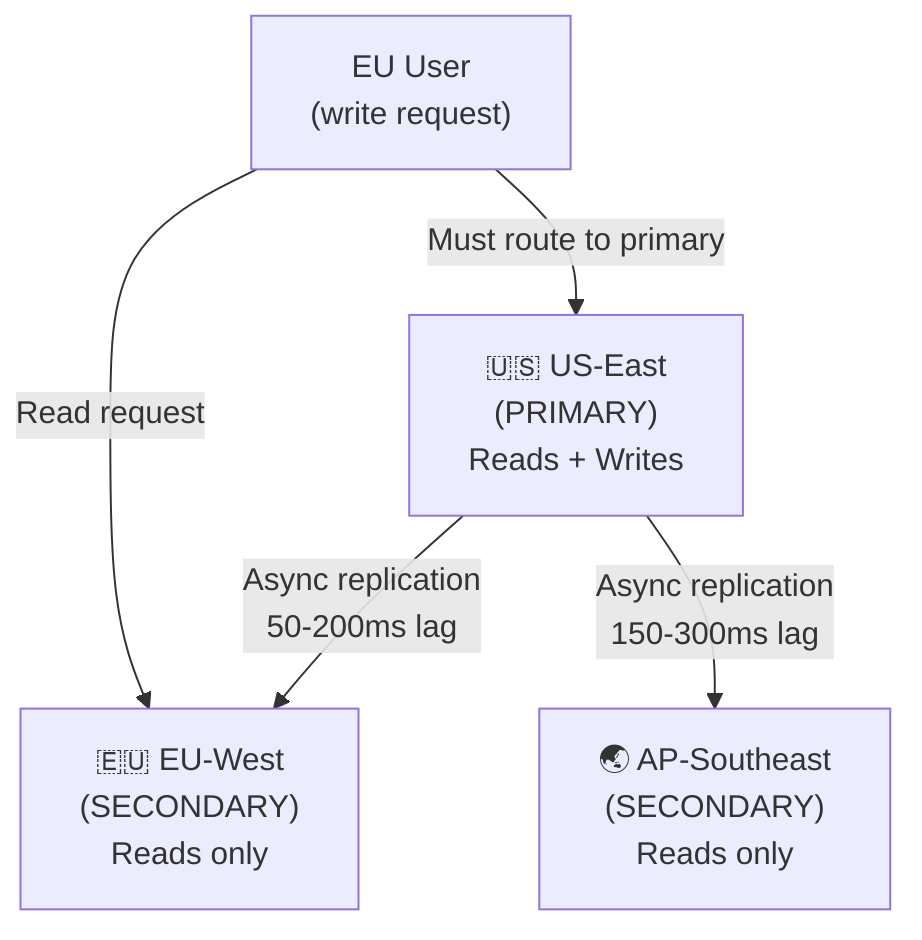
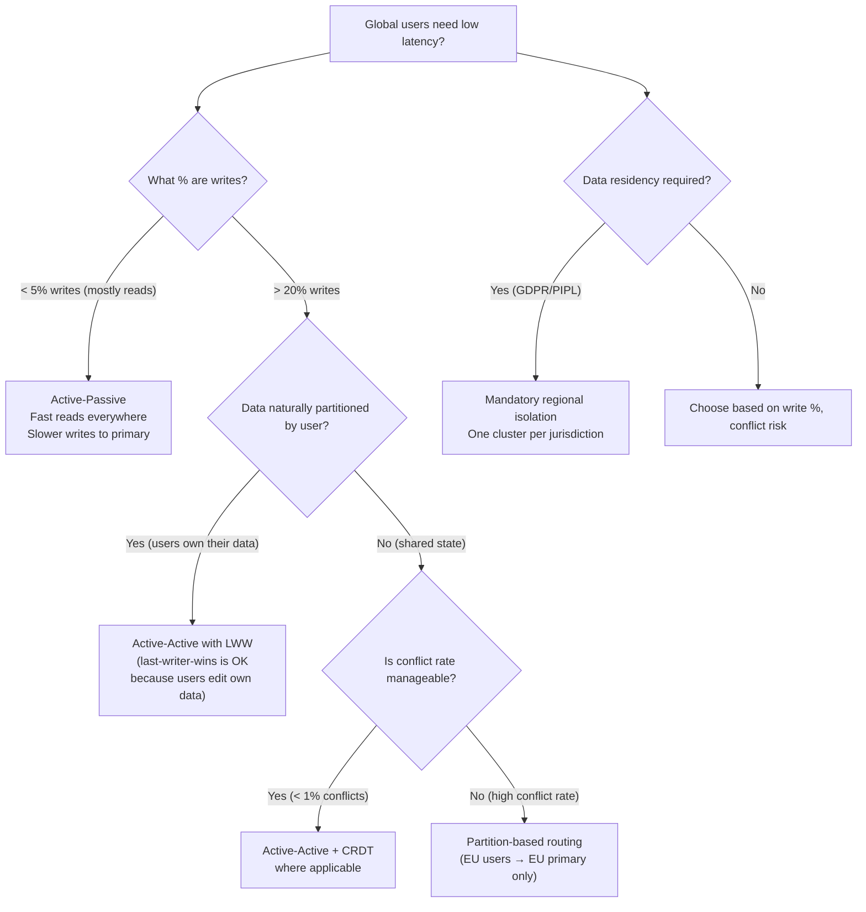

# Global Distribution: Data Residency, Latency Routing, and Conflict Resolution

## 🗺️ Quick Overview



*Geo-routing minimizes latency by directing users to nearby regions; active-active setups require explicit conflict resolution and data-residency enforcement.*

**Every distributed system eventually faces the same question: do you run one region and accept 200ms latency for users in other continents, or do you run multiple regions and accept the write conflict complexity?**

There's no free lunch. Global distribution trades operational simplicity for latency. This article gives you the math to decide which trade-off is right for your system.

---

## The Problem Class `[Mid]`

A social platform with users across the US, Europe, and Asia-Pacific. Currently single-region (US-East). User experience across regions:

```
US-East users:   ~20ms p99 API latency ✓
Europe users:    ~120ms p99 (transatlantic: ~80ms RTT + app overhead)
Asia-Pac users:  ~200ms p99 (transpacific: ~150ms RTT + app overhead)

User research finding:
  Conversion rate drops 7% for every 100ms of added latency
  Asia-Pac users: 14% lower conversion vs. US users

Revenue impact at $50M ARR:
  Europe underperformance: ~$3.5M/year
  Asia-Pac underperformance: ~$7M/year
  Total: ~$10.5M revenue left on table due to latency
```

The solution is global distribution — but which kind?



The diagram shows three paths and the key insight: the write path determines your complexity level. Reads are easy to regionalize; writes are hard.

> 💡 **What this means in practice:** Active-passive gives you fast reads everywhere but still routes writes to one region. Active-active gives you fast writes everywhere but requires you to resolve conflicts when two regions write the same data simultaneously.

---

## Why the Obvious Solution Fails `[Senior]`

### "Just add a CDN — it'll be fast enough"

A CDN solves static asset latency (images, CSS, JS). It doesn't solve API call latency. A user in Tokyo loading a dynamic page (social feed, personalized recommendations, live data) still hits US-East for every API call even with a CDN.

```
What CDN helps:      static assets (files, media) → 0ms (edge cache hit)
What CDN doesn't help: API calls, database reads, write operations
```

### "Active-Active is always better"

Active-active seems like the obvious answer — fast reads and writes in every region. The hidden cost: every write must eventually sync to every other region, and concurrent writes to the same data across regions require conflict resolution.

```
Conflict example:
  User updates their display name:
  US-East (10:00:00.100 UTC): sets name = "Alice"
  EU-West (10:00:00.105 UTC): sets name = "Alice B"
  (5ms apart, both regions accepted the write locally)

  Which one wins?
  - Last-writer-wins (by timestamp): "Alice B" wins (written 5ms later)
  - But clocks can drift! What if EU-West clock is 10ms ahead?
  - Then "Alice" (actually written later) would incorrectly lose
```

Clock-based conflict resolution fails at millisecond precision. Hybrid logical clocks, vector clocks, or CRDTs are required for correct conflict resolution — each adds significant complexity.

---

## The Solution Landscape `[Senior]`

### Solution 1: Active-Passive (Single Primary Region)

**What it is**

One region (the primary) accepts all writes. Other regions (secondaries) serve reads from replicated data. On primary region failure, one secondary is promoted.



After replication, EU reads are served locally (fast); EU writes still route to US-East (slow for writes).

**How it actually works at depth**

```python
# Active-passive routing middleware
class ActivePassiveRouter:
    def __init__(self, primary_region: str, local_region: str,
                 replication_lag_slo_ms: int = 500):
        self.primary_region = primary_region
        self.local_region = local_region
        self.replication_lag_slo = replication_lag_slo_ms

    def route_request(self, request):
        if request.method in ('POST', 'PUT', 'DELETE', 'PATCH'):
            # All writes go to primary region
            return self._route_to_primary(request)

        # Reads go to local region if lag is within SLO
        local_lag_ms = self._get_replication_lag()
        if local_lag_ms <= self.replication_lag_slo:
            return self._route_to_local(request)
        else:
            # Replica too stale — fall back to primary
            return self._route_to_primary(request)

    def _get_replication_lag(self) -> float:
        # Check replication lag from local database
        return db.execute(
            "SELECT EXTRACT(MILLISECONDS FROM (NOW() - pg_last_xact_replay_timestamp()))"
        ).scalar() or 0
```

**Sizing guidance** `[Staff+]`

```
Cross-region replication latency formula:
  Total lag = network_RTT/2 + WAL_shipping_overhead + replica_replay_time

  US-East to EU-West:
    network_RTT: ~80ms (transatlantic)
    WAL shipping: ~10ms (small WAL chunks, sent frequently)
    Replay time: ~5ms (normal write rate)
    Total typical lag: 95-120ms

  US-East to AP-Southeast:
    network_RTT: ~150ms (transpacific)
    Total typical lag: 165-200ms

  Under heavy write load:
    WAL accumulates faster than it can ship
    Lag can grow to seconds during write spikes
    Monitor WAL shipping rate vs. generation rate

Failover time (primary region fails):
  Detection: 30-60s (health check interval × failure threshold)
  DNS propagation: 60-300s (TTL-dependent)
  New primary warms up: 60-300s (connection pool, buffer pool warm)
  Total: 2.5-10 minutes

RTO/RPO for active-passive:
  RPO (data loss): replication lag at time of failure (typically 100-500ms)
  RTO (downtime): 2.5-10 minutes
```

**Failure modes** `[Staff+]`

- **Write latency for non-primary users**: A user in Tokyo has a 300-400ms round trip to US-East just for the write. For interactive writes (posting, submitting forms), this is noticeable. Active-passive is acceptable for write-light workloads (< 5% of user actions are writes).
- **Failover split-brain**: During primary region outage, if secondary is promoted while primary is actually still running (network partition, not actual failure), two primaries emerge. Requires fencing: old primary must be dead or fenced before promotion.
- **Replication lag at failover**: If primary fails with 500ms of un-replicated writes, those writes are lost. Users who made those writes see inconsistency after failover.

---

### Solution 2: Active-Active (Multi-Master)

**What it is**

All regions accept writes. Writes are replicated to all other regions asynchronously. Conflicts (same data written concurrently in multiple regions) must be detected and resolved.

**How it actually works at depth**

```python
# Active-active write with vector clock (conflict detection)
import uuid
import time
from collections import defaultdict

class VectorClock:
    def __init__(self, node_id: str):
        self.node_id = node_id
        self.clocks = defaultdict(int)

    def increment(self):
        self.clocks[self.node_id] += 1
        return dict(self.clocks)

    def merge(self, other_clock: dict):
        for node, ts in other_clock.items():
            self.clocks[node] = max(self.clocks[node], ts)

    def happens_before(self, other: dict) -> bool:
        # Returns True if self < other (self happened before other)
        return all(self.clocks.get(n, 0) <= other.get(n, 0) for n in
                   set(self.clocks) | set(other)) and self.clocks != other

class ActiveActiveStore:
    def __init__(self, region_id: str, replica_clients: list):
        self.region_id = region_id
        self.clock = VectorClock(region_id)
        self.replicas = replica_clients

    def write(self, key: str, value: str):
        # Generate vector clock timestamp for this write
        clock = self.clock.increment()
        record = {
            'key': key,
            'value': value,
            'vector_clock': clock,
            'region': self.region_id,
            'written_at': time.time()
        }
        # Write locally (fast)
        self._write_local(record)
        # Replicate to other regions (async)
        for replica in self.replicas:
            replica.replicate_async(record)

    def resolve_conflict(self, local: dict, incoming: dict) -> dict:
        local_clock = local['vector_clock']
        incoming_clock = incoming['vector_clock']

        # Check causal ordering
        if VectorClock('').happens_before(local_clock):  # incoming happens before local
            return local  # local wins, incoming is stale
        elif VectorClock('').happens_before(incoming_clock):  # local happens before incoming
            return incoming  # incoming wins, local is stale
        else:
            # Concurrent writes — true conflict
            return self._merge_conflict(local, incoming)

    def _merge_conflict(self, a: dict, b: dict) -> dict:
        # Strategy depends on data type:
        # - Last-writer-wins (use wall clock): simple but can lose data
        # - Application merge: custom logic per field
        # - CRDT: automatic merge for specific data types
        if a['written_at'] > b['written_at']:
            return a
        return b
```

**CRDTs for conflict-free data structures** `[Staff+]`

CRDTs (Conflict-free Replicated Data Types) are data structures that can be merged without conflicts regardless of the order of operations.

```python
# G-Counter CRDT — increment-only counter, no conflicts possible
class GCounter:
    def __init__(self, node_id: str, nodes: list):
        self.node_id = node_id
        self.counts = {node: 0 for node in nodes}

    def increment(self, amount: int = 1):
        self.counts[self.node_id] += amount

    def value(self) -> int:
        return sum(self.counts.values())

    def merge(self, other: 'GCounter'):
        # Merge = take max per node — always correct, no conflicts
        for node in self.counts:
            self.counts[node] = max(self.counts[node], other.counts.get(node, 0))

# PN-Counter CRDT — increment AND decrement, no conflicts
class PNCounter:
    def __init__(self, node_id: str, nodes: list):
        self.positive = GCounter(node_id, nodes)
        self.negative = GCounter(node_id, nodes)

    def increment(self, amount: int = 1):
        self.positive.increment(amount)

    def decrement(self, amount: int = 1):
        self.negative.increment(amount)

    def value(self) -> int:
        return self.positive.value() - self.negative.value()

    def merge(self, other: 'PNCounter'):
        self.positive.merge(other.positive)
        self.negative.merge(other.negative)
```

**Sizing guidance** `[Staff+]`

```
Cross-region replication latency for active-active:
  Write latency (local commit): ~5-10ms (local region only)
  Replication to other regions: async, doesn't block local commit

  Time until read reflects write in another region:
    Same as active-passive lag: 100-300ms for US↔EU

Conflict rate estimation:
  Conflict probability = P(same record written in 2+ regions within replication_lag)

  If replication lag = 200ms:
    A conflict occurs if two users in different regions edit the same record
    within 200ms of each other

  For user profiles (each user edits own profile):
    Probability of two regions editing same user within 200ms: ~0%
    → Conflicts essentially impossible

  For shared documents (collaborative editing):
    Multiple users editing same doc: conflicts likely
    → Need CRDTs or operational transforms

Decision: Active-active is low-risk for naturally partitioned data (user owns their data).
          It's high-risk for shared mutable state (team documents, shared inventory).
```

**Configuration decisions that matter** `[Staff+]`

- Route users to their "home region" (based on account creation region) to minimize conflicts — a user in EU should primarily interact with EU region data
- Use hybrid logical clocks (not wall clocks) for timestamp-based conflict resolution — wall clocks can skew by 10+ seconds
- For critical data (financial), disable active-active and route to a single region primary — correctness > latency

---

### Solution 3: Data Residency and GDPR Constraints `[Staff+]`

**What it is**

GDPR (EU), CCPA (California), LGPD (Brazil), PIPL (China) mandate that certain user data must remain within specific geographic boundaries. This constrains your global distribution architecture.

```python
# Data residency enforcement
RESIDENCY_RULES = {
    'EU': {
        'regions': ['eu-west-1', 'eu-central-1', 'eu-north-1'],
        'regulations': ['GDPR'],
        'data_types': ['pii', 'health_data', 'financial_data'],
        'allows_cross_region': False,  # Cannot send EU PII to US
    },
    'US': {
        'regions': ['us-east-1', 'us-west-2'],
        'regulations': ['CCPA'],
        'data_types': ['pii'],
        'allows_cross_region': True,  # US can store in US regions
    },
    'CN': {
        'regions': ['cn-north-1'],
        'regulations': ['PIPL'],
        'data_types': ['all'],
        'allows_cross_region': False,  # China data must stay in China
    }
}

class DataResidencyRouter:
    def route_write(self, user_region: str, data_type: str, data: dict):
        rules = RESIDENCY_RULES.get(user_region, {})
        if not rules.get('allows_cross_region') and data_type in rules.get('data_types', []):
            # Must write to an allowed region for this user
            target_region = self._select_region_in_jurisdiction(user_region)
        else:
            target_region = self._select_optimal_region(user_region)
        return self._write_to_region(target_region, data)

    def replicate_data(self, source_region: str, data: dict, data_classification: str):
        source_jurisdiction = self._get_jurisdiction(source_region)
        for target_region in self._get_all_regions():
            target_jurisdiction = self._get_jurisdiction(target_region)
            if self._replication_allowed(source_jurisdiction, target_jurisdiction, data_classification):
                self._replicate(target_region, data)
            # else: skip — would violate data residency
```

**Architectural implications of data residency** `[Staff+]`

```
Challenge: Global search across user data when EU data can't leave EU
Solution: Federated search — run search in each jurisdiction, aggregate results

Challenge: Analytics on global data when EU data is restricted
Solution: Anonymize/aggregate EU data before sending to global analytics cluster,
          or run EU analytics separately

Challenge: Support team in US needs to access EU user data
Solution: EU data stays in EU; US support team accesses EU region via jump host
          All access is logged for GDPR audit trail

Infrastructure cost impact:
  Without residency: 1 global cluster + CDN = simplest
  With residency:    1 cluster per jurisdiction = 3-5× infrastructure cost
  Minimum viable: 2 clusters (EU + US), CN gets separate system
```

---

## Trade-off Matrix `[Senior]` → `[Staff+]`

| Dimension | Single Region | Active-Passive | Active-Active |
|---|---|---|---|
| **Write latency** | 5-20ms | 200-400ms (non-primary) | 5-20ms (local) |
| **Read latency** | 200ms+ (remote users) | 5-20ms (local replica) | 5-20ms (local) |
| **Data consistency** | Strong | Eventual (100-300ms) | Eventual (100-300ms) |
| **Conflict handling** | None needed | None needed | Required |
| **Ops complexity** | Low | Medium | High |
| **Failover RTO** | N/A (single region) | 2-10 minutes | Seconds (auto-route) |
| **GDPR compliance** | Easy (single region) | Medium | Complex (where is primary?) |

---

## Decision Framework `[Senior]` → `[Staff+]`



---

## Production Failure Story `[Staff+]`

**Company**: Global document collaboration platform
**Architecture**: Active-active, 3 regions (US, EU, AP), last-writer-wins conflict resolution
**Incident**: A critical client (500-person law firm) was collaborating on a merger document

**What happened:**
1. Partner in New York edits section 7 of document at 14:00:00.100 UTC
2. Associate in London edits section 7 at 14:00:00.200 UTC (100ms later)
3. Both writes accepted locally (active-active, no blocking)
4. London write timestamp: 14:00:00.200 — wins LWW
5. New York's partner opens document 2 minutes later — her changes are gone
6. She's unaware of the overwrite, proceeds with incomplete version
7. Document sent to client with missing clauses from partner's edit

**Root cause:** Last-writer-wins with wall clocks failed because:
- 100ms window was smaller than potential clock skew
- LWW silently discards the "losing" write — no notification to either user

**Architectural fix:**
1. Replaced LWW with operational transforms (OT) for document editing — every character edit is transformed relative to concurrent edits, never silently discarded
2. Added conflict notification: users see "merged from X" annotations on conflicting sections
3. High-value documents can be "locked" to single-region writes (degraded latency, no conflicts)
4. Added write acknowledgment system: writes show as "pending sync" until confirmed by home region

---

## Observability Playbook `[Staff+]`

```yaml
metrics:
  replication:
    - cross_region_replication_lag_ms{source, dest}   # alert: > 1000ms
    - replication_bytes_per_second{source, dest}       # spike = write amplification
    - replication_error_rate                           # alert: > 0

  routing:
    - requests_by_region{region}                       # traffic distribution
    - write_cross_region_fraction                      # for active-passive: should be low
    - conflict_resolution_total{outcome}               # LWW wins, CRDT merge, etc.

  latency:
    - api_latency_p99_ms{user_region}                  # compare regions
    - db_write_latency_p99_ms{region}                  # cross-region write cost visible here

  compliance:
    - data_residency_violation_total                   # alert: > 0 (regulatory risk)
    - cross_jurisdiction_replication_blocked_total     # audit log

dashboards:
  - "Global latency map" — p99 latency per user region
  - "Replication health" — lag per region pair
  - "Conflict rate" — conflicts per hour, by data type
```

---

## Architectural Evolution `[Staff+]`

```
Stage 1 (< 1M users, single geography):
  Single region, CDN for static assets
  No replication complexity

Stage 2 (1M-10M users, multi-continent):
  Active-passive: read replicas in each continent
  Primary in region with majority of writes (typically US for US companies)
  Acceptable write latency for non-US users if writes < 10% of interactions

Stage 3 (10M-100M users, critical write latency):
  Active-active in 2-3 regions for naturally partitioned data
  CRDT counters and LWW for profile data
  Lock-based single-region writes for financial/critical data
  Data residency enforcement layer

Stage 4 (100M+ users, global brand):
  Full active-active with jurisdiction isolation
  Per-regulation data tier (EU GDPR cluster, CN PIPL cluster)
  Global metadata plane (user auth, routing) vs. data plane (user content)
  Metadata global; user data regional
```

---

## Decision Framework Checklist `[All Levels]`

- [ ] What is the p99 latency for users in each target region today? Is it within your SLO?
- [ ] What % of your traffic is writes? (Determines whether active-passive is sufficient)
- [ ] Are you subject to GDPR, PIPL, or other data residency regulations? Do you know which data types are regulated?
- [ ] Is your user data naturally partitioned (each user owns their data) or shared (multiple users edit same records)?
- [ ] Have you modeled your conflict rate? (Replication lag × concurrent write probability per entity)
- [ ] If using active-active: what is your conflict resolution strategy? Have you tested it?
- [ ] Is your failover process tested? When did you last simulate a full region failure?
- [ ] What is your RPO (data loss tolerance) and RTO (downtime tolerance)?
- [ ] Is your DNS TTL short enough for fast traffic rerouting during failover?
- [ ] Have you documented which data can and cannot be replicated across jurisdictions?

*Written by Gaurav Porwal — 10+ Year Engineer | Tech Lead | Product Owner | Business-Minded Builder*
*Last updated: 2026-03-18*
