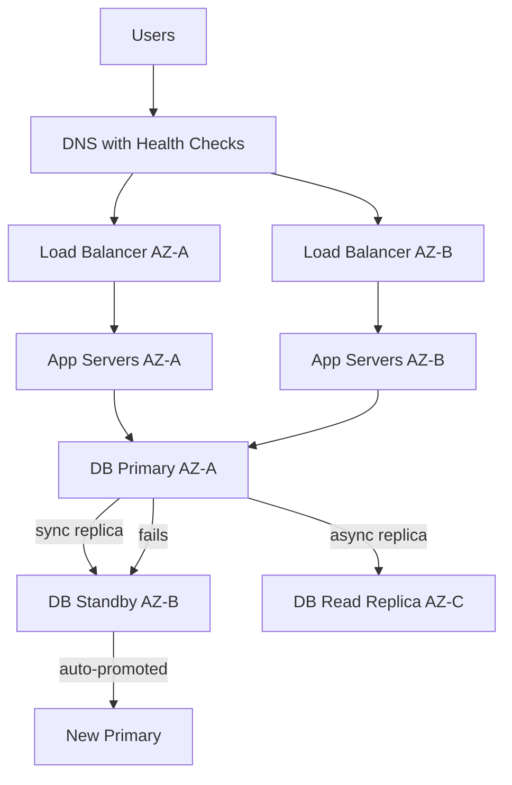

# High Availability - Design for 99.99% Uptime

> **Reading Time:** 22 minutes
> **Difficulty:** Intermediate
> **Impact:** The difference between "site is down" and "users never notice"

## 🗺️ Quick Overview



*Every layer — DNS, load balancer, app, database — has a redundant counterpart across Availability Zones; when one fails the other takes over automatically.*

## The Math That Will Haunt You

**99% uptime sounds good. Here's what it actually means:**

```
Uptime %    Downtime/Year    Downtime/Month    Downtime/Week
─────────   ─────────────    ──────────────    ─────────────
99%         3.65 days        7.2 hours         1.68 hours
99.9%       8.76 hours       43.8 minutes      10.1 minutes
99.99%      52.6 minutes     4.38 minutes      1.01 minutes
99.999%     5.26 minutes     26.3 seconds      6.05 seconds

Translation:
99% = "Sorry, the site is down every week for 2 hours"
99.9% = "Monthly maintenance window acceptable"
99.99% = "Users might notice once a quarter"
99.999% = "Literally never down" (Google/AWS target)
```

**The cost of each "9":**

```
99% → 99.9%    = 10x effort
99.9% → 99.99%  = 10x more effort
99.99% → 99.999% = 10x more again

Total: 99% → 99.999% = 1000x complexity
```

This article shows you how to achieve 99.99% without going bankrupt.

---

## The $150M GitLab Incident

**January 31, 2017: GitLab goes down for 18 hours**

```
Timeline:
6:00 PM - DBA runs maintenance script on wrong database server
6:01 PM - Realizes mistake, stops script
6:02 PM - 300GB of production data deleted
6:03 PM - Panic begins

Recovery attempts:
- Backup 1: Regular backups → Failed silently for months
- Backup 2: LVM snapshots → Not configured
- Backup 3: Azure disk snapshots → Not configured
- Backup 4: pg_dump → 6 hours old, corrupt
- Backup 5: S3 → Actually worked!

Result:
- 18 hours of downtime
- 6 hours of data lost forever
- 5,000 projects affected
- Stock price impact
- Public trust damaged

Root cause: Single point of failure (one database, no tested backups)
```

**GitLab's response:** Published their entire incident publicly and built one of the most robust HA systems in the industry.

---

## The Single Point of Failure (SPOF) Problem

### Find Your SPOFs

```
Your "highly available" system:

                    ┌───────────────┐
        Users ─────▶│ Load Balancer │  ← What if this dies?
                    └───────┬───────┘
                            │
            ┌───────────────┼───────────────┐
            ▼               ▼               ▼
      ┌─────────┐     ┌─────────┐     ┌─────────┐
      │ App 1   │     │ App 2   │     │ App 3   │  ✓ Redundant
      └────┬────┘     └────┬────┘     └────┬────┘
           │               │               │
           └───────────────┼───────────────┘
                           ▼
                    ┌─────────────┐
                    │  Database   │  ← SPOF! One DB = total failure
                    └─────────────┘

Hidden SPOFs you forgot:
- DNS provider (1 provider = 1 failure point)
- SSL certificate (expired = site down)
- Configuration server (Consul/etcd)
- External APIs (Stripe, Twilio, Auth0)
- The one person who knows the deployment process
```

### SPOF Audit Checklist

| Component | Question | If "Yes", You Have a SPOF |
|-----------|----------|---------------------------|
| Load Balancer | Is there only 1? | SPOF |
| Database | Is there only 1 instance? | SPOF |
| Cache | One Redis node? | SPOF |
| DNS | One provider? | SPOF |
| Region | All in one AWS region? | SPOF |
| Deployment | One person knows how? | SPOF |
| Secrets | One copy of credentials? | SPOF |

---

## The HA Building Blocks

### 1. Redundancy at Every Layer

```
Layer-by-Layer Redundancy:

DNS Layer:
┌──────────────────────────────────────────────────┐
│  Primary: Route 53          Backup: Cloudflare   │
│  (Automatic failover via health checks)          │
└──────────────────────────────────────────────────┘
                           │
                           ▼
Load Balancer Layer:
┌──────────────────────────────────────────────────┐
│    ALB (us-east-1a)    ←→    ALB (us-east-1b)   │
│    (Cross-zone load balancing enabled)           │
└──────────────────────────────────────────────────┘
                           │
                           ▼
Application Layer:
┌─────────────────────────────────────────────────────────────┐
│  us-east-1a         us-east-1b         us-east-1c          │
│  ┌─────────┐        ┌─────────┐        ┌─────────┐         │
│  │ App x 3 │        │ App x 3 │        │ App x 3 │         │
│  └─────────┘        └─────────┘        └─────────┘         │
│  (Auto-scaling group: min 2, max 50 per AZ)                │
└─────────────────────────────────────────────────────────────┘
                           │
                           ▼
Database Layer:
┌─────────────────────────────────────────────────────────────┐
│  Primary (1a)     Sync Replica (1b)    Async Replica (1c)  │
│  ┌─────────┐      ┌─────────┐          ┌─────────┐         │
│  │   RW    │ ───▶ │   RO    │ ──────▶  │   RO    │         │
│  └─────────┘      └─────────┘          └─────────┘         │
│  (Automatic failover: RDS Multi-AZ or Aurora)              │
└─────────────────────────────────────────────────────────────┘
```

### 2. Health Checks Everywhere

```javascript
// Application health check endpoint
app.get('/health', async (req, res) => {
  const health = {
    status: 'healthy',
    timestamp: Date.now(),
    checks: {}
  };

  // Check database connectivity
  try {
    await db.query('SELECT 1');
    health.checks.database = 'healthy';
  } catch (err) {
    health.checks.database = 'unhealthy';
    health.status = 'unhealthy';
  }

  // Check Redis connectivity
  try {
    await redis.ping();
    health.checks.redis = 'healthy';
  } catch (err) {
    health.checks.redis = 'unhealthy';
    health.status = 'unhealthy';
  }

  // Check external API (with timeout)
  try {
    const response = await axios.get('https://api.stripe.com/v1/health', {
      timeout: 2000
    });
    health.checks.stripe = response.status === 200 ? 'healthy' : 'degraded';
  } catch (err) {
    health.checks.stripe = 'unreachable';
    // Don't mark entire system unhealthy for external dependency
  }

  const statusCode = health.status === 'healthy' ? 200 : 503;
  res.status(statusCode).json(health);
});

// Load balancer configuration (AWS ALB)
const healthCheck = {
  path: '/health',
  interval: 30,           // Check every 30 seconds
  timeout: 5,             // Wait 5 seconds for response
  healthyThreshold: 2,    // 2 successes = healthy
  unhealthyThreshold: 3   // 3 failures = unhealthy, remove from pool
};
```

### 3. Automatic Failover

```javascript
// Database failover with connection retry
const { Pool } = require('pg');

class ResilientDatabase {
  constructor(config) {
    this.primaryPool = new Pool({ ...config, host: config.primaryHost });
    this.replicaPool = new Pool({ ...config, host: config.replicaHost });
    this.usingPrimary = true;
  }

  async query(sql, params, options = {}) {
    const pool = options.readOnly ? this.replicaPool : this.primaryPool;

    try {
      return await this.executeWithRetry(pool, sql, params);
    } catch (err) {
      if (this.isConnectionError(err) && !options.readOnly) {
        // Primary might be failing over, try replica for reads
        console.warn('Primary unavailable, checking replica...');
        return await this.waitForFailover(sql, params);
      }
      throw err;
    }
  }

  async executeWithRetry(pool, sql, params, retries = 3) {
    for (let i = 0; i < retries; i++) {
      try {
        return await pool.query(sql, params);
      } catch (err) {
        if (i === retries - 1) throw err;
        await this.sleep(Math.pow(2, i) * 100);  // Exponential backoff
      }
    }
  }

  async waitForFailover(sql, params) {
    // RDS failover takes 60-120 seconds
    // Aurora takes 30 seconds
    const maxWait = 120000;
    const interval = 5000;
    let waited = 0;

    while (waited < maxWait) {
      try {
        // Try the connection that will become primary after failover
        return await this.primaryPool.query(sql, params);
      } catch (err) {
        await this.sleep(interval);
        waited += interval;
        console.log(`Waiting for failover... ${waited/1000}s`);
      }
    }

    throw new Error('Database failover timeout');
  }

  isConnectionError(err) {
    return err.code === 'ECONNREFUSED' ||
           err.code === 'ETIMEDOUT' ||
           err.code === '57P01';  // PostgreSQL admin shutdown
  }

  sleep(ms) {
    return new Promise(resolve => setTimeout(resolve, ms));
  }
}
```

---

## The HA Design Patterns

### Pattern 1: Active-Passive (Hot Standby)

```
Primary handles all traffic, standby waits:

        ┌────────────────┐      ┌────────────────┐
Traffic │  Active        │      │  Passive       │
───────▶│  Server        │      │  Server        │
        │  (handling)    │      │  (waiting)     │
        └───────┬────────┘      └───────┬────────┘
                │                       │
                ▼                       ▼
        ┌────────────────────────────────────────┐
        │       Shared Storage / Database        │
        │   (Both servers can access same data)  │
        └────────────────────────────────────────┘

Failover process:
1. Active server fails health check
2. Monitoring detects failure
3. Passive server promoted to active
4. DNS/load balancer updated
5. Passive becomes new active

Time to failover: 30 seconds - 2 minutes

Use cases:
- Database failover (PostgreSQL, MySQL)
- Legacy applications that can't be parallelized
- Licensing restrictions (only 1 active node)
```

### Pattern 2: Active-Active (Load Balanced)

```
All servers handle traffic simultaneously:

              Load Balancer
                    │
        ┌───────────┼───────────┐
        ▼           ▼           ▼
   ┌─────────┐ ┌─────────┐ ┌─────────┐
   │ Active  │ │ Active  │ │ Active  │
   │ Server 1│ │ Server 2│ │ Server 3│
   │  (33%)  │ │  (33%)  │ │  (33%)  │
   └────┬────┘ └────┬────┘ └────┬────┘
        │           │           │
        └───────────┼───────────┘
                    ▼
          Shared Data Layer
        (Database, Cache, etc.)

Failover process:
1. Server 2 fails health check
2. Load balancer removes Server 2
3. Traffic redistributed to Server 1 and 3
4. No manual intervention needed

Time to failover: < 30 seconds (next health check)

Use cases:
- Stateless web applications
- API servers
- Microservices
```

### Pattern 3: Multi-Region Active-Active

```
Traffic served from multiple geographic regions:

        Users in US          Users in Europe         Users in Asia
             │                     │                      │
             ▼                     ▼                      ▼
     ┌───────────────┐     ┌───────────────┐     ┌───────────────┐
     │  US-East      │     │  EU-West      │     │  AP-Southeast │
     │  Region       │     │  Region       │     │  Region       │
     │  ┌─────────┐  │     │  ┌─────────┐  │     │  ┌─────────┐  │
     │  │ App x 5 │  │     │  │ App x 5 │  │     │  │ App x 5 │  │
     │  └────┬────┘  │     │  └────┬────┘  │     │  └────┬────┘  │
     │       ▼       │     │       ▼       │     │       ▼       │
     │  ┌─────────┐  │     │  ┌─────────┐  │     │  ┌─────────┐  │
     │  │ DB      │◀─┼──▶──┼─▶│ DB      │◀─┼──▶──┼─▶│ DB      │  │
     │  │ Primary │  │     │  │ Replica │  │     │  │ Replica │  │
     │  └─────────┘  │     │  └─────────┘  │     │  └─────────┘  │
     └───────────────┘     └───────────────┘     └───────────────┘

Global traffic routing (Route 53 / Cloudflare):
- Latency-based routing: Users → Nearest region
- Health checks: Automatically exclude unhealthy regions
- Failover: US-East down → Traffic to EU-West

Complexity:
- Database replication across regions
- Conflict resolution for writes
- Eventually consistent reads
```

---

## Calculating Availability

### The SLA Math

```
System availability = Component 1 × Component 2 × Component 3 × ...

Example: Simple 3-tier app
- Load Balancer: 99.99%
- Application (single server): 99.9%
- Database (single instance): 99.9%

System availability = 0.9999 × 0.999 × 0.999 = 99.78%

With redundancy:
- Load Balancer (2 instances): 1 - (0.0001)² = 99.999999%
- Application (3 servers): 1 - (0.001)³ = 99.9999997%
- Database (2 instances): 1 - (0.001)² = 99.9999%

System availability = 0.99999999 × 0.999999997 × 0.999999 = 99.999998%

That's the difference between:
- 3.65 days downtime/year (99%)
- 6.3 seconds downtime/year (99.999998%)
```

### Dependency Chain Impact

```
Your service depends on:
- AWS EC2: 99.99%
- AWS RDS: 99.95%
- Stripe API: 99.99%
- Twilio: 99.95%
- Auth0: 99.99%

Combined availability = 0.9999 × 0.9995 × 0.9999 × 0.9995 × 0.9999
                      = 99.87%

That's 11.4 hours of downtime per year, even if YOUR code is perfect!

Solutions:
1. Reduce dependencies
2. Add fallbacks for each dependency
3. Design for degraded operation
4. Cache responses from external APIs
```

---

## Netflix's Chaos Engineering

**"The best way to avoid failure is to fail constantly."**

### Chaos Monkey: Kill Random Servers

```javascript
// Simplified Chaos Monkey concept
class ChaosMonkey {
  constructor(config) {
    this.targetGroup = config.targetGroup;
    this.probability = config.probability;  // e.g., 0.05 = 5% chance
  }

  async runChaos() {
    const instances = await this.getRunningInstances();

    for (const instance of instances) {
      if (Math.random() < this.probability) {
        console.log(`Chaos Monkey killing instance: ${instance.id}`);
        await this.terminateInstance(instance.id);
        // Instance should be replaced by auto-scaling
        // System should continue working
      }
    }
  }

  scheduleDaily() {
    // Run during business hours to ensure engineers can respond
    cron.schedule('0 10 * * 1-5', () => this.runChaos());  // 10 AM weekdays
  }
}

// Usage
const monkey = new ChaosMonkey({
  targetGroup: 'production-api-servers',
  probability: 0.05  // Kill 5% of servers randomly
});

monkey.scheduleDaily();
```

### Chaos Kong: Kill Entire Regions

```
Netflix runs "Chaos Kong" exercises:

Before Chaos Kong:
├── us-east-1: Handling 40% of traffic ✓
├── us-west-2: Handling 35% of traffic ✓
└── eu-west-1: Handling 25% of traffic ✓

Chaos Kong kills us-east-1:
├── us-east-1: OFFLINE ❌
├── us-west-2: Now handling 57% of traffic ✓
└── eu-west-1: Now handling 43% of traffic ✓

Results:
- Automatic failover in < 60 seconds
- No customer impact
- Proves multi-region really works
```

---

## HA Implementation Checklist

### Infrastructure Level

```yaml
# Terraform example for HA infrastructure

# Multiple Availability Zones
resource "aws_subnet" "app_subnet" {
  count             = 3  # Three AZs
  vpc_id            = aws_vpc.main.id
  availability_zone = data.aws_availability_zones.available.names[count.index]
  cidr_block        = cidrsubnet(aws_vpc.main.cidr_block, 4, count.index)
}

# Auto-scaling across AZs
resource "aws_autoscaling_group" "app" {
  name                = "app-asg"
  vpc_zone_identifier = aws_subnet.app_subnet[*].id  # All 3 AZs
  min_size            = 6    # 2 per AZ minimum
  max_size            = 30
  desired_capacity    = 9    # 3 per AZ normal

  health_check_type         = "ELB"
  health_check_grace_period = 300
}

# Multi-AZ database
resource "aws_db_instance" "main" {
  identifier        = "production-db"
  multi_az          = true  # Automatic standby in different AZ
  engine            = "postgres"
  instance_class    = "db.r5.xlarge"

  backup_retention_period = 30
  backup_window          = "03:00-04:00"
}

# Redis cluster
resource "aws_elasticache_replication_group" "redis" {
  replication_group_id          = "production-redis"
  automatic_failover_enabled    = true
  multi_az_enabled             = true
  num_cache_clusters           = 3  # 1 primary + 2 replicas
}
```

### Application Level

```javascript
// HA-ready application patterns

// 1. Graceful shutdown
process.on('SIGTERM', async () => {
  console.log('SIGTERM received, starting graceful shutdown...');

  // Stop accepting new requests
  server.close();

  // Wait for in-flight requests (max 30 seconds)
  await new Promise(resolve => setTimeout(resolve, 30000));

  // Close database connections
  await db.end();
  await redis.quit();

  console.log('Graceful shutdown complete');
  process.exit(0);
});

// 2. Circuit breaker for external dependencies
const CircuitBreaker = require('opossum');

const stripeOptions = {
  timeout: 3000,
  errorThresholdPercentage: 50,
  resetTimeout: 30000
};

const stripeBreaker = new CircuitBreaker(
  (amount) => stripe.charges.create({ amount }),
  stripeOptions
);

stripeBreaker.on('open', () => {
  console.warn('Stripe circuit breaker OPEN');
  alertOps('Stripe API failures detected');
});

stripeBreaker.on('halfOpen', () => {
  console.info('Stripe circuit breaker testing...');
});

stripeBreaker.on('close', () => {
  console.info('Stripe circuit breaker CLOSED (recovered)');
});

// 3. Request timeouts
const timeout = require('connect-timeout');

app.use(timeout('15s'));  // Fail requests after 15 seconds

app.use((req, res, next) => {
  if (!req.timedout) next();
  // If timed out, response already sent
});
```

---

## Common HA Mistakes

### Mistake 1: "We Have Backups" (Untested)

```
GitLab incident pattern:

"We have 5 backup systems!"

Reality:
- Backup 1: LVM snapshots → Disabled by accident
- Backup 2: pg_dump → Running but corrupt
- Backup 3: Azure → Not configured
- Backup 4: S3 → Worked! (Lucky)
- Backup 5: Manual → 6 months old

The fix: Test backups monthly

// Automated backup test
async function testBackupRecovery() {
  // 1. Restore to test environment
  await restoreBackupTo('test-db-recovery');

  // 2. Run integrity checks
  const rowCount = await testDb.query('SELECT COUNT(*) FROM users');
  const checksum = await testDb.query('SELECT SUM(id) FROM orders');

  // 3. Compare with production
  const prodRowCount = await prodDb.query('SELECT COUNT(*) FROM users');
  const prodChecksum = await prodDb.query('SELECT SUM(id) FROM orders');

  if (rowCount !== prodRowCount || checksum !== prodChecksum) {
    alertOps('CRITICAL: Backup integrity check failed!');
  }

  // 4. Clean up
  await destroyTestDb('test-db-recovery');
}

// Run weekly
cron.schedule('0 4 * * SUN', testBackupRecovery);
```

### Mistake 2: Same Rack / Same DC

```
"We have 3 servers for redundancy!"

Reality:
- All 3 in same rack
- Same power strip
- Same network switch
- Same failure domain

Power surge → All 3 dead → 100% outage

The fix: Spread across failure domains

AWS Availability Zones:
- Zone A: Server 1, 2 (different racks)
- Zone B: Server 3, 4 (different building)
- Zone C: Server 5, 6 (different power grid)

Now: Any zone can fail, system continues
```

### Mistake 3: Ignoring Thundering Herd

```
Scenario:
- 3 app servers behind load balancer
- Server 1 dies
- 1000 connections per server

What happens:
1. Server 1 dies
2. 1000 connections drop
3. All 1000 retry immediately
4. Server 2 gets 2000 connections
5. Server 2 overwhelmed, dies
6. Server 3 gets 3000 connections
7. Server 3 dies
8. Total outage

The fix: Retry with jitter

async function retryWithBackoff(fn, options = {}) {
  const maxRetries = options.maxRetries || 3;
  const baseDelay = options.baseDelay || 1000;

  for (let i = 0; i < maxRetries; i++) {
    try {
      return await fn();
    } catch (err) {
      if (i === maxRetries - 1) throw err;

      // Exponential backoff with jitter
      const delay = baseDelay * Math.pow(2, i);
      const jitter = delay * 0.5 * Math.random();  // Add 0-50% random jitter

      await sleep(delay + jitter);
    }
  }
}
```

---

## Quick Win: Basic HA in 1 Hour

**Minimum viable high availability:**

```yaml
# docker-compose.yml for local HA testing

version: '3.8'

services:
  # Multiple app instances
  app1:
    build: .
    environment:
      - INSTANCE_ID=1
    depends_on:
      - redis
      - postgres

  app2:
    build: .
    environment:
      - INSTANCE_ID=2
    depends_on:
      - redis
      - postgres

  # Load balancer
  nginx:
    image: nginx
    ports:
      - "80:80"
    volumes:
      - ./nginx.conf:/etc/nginx/nginx.conf
    depends_on:
      - app1
      - app2

  # Shared state
  redis:
    image: redis:7

  postgres:
    image: postgres:15
    environment:
      POSTGRES_PASSWORD: secret
```

```nginx
# nginx.conf
upstream app_servers {
    least_conn;
    server app1:3000;
    server app2:3000;
}

server {
    listen 80;

    location / {
        proxy_pass http://app_servers;
        proxy_next_upstream error timeout http_502;
        proxy_connect_timeout 5s;
    }

    location /health {
        proxy_pass http://app_servers;
    }
}
```

**Test failover:**
```bash
# Start everything
docker-compose up -d

# Verify both instances work
curl http://localhost/health

# Kill one instance
docker-compose stop app1

# Verify system still works
curl http://localhost/health  # Should still respond!

# Bring it back
docker-compose start app1
```

---

## Key Takeaways

1. **No single points of failure**: Redundancy at every layer
2. **Health checks everywhere**: Automatic detection and removal
3. **Test your failover**: Regularly kill components to verify
4. **Plan for cascading failures**: Circuit breakers, timeouts, backpressure
5. **Start simple**: 2 AZs better than complex 3-region setup that's never tested

## The HA Mindset

```
Ask yourself for every component:

"What happens if this dies at 3 AM on Sunday?"

If the answer is "everything breaks":
  → Add redundancy
  → Add health checks
  → Add automatic failover
  → Test it actually works

If the answer is "the pager goes off but service continues":
  → You've achieved high availability
```

---

## Related Resources

- [Scaling Basics](./scaling-basics.md) - Vertical vs horizontal scaling
- [Stateless Architecture](./stateless-architecture.md) - Enable easy failover
- [Circuit Breaker Pattern](../patterns/circuit-breaker.md) - Handle dependency failures

---

## Practice POCs

- [POC #69: Circuit Breaker](/10-architecture/hands-on/circuit-breaker)
- [POC #76: Timeout Configuration](/10-architecture/hands-on/timeout-configuration)
- [POC #78: Graceful Degradation](/10-architecture/hands-on/graceful-degradation)
- [POC #92: Chaos Engineering](/10-architecture/hands-on/chaos-engineering)
