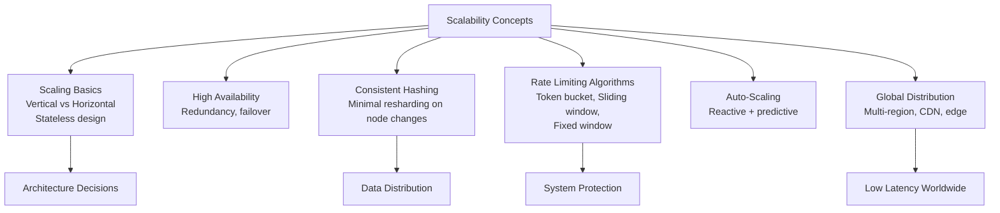

# Scalability Concepts

Core techniques for scaling systems: consistent hashing, rate limiting, global distribution, and more.

```mermaid
graph TD
    CONCEPTS[Scalability Concepts]
    CONCEPTS --> BASICS[Scaling Basics\nVertical vs Horizontal\nStateless design]
    CONCEPTS --> HA[High Availability\nRedundancy, failover]
    CONCEPTS --> CHASH[Consistent Hashing\nMinimal resharding on node changes]
    CONCEPTS --> RATE[Rate Limiting Algorithms\nToken bucket, Sliding window,\nFixed window]
    CONCEPTS --> AUTOSCALE[Auto-Scaling\nReactive + predictive]
    CONCEPTS --> GLOBAL[Global Distribution\nMulti-region, CDN, edge]
    BASICS --> ARCH[Architecture Decisions]
    CHASH --> DATA[Data Distribution]
    RATE --> PROTECT[System Protection]
    GLOBAL --> LATENCY[Low Latency Worldwide]
```
