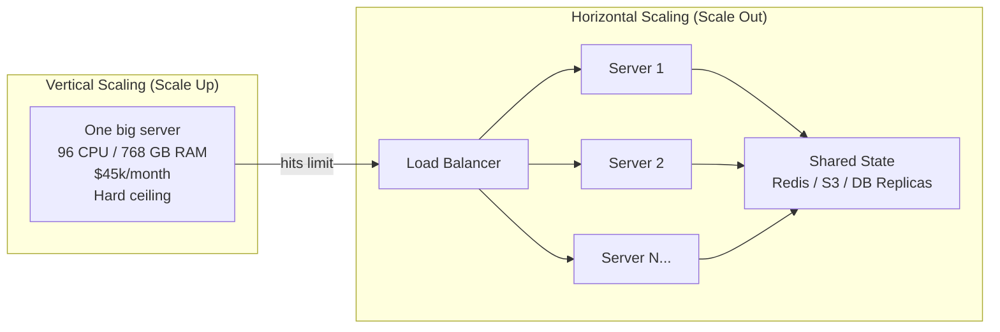

# Scaling Basics - From 100 to 100 Million Users

> **Reading Time:** 20 minutes
> **Difficulty:** Beginner
> **Impact:** Foundation for every scalability decision

## 🗺️ Quick Overview



*Vertical scaling upgrades one machine until it hits a hardware ceiling; horizontal scaling adds identical stateless servers behind a load balancer for effectively unlimited capacity.*

## The Moment Every System Hits the Wall

**Your startup is growing. Then suddenly, it isn't.**

```
Week 1: 100 users, everything fast
Week 4: 1,000 users, still okay ✓
Week 8: 10,000 users, getting slow ⚠️
Week 12: 50,000 users, timeouts everywhere ❌

Server status:
- CPU: 100%
- Memory: 95%
- Response time: 15 seconds
- User complaints: 500+ tickets

"Our app worked FINE last month!"
```

**The question every engineer faces:** Do you buy a bigger server or add more servers?

This decision will define your architecture for years. Choose wrong, and you'll rewrite everything. Choose right, and you'll scale to millions effortlessly.

---

## The $2M Mistake: Instagram's Early Days

**2010: Instagram launches with a single server.**

```
Timeline:
Day 1: 25,000 users sign up (unexpected!)
Day 2: Server crashes repeatedly
Day 7: 1 million users
Day 60: 7 million users

Initial response: "Buy a bigger server!"
- Upgraded from 1 CPU to 8 CPUs
- Upgraded from 8GB to 64GB RAM
- Cost: $15,000/month

Result:
- Still crashing under peak load
- No redundancy (one server = one failure point)
- Scaling ceiling reached
```

**The fix:** They rewrote everything for horizontal scaling.

```
After rewrite:
- 100+ application servers
- 50+ database replicas
- Traffic spread across machines
- Cost: Similar, but infinite scalability
- Any server can fail, system continues
```

**Lesson learned:** Vertical scaling buys time. Horizontal scaling buys freedom.

---

## The Two Paths: Vertical vs Horizontal Scaling

### Vertical Scaling (Scale Up)

**Definition:** Add more power to your existing machine.

```
Before: 4 CPU cores, 16GB RAM, 500GB SSD
After:  32 CPU cores, 256GB RAM, 2TB NVMe

Think: Upgrading from a Honda to a Ferrari
```

**Real-world analogy:**
```
Problem: Restaurant can only serve 50 customers/hour
Vertical solution: Hire one super-chef who cooks 5x faster

Result:
- 250 customers/hour (5x improvement)
- If super-chef is sick, restaurant closes
- Can't hire someone 100x faster (doesn't exist)
```

**Code example:**

```javascript
// Vertical scaling approach
// Single powerful server handles everything

const app = express();

// Single database connection
const db = new PostgreSQL({
  host: 'mega-powerful-db-server.aws.com',
  cpu: 96,      // 96 vCPUs
  memory: 768,  // 768 GB RAM
  storage: 30,  // 30 TB NVMe SSD
  cost: 45000   // $45,000/month
});

// Everything runs on one machine
app.get('/feed', async (req, res) => {
  // All computation on this single server
  const posts = await db.query('SELECT * FROM posts ORDER BY created_at DESC LIMIT 100');
  const users = await db.query('SELECT * FROM users WHERE id IN (...)');
  const comments = await db.query('SELECT * FROM comments WHERE post_id IN (...)');

  res.json(assembleFeed(posts, users, comments));
});

// Maximum capacity: ~10,000 requests/second
// Ceiling: AWS largest instance (u-24tb1.112xlarge = 448 vCPUs, 24TB RAM)
```

### Horizontal Scaling (Scale Out)

**Definition:** Add more machines to your system.

```
Before: 1 server (4 CPU, 16GB)
After:  10 servers (4 CPU, 16GB each) = 40 CPUs, 160GB total

Think: Adding more lanes to a highway
```

**Real-world analogy:**
```
Problem: Restaurant can only serve 50 customers/hour
Horizontal solution: Open 10 identical restaurants

Result:
- 500 customers/hour (10x improvement)
- If one restaurant closes, 9 others continue
- Can open 100 restaurants if needed
```

**Code example:**

```javascript
// Horizontal scaling approach
// Multiple servers share the load

// Load balancer distributes requests
const loadBalancer = {
  servers: [
    'app-server-1.aws.com',
    'app-server-2.aws.com',
    'app-server-3.aws.com',
    // ... can add more anytime
  ],
  algorithm: 'round-robin'
};

// Each server is identical (stateless)
const app = express();

// Shared external services
const cache = new Redis({ cluster: ['redis-1', 'redis-2', 'redis-3'] });
const db = new PostgreSQL({
  primary: 'db-primary.aws.com',
  replicas: ['db-replica-1', 'db-replica-2', 'db-replica-3']
});

app.get('/feed', async (req, res) => {
  // Check distributed cache first
  const cached = await cache.get(`feed:${req.user.id}`);
  if (cached) return res.json(cached);

  // Read from any replica (load distributed)
  const posts = await db.replica.query('SELECT * FROM posts...');

  // Cache for next request
  await cache.set(`feed:${req.user.id}`, posts, 'EX', 60);

  res.json(posts);
});

// Capacity: 10 servers × 1,000 req/s = 10,000 req/s
// Need more? Add servers. Limit: practically unlimited
```

---

## When to Use Each Approach

### Choose Vertical Scaling When:

| Scenario | Why Vertical |
|----------|--------------|
| Startup/MVP phase | Simpler architecture, faster iteration |
| < 10,000 users | Overhead of distributed systems not worth it |
| CPU-intensive workloads | Some tasks don't parallelize well |
| Database performance issues | Bigger database server often faster than sharding |
| Quick fix needed | Upgrade in hours, not days/weeks |

**Example:** Early-stage startup

```javascript
// Simple vertical architecture
// Perfect for MVP and early growth

// Monolithic app on single server
const app = express();
const db = require('./database'); // Local PostgreSQL

// All features in one codebase
app.use('/api/users', require('./routes/users'));
app.use('/api/posts', require('./routes/posts'));
app.use('/api/comments', require('./routes/comments'));

// Deploy: Push to one server
// Scale: Click "upgrade" in cloud console
// Debug: One place to look
// Cost: $200-500/month
```

### Choose Horizontal Scaling When:

| Scenario | Why Horizontal |
|----------|----------------|
| High availability required | Redundancy = no single point of failure |
| > 100,000 users | Vertical has limits, horizontal doesn't |
| Unpredictable traffic | Auto-scale up/down as needed |
| Global users | Servers in multiple regions |
| Regulatory requirements | Data residency per country |

**Example:** Production system at scale

```javascript
// Horizontal architecture for scale
// Used by companies at 1M+ users

// Stateless application servers (any server can handle any request)
const app = express();

// External session storage (not on app server)
const sessionStore = new RedisStore({ client: redisClient });
app.use(session({ store: sessionStore }));

// External file storage (not on app server)
const fileStorage = new S3({ bucket: 'user-uploads' });

// External cache (not on app server)
const cache = new Redis({ cluster: true });

// Database with read replicas
const db = {
  write: new PostgreSQL({ host: 'primary.db.aws.com' }),
  read: new PostgreSQL({
    hosts: ['replica-1.db.aws.com', 'replica-2.db.aws.com'],
    loadBalance: true
  })
};

// Now you can run 100 identical app servers
// Load balancer distributes traffic automatically
```

---

## The Real Answer: Use Both

**Every successful company uses hybrid scaling:**

```
Phase 1: Vertical (0 → 50K users)
  └── Single powerful server
  └── Focus on product, not infrastructure

Phase 2: Hybrid (50K → 500K users)
  └── Multiple app servers (horizontal)
  └── Single database (vertical - upgrade it)
  └── Add caching layer (Redis)

Phase 3: Full Horizontal (500K → 10M+ users)
  └── Many app servers
  └── Database sharding/replicas
  └── CDN for static content
  └── Regional deployments
```

### Twitter's Evolution

```
2006 (Launch):
- 1 Ruby on Rails server
- 1 MySQL database
- Vertical scaling: "Buy bigger servers"

2008 (Growing pains):
- "Fail Whale" became famous
- Still mostly vertical
- Added some caching

2010 (Scale out):
- Migrated to distributed architecture
- Horizontal app servers
- Database partitioning by user ID
- Custom message queue system

2012 (Massive scale):
- 500M+ tweets/day
- Manhattan distributed database
- Fully horizontal architecture
- Can handle 143,199 tweets/second (World Cup record)
```

---

## The Scaling Decision Framework

Use this flowchart for every scaling decision:

```
                     ┌─────────────────┐
                     │ Performance     │
                     │ Problem?        │
                     └────────┬────────┘
                              │
              ┌───────────────┴───────────────┐
              │                               │
              ▼                               ▼
        ┌─────────────┐               ┌─────────────┐
        │ Quick fix   │               │ Long-term   │
        │ needed?     │               │ solution?   │
        └──────┬──────┘               └──────┬──────┘
               │                              │
               ▼                              ▼
     ┌─────────────────┐           ┌─────────────────────┐
     │ VERTICAL SCALE  │           │ Need high           │
     │ - Upgrade CPU   │           │ availability?       │
     │ - Add RAM       │           └──────────┬──────────┘
     │ - Faster SSD    │                      │
     └─────────────────┘           ┌──────────┴──────────┐
                                   │ YES                 │ NO
                                   ▼                     ▼
                        ┌──────────────────┐  ┌──────────────────┐
                        │ HORIZONTAL SCALE │  │ VERTICAL first,  │
                        │ - Add servers    │  │ then horizontal  │
                        │ - Load balance   │  │ when needed      │
                        │ - Distribute DB  │  └──────────────────┘
                        └──────────────────┘
```

---

## Side-by-Side Comparison

| Aspect | Vertical Scaling | Horizontal Scaling |
|--------|-----------------|-------------------|
| **Cost** | Expensive (exponential) | Linear (more machines = more cost) |
| **Complexity** | Simple (one machine) | Complex (distributed systems) |
| **Downtime** | Required for upgrade | Zero downtime scaling |
| **Limit** | Hardware ceiling | Practically unlimited |
| **Failure Impact** | Total outage | Partial degradation |
| **Implementation Time** | Hours | Days to weeks |
| **Best For** | Quick fixes, small scale | Large scale, high availability |

### Cost Comparison

```
Vertical Scaling Cost (AWS):

   Users    Instance Type       Monthly Cost
   ─────    ─────────────      ────────────
   1K       t3.medium          $30
   10K      t3.xlarge          $120
   50K      m5.4xlarge         $560
   100K     m5.8xlarge         $1,120
   500K     r5.16xlarge        $4,800
   1M       u-6tb1.56xlarge    $20,000+  ← CEILING

   ⚠️ After u-24tb1.112xlarge ($50,000/mo), you're stuck!


Horizontal Scaling Cost (AWS):

   Users    Setup                Monthly Cost
   ─────    ─────                ────────────
   1K       2 × t3.medium        $60
   10K      5 × t3.medium        $150
   50K      20 × t3.medium       $600
   100K     40 × t3.medium       $1,200
   500K     100 × t3.medium      $3,000
   1M       200 × t3.medium      $6,000
   10M      2000 × t3.medium     $60,000

   ✓ No ceiling! Add more machines as needed
```

---

## How FAANG Companies Scale

### Netflix

```
Architecture:
- 1000s of AWS instances (horizontal)
- Each service can scale independently
- Auto-scaling based on demand
- Regional deployments globally

Key decisions:
- Stateless microservices
- Cache everything (EVCache)
- CDN for video delivery
- Chaos engineering to test failures
```

### Instagram

```
Architecture:
- 100s of Django app servers
- PostgreSQL with heavy sharding
- Memcached cluster for caching
- Gearman for async tasks

Scale:
- 2 billion users
- 95 million photos/day
- Seconds of feed generation per user
```

### Uber

```
Architecture:
- 4000+ microservices
- Horizontal scaling per service
- Geographic distribution
- Real-time location processing

Key insight:
- Started with monolith (vertical)
- Migrated to microservices (horizontal)
- Each service scaled independently
```

---

## Common Mistakes

### Mistake 1: Premature Horizontal Scaling

```javascript
// ❌ Day 1 startup with 100 users
const setup = {
  appServers: 10,
  loadBalancer: true,
  redis: { cluster: true, nodes: 6 },
  db: { shards: 4, replicas: 8 },
  kubernetes: true,
  serviceMesh: true
};

// Result:
// - $10,000/month for 100 users
// - 90% time spent on infrastructure
// - 10% time on product
// - Startup runs out of money

// ✅ Day 1 startup with 100 users
const setup = {
  appServer: 1,  // Single Heroku/Render dyno
  db: 1          // Managed PostgreSQL
};

// Result:
// - $50/month
// - 90% time on product
// - Scale when you have the problem
```

### Mistake 2: Scaling State Instead of Fixing It

```javascript
// ❌ App stores session data locally
// "Solution": Session sticky load balancing

const loadBalancer = {
  type: 'sticky-sessions',
  cookieName: 'SERVERID'
};

// Problems:
// - Uneven load distribution
// - Can't scale down (users stuck)
// - Server failure = session loss

// ✅ Move state out, then scale freely
const app = express();

// Sessions in Redis (external)
app.use(session({
  store: new RedisStore({ client: redis }),
  secret: process.env.SESSION_SECRET
}));

// File uploads to S3 (external)
app.post('/upload', (req, res) => {
  const s3 = new AWS.S3();
  // ... upload to S3, not local disk
});

// Now any server can handle any request
```

### Mistake 3: Ignoring the Database

```javascript
// ❌ Add 100 app servers, keep 1 database
const architecture = {
  appServers: 100,
  loadBalancer: true,
  database: 1  // Bottleneck!
};

// Result:
// - Database becomes bottleneck
// - Connection pool exhaustion
// - All scaling efforts wasted

// ✅ Scale database too
const architecture = {
  appServers: 100,
  loadBalancer: true,
  cache: { redis: true, nodes: 6 },
  database: {
    primary: 1,      // Writes go here
    replicas: 5,     // Reads distributed
    connectionPool: {
      perServer: 5,  // 100 servers × 5 = 500 connections
      maxTotal: 500
    }
  }
};
```

---

## Quick Win: Measure Before You Scale

**Before any scaling, know your bottleneck:**

```bash
# 1. Check what's actually slow
# Is it CPU? Memory? Disk? Network? Database?

# CPU bound?
top -bn1 | grep "Cpu(s)"
# If CPU > 80%, you need more compute

# Memory bound?
free -m
# If memory > 90%, you need more RAM or fewer processes

# Disk bound?
iostat -x 1 5
# If %util > 80%, you need faster disk or less disk I/O

# Database slow?
# Check slow query logs
tail -f /var/log/postgresql/postgresql-slow.log

# Network bound?
iftop
# If saturated, you need more bandwidth or CDN
```

**Quick metrics to collect:**

```javascript
// Add basic metrics to your app (5 minutes)
const metrics = {
  requestCount: 0,
  totalResponseTime: 0,
  dbQueryTime: 0,
  externalApiTime: 0
};

app.use((req, res, next) => {
  const start = Date.now();
  res.on('finish', () => {
    metrics.requestCount++;
    metrics.totalResponseTime += Date.now() - start;

    // Log every 100 requests
    if (metrics.requestCount % 100 === 0) {
      console.log({
        avgResponseTime: metrics.totalResponseTime / metrics.requestCount,
        requestsPerMinute: metrics.requestCount / ((Date.now() - startTime) / 60000)
      });
    }
  });
  next();
});
```

---

## Key Takeaways

1. **Start simple:** Use vertical scaling until you hit limits
2. **Move state out:** Sessions, files, cache → external services
3. **Add horizontal when needed:** High availability or scale limits
4. **Measure first:** Know your bottleneck before scaling
5. **Both are valid:** Every large system uses hybrid approaches

## Scaling Milestones Cheat Sheet

| Users | Architecture | Key Actions |
|-------|-------------|-------------|
| 0-10K | Single server | Focus on product |
| 10K-100K | Add caching, read replicas | Optimize queries |
| 100K-1M | Multiple app servers, CDN | Go horizontal |
| 1M-10M | Microservices, sharding | Distribute database |
| 10M+ | Multi-region, event-driven | Global architecture |

---

## Related Resources

- [Stateless Architecture](./stateless-architecture.md) - Enable horizontal scaling
- [High Availability](./high-availability.md) - Eliminate single points of failure
- [Database Scaling](../databases/scaling.md) - Replicas and sharding
- [Load Balancing Strategies](../load-balancing/strategies.md) - Distribute traffic

---

## Practice POCs

Test these concepts hands-on:

- [POC #66: Round-Robin Load Balancing](/interview-prep/practice-pocs/load-balancer-round-robin)
- [POC #68: Consistent Hashing](/interview-prep/practice-pocs/load-balancer-consistent-hashing)
- [POC #70: NGINX Load Balancer](/interview-prep/practice-pocs/nginx-load-balancer)
