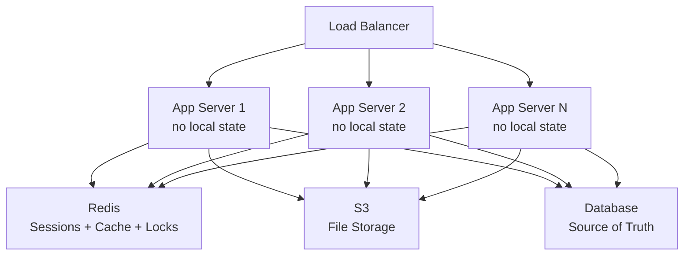

# Stateless Architecture - The Secret to Infinite Scalability

> **Reading Time:** 18 minutes
> **Difficulty:** Beginner
> **Impact:** Enables horizontal scaling and zero-downtime deployments

## 🗺️ Quick Overview



*All app servers are identical and store nothing locally — sessions, files, and cache live in shared external services so any server can handle any request.*

## Why Your App Dies at 3x Traffic

**Thursday night. Product Hunt launch. Traffic 5x normal.**

```
9:00 PM - Feature launches, traffic spikes
9:05 PM - 60% of requests start failing
9:10 PM - Users reporting "session expired"
9:15 PM - Random logouts, lost shopping carts
9:20 PM - Site becomes unusable

Server logs:
"Session not found: abc123"
"User authentication failed"
"Cart data missing for user 456"
```

**What went wrong?**

Your load balancer sent users to different servers. Each server had its own session data. Server 1 created the session, Server 2 never saw it.

**The fix:** Stateless architecture. This single change lets you scale to millions.

---

## The $3M Cart Abandonment Bug

**Real Incident: E-Commerce Black Friday**

```
Background:
- E-commerce site, $50M annual revenue
- 3 app servers behind load balancer
- Sessions stored locally on each server

Black Friday:
- Traffic 10x normal
- Added 7 more servers (10 total)
- Load balancer using round-robin

What happened:
Request 1 (Server 1): User logs in → Session created on Server 1
Request 2 (Server 4): User adds to cart → "Please log in again"
Request 3 (Server 7): User tries again → "Session not found"
Request 4 (Server 2): User gives up → Buys from competitor

Impact:
- 40% cart abandonment rate (vs normal 15%)
- Lost revenue: $3M in one day
- Customer support overwhelmed
- Brand reputation damaged
```

**Root cause:** Stateful servers. Session lived on one server, requests went to all servers.

---

## What Is Stateless Architecture?

### Stateful vs Stateless

**Stateful Server:**
```
Server 1:                    Server 2:
┌──────────────────────┐    ┌──────────────────────┐
│  Application Code    │    │  Application Code    │
├──────────────────────┤    ├──────────────────────┤
│  Sessions:           │    │  Sessions:           │
│  - user_abc: {...}   │    │  - user_xyz: {...}   │
│  - user_def: {...}   │    │  (different users!)  │
├──────────────────────┤    ├──────────────────────┤
│  Cache:              │    │  Cache:              │
│  - product_123: {...}│    │  - product_456: {...}│
│  (different data!)   │    │  (different data!)   │
└──────────────────────┘    └──────────────────────┘

Problem: Users MUST go back to same server!
         Load balancing becomes a nightmare.
```

**Stateless Server:**
```
Server 1:                    Server 2:
┌──────────────────────┐    ┌──────────────────────┐
│  Application Code    │    │  Application Code    │
│  (identical)         │    │  (identical)         │
└──────────────────────┘    └──────────────────────┘
        ↓                           ↓
        └──────────┬────────────────┘
                   ↓
┌─────────────────────────────────────────────────┐
│         External Shared State                   │
├─────────────────────────────────────────────────┤
│  Redis: Sessions for ALL users                  │
│  S3: Files for ALL users                        │
│  PostgreSQL: Data for ALL users                 │
└─────────────────────────────────────────────────┘

Any server can handle any request!
```

---

## The Three Types of State You Must Externalize

### 1. Session State

**The Problem:**

```javascript
// ❌ Sessions stored on local server
const express = require('express');
const session = require('express-session');
const app = express();

app.use(session({
  secret: 'keyboard-cat',
  resave: false,
  saveUninitialized: true
  // Default: MemoryStore (on this server only!)
}));

app.post('/login', (req, res) => {
  req.session.userId = user.id;  // Saved on THIS server
  res.redirect('/dashboard');
});

app.get('/dashboard', (req, res) => {
  // Only works if request hits same server!
  if (!req.session.userId) {
    return res.redirect('/login');  // User confused: "I just logged in!"
  }
  res.render('dashboard');
});
```

**The Solution:**

```javascript
// ✅ Sessions stored in Redis (external)
const express = require('express');
const session = require('express-session');
const RedisStore = require('connect-redis').default;
const Redis = require('ioredis');

const redis = new Redis({
  host: 'redis.internal.aws.com',
  port: 6379,
  password: process.env.REDIS_PASSWORD
});

const app = express();

app.use(session({
  store: new RedisStore({ client: redis }),
  secret: 'keyboard-cat',
  resave: false,
  saveUninitialized: false,
  cookie: { secure: true, maxAge: 86400000 }  // 24 hours
}));

// Now sessions work across ALL servers!
// Redis stores: "sess:abc123" → { userId: 42, cart: [...] }
```

### 2. File Storage

**The Problem:**

```javascript
// ❌ Files stored on local disk
const multer = require('multer');
const path = require('path');

const storage = multer.diskStorage({
  destination: '/var/uploads/',  // On THIS server only!
  filename: (req, file, cb) => {
    cb(null, Date.now() + path.extname(file.originalname));
  }
});

app.post('/upload', upload.single('avatar'), (req, res) => {
  // File saved to /var/uploads/1234567890.jpg on Server 1
  const fileUrl = `/uploads/${req.file.filename}`;
  res.json({ url: fileUrl });
});

app.get('/uploads/:filename', (req, res) => {
  // Only works if request hits Server 1!
  // Server 2 returns 404!
  res.sendFile(`/var/uploads/${req.params.filename}`);
});
```

**The Solution:**

```javascript
// ✅ Files stored in S3 (external)
const AWS = require('aws-sdk');
const multer = require('multer');
const multerS3 = require('multer-s3');

const s3 = new AWS.S3({
  accessKeyId: process.env.AWS_ACCESS_KEY,
  secretAccessKey: process.env.AWS_SECRET_KEY,
  region: 'us-east-1'
});

const upload = multer({
  storage: multerS3({
    s3: s3,
    bucket: 'my-app-uploads',
    acl: 'public-read',
    key: (req, file, cb) => {
      cb(null, `avatars/${Date.now()}-${file.originalname}`);
    }
  })
});

app.post('/upload', upload.single('avatar'), (req, res) => {
  // File saved to S3, accessible from anywhere!
  res.json({ url: req.file.location });
  // Returns: https://my-app-uploads.s3.amazonaws.com/avatars/123-photo.jpg
});

// No need for /uploads route - S3 serves files directly!
```

### 3. Cache Data

**The Problem:**

```javascript
// ❌ Cache stored in local memory
const cache = new Map();  // Lives only on this server!

app.get('/products/:id', async (req, res) => {
  const cacheKey = `product:${req.params.id}`;

  if (cache.has(cacheKey)) {
    return res.json(cache.get(cacheKey));  // Only if same server!
  }

  const product = await db.query('SELECT * FROM products WHERE id = $1', [req.params.id]);
  cache.set(cacheKey, product);  // Cached on THIS server only

  res.json(product);
});

// Problem: 5 servers = 5 separate caches
// - Wasted memory (same data cached 5 times)
// - Cache inconsistency (update on Server 1, stale on Server 2-5)
// - Poor cache hit rate (user bounces between servers)
```

**The Solution:**

```javascript
// ✅ Cache stored in Redis (external)
const Redis = require('ioredis');
const redis = new Redis('redis://redis.internal.aws.com:6379');

app.get('/products/:id', async (req, res) => {
  const cacheKey = `product:${req.params.id}`;

  // Check shared cache
  const cached = await redis.get(cacheKey);
  if (cached) {
    return res.json(JSON.parse(cached));  // Works from any server!
  }

  const product = await db.query('SELECT * FROM products WHERE id = $1', [req.params.id]);

  // Cache for all servers
  await redis.setex(cacheKey, 3600, JSON.stringify(product));

  res.json(product);
});

// Benefits:
// - One cache for all servers
// - Consistent data everywhere
// - 90%+ cache hit rate
// - Easy invalidation
```

---

## The Stateless Transformation Checklist

| State Type | Stateful (Bad) | Stateless (Good) |
|------------|----------------|------------------|
| Sessions | In-memory store | Redis/Memcached |
| User files | Local filesystem | S3/GCS/Azure Blob |
| Temp files | /tmp directory | S3 with TTL or Redis |
| Cache | In-process memory | Redis/Memcached |
| Locks | Local mutexes | Redis distributed locks |
| Scheduled jobs | Cron on one server | External scheduler (SQS, Cloud Tasks) |
| WebSocket connections | Local server | Redis Pub/Sub for coordination |

---

## How Netflix Went Stateless

```
2008 (Stateful era):
- Monolithic Java application
- Sessions on local servers
- Sticky sessions required
- Scaling: painful, limited

2009-2012 (Stateless migration):

Step 1: Externalized sessions
- Moved from in-memory to EVCache (Netflix's Memcached)
- Any server could handle any request

Step 2: Externalized storage
- Moved from local disk to S3
- Enabled cross-region redundancy

Step 3: Externalized cache
- EVCache clusters per region
- Consistent caching across servers

Step 4: Stateless microservices
- Broke monolith into 700+ services
- Each service completely stateless
- Auto-scaling per service

Result:
- 200M+ subscribers
- 125M hours streamed daily
- Zero-downtime deployments
- Scale any service independently
```

---

## Stateless Enables These Superpowers

### 1. Zero-Downtime Deployments

```
Stateful deployment:
1. Drain sessions from server (wait for users to finish)
2. Update server
3. Hope nothing breaks
4. Repeat for each server

Problem: Long deployments, user disruption

Stateless deployment:
1. Deploy new version to new servers
2. Load balancer shifts traffic gradually (blue-green)
3. Old servers terminate when idle
4. Rollback: shift traffic back

Time: Minutes instead of hours
Risk: Nearly zero
```

### 2. Auto-Scaling

```javascript
// AWS Auto Scaling with stateless servers

const autoScalingPolicy = {
  minInstances: 2,
  maxInstances: 100,
  targetCPUUtilization: 70,
  scaleUpCooldown: 60,      // Wait 60s after scale up
  scaleDownCooldown: 300    // Wait 5min after scale down
};

// 9 AM: Traffic spike
// - CPU hits 80%
// - Auto scaling adds 10 servers
// - New servers immediately ready (no state to transfer)
// - Load balanced within seconds

// 2 AM: Traffic drops
// - CPU at 20%
// - Auto scaling removes 8 servers
// - No "session draining" needed
// - Cost savings: $800/day
```

### 3. Fault Tolerance

```
Stateful:
Server 1 dies → All users on Server 1 lose sessions
                Cart data gone
                "Please log in again"
                Angry customers

Stateless:
Server 1 dies → Load balancer routes to Server 2-10
                Sessions in Redis (intact)
                Cart data in Redis (intact)
                Users don't notice
                Automatic recovery
```

### 4. Multi-Region Deployment

```
              US-East              US-West              EU-West
         ┌─────────────┐      ┌─────────────┐      ┌─────────────┐
         │  LB → Apps  │      │  LB → Apps  │      │  LB → Apps  │
         └──────┬──────┘      └──────┬──────┘      └──────┬──────┘
                │                    │                    │
                └────────────────────┼────────────────────┘
                                     │
                        ┌────────────┴────────────┐
                        │    Global State Layer   │
                        ├─────────────────────────┤
                        │  Redis: ElastiCache     │
                        │     Global Replication  │
                        │  S3: Cross-region       │
                        │     Replication         │
                        │  DB: Aurora Global      │
                        └─────────────────────────┘

User in Tokyo → Routes to US-West (closest)
US-West servers down? → Routes to US-East (automatic)
No user impact, no session loss
```

---

## Common Pitfalls and Solutions

### Pitfall 1: "We'll Just Use Sticky Sessions"

```
"Sticky sessions" = Load balancer sends user to same server

Why it seems smart:
- Quick fix for stateful apps
- No code changes needed

Why it fails:

Problem 1: Uneven load
  Server 1: 1000 users (busy sessions)
  Server 2: 100 users (quick visits)
  Server 3: 50 users (mostly idle)
  → Server 1 overwhelmed, 2 and 3 underutilized

Problem 2: Can't scale down
  Server 1 has 500 active sessions
  Want to remove Server 1?
  Must wait hours for sessions to expire
  → Slow, expensive scaling

Problem 3: Server failure = user loss
  Server 1 crashes
  500 users lose sessions immediately
  → Poor user experience

Better solution: Make app stateless, remove stickiness
```

### Pitfall 2: Storing Too Much in Session

```javascript
// ❌ Bloated session
req.session = {
  userId: 42,
  username: 'john',
  email: 'john@example.com',
  preferences: { theme: 'dark', language: 'en', ... },  // 2KB
  cart: [{ id: 1, ... }, { id: 2, ... }, ...],  // 10KB
  recentlyViewed: [...],  // 5KB
  recommendations: [...],  // 20KB
  fullUserProfile: { ... }  // 50KB
};

// Problem: 87KB per session × 100,000 users = 8.7GB in Redis
// Redis cost: $500/month just for bloated sessions!

// ✅ Minimal session
req.session = {
  userId: 42  // Just the ID, 10 bytes
};

// Fetch other data when needed
app.get('/cart', async (req, res) => {
  const cart = await redis.get(`cart:${req.session.userId}`);
  res.json(cart);
});

// Session: 10 bytes × 100,000 = 1MB
// Cart stored separately, fetched only when needed
```

### Pitfall 3: Forgetting WebSocket State

```javascript
// ❌ WebSocket connections are stateful by nature
// User connects to Server 1, only Server 1 can send messages

wss.on('connection', (ws, req) => {
  const userId = getUserId(req);
  connectedUsers.set(userId, ws);  // Local to this server!
});

function sendToUser(userId, message) {
  const ws = connectedUsers.get(userId);  // Only works if user on this server
  if (ws) ws.send(message);
}

// ✅ Use Redis Pub/Sub for WebSocket coordination
const Redis = require('ioredis');
const pub = new Redis();
const sub = new Redis();

// Subscribe to messages for users on THIS server
sub.subscribe('user-messages');
sub.on('message', (channel, data) => {
  const { userId, message } = JSON.parse(data);
  const ws = connectedUsers.get(userId);
  if (ws) ws.send(message);  // Forward if user connected here
});

function sendToUser(userId, message) {
  // Publish to ALL servers
  pub.publish('user-messages', JSON.stringify({ userId, message }));
  // The server with the connection will deliver it
}
```

---

## Migration Strategy: 4 Steps to Stateless

### Step 1: Audit Current State

```bash
# Find all places you store state

# Sessions
grep -r "session\[" --include="*.js" .
grep -r "req\.session" --include="*.js" .

# File storage
grep -r "fs\.write" --include="*.js" .
grep -r "multer\.diskStorage" --include="*.js" .

# In-memory cache
grep -r "new Map()" --include="*.js" .
grep -r "cache\[" --include="*.js" .

# Create inventory:
# - Sessions: express-session with MemoryStore
# - Files: /var/uploads/
# - Cache: global Map objects
# - Scheduled jobs: node-cron
```

### Step 2: Set Up External Services

```yaml
# docker-compose.yml for development

services:
  redis:
    image: redis:7
    ports:
      - "6379:6379"

  minio:  # S3-compatible storage for development
    image: minio/minio
    ports:
      - "9000:9000"
    environment:
      MINIO_ROOT_USER: minioadmin
      MINIO_ROOT_PASSWORD: minioadmin
    command: server /data
```

### Step 3: Migrate One Component at a Time

```javascript
// Week 1: Sessions
// Before: MemoryStore
// After: RedisStore

// Week 2: File uploads
// Before: local disk
// After: S3

// Week 3: Cache
// Before: in-memory Map
// After: Redis

// Week 4: Background jobs
// Before: node-cron
// After: BullMQ with Redis

// Each week: test, deploy, monitor
```

### Step 4: Remove Sticky Sessions

```nginx
# Before: Sticky sessions
upstream app_servers {
    ip_hash;  # Sticky based on IP
    server app1:3000;
    server app2:3000;
}

# After: True load balancing
upstream app_servers {
    least_conn;  # Send to least busy server
    server app1:3000;
    server app2:3000;
    server app3:3000;
}
```

---

## Quick Win: Make Your App Stateless in 30 Minutes

**Minimum changes for immediate benefits:**

```javascript
// 1. Add Redis for sessions (10 minutes)
npm install connect-redis ioredis

const RedisStore = require('connect-redis').default;
const Redis = require('ioredis');

const redis = new Redis(process.env.REDIS_URL || 'redis://localhost:6379');

app.use(session({
  store: new RedisStore({ client: redis }),
  secret: process.env.SESSION_SECRET,
  resave: false,
  saveUninitialized: false
}));

// 2. Use S3 for file uploads (15 minutes)
npm install @aws-sdk/client-s3 multer-s3

const { S3Client } = require('@aws-sdk/client-s3');
const multerS3 = require('multer-s3');

const s3 = new S3Client({ region: process.env.AWS_REGION });
const upload = multer({
  storage: multerS3({
    s3,
    bucket: process.env.S3_BUCKET,
    key: (req, file, cb) => cb(null, `${Date.now()}-${file.originalname}`)
  })
});

// 3. Test by running 2 instances (5 minutes)
# Terminal 1
PORT=3000 node app.js

# Terminal 2
PORT=3001 node app.js

# Test: Login on :3000, verify session works on :3001
```

---

## Key Takeaways

1. **Stateless = Scalable**: Any server can handle any request
2. **Externalize everything**: Sessions, files, cache → Redis/S3
3. **Kill sticky sessions**: They're a scaling trap
4. **Enable superpowers**: Zero-downtime deploys, auto-scaling, fault tolerance
5. **Migrate gradually**: One component at a time

## The Stateless Mantra

```
If a server dies at 3 AM:
- Should users notice? NO
- Should sessions be lost? NO
- Should data be affected? NO
- Should you wake up? NO

This is only possible with stateless architecture.
```

---

## Related Resources

- [Scaling Basics](./scaling-basics.md) - Vertical vs horizontal scaling
- [High Availability](./high-availability.md) - Eliminate single points of failure
- [Connection Pool Management](../performance/connection-pool-management.md) - External connection state

---

## Practice POCs

- [POC #6: Redis Session Management](/03-redis/hands-on/redis-session-management)
- [POC #3: Redis Distributed Lock](/03-redis/hands-on/redis-distributed-lock)
- [POC #64: Redis Cluster Caching](/03-redis/hands-on/redis-cluster-caching)
