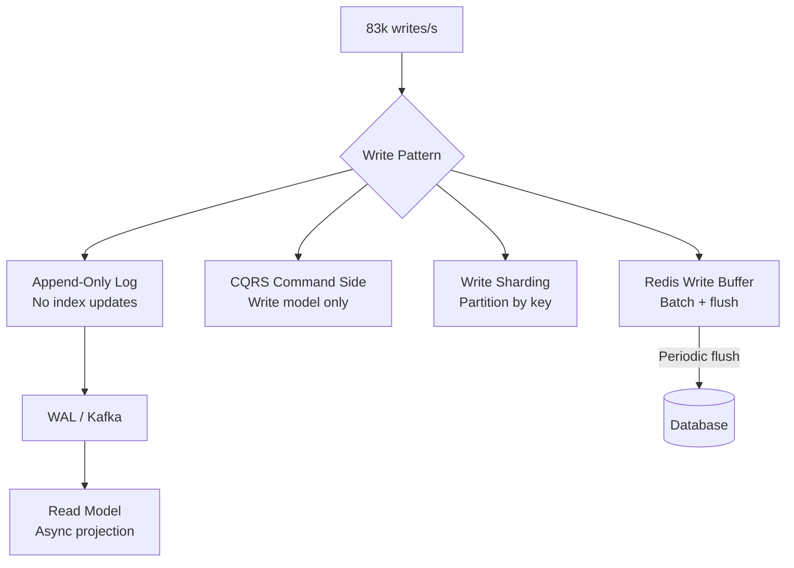
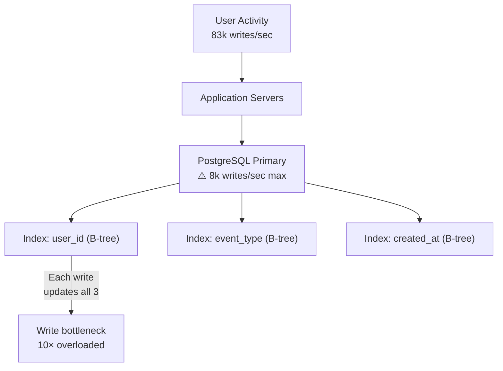
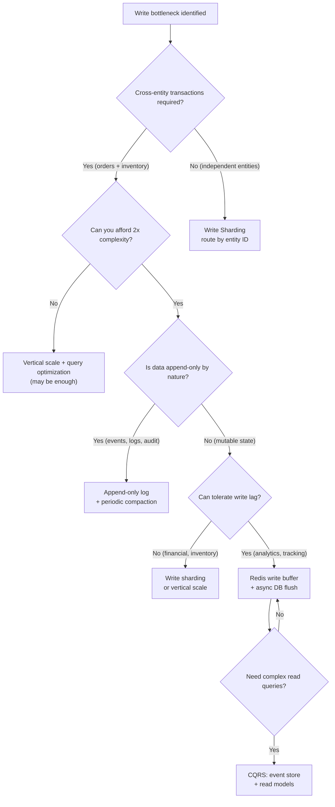

# Write Scaling: Append-Only, CQRS, Event Sourcing, and Write Sharding

## 🗺️ Quick Overview



*High write throughput requires moving beyond a single primary — append-only logs, CQRS, sharding, and Redis buffering are the four canonical patterns.*

**Read scaling is straightforward: add replicas. Write scaling is where things get hard — every write must eventually touch a primary, and primaries don't scale horizontally without fundamental architectural changes.**

The good news: most write bottlenecks are solved by one of four patterns. The bad news: each pattern comes with a complexity tax that most teams underestimate.

---

## The Problem Class `[Mid]`

Your SaaS platform tracks user activity: every click, page view, form submission, and API call gets written to a `user_events` table. At 100,000 active users generating 50 events/minute each, that's 83,000 writes/second to a single PostgreSQL table.

```
Activity tracking writes:
  83,000 INSERT/s to user_events table

PostgreSQL single-node write capacity:
  Simple INSERTs with WAL: ~20,000-40,000/s on good hardware
  With indexes: drops to ~5,000-10,000/s (each write updates B-tree)

Gap: 83,000 required vs. ~8,000 achievable = 10× write bottleneck
```

Vertical scaling helps but doesn't close the 10× gap. Adding a bigger machine takes you from 8k to maybe 15k writes/second — not 83k.



Each INSERT must update every index. With 3 indexes on `user_events`, each write does 4 disk operations (heap + 3 B-tree updates). Index maintenance is the primary write bottleneck — not the insert itself.

> 💡 **What this means in practice:** Adding a new index to your table can cut your write throughput in half. Before adding an index, ask: "Which queries actually need this?" Every index has a write tax.

---

## Why the Obvious Solution Fails `[Senior]`

### Just Write to Multiple Primaries

MySQL Group Replication and PostgreSQL BDR (Bi-Directional Replication) offer multi-primary writes. The problem: write conflicts. When two nodes write to the same row simultaneously, one must be rolled back. At high write rates, conflict resolution overhead eliminates most of the throughput gain.

```
Conflict rate at N primaries:
  Probability of conflict = (writes_per_second × transaction_duration) / total_rows

  At 80k writes/s, 10ms avg transaction, 10M rows:
  Conflict rate = (80k × 0.01) / 10M = 0.008% per write

  Sounds small, but: 80k writes/s × 0.008% = 6.4 conflicts/second
  Each conflict requires: detection, rollback, retry, re-execute
  At 10ms per retry cycle: 6.4 × 10ms = 64ms of wasted CPU/s
  → Actual throughput gain: ~30% (not the expected 100% for 2 primaries)
```

Multi-master writes work well only when write sets are naturally partitioned (different users write to different rows). If uncontrolled, conflict rates make multi-master worse than a single primary.

---

## The Solution Landscape `[Senior]`

### Solution 1: Write Sharding (Tenant/Region-Based)

**What it is**

Partition your write traffic across multiple independent primary databases. Each shard handles a subset of the data. Writes go to the correct shard based on a routing key.

```
User activity tracking — shard by user_id:
  Shard 0: user_id % 4 = 0 → primary-0.db.internal
  Shard 1: user_id % 4 = 1 → primary-1.db.internal
  Shard 2: user_id % 4 = 2 → primary-2.db.internal
  Shard 3: user_id % 4 = 3 → primary-3.db.internal

Write throughput:
  1 shard:  ~8,000 writes/s
  4 shards: ~32,000 writes/s
  16 shards: ~128,000 writes/s (exceeds our 83k requirement)
```

```python
# Write sharding router
class ShardedDatabaseRouter:
    def __init__(self, shard_count: int, shard_connections: list):
        self.shard_count = shard_count
        self.shards = shard_connections

    def get_shard(self, shard_key: str) -> object:
        # Consistent shard assignment based on key
        shard_id = hash(shard_key) % self.shard_count
        return self.shards[shard_id]

    def write_event(self, user_id: str, event_data: dict):
        shard = self.get_shard(user_id)
        shard.execute(
            "INSERT INTO user_events (user_id, event_type, data, created_at) VALUES (%s, %s, %s, NOW())",
            (user_id, event_data['type'], json.dumps(event_data))
        )

    def read_user_events(self, user_id: str) -> list:
        # Reads go to the same shard as writes — consistent routing
        shard = self.get_shard(user_id)
        return shard.execute(
            "SELECT * FROM user_events WHERE user_id = %s ORDER BY created_at DESC LIMIT 100",
            (user_id,)
        ).fetchall()
```

**Sizing guidance** `[Staff+]`

```
Shard count formula:
  shards = ceil(peak_writes_per_second / single_shard_capacity × safety_factor)

  safety_factor = 1.5 (headroom for growth and hot shards)
  single_shard_capacity = 8,000 writes/s (conservative)

  For 83,000 writes/s:
  shards = ceil(83,000 / 8,000 × 1.5) = ceil(15.6) = 16 shards

Hot shard detection:
  With Zipf distribution, some shards receive more writes than others
  Monitor per-shard write QPS; alert if any shard > 2× mean

Cross-shard query cost:
  "Get events for all users in org X" → must query all shards and merge
  If cross-shard queries are common, consider shard key = org_id (not user_id)

Shard expansion cost:
  Going from 16 → 32 shards requires migrating 50% of data
  Plan shard count for 3-5 years ahead; expensive to change
```

**Configuration decisions that matter** `[Staff+]`

- Choose shard key based on your most common access pattern, not just write distribution
- Avoid hot shard keys: user_id is usually good (uniform); country_code is bad (US has 40% of traffic)
- Use a shard registry (database or config service) instead of computing shard ID in app code — allows rebalancing without deployment

**Failure modes** `[Staff+]`

- **Uneven shard load**: If your product goes viral in Germany, all German users might hash to shard 3. Mitigation: use consistent hashing with virtual nodes so load redistributes naturally.
- **Cross-shard transactions**: Sharding eliminates ACID guarantees across shard boundaries. A write that touches two shards requires 2-phase commit or saga pattern — significant complexity.
- **Schema migrations**: A schema change must be applied to all N shards. Requires blue-green deployment per shard or online schema change tools (pt-online-schema-change, gh-ost).

---

### Solution 2: Append-Only Log (No In-Place Updates)

**What it is**

Instead of updating rows, only insert new rows. Every state change is a new record. The "current state" is derived by reading all historical records for an entity.

```sql
-- Traditional (in-place update):
UPDATE user_preferences SET theme = 'dark' WHERE user_id = 123;

-- Append-only:
INSERT INTO user_preference_events
  (user_id, key, value, changed_at)
VALUES (123, 'theme', 'dark', NOW());

-- Current state = latest value per key
SELECT DISTINCT ON (key) key, value
FROM user_preference_events
WHERE user_id = 123
ORDER BY key, changed_at DESC;
```

**Why this helps write throughput:**

```
Traditional UPDATE:
  1. Find row (index lookup)
  2. Lock row
  3. Write new value
  4. Update indexes (potentially multiple)
  5. Write to WAL
  6. Release lock

Append-only INSERT:
  1. Write new row (sequential)
  2. Write to WAL (sequential)

Sequential writes are 5-10× faster than random-access updates.
PostgreSQL INSERT: ~50,000-100,000/s (simple, no FK checks)
PostgreSQL UPDATE: ~10,000-20,000/s (requires row lookup + lock)
```

**Compaction strategy:**

```python
# Periodic compaction to prevent unbounded table growth
class AppendOnlyStore:
    def __init__(self, db):
        self.db = db

    def write_preference(self, user_id: int, key: str, value: str):
        # Simple append — very fast
        self.db.execute(
            "INSERT INTO user_preference_events (user_id, key, value, ts) VALUES (%s, %s, %s, NOW())",
            (user_id, key, value)
        )

    def read_current(self, user_id: int) -> dict:
        rows = self.db.execute(
            "SELECT DISTINCT ON (key) key, value FROM user_preference_events "
            "WHERE user_id = %s ORDER BY key, ts DESC",
            (user_id,)
        ).fetchall()
        return {row['key']: row['value'] for row in rows}

    def compact(self, older_than_days: int = 30):
        # Periodically collapse historical events into a snapshot
        # Run as background job during off-peak hours
        self.db.execute("""
            WITH latest AS (
                SELECT DISTINCT ON (user_id, key) user_id, key, value, ts
                FROM user_preference_events
                ORDER BY user_id, key, ts DESC
            )
            INSERT INTO user_preference_snapshots (user_id, preferences, snapshot_at)
            SELECT user_id, jsonb_object_agg(key, value), MAX(ts)
            FROM latest GROUP BY user_id
            ON CONFLICT (user_id) DO UPDATE SET preferences = EXCLUDED.preferences
        """)
        self.db.execute(
            "DELETE FROM user_preference_events WHERE ts < NOW() - INTERVAL '%s days'",
            (older_than_days,)
        )
```

> 💡 **What this means in practice:** Append-only is how most modern data systems (Kafka, Cassandra SSTable, PostgreSQL WAL) achieve high write throughput internally. The trick is compaction — periodically collapsing history into snapshots so you don't scan 10 years of records to find current state.

**Sizing guidance** `[Staff+]`

```
Table growth rate:
  events_per_day = active_users × avg_changes_per_user_per_day
  avg_row_size ≈ 200 bytes

  1M users, 10 changes/day: 10M rows/day = 2GB/day
  Without compaction: 730GB/year
  With daily compaction (keep last 30 days): ~60GB steady state

Compaction schedule:
  Run during lowest write window (typically 2-5 AM)
  Duration: depends on table size; test in staging first
  Monitor: table bloat (dead tuples) using pg_stat_user_tables.n_dead_tup
```

---

### Solution 3: Redis as Write Buffer (Write-Behind Cache)

**What it is**

Accept writes into Redis (in-memory, extremely fast), then asynchronously flush them to the database in batches. This absorbs write spikes without overwhelming the database.

```python
# Write-behind cache with Redis
import redis
import json
import time
import threading

class WriteBehindBuffer:
    def __init__(self, redis_client, db_connection, flush_interval: float = 1.0,
                 max_buffer_size: int = 10000):
        self.redis = redis_client
        self.db = db_connection
        self.buffer_key = "write_buffer:user_events"
        self.flush_interval = flush_interval
        self.max_buffer_size = max_buffer_size
        self._start_flush_worker()

    def write_event(self, user_id: str, event_type: str, data: dict):
        event = {
            'user_id': user_id,
            'event_type': event_type,
            'data': data,
            'created_at': time.time()
        }
        # Atomic push to Redis list — extremely fast (< 0.1ms)
        pipe = self.redis.pipeline()
        pipe.rpush(self.buffer_key, json.dumps(event))
        pipe.llen(self.buffer_key)
        _, buffer_size = pipe.execute()

        # If buffer is full, flush immediately (backpressure)
        if buffer_size >= self.max_buffer_size:
            self._flush_now()

    def _flush_worker(self):
        while True:
            time.sleep(self.flush_interval)
            self._flush_now()

    def _flush_now(self):
        # Atomically take all buffered events
        pipe = self.redis.pipeline()
        pipe.lrange(self.buffer_key, 0, self.max_buffer_size - 1)
        pipe.ltrim(self.buffer_key, self.max_buffer_size, -1)
        events_json, _ = pipe.execute()

        if not events_json:
            return

        events = [json.loads(e) for e in events_json]
        # Batch insert to PostgreSQL
        self.db.executemany(
            "INSERT INTO user_events (user_id, event_type, data, created_at) VALUES (%s, %s, %s, to_timestamp(%s))",
            [(e['user_id'], e['event_type'], json.dumps(e['data']), e['created_at']) for e in events]
        )

    def _start_flush_worker(self):
        threading.Thread(target=self._flush_worker, daemon=True).start()
```

**Sizing guidance** `[Staff+]`

```
Buffer capacity sizing:
  Scenario: 80k writes/s peak, DB handles 20k writes/s
  Surplus: 60k writes/s absorbed by buffer

  During 60-second peak:
  buffer_size = surplus × peak_duration = 60k × 60 = 3.6M events
  memory = 3.6M × 200 bytes = 720MB Redis memory

  After peak (10 minutes):
  DB drains buffer: 60k writes/s surplus cleared in 3.6M / 20k = 180 seconds = 3 minutes

Durability trade-off:
  Redis without persistence (default): crash = all buffered writes lost
  Redis with AOF (appendfsync=always): safe but adds ~2ms latency per write
  Redis with AOF (appendfsync=everysec): at most 1 second of data loss

  For analytics events (non-critical): everysec is acceptable
  For financial transactions: don't use write buffer — write directly to DB

Flush batch size optimization:
  PostgreSQL INSERT throughput vs. batch size:
  batch=1:    2,000 writes/s (overhead per statement)
  batch=100:  15,000 writes/s
  batch=1000: 28,000 writes/s
  batch=10000: 35,000 writes/s (diminishing returns)
  Target batch size: 500-2,000 rows per flush
```

**Failure modes** `[Staff+]`

- **Redis OOM during sustained overload**: If DB stays down, buffer grows unbounded. Set `maxmemory` in Redis with `allkeys-lru` eviction, or add circuit breaker that rejects writes when buffer > 80% capacity.
- **Duplicate writes on flush failure**: If flush fails halfway, some events are lost from Redis (already trimmed) but not in DB. Use a staging key — move to staging, flush, then delete staging. On failure, restore from staging.
- **Order guarantees**: Redis FIFO (LPUSH/RPOP) preserves insertion order within a key. But multiple flush workers lose ordering. Use single flush worker or partition by user_id to maintain per-user ordering.

---

### Solution 4: Command Side of CQRS `[Staff+]`

**What it is**

In CQRS, the write (command) side is separated from the read (query) side. Commands are optimized for consistency and durability; they don't need to maintain read-optimized views. Read models are built separately from events.

```python
# CQRS command side — optimized for write throughput
class UserEventCommandHandler:
    def __init__(self, event_store, event_bus):
        self.event_store = event_store  # append-only, write-optimized
        self.event_bus = event_bus      # Kafka for async read model updates

    def handle_user_action(self, command: dict):
        # Validate command
        event = UserActionEvent(
            user_id=command['user_id'],
            action=command['action'],
            timestamp=time.time(),
            metadata=command.get('metadata', {})
        )

        # Write to event store (append-only, fast)
        event_id = self.event_store.append(event)

        # Publish to event bus (async — read models update eventually)
        self.event_bus.publish('user-events', event.to_dict())

        # Return immediately — don't wait for read model update
        return {'event_id': event_id, 'status': 'accepted'}

# Read model updater runs separately (async consumer)
class UserActivityProjection:
    def handle_user_action_event(self, event: dict):
        # Update denormalized read model (Elasticsearch, Redis, etc.)
        self.elasticsearch.index('user_activity', {
            'user_id': event['user_id'],
            'last_active': event['timestamp'],
            'action_count': self.get_action_count(event['user_id']) + 1
        })
```

---

## Trade-off Matrix `[Senior]` → `[Staff+]`

| Approach | Write Throughput | Consistency | Query Flexibility | Complexity |
|---|---|---|---|---|
| Single primary | Baseline (8k-20k/s) | Strong ACID | Full SQL | Low |
| Write sharding | N× (N shards) | Per-shard ACID | Cross-shard: complex | High |
| Append-only | 3-5× (no update overhead) | Strong ACID | Requires aggregation | Medium |
| Redis write buffer | 100× (async flush) | Eventual (flush lag) | Full SQL on flush | Medium-High |
| CQRS command side | Very high (event store) | Eventual (async) | Per-model | High |

---

## Decision Framework `[Senior]` → `[Staff+]`



---

## Production Failure Story `[Staff+]`

**System**: Gaming leaderboard service, writes player scores after every match
**Scale**: 2M players, 50k matches/hour, each match writes 10-50 score updates
**Architecture**: Single PostgreSQL primary, `player_scores` table with 5 indexes

**The incident**: Tournament weekend — 3× normal player activity. 150k writes/second incoming.

PostgreSQL primary saturated at 25k writes/s. Queue backed up. Application pods timeout waiting for DB acknowledgment. Load balancer sees timeouts → marks pods unhealthy → traffic concentrates on fewer pods → more timeouts → full outage after 8 minutes.

**Root cause**: Five indexes on `player_scores` table. Each write touched 5 B-trees. Effective single-row write cost was 6× the cost without indexes.

**What they tried first (failed)**: Removed 2 rarely-used indexes. Throughput improved to 40k writes/s. Still not enough for 150k.

**What actually worked**:
1. Redis write buffer: accept score writes into Redis sorted sets (leaderboard is a sorted set anyway)
2. Async flush to PostgreSQL every 5 seconds (leaderboards are approximate anyway — 5s lag acceptable)
3. PostgreSQL now receives 30k batched writes every 5 seconds instead of 150k/s stream

**Result**:
- Redis handles 150k writes/s easily (< 0.1ms per write)
- PostgreSQL receives clean batches of 750k rows every 5s = 150k writes/s → 6,000 rows/flush → well within capacity
- Leaderboard staleness: max 5 seconds (players accepted this)

**Lesson**: Redis is not a database, but for write-heavy workloads where eventual consistency is acceptable, a well-designed write buffer can handle 10-100× the write volume of PostgreSQL.

---

## Observability Playbook `[Staff+]`

```yaml
metrics:
  write_path:
    - db_writes_per_second{shard}            # per shard — alert: any shard > 80% capacity
    - db_write_latency_p99_ms                # alert: > 100ms
    - write_buffer_size{queue}               # alert: > 80% max_buffer_size
    - write_buffer_flush_latency_ms          # alert: p99 > 2000ms
    - write_buffer_flush_failures_total      # alert: > 0

  replication_lag:
    - wal_bytes_per_second                   # write amplification indicator
    - db_replica_lag_seconds{replica}        # alert: > 30s

  business:
    - writes_accepted_per_second             # should match business expectation
    - writes_rejected_per_second             # alert: > 0 (buffer full, backpressure active)

dashboards:
  - "Write path throughput" — accepted vs. rejected vs. DB capacity
  - "Write buffer depth" — current depth vs. max_buffer_size
  - "Per-shard write distribution" — detect hot shards
```

---

## Architectural Evolution `[Staff+]`

```
Stage 1 (< 5k writes/s):
  Single primary, optimize indexes
  Remove unnecessary indexes (each index = ~20% write cost)

Stage 2 (5k-30k writes/s):
  Append-only for event data (removes update overhead)
  Redis write buffer for analytics/non-critical writes

Stage 3 (30k-200k writes/s):
  Write sharding (4-16 shards based on target)
  CQRS: separate event store + async read model projections

Stage 4 (200k+ writes/s):
  Write sharding + Redis buffer combined
  Kafka as primary event stream (writes to Kafka, async to DB)
  PostgreSQL receives only aggregated/batched writes
  Event sourcing as primary write model
```

---

## Decision Framework Checklist `[All Levels]`

- [ ] Do I know my current write throughput and my primary's measured capacity?
- [ ] Have I profiled which queries/tables are the write bottleneck? (Not just "DB is slow")
- [ ] Are all my indexes necessary? (Unused indexes add write tax with no read benefit)
- [ ] If sharding: is my shard key uniform, or will I have hot shards?
- [ ] If write buffer: what's my durability requirement? (Redis can lose data on crash)
- [ ] If CQRS: is my team prepared for eventual consistency complexity?
- [ ] Have I load-tested at 3× peak (not just 1.5×)?
- [ ] Do I have a rollback plan if write scaling causes data consistency issues?
- [ ] Are cross-shard/cross-service transactions handled (saga, 2PC, or avoided by design)?
- [ ] Is my write path monitored with per-shard granularity?

*Written by Gaurav Porwal — 10+ Year Engineer | Tech Lead | Product Owner | Business-Minded Builder*
*Last updated: 2026-03-18*
