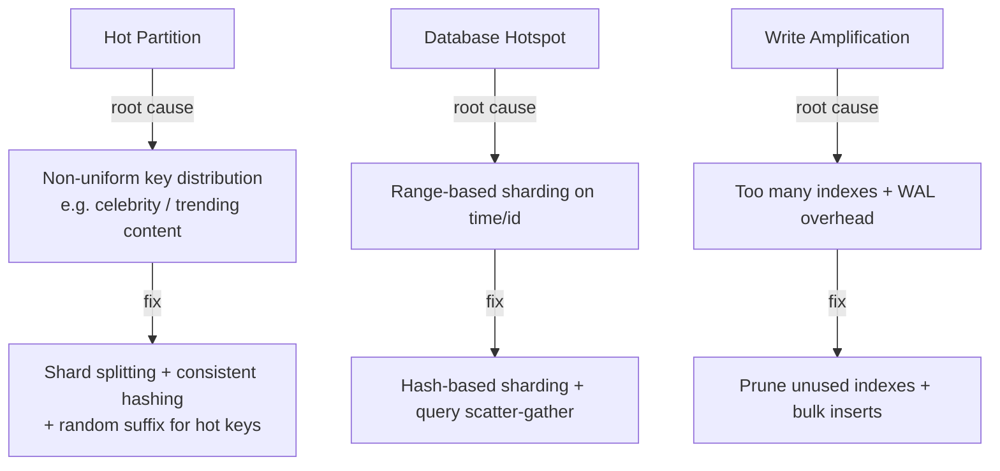

# Scalability Failure Modes

Hot spots, hot partitions, and other scaling anti-patterns.

```mermaid
graph TD
    HOTPART[Hot Partition] -->|root cause| SKEW[Non-uniform key distribution\ne.g. celebrity / trending content]
    SKEW -->|fix| SPLIT[Shard splitting + consistent hashing\n+ random suffix for hot keys]
    HOTDB[Database Hotspot] -->|root cause| RANGE[Range-based sharding on time/id]
    RANGE -->|fix| SCATTER[Hash-based sharding + query scatter-gather]
    WRITEAMP[Write Amplification] -->|root cause| INDEXES[Too many indexes + WAL overhead]
    INDEXES -->|fix| PRUNE[Prune unused indexes + bulk inserts]
```
