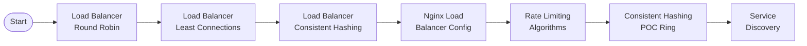

# Scalability Hands-On

Implement load balancers, consistent hashing rings, rate limiters, and service discovery from scratch.

```mermaid
graph LR
    Start([Start]) --> P1[Load Balancer\nRound Robin]
    P1 --> P2[Load Balancer\nLeast Connections]
    P2 --> P3[Load Balancer\nConsistent Hashing]
    P3 --> P4[Nginx Load\nBalancer Config]
    P4 --> P5[Rate Limiting\nAlgorithms]
    P5 --> P6[Consistent Hashing\nPOC Ring]
    P6 --> P7[Service\nDiscovery]
```
