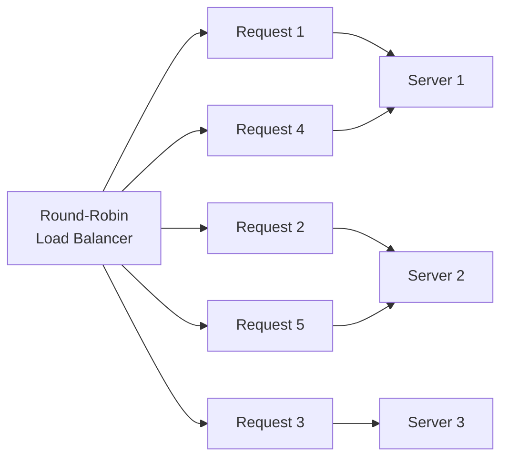

# POC #66: Round-Robin Load Balancing

> **Difficulty:** 🟢 Beginner
> **Time:** 20 minutes
> **Prerequisites:** Node.js basics

## 🗺️ Quick Overview



*Requests cycle through servers in fixed order — equal distribution regardless of server speed or current load.*

## What You'll Learn

Round-robin is the simplest load balancing algorithm - distribute requests evenly across all servers in order.

```
ROUND-ROBIN LOAD BALANCING:
┌─────────────────────────────────────────────────────────┐
│                                                         │
│           ┌──────────────────┐                          │
│  Request ─▶│  Load Balancer  │                          │
│           │  (Round Robin)   │                          │
│           └────────┬─────────┘                          │
│                    │                                    │
│     ┌──────────────┼──────────────┐                     │
│     ▼              ▼              ▼                     │
│ ┌────────┐   ┌────────┐   ┌────────┐                   │
│ │Server 1│   │Server 2│   │Server 3│                   │
│ └────────┘   └────────┘   └────────┘                   │
│                                                         │
│ Request 1 → Server 1                                    │
│ Request 2 → Server 2                                    │
│ Request 3 → Server 3                                    │
│ Request 4 → Server 1  (cycles back)                     │
│ Request 5 → Server 2                                    │
│                                                         │
└─────────────────────────────────────────────────────────┘
```

---

## Implementation

```javascript
// round-robin.js
const http = require('http');
const httpProxy = require('http-proxy');

// Backend servers
const servers = [
  { host: 'localhost', port: 3001 },
  { host: 'localhost', port: 3002 },
  { host: 'localhost', port: 3003 }
];

// ==========================================
// ROUND-ROBIN LOAD BALANCER
// ==========================================

class RoundRobinBalancer {
  constructor(servers) {
    this.servers = servers;
    this.current = 0;
    this.stats = {};

    // Initialize stats for each server
    servers.forEach((s, i) => {
      this.stats[`server${i + 1}`] = { requests: 0, errors: 0 };
    });
  }

  getNextServer() {
    const server = this.servers[this.current];
    const serverName = `server${this.current + 1}`;

    // Move to next server (wrap around)
    this.current = (this.current + 1) % this.servers.length;

    this.stats[serverName].requests++;

    console.log(`🔄 Routing to ${serverName} (${server.host}:${server.port})`);
    return server;
  }

  markError(serverIndex) {
    this.stats[`server${serverIndex + 1}`].errors++;
  }

  getStats() {
    return {
      totalRequests: Object.values(this.stats).reduce((sum, s) => sum + s.requests, 0),
      serverStats: this.stats,
      distribution: Object.entries(this.stats).map(([name, s]) => ({
        name,
        requests: s.requests,
        errors: s.errors,
        percentage: ((s.requests / Object.values(this.stats).reduce((sum, x) => sum + x.requests, 0)) * 100).toFixed(1) + '%'
      }))
    };
  }
}

// ==========================================
// WEIGHTED ROUND-ROBIN (BONUS)
// ==========================================

class WeightedRoundRobinBalancer {
  constructor(servers) {
    // servers: [{ host, port, weight }]
    this.servers = servers;
    this.currentIndex = 0;
    this.currentWeight = 0;
    this.maxWeight = Math.max(...servers.map(s => s.weight));
    this.gcd = this.calculateGCD(servers.map(s => s.weight));
    this.stats = {};

    servers.forEach((s, i) => {
      this.stats[`server${i + 1}`] = { requests: 0, weight: s.weight };
    });
  }

  calculateGCD(weights) {
    const gcd = (a, b) => b === 0 ? a : gcd(b, a % b);
    return weights.reduce((acc, w) => gcd(acc, w));
  }

  getNextServer() {
    while (true) {
      this.currentIndex = (this.currentIndex + 1) % this.servers.length;

      if (this.currentIndex === 0) {
        this.currentWeight -= this.gcd;
        if (this.currentWeight <= 0) {
          this.currentWeight = this.maxWeight;
        }
      }

      if (this.servers[this.currentIndex].weight >= this.currentWeight) {
        const server = this.servers[this.currentIndex];
        const serverName = `server${this.currentIndex + 1}`;
        this.stats[serverName].requests++;

        console.log(`⚖️ Weighted routing to ${serverName} (weight: ${server.weight})`);
        return server;
      }
    }
  }

  getStats() {
    const totalRequests = Object.values(this.stats).reduce((sum, s) => sum + s.requests, 0);
    return {
      totalRequests,
      serverStats: Object.entries(this.stats).map(([name, s]) => ({
        name,
        weight: s.weight,
        requests: s.requests,
        actualPercentage: totalRequests ? ((s.requests / totalRequests) * 100).toFixed(1) + '%' : '0%'
      }))
    };
  }
}

// ==========================================
// CREATE BACKEND SERVERS
// ==========================================

function createBackendServer(port, name) {
  const server = http.createServer((req, res) => {
    // Simulate varying response times
    const delay = Math.random() * 100;

    setTimeout(() => {
      res.writeHead(200, { 'Content-Type': 'application/json' });
      res.end(JSON.stringify({
        server: name,
        port: port,
        timestamp: new Date().toISOString(),
        responseTime: Math.round(delay) + 'ms'
      }));
    }, delay);
  });

  server.listen(port, () => {
    console.log(`✅ Backend ${name} running on port ${port}`);
  });

  return server;
}

// ==========================================
// CREATE LOAD BALANCER
// ==========================================

function createLoadBalancer(balancer, port) {
  const proxy = httpProxy.createProxyServer({});

  proxy.on('error', (err, req, res) => {
    console.error(`❌ Proxy error: ${err.message}`);
    res.writeHead(502, { 'Content-Type': 'application/json' });
    res.end(JSON.stringify({ error: 'Bad Gateway', message: err.message }));
  });

  const server = http.createServer((req, res) => {
    if (req.url === '/stats') {
      res.writeHead(200, { 'Content-Type': 'application/json' });
      res.end(JSON.stringify(balancer.getStats(), null, 2));
      return;
    }

    const target = balancer.getNextServer();
    proxy.web(req, res, {
      target: `http://${target.host}:${target.port}`
    });
  });

  server.listen(port, () => {
    console.log(`\n🔀 Load Balancer running on port ${port}`);
    console.log(`   GET http://localhost:${port}/        - Proxied request`);
    console.log(`   GET http://localhost:${port}/stats   - Load balancer stats\n`);
  });

  return server;
}

// ==========================================
// DEMONSTRATION
// ==========================================

async function demonstrate() {
  console.log('='.repeat(60));
  console.log('ROUND-ROBIN LOAD BALANCING');
  console.log('='.repeat(60));
  console.log();

  // Create backend servers
  const backends = [];
  for (let i = 0; i < 3; i++) {
    backends.push(createBackendServer(3001 + i, `Backend-${i + 1}`));
  }

  // Create round-robin balancer
  const balancer = new RoundRobinBalancer(servers);

  // Create load balancer
  createLoadBalancer(balancer, 3000);

  // Wait for servers to start
  await new Promise(resolve => setTimeout(resolve, 1000));

  // Send test requests
  console.log('='.repeat(60));
  console.log('SENDING 10 TEST REQUESTS');
  console.log('='.repeat(60));
  console.log();

  for (let i = 0; i < 10; i++) {
    try {
      const response = await fetch('http://localhost:3000/');
      const data = await response.json();
      console.log(`Request ${i + 1}: ${data.server} responded in ${data.responseTime}`);
    } catch (err) {
      console.error(`Request ${i + 1}: Error - ${err.message}`);
    }
  }

  // Show stats
  console.log('\n' + '='.repeat(60));
  console.log('LOAD BALANCER STATISTICS');
  console.log('='.repeat(60));

  const stats = balancer.getStats();
  console.log(`\nTotal requests: ${stats.totalRequests}`);
  console.log('\nDistribution:');
  stats.distribution.forEach(s => {
    console.log(`  ${s.name}: ${s.requests} requests (${s.percentage})`);
  });

  // Demonstrate weighted round-robin
  console.log('\n' + '='.repeat(60));
  console.log('WEIGHTED ROUND-ROBIN (Simulation)');
  console.log('='.repeat(60));

  const weightedServers = [
    { host: 'localhost', port: 3001, weight: 5 },  // Gets 5/10 = 50%
    { host: 'localhost', port: 3002, weight: 3 },  // Gets 3/10 = 30%
    { host: 'localhost', port: 3003, weight: 2 }   // Gets 2/10 = 20%
  ];

  const weightedBalancer = new WeightedRoundRobinBalancer(weightedServers);

  console.log('\nServer weights:');
  weightedServers.forEach((s, i) => {
    console.log(`  Server ${i + 1}: weight ${s.weight}`);
  });

  console.log('\nSimulating 100 requests with weighted distribution:');
  for (let i = 0; i < 100; i++) {
    weightedBalancer.getNextServer();
  }

  const weightedStats = weightedBalancer.getStats();
  console.log('\nActual distribution:');
  weightedStats.serverStats.forEach(s => {
    console.log(`  ${s.name}: weight ${s.weight}, got ${s.requests} requests (${s.actualPercentage})`);
  });

  console.log('\n✅ Demo complete! Keep the server running to test manually.');
  console.log('   curl http://localhost:3000/');
  console.log('   curl http://localhost:3000/stats');
}

demonstrate().catch(console.error);
```

---

## Run the POC

```bash
npm install http-proxy
node round-robin.js
```

---

## Expected Output

```
============================================================
ROUND-ROBIN LOAD BALANCING
============================================================

✅ Backend Backend-1 running on port 3001
✅ Backend Backend-2 running on port 3002
✅ Backend Backend-3 running on port 3003

🔀 Load Balancer running on port 3000

============================================================
SENDING 10 TEST REQUESTS
============================================================

🔄 Routing to server1 (localhost:3001)
Request 1: Backend-1 responded in 45ms
🔄 Routing to server2 (localhost:3002)
Request 2: Backend-2 responded in 78ms
🔄 Routing to server3 (localhost:3003)
Request 3: Backend-3 responded in 23ms
🔄 Routing to server1 (localhost:3001)
Request 4: Backend-1 responded in 56ms
...

============================================================
LOAD BALANCER STATISTICS
============================================================

Total requests: 10

Distribution:
  server1: 4 requests (40.0%)
  server2: 3 requests (30.0%)
  server3: 3 requests (30.0%)

============================================================
WEIGHTED ROUND-ROBIN (Simulation)
============================================================

Server weights:
  Server 1: weight 5
  Server 2: weight 3
  Server 3: weight 2

Actual distribution:
  server1: weight 5, got 50 requests (50.0%)
  server2: weight 3, got 30 requests (30.0%)
  server3: weight 2, got 20 requests (20.0%)
```

---

## Pros & Cons

| Pros | Cons |
|------|------|
| Simple to implement | Ignores server capacity |
| Even distribution | Ignores current load |
| Predictable behavior | Slow server affects all |
| No state needed | Long requests cause uneven load |

---

## When to Use

- All servers have identical specs
- Request processing time is similar
- Simple setup without health monitoring
- Stateless applications

---

## Related POCs

- [POC #67: Least Connections](/06-scalability/hands-on/load-balancer-least-connections)
- [POC #68: Consistent Hashing](/06-scalability/hands-on/load-balancer-consistent-hashing)
- [Load Balancing Strategies](/10-architecture/concepts/load-balancing-strategies)
