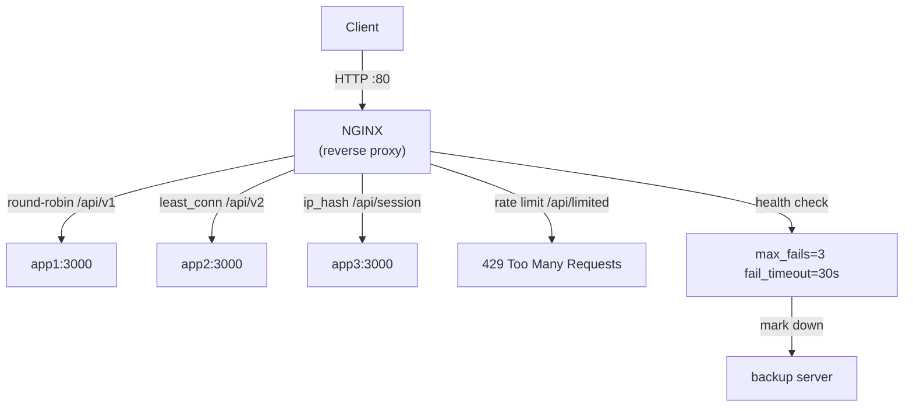

# POC #70: NGINX Load Balancer Configuration

> **Difficulty:** 🟡 Intermediate
> **Time:** 20 minutes
> **Prerequisites:** Docker basics

## 🗺️ Quick Overview



*NGINX supports multiple balancing strategies per upstream block — round-robin, least-conn, weighted, and ip-hash — all configurable without code.*

## What You'll Learn

Configure NGINX as a production-grade load balancer with health checks, sticky sessions, and rate limiting.

```
NGINX LOAD BALANCER:
┌─────────────────────────────────────────────────────────┐
│                                                         │
│   Client ─────▶ NGINX (Port 80)                        │
│                    │                                    │
│                    │ ┌── Health Checks ──┐              │
│                    │ │  Every 5 seconds  │              │
│                    │ └───────────────────┘              │
│                    │                                    │
│         ┌──────────┼──────────┐                         │
│         ▼          ▼          ▼                         │
│    ┌────────┐ ┌────────┐ ┌────────┐                    │
│    │ App 1  │ │ App 2  │ │ App 3  │                    │
│    │:3001   │ │:3002   │ │:3003   │                    │
│    └────────┘ └────────┘ └────────┘                    │
│                                                         │
└─────────────────────────────────────────────────────────┘
```

---

## Docker Compose Setup

```yaml
# docker-compose.yml
version: '3.8'

services:
  nginx:
    image: nginx:alpine
    ports:
      - "80:80"
      - "443:443"
    volumes:
      - ./nginx.conf:/etc/nginx/nginx.conf:ro
    depends_on:
      - app1
      - app2
      - app3
    networks:
      - backend

  app1:
    build: ./app
    environment:
      - SERVER_ID=app1
      - PORT=3000
    networks:
      - backend

  app2:
    build: ./app
    environment:
      - SERVER_ID=app2
      - PORT=3000
    networks:
      - backend

  app3:
    build: ./app
    environment:
      - SERVER_ID=app3
      - PORT=3000
    networks:
      - backend

networks:
  backend:
    driver: bridge
```

---

## NGINX Configuration

```nginx
# nginx.conf

# Worker processes (usually = number of CPU cores)
worker_processes auto;

events {
    worker_connections 1024;
    use epoll;  # Efficient event handling on Linux
}

http {
    # ==========================================
    # LOGGING
    # ==========================================
    log_format main '$remote_addr - [$time_local] "$request" '
                    '$status $body_bytes_sent '
                    '"$http_referer" "$http_user_agent" '
                    'upstream: $upstream_addr '
                    'response_time: $upstream_response_time';

    access_log /var/log/nginx/access.log main;
    error_log /var/log/nginx/error.log warn;

    # ==========================================
    # UPSTREAM: ROUND-ROBIN (Default)
    # ==========================================
    upstream backend_round_robin {
        server app1:3000;
        server app2:3000;
        server app3:3000;

        # Keep connections alive to backend
        keepalive 32;
    }

    # ==========================================
    # UPSTREAM: LEAST CONNECTIONS
    # ==========================================
    upstream backend_least_conn {
        least_conn;

        server app1:3000;
        server app2:3000;
        server app3:3000;

        keepalive 32;
    }

    # ==========================================
    # UPSTREAM: WEIGHTED
    # ==========================================
    upstream backend_weighted {
        server app1:3000 weight=5;  # Gets 50% traffic
        server app2:3000 weight=3;  # Gets 30% traffic
        server app3:3000 weight=2;  # Gets 20% traffic

        keepalive 32;
    }

    # ==========================================
    # UPSTREAM: IP HASH (Sticky Sessions)
    # ==========================================
    upstream backend_sticky {
        ip_hash;  # Same client IP goes to same server

        server app1:3000;
        server app2:3000;
        server app3:3000;
    }

    # ==========================================
    # UPSTREAM: WITH HEALTH CHECKS (NGINX Plus only)
    # For open-source, use passive health checks
    # ==========================================
    upstream backend_health {
        server app1:3000 max_fails=3 fail_timeout=30s;
        server app2:3000 max_fails=3 fail_timeout=30s;
        server app3:3000 max_fails=3 fail_timeout=30s backup;  # Backup server

        keepalive 32;
    }

    # ==========================================
    # RATE LIMITING
    # ==========================================
    limit_req_zone $binary_remote_addr zone=api_limit:10m rate=10r/s;
    limit_conn_zone $binary_remote_addr zone=conn_limit:10m;

    # ==========================================
    # MAIN SERVER
    # ==========================================
    server {
        listen 80;
        server_name localhost;

        # Response compression
        gzip on;
        gzip_types application/json text/plain;

        # ==========================================
        # HEALTH CHECK ENDPOINT
        # ==========================================
        location /health {
            return 200 'OK';
            add_header Content-Type text/plain;
        }

        # ==========================================
        # ROUND-ROBIN ROUTE
        # ==========================================
        location /api/v1 {
            proxy_pass http://backend_round_robin;

            proxy_http_version 1.1;
            proxy_set_header Connection "";
            proxy_set_header Host $host;
            proxy_set_header X-Real-IP $remote_addr;
            proxy_set_header X-Forwarded-For $proxy_add_x_forwarded_for;

            # Timeouts
            proxy_connect_timeout 5s;
            proxy_send_timeout 60s;
            proxy_read_timeout 60s;
        }

        # ==========================================
        # LEAST CONNECTIONS ROUTE
        # ==========================================
        location /api/v2 {
            proxy_pass http://backend_least_conn;

            proxy_http_version 1.1;
            proxy_set_header Connection "";
            proxy_set_header Host $host;
            proxy_set_header X-Real-IP $remote_addr;
        }

        # ==========================================
        # WEIGHTED ROUTE
        # ==========================================
        location /api/v3 {
            proxy_pass http://backend_weighted;

            proxy_http_version 1.1;
            proxy_set_header Connection "";
        }

        # ==========================================
        # STICKY SESSIONS ROUTE
        # ==========================================
        location /api/session {
            proxy_pass http://backend_sticky;

            proxy_http_version 1.1;
            proxy_set_header Connection "";
            proxy_set_header Host $host;
        }

        # ==========================================
        # RATE LIMITED ROUTE
        # ==========================================
        location /api/limited {
            limit_req zone=api_limit burst=20 nodelay;
            limit_conn conn_limit 10;

            proxy_pass http://backend_round_robin;

            proxy_http_version 1.1;
            proxy_set_header Connection "";
        }

        # ==========================================
        # CIRCUIT BREAKER (Retry + Timeout)
        # ==========================================
        location /api/resilient {
            proxy_pass http://backend_health;

            proxy_next_upstream error timeout http_502 http_503;
            proxy_next_upstream_tries 2;
            proxy_next_upstream_timeout 10s;

            proxy_connect_timeout 2s;
            proxy_read_timeout 5s;
        }

        # ==========================================
        # STATUS PAGE
        # ==========================================
        location /nginx_status {
            stub_status on;
            allow 127.0.0.1;
            deny all;
        }
    }
}
```

---

## Backend Application

```dockerfile
# app/Dockerfile
FROM node:18-alpine
WORKDIR /app
COPY server.js .
CMD ["node", "server.js"]
```

```javascript
// app/server.js
const http = require('http');

const SERVER_ID = process.env.SERVER_ID || 'unknown';
const PORT = process.env.PORT || 3000;

let requestCount = 0;

const server = http.createServer((req, res) => {
  requestCount++;

  // Health check
  if (req.url === '/health') {
    res.writeHead(200);
    res.end('OK');
    return;
  }

  // Simulate varying response times
  const delay = Math.random() * 100;

  setTimeout(() => {
    res.writeHead(200, { 'Content-Type': 'application/json' });
    res.end(JSON.stringify({
      server: SERVER_ID,
      requestNumber: requestCount,
      path: req.url,
      timestamp: new Date().toISOString(),
      responseTime: Math.round(delay) + 'ms'
    }));
  }, delay);
});

server.listen(PORT, () => {
  console.log(`${SERVER_ID} listening on port ${PORT}`);
});
```

---

## Run the POC

```bash
# Start everything
docker-compose up -d

# Wait for startup
sleep 5

# Test round-robin
echo "=== Round-Robin ===" && \
for i in {1..6}; do curl -s http://localhost/api/v1 | jq -r .server; done

# Test least connections
echo "=== Least Connections ===" && \
for i in {1..6}; do curl -s http://localhost/api/v2 | jq -r .server; done

# Test weighted
echo "=== Weighted ===" && \
for i in {1..10}; do curl -s http://localhost/api/v3 | jq -r .server; done | sort | uniq -c

# Test sticky sessions
echo "=== Sticky Sessions ===" && \
for i in {1..5}; do curl -s http://localhost/api/session | jq -r .server; done

# Test rate limiting
echo "=== Rate Limiting ===" && \
for i in {1..15}; do curl -s -o /dev/null -w "%{http_code}\n" http://localhost/api/limited; done
```

---

## Expected Output

```bash
=== Round-Robin ===
app1
app2
app3
app1
app2
app3

=== Least Connections ===
app2
app1
app3
app1
app2
app3

=== Weighted ===
   5 app1   # ~50%
   3 app2   # ~30%
   2 app3   # ~20%

=== Sticky Sessions ===
app2
app2
app2
app2
app2  # Same server for same IP

=== Rate Limiting ===
200
200
...
429  # Too Many Requests (after rate exceeded)
```

---

## Configuration Reference

| Directive | Purpose |
|-----------|---------|
| `least_conn` | Least connections algorithm |
| `ip_hash` | Sticky sessions by IP |
| `weight=N` | Server weight for traffic |
| `max_fails=N` | Failures before marking down |
| `fail_timeout=Ns` | Time server stays marked down |
| `backup` | Use only when primary servers down |
| `limit_req` | Request rate limiting |
| `proxy_next_upstream` | Retry failed requests |

---

## Production Checklist

- [ ] Set appropriate `worker_processes` (usually = CPU cores)
- [ ] Configure `keepalive` for connection reuse
- [ ] Set reasonable timeouts
- [ ] Enable access logs with upstream info
- [ ] Add rate limiting for public APIs
- [ ] Configure health checks
- [ ] Add SSL/TLS termination
- [ ] Set up monitoring (`stub_status`)

---

## Related POCs

- [POC #66: Round-Robin](/interview-prep/practice-pocs/load-balancer-round-robin)
- [POC #67: Least Connections](/interview-prep/practice-pocs/load-balancer-least-connections)
- [Load Balancing Strategies](/system-design/load-balancing/load-balancing-strategies)
