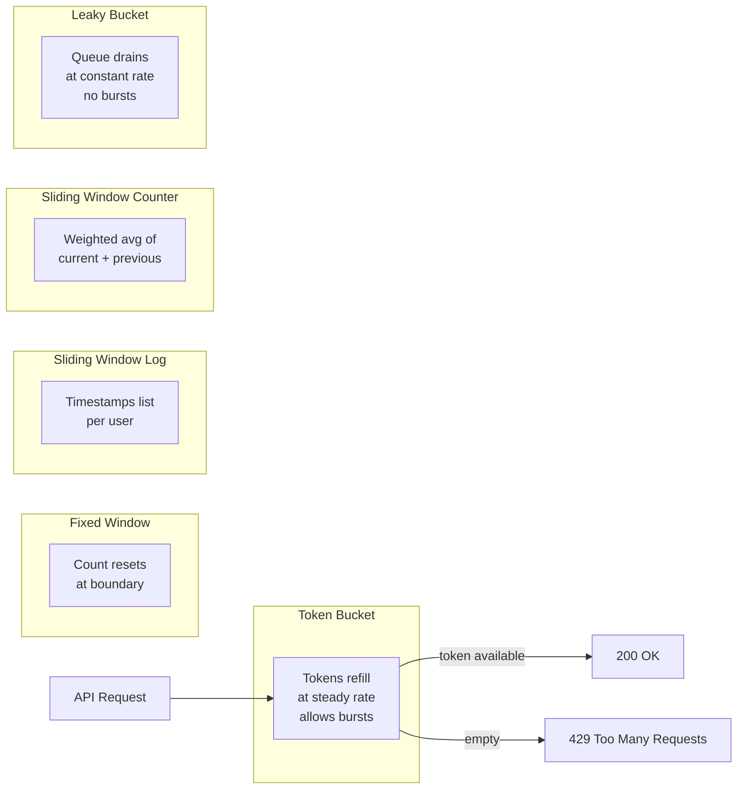

# POC #89: Rate Limiting Algorithms

> **Difficulty:** 🟡 Intermediate
> **Time:** 30 minutes
> **Prerequisites:** Node.js, Redis basics

## 🗺️ Quick Overview



*Token bucket is the most flexible — it allows short bursts while enforcing a sustained average rate.*

## What You'll Learn

Rate limiting protects APIs from abuse. This POC implements the four main algorithms: Fixed Window, Sliding Window Log, Sliding Window Counter, and Token Bucket.

```
RATE LIMITING ALGORITHMS:
┌─────────────────────────────────────────────────────────────────┐
│                                                                 │
│  FIXED WINDOW              SLIDING WINDOW LOG                   │
│  ────────────              ──────────────────                   │
│  │ 5 │ 5 │ 5 │             [t1, t2, t3, t4, t5]                │
│  └───┴───┴───┘             Count requests in sliding window     │
│  Reset at boundaries       Precise but memory-heavy             │
│                                                                 │
│  SLIDING WINDOW COUNTER    TOKEN BUCKET                         │
│  ──────────────────────    ────────────                         │
│  Weighted average of       [●●●●○○○○○○]                         │
│  current + previous        Tokens refill over time              │
│  window counts             Allows bursts up to bucket size      │
│                                                                 │
└─────────────────────────────────────────────────────────────────┘
```

---

## Implementation

```javascript
// rate-limiting-algorithms.js

// ==========================================
// 1. FIXED WINDOW COUNTER
// ==========================================

class FixedWindowRateLimiter {
  constructor(options = {}) {
    this.windowMs = options.windowMs || 60000;  // 1 minute
    this.maxRequests = options.maxRequests || 100;
    this.windows = new Map();  // key -> { count, resetAt }
  }

  isAllowed(key) {
    const now = Date.now();
    const windowStart = Math.floor(now / this.windowMs) * this.windowMs;
    const windowKey = `${key}:${windowStart}`;

    let window = this.windows.get(windowKey);

    if (!window) {
      window = { count: 0, resetAt: windowStart + this.windowMs };
      this.windows.set(windowKey, window);

      // Cleanup old windows
      this.cleanup(now);
    }

    if (window.count >= this.maxRequests) {
      return {
        allowed: false,
        remaining: 0,
        resetAt: window.resetAt,
        retryAfter: Math.ceil((window.resetAt - now) / 1000)
      };
    }

    window.count++;

    return {
      allowed: true,
      remaining: this.maxRequests - window.count,
      resetAt: window.resetAt
    };
  }

  cleanup(now) {
    for (const [key, window] of this.windows) {
      if (window.resetAt < now) {
        this.windows.delete(key);
      }
    }
  }
}

// ==========================================
// 2. SLIDING WINDOW LOG
// ==========================================

class SlidingWindowLogRateLimiter {
  constructor(options = {}) {
    this.windowMs = options.windowMs || 60000;
    this.maxRequests = options.maxRequests || 100;
    this.logs = new Map();  // key -> [timestamps]
  }

  isAllowed(key) {
    const now = Date.now();
    const windowStart = now - this.windowMs;

    // Get or create log
    let log = this.logs.get(key) || [];

    // Remove expired entries
    log = log.filter(timestamp => timestamp > windowStart);

    if (log.length >= this.maxRequests) {
      // Find oldest request in window
      const oldestRequest = Math.min(...log);
      const retryAfter = Math.ceil((oldestRequest + this.windowMs - now) / 1000);

      return {
        allowed: false,
        remaining: 0,
        retryAfter: Math.max(1, retryAfter)
      };
    }

    // Add current request
    log.push(now);
    this.logs.set(key, log);

    return {
      allowed: true,
      remaining: this.maxRequests - log.length
    };
  }
}

// ==========================================
// 3. SLIDING WINDOW COUNTER
// ==========================================

class SlidingWindowCounterRateLimiter {
  constructor(options = {}) {
    this.windowMs = options.windowMs || 60000;
    this.maxRequests = options.maxRequests || 100;
    this.windows = new Map();  // key -> { current, previous, currentStart }
  }

  isAllowed(key) {
    const now = Date.now();
    const currentWindowStart = Math.floor(now / this.windowMs) * this.windowMs;

    let data = this.windows.get(key);

    if (!data || data.currentStart !== currentWindowStart) {
      // New window
      const previousCount = data && data.currentStart === currentWindowStart - this.windowMs
        ? data.current
        : 0;

      data = {
        current: 0,
        previous: previousCount,
        currentStart: currentWindowStart
      };
      this.windows.set(key, data);
    }

    // Calculate weighted count
    const elapsedInWindow = now - currentWindowStart;
    const previousWeight = 1 - (elapsedInWindow / this.windowMs);
    const weightedCount = data.current + (data.previous * previousWeight);

    if (weightedCount >= this.maxRequests) {
      const resetAt = currentWindowStart + this.windowMs;
      return {
        allowed: false,
        remaining: 0,
        resetAt,
        retryAfter: Math.ceil((resetAt - now) / 1000)
      };
    }

    data.current++;

    return {
      allowed: true,
      remaining: Math.floor(this.maxRequests - weightedCount - 1),
      resetAt: currentWindowStart + this.windowMs
    };
  }
}

// ==========================================
// 4. TOKEN BUCKET
// ==========================================

class TokenBucketRateLimiter {
  constructor(options = {}) {
    this.bucketSize = options.bucketSize || 100;      // Max tokens
    this.refillRate = options.refillRate || 10;       // Tokens per second
    this.buckets = new Map();  // key -> { tokens, lastRefill }
  }

  isAllowed(key, tokensRequired = 1) {
    const now = Date.now();

    let bucket = this.buckets.get(key);

    if (!bucket) {
      bucket = { tokens: this.bucketSize, lastRefill: now };
      this.buckets.set(key, bucket);
    }

    // Refill tokens based on time elapsed
    const elapsed = (now - bucket.lastRefill) / 1000;
    const tokensToAdd = elapsed * this.refillRate;
    bucket.tokens = Math.min(this.bucketSize, bucket.tokens + tokensToAdd);
    bucket.lastRefill = now;

    if (bucket.tokens < tokensRequired) {
      // Calculate wait time
      const tokensNeeded = tokensRequired - bucket.tokens;
      const waitTime = tokensNeeded / this.refillRate;

      return {
        allowed: false,
        remaining: Math.floor(bucket.tokens),
        retryAfter: Math.ceil(waitTime)
      };
    }

    bucket.tokens -= tokensRequired;

    return {
      allowed: true,
      remaining: Math.floor(bucket.tokens)
    };
  }
}

// ==========================================
// 5. LEAKY BUCKET (Queue-based)
// ==========================================

class LeakyBucketRateLimiter {
  constructor(options = {}) {
    this.bucketSize = options.bucketSize || 100;
    this.leakRate = options.leakRate || 10;  // Requests per second
    this.buckets = new Map();  // key -> { queue, lastLeak }
  }

  isAllowed(key) {
    const now = Date.now();

    let bucket = this.buckets.get(key);

    if (!bucket) {
      bucket = { queueSize: 0, lastLeak: now };
      this.buckets.set(key, bucket);
    }

    // Leak requests based on time elapsed
    const elapsed = (now - bucket.lastLeak) / 1000;
    const leaked = elapsed * this.leakRate;
    bucket.queueSize = Math.max(0, bucket.queueSize - leaked);
    bucket.lastLeak = now;

    if (bucket.queueSize >= this.bucketSize) {
      return {
        allowed: false,
        remaining: 0,
        queuePosition: Math.ceil(bucket.queueSize - this.bucketSize + 1)
      };
    }

    bucket.queueSize++;

    return {
      allowed: true,
      remaining: Math.floor(this.bucketSize - bucket.queueSize)
    };
  }
}

// ==========================================
// REDIS IMPLEMENTATION (Token Bucket)
// ==========================================

const REDIS_TOKEN_BUCKET_SCRIPT = `
local key = KEYS[1]
local bucket_size = tonumber(ARGV[1])
local refill_rate = tonumber(ARGV[2])
local now = tonumber(ARGV[3])
local tokens_required = tonumber(ARGV[4])

local bucket = redis.call('HMGET', key, 'tokens', 'last_refill')
local tokens = tonumber(bucket[1]) or bucket_size
local last_refill = tonumber(bucket[2]) or now

-- Refill tokens
local elapsed = (now - last_refill) / 1000
local tokens_to_add = elapsed * refill_rate
tokens = math.min(bucket_size, tokens + tokens_to_add)

if tokens < tokens_required then
  return {0, math.floor(tokens), math.ceil((tokens_required - tokens) / refill_rate)}
end

tokens = tokens - tokens_required
redis.call('HMSET', key, 'tokens', tokens, 'last_refill', now)
redis.call('EXPIRE', key, math.ceil(bucket_size / refill_rate) + 1)

return {1, math.floor(tokens), 0}
`;

class RedisTokenBucket {
  constructor(redis, options = {}) {
    this.redis = redis;
    this.bucketSize = options.bucketSize || 100;
    this.refillRate = options.refillRate || 10;
    this.keyPrefix = options.keyPrefix || 'ratelimit:';
  }

  async isAllowed(key, tokensRequired = 1) {
    const redisKey = this.keyPrefix + key;
    const now = Date.now();

    // In real implementation, use EVALSHA with script caching
    const result = await this.redis.eval(
      REDIS_TOKEN_BUCKET_SCRIPT,
      1,
      redisKey,
      this.bucketSize,
      this.refillRate,
      now,
      tokensRequired
    );

    return {
      allowed: result[0] === 1,
      remaining: result[1],
      retryAfter: result[2]
    };
  }
}

// ==========================================
// DEMONSTRATION
// ==========================================

async function demonstrate() {
  console.log('='.repeat(60));
  console.log('RATE LIMITING ALGORITHMS');
  console.log('='.repeat(60));

  // Test each algorithm
  const algorithms = [
    { name: 'Fixed Window', limiter: new FixedWindowRateLimiter({ maxRequests: 5, windowMs: 10000 }) },
    { name: 'Sliding Window Log', limiter: new SlidingWindowLogRateLimiter({ maxRequests: 5, windowMs: 10000 }) },
    { name: 'Sliding Window Counter', limiter: new SlidingWindowCounterRateLimiter({ maxRequests: 5, windowMs: 10000 }) },
    { name: 'Token Bucket', limiter: new TokenBucketRateLimiter({ bucketSize: 5, refillRate: 1 }) },
    { name: 'Leaky Bucket', limiter: new LeakyBucketRateLimiter({ bucketSize: 5, leakRate: 1 }) }
  ];

  for (const { name, limiter } of algorithms) {
    console.log(`\n--- ${name} ---`);

    const results = [];
    for (let i = 0; i < 7; i++) {
      const result = limiter.isAllowed('user-123');
      results.push(result.allowed ? '✅' : '❌');
    }

    console.log(`Requests: ${results.join(' ')}`);
  }

  // Token bucket burst demo
  console.log('\n--- Token Bucket Burst Demo ---');
  const tokenBucket = new TokenBucketRateLimiter({ bucketSize: 10, refillRate: 2 });

  console.log('Initial burst of 8 requests:');
  for (let i = 0; i < 8; i++) {
    const result = tokenBucket.isAllowed('burst-test');
    console.log(`  Request ${i + 1}: ${result.allowed ? '✅' : '❌'} (remaining: ${result.remaining})`);
  }

  console.log('\nWaiting 3 seconds for refill...');
  await new Promise(r => setTimeout(r, 3000));

  console.log('After refill:');
  for (let i = 0; i < 3; i++) {
    const result = tokenBucket.isAllowed('burst-test');
    console.log(`  Request ${i + 1}: ${result.allowed ? '✅' : '❌'} (remaining: ${result.remaining})`);
  }

  console.log('\n✅ Demo complete!');
}

demonstrate().catch(console.error);
```

---

## Algorithm Comparison

| Algorithm | Pros | Cons | Use Case |
|-----------|------|------|----------|
| **Fixed Window** | Simple, low memory | Burst at boundaries | Basic protection |
| **Sliding Window Log** | Precise | High memory | Strict limits |
| **Sliding Window Counter** | Good balance | Slight imprecision | Production APIs |
| **Token Bucket** | Allows bursts | Complex | API gateways |
| **Leaky Bucket** | Smooth output | No burst support | Queue systems |

---

## Redis Lua Script Benefits

```
WHY USE LUA SCRIPTS?

1. ATOMICITY
   └── All operations in single transaction

2. PERFORMANCE
   └── No network round-trips between commands

3. CONSISTENCY
   └── No race conditions between read/update

4. EFFICIENCY
   └── EVALSHA caches compiled script
```

---

## Production Considerations

```
✅ IMPLEMENTATION:
├── Use Redis for distributed rate limiting
├── Lua scripts for atomicity
├── Separate limits per endpoint
└── Different tiers for users

✅ HEADERS (RFC 6585):
├── X-RateLimit-Limit: 100
├── X-RateLimit-Remaining: 42
├── X-RateLimit-Reset: 1672531200
└── Retry-After: 60

✅ RESPONSES:
├── 429 Too Many Requests
├── Include Retry-After header
├── Explain limit in body
└── Don't leak implementation details
```

---

## Related POCs

- [API Key Management](/07-api-design/hands-on/api-key-management)
- [Redis Rate Limiting](/03-redis/hands-on/redis-rate-limiting)
- [API Gateway](/07-api-design/hands-on/api-gateway-rate-limiting)
