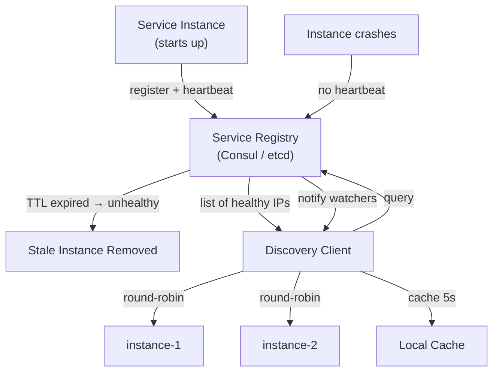

# POC #100: Service Discovery

> **Difficulty:** 🟡 Intermediate
> **Time:** 25 minutes
> **Prerequisites:** Microservices basics, Networking fundamentals

## 🗺️ Quick Overview



*Services self-register and send heartbeats; the registry removes stale entries and notifies discovery clients to refresh their local caches.*

## What You'll Learn

Service discovery enables services to find each other dynamically without hardcoded addresses. This covers client-side vs server-side discovery, service registries, and health-aware routing.

```
SERVICE DISCOVERY PATTERNS:
┌─────────────────────────────────────────────────────────────────┐
│                                                                 │
│  CLIENT-SIDE DISCOVERY                                          │
│  ─────────────────────                                          │
│                                                                 │
│  ┌────────┐    1. Query    ┌──────────────┐                    │
│  │ Client │───────────────▶│   Registry   │                    │
│  │Service │◀───────────────│ (Consul/etcd)│                    │
│  └────┬───┘    2. Get IPs  └──────────────┘                    │
│       │                          ▲                              │
│       │ 3. Direct call           │ Heartbeat                    │
│       ▼                          │                              │
│  ┌────────┐  ┌────────┐  ┌────────┐                            │
│  │Service │  │Service │  │Service │                            │
│  │  A.1   │  │  A.2   │  │  A.3   │                            │
│  └────────┘  └────────┘  └────────┘                            │
│                                                                 │
│  SERVER-SIDE DISCOVERY                                          │
│  ─────────────────────                                          │
│                                                                 │
│  ┌────────┐    1. Call    ┌─────────────┐    3. Route          │
│  │ Client │──────────────▶│    Load     │────────────▶ Service │
│  │Service │◀──────────────│  Balancer   │◀────────────         │
│  └────────┘   4. Response └──────┬──────┘                      │
│                                  │                              │
│                           2. Query│                             │
│                                  ▼                              │
│                           ┌──────────────┐                      │
│                           │   Registry   │                      │
│                           └──────────────┘                      │
│                                                                 │
└─────────────────────────────────────────────────────────────────┘
```

---

## Implementation

```javascript
// service-discovery.js

// ==========================================
// SERVICE INSTANCE
// ==========================================

class ServiceInstance {
  constructor(config) {
    this.id = config.id || `${config.name}-${Date.now()}`;
    this.name = config.name;
    this.host = config.host;
    this.port = config.port;
    this.metadata = config.metadata || {};
    this.status = 'starting';  // starting, healthy, unhealthy, draining
    this.lastHeartbeat = Date.now();
    this.registeredAt = Date.now();

    // Health metrics
    this.health = {
      consecutiveFailures: 0,
      lastCheck: null,
      latencyMs: 0
    };
  }

  getAddress() {
    return `${this.host}:${this.port}`;
  }

  toJSON() {
    return {
      id: this.id,
      name: this.name,
      address: this.getAddress(),
      status: this.status,
      metadata: this.metadata,
      health: this.health
    };
  }
}

// ==========================================
// SERVICE REGISTRY
// ==========================================

class ServiceRegistry {
  constructor(options = {}) {
    this.services = new Map();  // name -> Map<id, ServiceInstance>
    this.heartbeatTTL = options.heartbeatTTL || 30000;  // 30 seconds
    this.cleanupInterval = options.cleanupInterval || 10000;
    this.listeners = new Map();  // name -> Set<callback>

    // Start cleanup timer
    this.startCleanup();
  }

  // Register a service instance
  register(instance) {
    if (!this.services.has(instance.name)) {
      this.services.set(instance.name, new Map());
    }

    const instances = this.services.get(instance.name);
    instances.set(instance.id, instance);
    instance.status = 'healthy';
    instance.lastHeartbeat = Date.now();

    console.log(`📥 Registered: ${instance.name}/${instance.id} at ${instance.getAddress()}`);

    this.notifyListeners(instance.name, 'register', instance);

    return instance;
  }

  // Deregister a service instance
  deregister(serviceName, instanceId) {
    const instances = this.services.get(serviceName);
    if (instances) {
      const instance = instances.get(instanceId);
      if (instance) {
        instances.delete(instanceId);
        console.log(`📤 Deregistered: ${serviceName}/${instanceId}`);
        this.notifyListeners(serviceName, 'deregister', instance);
        return true;
      }
    }
    return false;
  }

  // Send heartbeat
  heartbeat(serviceName, instanceId) {
    const instances = this.services.get(serviceName);
    if (instances) {
      const instance = instances.get(instanceId);
      if (instance) {
        instance.lastHeartbeat = Date.now();
        if (instance.status === 'unhealthy') {
          instance.status = 'healthy';
          instance.health.consecutiveFailures = 0;
          this.notifyListeners(serviceName, 'healthy', instance);
        }
        return true;
      }
    }
    return false;
  }

  // Get all healthy instances of a service
  getInstances(serviceName, onlyHealthy = true) {
    const instances = this.services.get(serviceName);
    if (!instances) return [];

    const result = Array.from(instances.values());

    if (onlyHealthy) {
      return result.filter(i => i.status === 'healthy');
    }

    return result;
  }

  // Get all registered services
  getServices() {
    const result = {};
    for (const [name, instances] of this.services) {
      result[name] = {
        total: instances.size,
        healthy: Array.from(instances.values()).filter(i => i.status === 'healthy').length
      };
    }
    return result;
  }

  // Subscribe to service changes
  subscribe(serviceName, callback) {
    if (!this.listeners.has(serviceName)) {
      this.listeners.set(serviceName, new Set());
    }
    this.listeners.get(serviceName).add(callback);

    // Return unsubscribe function
    return () => {
      this.listeners.get(serviceName)?.delete(callback);
    };
  }

  notifyListeners(serviceName, event, instance) {
    const callbacks = this.listeners.get(serviceName);
    if (callbacks) {
      for (const callback of callbacks) {
        callback(event, instance);
      }
    }
  }

  // Cleanup stale instances
  startCleanup() {
    setInterval(() => {
      const now = Date.now();

      for (const [serviceName, instances] of this.services) {
        for (const [id, instance] of instances) {
          const elapsed = now - instance.lastHeartbeat;

          if (elapsed > this.heartbeatTTL) {
            instance.health.consecutiveFailures++;

            if (instance.status === 'healthy') {
              instance.status = 'unhealthy';
              console.log(`⚠️ Unhealthy: ${serviceName}/${id} (no heartbeat for ${elapsed}ms)`);
              this.notifyListeners(serviceName, 'unhealthy', instance);
            }

            // Remove after multiple failures
            if (instance.health.consecutiveFailures >= 3) {
              instances.delete(id);
              console.log(`🗑️ Removed stale: ${serviceName}/${id}`);
              this.notifyListeners(serviceName, 'removed', instance);
            }
          }
        }
      }
    }, this.cleanupInterval);
  }
}

// ==========================================
// SERVICE DISCOVERY CLIENT
// ==========================================

class DiscoveryClient {
  constructor(registry, options = {}) {
    this.registry = registry;
    this.cache = new Map();  // name -> { instances, timestamp }
    this.cacheTTL = options.cacheTTL || 5000;
    this.loadBalancer = options.loadBalancer || 'round-robin';
    this.counters = new Map();  // For round-robin
  }

  // Discover service instances
  async discover(serviceName) {
    // Check cache
    const cached = this.cache.get(serviceName);
    if (cached && Date.now() - cached.timestamp < this.cacheTTL) {
      return cached.instances;
    }

    // Fetch from registry
    const instances = this.registry.getInstances(serviceName);
    this.cache.set(serviceName, {
      instances,
      timestamp: Date.now()
    });

    return instances;
  }

  // Get one instance using load balancing
  async getOne(serviceName) {
    const instances = await this.discover(serviceName);

    if (instances.length === 0) {
      throw new Error(`No healthy instances for service: ${serviceName}`);
    }

    switch (this.loadBalancer) {
      case 'round-robin':
        return this.roundRobin(serviceName, instances);
      case 'random':
        return this.random(instances);
      case 'least-connections':
        return this.leastConnections(instances);
      default:
        return instances[0];
    }
  }

  roundRobin(serviceName, instances) {
    const counter = this.counters.get(serviceName) || 0;
    const instance = instances[counter % instances.length];
    this.counters.set(serviceName, counter + 1);
    return instance;
  }

  random(instances) {
    const index = Math.floor(Math.random() * instances.length);
    return instances[index];
  }

  leastConnections(instances) {
    // In real implementation, track connection counts
    return instances.sort((a, b) =>
      (a.metadata.connections || 0) - (b.metadata.connections || 0)
    )[0];
  }

  // Invalidate cache
  invalidate(serviceName) {
    this.cache.delete(serviceName);
  }

  // Watch for service changes
  watch(serviceName, callback) {
    this.registry.subscribe(serviceName, (event, instance) => {
      this.invalidate(serviceName);  // Clear cache on changes
      callback(event, instance);
    });
  }
}

// ==========================================
// SERVICE MESH SIDECAR (Simplified)
// ==========================================

class ServiceMeshSidecar {
  constructor(registry, config) {
    this.registry = registry;
    this.serviceName = config.serviceName;
    this.host = config.host || 'localhost';
    this.port = config.port;
    this.heartbeatInterval = config.heartbeatInterval || 10000;

    this.instance = null;
    this.intervalId = null;
  }

  // Start sidecar
  async start() {
    // Register this service
    this.instance = new ServiceInstance({
      name: this.serviceName,
      host: this.host,
      port: this.port,
      metadata: {
        startedAt: new Date().toISOString(),
        version: process.env.APP_VERSION || '1.0.0'
      }
    });

    this.registry.register(this.instance);

    // Start heartbeat
    this.intervalId = setInterval(() => {
      this.registry.heartbeat(this.serviceName, this.instance.id);
    }, this.heartbeatInterval);

    console.log(`🚀 Sidecar started for ${this.serviceName}`);

    return this.instance;
  }

  // Stop sidecar (graceful shutdown)
  async stop() {
    if (this.intervalId) {
      clearInterval(this.intervalId);
    }

    if (this.instance) {
      this.instance.status = 'draining';
      // Wait for connections to drain
      await new Promise(r => setTimeout(r, 5000));
      this.registry.deregister(this.serviceName, this.instance.id);
    }

    console.log(`🛑 Sidecar stopped for ${this.serviceName}`);
  }

  // Get address of another service
  async resolve(targetService) {
    const instances = this.registry.getInstances(targetService);
    if (instances.length === 0) {
      throw new Error(`Service not found: ${targetService}`);
    }
    // Simple round-robin
    return instances[Math.floor(Math.random() * instances.length)];
  }
}

// ==========================================
// DEMONSTRATION
// ==========================================

async function demonstrate() {
  console.log('='.repeat(60));
  console.log('SERVICE DISCOVERY');
  console.log('='.repeat(60));

  // Create registry
  const registry = new ServiceRegistry({
    heartbeatTTL: 5000,
    cleanupInterval: 2000
  });

  // Create discovery client
  const client = new DiscoveryClient(registry, {
    cacheTTL: 2000,
    loadBalancer: 'round-robin'
  });

  // Register multiple instances of payment-service
  console.log('\n--- Registering Services ---');

  const paymentInstances = [
    new ServiceInstance({ name: 'payment-service', host: '10.0.0.1', port: 8080 }),
    new ServiceInstance({ name: 'payment-service', host: '10.0.0.2', port: 8080 }),
    new ServiceInstance({ name: 'payment-service', host: '10.0.0.3', port: 8080 })
  ];

  for (const instance of paymentInstances) {
    registry.register(instance);
  }

  // Register order-service
  const orderInstance = new ServiceInstance({
    name: 'order-service',
    host: '10.0.1.1',
    port: 8081,
    metadata: { version: '2.0.0' }
  });
  registry.register(orderInstance);

  // Show registered services
  console.log('\n--- Registered Services ---');
  const services = registry.getServices();
  for (const [name, info] of Object.entries(services)) {
    console.log(`  ${name}: ${info.healthy}/${info.total} healthy`);
  }

  // Client-side discovery
  console.log('\n--- Client-Side Discovery ---');
  const instances = await client.discover('payment-service');
  console.log(`  Found ${instances.length} payment-service instances:`);
  for (const inst of instances) {
    console.log(`    - ${inst.getAddress()}`);
  }

  // Load balancing
  console.log('\n--- Load Balancing (Round-Robin) ---');
  for (let i = 0; i < 5; i++) {
    const selected = await client.getOne('payment-service');
    console.log(`  Request ${i + 1}: ${selected.getAddress()}`);
  }

  // Watch for changes
  console.log('\n--- Watching for Changes ---');
  client.watch('payment-service', (event, instance) => {
    console.log(`  Event: ${event} - ${instance.id}`);
  });

  // Simulate instance failure (no heartbeat)
  console.log('\n--- Simulating Instance Failure ---');
  console.log('  (Instance 1 stops sending heartbeats)');

  // Send heartbeats for only 2 instances
  for (let i = 0; i < 3; i++) {
    await new Promise(r => setTimeout(r, 2000));
    registry.heartbeat('payment-service', paymentInstances[1].id);
    registry.heartbeat('payment-service', paymentInstances[2].id);
    // paymentInstances[0] doesn't send heartbeat - will be marked unhealthy
  }

  // Check healthy instances now
  console.log('\n--- After Failure Detection ---');
  const healthyInstances = registry.getInstances('payment-service');
  console.log(`  Healthy instances: ${healthyInstances.length}`);
  for (const inst of healthyInstances) {
    console.log(`    - ${inst.getAddress()} (${inst.status})`);
  }

  // Sidecar pattern
  console.log('\n--- Sidecar Pattern ---');
  const sidecar = new ServiceMeshSidecar(registry, {
    serviceName: 'user-service',
    host: '10.0.2.1',
    port: 8082,
    heartbeatInterval: 2000
  });

  await sidecar.start();

  // Resolve another service through sidecar
  const paymentAddr = await sidecar.resolve('payment-service');
  console.log(`  Resolved payment-service: ${paymentAddr.getAddress()}`);

  // Graceful shutdown
  console.log('\n--- Graceful Shutdown ---');
  await sidecar.stop();

  console.log('\n✅ Demo complete!');
}

demonstrate().catch(console.error);
```

---

## Discovery Patterns Comparison

| Pattern | Pros | Cons | Use Case |
|---------|------|------|----------|
| **Client-Side** | Simple, no proxy | Client complexity | Simple microservices |
| **Server-Side** | Client simplicity | Extra hop | Kubernetes, AWS ELB |
| **DNS-Based** | Standard, simple | TTL caching issues | Static services |
| **Service Mesh** | Full features | Complexity, overhead | Large scale systems |

---

## Popular Implementations

```
REGISTRY OPTIONS:
┌─────────────────────────────────────────────────────────────────┐
│                                                                 │
│  CONSUL                       ETCD                              │
│  ──────                       ────                              │
│  - Health checks built-in     - Kubernetes native               │
│  - Multi-datacenter           - Strong consistency              │
│  - Key-value store            - Watch support                   │
│                                                                 │
│  ZOOKEEPER                    EUREKA                            │
│  ─────────                    ──────                            │
│  - Battle-tested              - Netflix OSS                     │
│  - Strong consistency         - AP (availability)               │
│  - Complex to operate         - Self-preservation               │
│                                                                 │
│  KUBERNETES DNS               AWS CLOUD MAP                     │
│  ──────────────               ─────────────                     │
│  - Built-in                   - AWS native                      │
│  - Service abstraction        - Route 53 integration            │
│  - Auto-registration          - Health checks                   │
│                                                                 │
└─────────────────────────────────────────────────────────────────┘
```

---

## Best Practices

```
✅ DO:
├── Use health-aware discovery
├── Implement client-side caching
├── Handle service unavailability
├── Use connection pooling
├── Implement circuit breakers
└── Support graceful shutdown

❌ DON'T:
├── Hardcode service addresses
├── Ignore DNS TTL issues
├── Skip health checks
├── Forget cache invalidation
├── Trust stale registrations
└── Over-engineer for small scale
```

---

## Related POCs

- [Health Check Patterns](/09-observability/hands-on/health-check-patterns)
- [Load Balancer Consistent Hashing](/06-scalability/hands-on/load-balancer-consistent-hashing)
- [Circuit Breaker](/10-architecture/hands-on/circuit-breaker)
