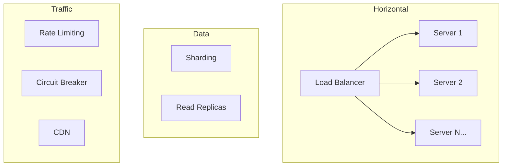

# Scalability

Scaling is not just about adding more servers — it requires rethinking how data flows through your system. This section covers the core techniques used at FAANG scale.

## What You'll Learn

- **Concepts**: Consistent hashing, rate limiting, leader election, global distribution
- **Hands-On**: Implement load balancers, consistent hashing, rate limiters
- **Failure Modes**: Hot spot detection and mitigation

## Where to Start

1. [Scaling Basics](./concepts/scaling-basics) — Vertical vs horizontal, stateless design
2. [Consistent Hashing Deep Dive](./concepts/consistent-hashing-deep-dive) — The foundation of distributed data
3. [Rate Limiting Algorithms](./concepts/rate-limiting-algorithms) — Token bucket, sliding window, fixed window
4. [Load Balancer: Round Robin](./hands-on/load-balancer-round-robin) — Implement from scratch

## Topic Map

| Topic | Concepts | Hands-On | Problems at Scale | Interview Prep |
|-------|----------|----------|-------------------|----------------|
| Scaling basics | [scaling-basics](./concepts/scaling-basics), [stateless-architecture](./concepts/stateless-architecture) | — | — | [load-balancing-strategies](/12-interview-prep/system-design/fundamentals/load-balancing-strategies) |
| High availability | [high-availability](./concepts/high-availability) | — | — | [scale-and-reliability](/12-interview-prep/system-design/scale-and-reliability/) |
| Auto-scaling | [auto-scaling](./concepts/auto-scaling) | — | — | [auto-scaling](/12-interview-prep/quick-reference/aws-cloud/auto-scaling) |
| CDN & edge computing | [global-distribution-strategy](./concepts/global-distribution-strategy), [multi-region](./concepts/multi-region) | — | — | [cdn-edge-computing-media](/12-interview-prep/system-design/scale-and-reliability/cdn-edge-computing-media) |
| Load balancing | — | [load-balancer-round-robin](./hands-on/load-balancer-round-robin), [load-balancer-least-connections](./hands-on/load-balancer-least-connections), [load-balancer-consistent-hashing](./hands-on/load-balancer-consistent-hashing), [nginx-load-balancer](./hands-on/nginx-load-balancer) | — | [load-balancing-strategies](/12-interview-prep/system-design/fundamentals/load-balancing-strategies) |
| Chaos engineering | — | [chaos-engineering](./hands-on/chaos-engineering) | — | — |
