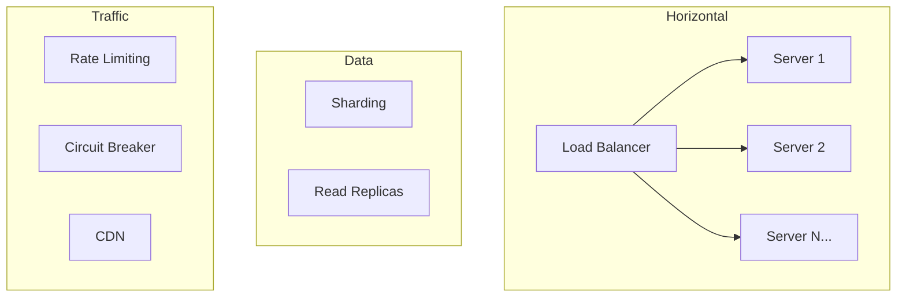

# Scalability

Scaling is not just about adding more servers — it requires rethinking how data flows through your system. This section covers the core techniques used at FAANG scale.

## What You'll Learn

- **Concepts**: Consistent hashing, rate limiting, leader election, global distribution
- **Hands-On**: Implement load balancers, consistent hashing, rate limiters
- **Failure Modes**: Hot spot detection and mitigation

## Where to Start

1. [Scaling Basics](/06-scalability/concepts/scaling-basics) — Vertical vs horizontal, stateless design
2. [Consistent Hashing Deep Dive](/06-scalability/concepts/consistent-hashing-deep-dive) — The foundation of distributed data
3. [Rate Limiting Algorithms](/06-scalability/concepts/rate-limiting-algorithms) — Token bucket, sliding window, fixed window
4. [Load Balancer: Round Robin](/06-scalability/hands-on/load-balancer-round-robin) — Implement from scratch

## Navigate by Role

| I am... | Start here | Goal |
|---------|-----------|------|
| 🟢 Junior | [scaling-basics](./concepts/scaling-basics) | Understand horizontal vs vertical scaling |
| 🟡 Mid-level | [consistent-hashing-deep-dive](./concepts/consistent-hashing-deep-dive) | Design scalable data distribution |
| 🔴 Senior / TL | [rate-limiting-algorithms](./concepts/rate-limiting-algorithms) + [failures](./failures) | Production scaling: rate limiting, HA, failure modes |
| 🏆 Interview prepping | [scale-and-reliability questions](../../12-interview-prep/system-design/scale-and-reliability) | Scaling & reliability interview patterns |

## Topic Map

| Topic | 📖 Concept | 🔬 Hands-On | ⚠️ Failures | 🎯 Interview |
|-------|-----------|------------|------------|-------------|
| Scaling basics | [scaling-basics](./concepts/scaling-basics), [stateless-architecture](./concepts/stateless-architecture) | — | — | — |
| High availability | [high-availability](./concepts/high-availability) | — | [failures](./failures) | [cdn-from-scratch](../../12-interview-prep/system-design/scale-and-reliability/cdn-from-scratch) |
| Auto-scaling | [auto-scaling](./concepts/auto-scaling) | — | — | [kubernetes-basics](../../12-interview-prep/system-design/scale-and-reliability/kubernetes-basics) |
| Consistent hashing | [consistent-hashing-deep-dive](./concepts/consistent-hashing-deep-dive) | [consistent-hashing-poc](./hands-on/consistent-hashing-poc), [load-balancer-consistent-hashing](./hands-on/load-balancer-consistent-hashing) | — | — |
| Rate limiting | [rate-limiting-algorithms](./concepts/rate-limiting-algorithms) | [rate-limiting-algorithms](./hands-on/rate-limiting-algorithms) | — | — |
| Load balancing | — | [load-balancer-round-robin](./hands-on/load-balancer-round-robin), [load-balancer-least-connections](./hands-on/load-balancer-least-connections), [nginx-load-balancer](./hands-on/nginx-load-balancer) | — | — |
| Leader election | [leader-election](./concepts/leader-election) | — | — | — |
| Hot spot detection | [hot-spot-detection](./concepts/hot-spot-detection) | — | — | — |
| Database read scaling | [database-read-scaling](./concepts/database-read-scaling) | — | — | — |
| Write scaling | [write-scaling-patterns](./concepts/write-scaling-patterns) | — | — | — |
| CDN & global distribution | [global-distribution-strategy](./concepts/global-distribution-strategy), [multi-region](./concepts/multi-region) | — | — | [cdn-edge-computing-media](../../12-interview-prep/system-design/scale-and-reliability/cdn-edge-computing-media) |
| Service discovery | — | [service-discovery](./hands-on/service-discovery) | — | [service-discovery](../../12-interview-prep/system-design/scale-and-reliability/service-discovery) |
| Microservices migration | — | — | — | [monolith-to-microservices](../../12-interview-prep/system-design/scale-and-reliability/monolith-to-microservices) |
| Multi-tenant SaaS | — | — | — | [multi-tenant-saas](../../12-interview-prep/system-design/scale-and-reliability/multi-tenant-saas) |
