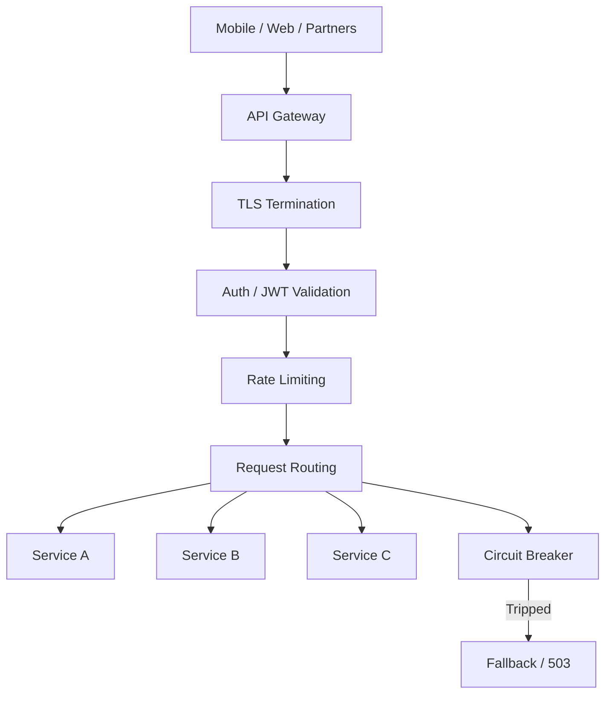
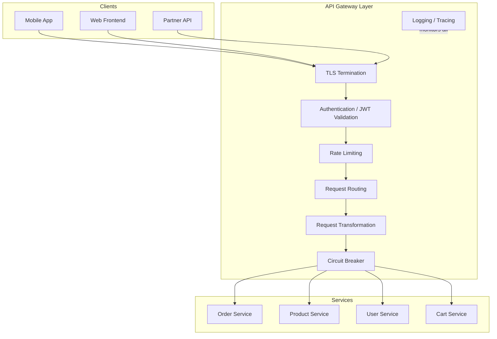
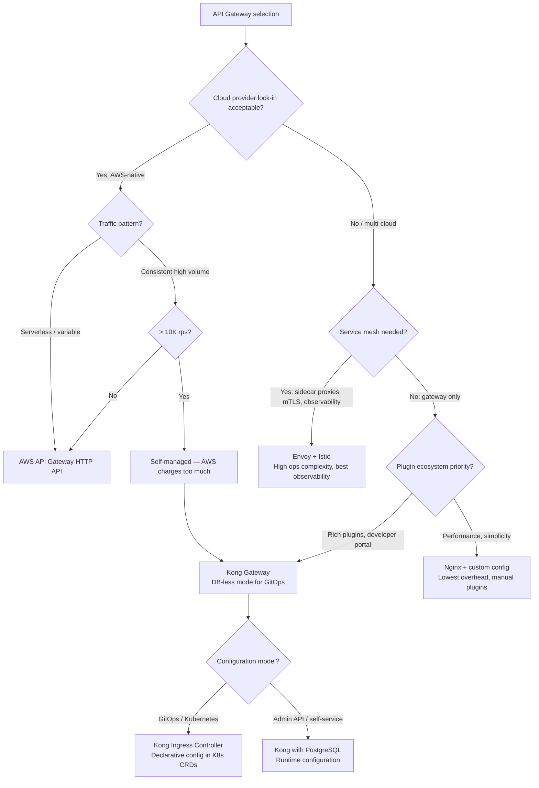

# API Gateway Deep Dive: Routing, Auth, Rate Limiting, and Circuit Breaking

## 🗺️ Quick Overview



*The gateway centralizes cross-cutting concerns — TLS, auth, rate limiting, routing, and circuit breaking — between external clients and internal microservices.*

**The API gateway is the front door to your entire platform. It's also the most frequently over-engineered and under-operated component in microservice architectures.** Teams bolt on feature after feature until the gateway becomes a distributed monolith: handling auth, rate limiting, routing, transformation, circuit breaking, caching, and logging — all in a single process that must be deployed, scaled, and operated by one team. This article covers what belongs in the gateway, what doesn't, and how to keep it from becoming the single point of failure it was meant to prevent.

---

## The Problem Class `[Mid]`

Every client request must authenticate, be rate-limited, routed to the correct service, potentially transformed, and observed. Without a gateway, each microservice implements this independently — inconsistently and duplicatively. With a gateway, these cross-cutting concerns are centralized — but centralization creates a chokepoint.

**Scenario:** E-commerce platform. 50 microservices. 3 client types (mobile app, web frontend, third-party partners). 80,000 req/sec peak. Authentication, rate limiting, and request routing must be consistent across all services.



**The cost of no gateway:** Each of the 50 services independently implements JWT validation (50 copies of auth logic), rate limiting (50 different implementations, inconsistently tuned), and logging (50 different formats). When a new auth requirement arrives (e.g., add scope validation), you deploy 50 services. Security incident: patch 50 places.

**The cost of a fat gateway:** The gateway becomes 50,000 lines of plugin code, configuration, and custom logic. The gateway team owns all 50 services' routing configuration. Deploying a new service requires a gateway change request. The gateway is a bureaucratic bottleneck.

---

## Why the Obvious Solution Fails `[Senior]`

**"Put everything in the gateway"** — the empire-building failure mode. Teams progressively add business logic to the gateway because it's "the right place for cross-cutting concerns." Soon the gateway handles:

- JWT validation ✓ (correct)
- Rate limiting ✓ (correct)
- Request routing ✓ (correct)
- Business rule validation ✗ (wrong — belongs in services)
- Response aggregation ✗ (wrong — creates tight coupling)
- Complex request transformation logic ✗ (wrong — maintenance nightmare)
- A/B test assignment ✗ (wrong — feature flag service)
- Caching ✗ (sometimes correct, often wrong)

The result: a gateway that requires redeployment for every business logic change. The "microservices" behind it are thin wrappers because the real logic lives in the gateway.

**"Use the gateway as a single point of failure"** — the availability failure mode. Teams deploy a single gateway cluster behind a VIP. The gateway processes 80,000 req/sec. When the gateway has a bug in its JWT validation plugin, 100% of traffic fails. Recovery requires deploying a fix to a system that is actively receiving 80,000 req/sec.

**"Build a custom gateway with full features from day one"** — the overengineering failure mode. Building a custom gateway for features that off-the-shelf solutions (Kong, Envoy, AWS API Gateway) already provide correctly is a multi-quarter investment that creates a custom system your team must maintain forever. The opportunity cost is 6–12 months of feature development.

---

## The Solution Landscape `[Senior]`

### Solution 1: Kong Gateway (Open Source / Enterprise)

**What it is**

Kong is a Lua/OpenResty-based API gateway with a plugin ecosystem. Configuration via Admin API or declarative YAML (Deck). Commercial enterprise version adds RBAC, developer portal, and advanced analytics.

**How it actually works at depth**

Kong runs on Nginx + OpenResty. Request processing:
1. Client request arrives at Kong's Nginx listener
2. Kong executes plugins in order: `access` phase → `header_filter` phase → `body_filter` phase → `log` phase
3. Request is proxied to the upstream service
4. Response is returned through filter phases

```yaml
# Kong declarative configuration (deck sync)
_format_version: "3.0"

services:
  - name: order-service
    url: http://order-service:8080
    connect_timeout: 5000
    write_timeout: 30000
    read_timeout: 30000
    routes:
      - name: order-routes
        paths:
          - /api/v2/orders
        methods:
          - GET
          - POST
        strip_path: false
    plugins:
      - name: jwt
        config:
          key_claim_name: kid
          claims_to_verify:
            - exp
      - name: rate-limiting
        config:
          minute: 1000
          hour: 10000
          policy: redis
          redis_host: redis-cluster
          redis_port: 6379
      - name: request-transformer
        config:
          add:
            headers:
              - "X-Consumer-ID:$(consumer.id)"
              - "X-Request-Start:$(date_header)"
      - name: http-log
        config:
          http_endpoint: http://log-aggregator:8080/ingest
          timeout: 1000
          keepalive: 60000
```

**Sizing guidance** `[Staff+]`

```
Kong performance characteristics:
  Single Kong node: ~50,000 req/sec with basic plugins (JWT + rate limit + log)
  Latency overhead per request: 1–5ms (plugin execution time)
  Memory per Kong node: ~500MB base + ~50MB per 1,000 active consumers

  Cluster sizing formula:
    peak_rps / (node_capacity × 0.70 utilization) + 1 spare node
    80,000 rps / (50,000 × 0.70) + 1 = 4 nodes

  Database (PostgreSQL/Cassandra) requirement:
    Kong stores configuration in PostgreSQL or Cassandra
    PostgreSQL: sufficient for < 10,000 services/routes
    Cassandra: required for geographically distributed Kong clusters
    DB-less mode (declarative): no database, config loaded from file — best for GitOps

  Plugin overhead by type:
    JWT validation: ~0.5ms (cryptographic operation)
    Rate limiting (Redis): ~1.5ms (Redis RTT + incr operation)
    Request logging (async): ~0.1ms (buffered, non-blocking)
    Response transformation: ~2ms (Lua string manipulation)
    Total typical overhead: 4–6ms per request
```

**Configuration decisions that matter** `[Staff+]`

- **DB-less vs database mode:** DB-less mode (declarative config from file, Kubernetes ConfigMap, or Git) is preferred for GitOps workflows. Configuration changes require pod restarts (or hot reload via Admin API). Database mode allows runtime configuration changes via Admin API without restart — required for self-service developer onboarding portals.
- **Rate limiting policy: local vs redis vs cluster:** `local` — rate limit per Kong node (simplest, allows N× rate per consumer if N nodes). `redis` — shared counter across all nodes (accurate, Redis is now critical path). `cluster` — Kong gossip-based sharing (not recommended for high-accuracy requirements). Default to Redis for consumer-facing rate limiting where accuracy matters.
- **Plugin order matters:** Kong executes plugins in a fixed phase order. `jwt` must run before `rate-limiting` (authenticate before counting). `request-transformer` must run before proxying. Verify plugin execution order in your Kong version — it changed between Kong 2.x and 3.x.

**Failure modes** `[Staff+]`

| Failure | Root cause | Mitigation |
|---|---|---|
| Gateway timeout under load | Upstream service slow + Kong connection pool exhausted | Tune `upstream.connections` pool size; implement circuit breaker |
| Rate limit misconfigured, consumers blocked | Redis timeout causes fallback to deny | Configure `fault_tolerant: true` on rate-limiting plugin for Redis failures |
| JWT plugin allows expired tokens | Clock skew between Kong and token issuer > 60s | Synchronize NTP; set `leeway: 60` in JWT plugin config |
| Config change accidentally deletes service | Deck sync overwrites instead of merging | Use `deck diff` before `deck sync`; configure GitOps with PR approval |

---

### Solution 2: Envoy Proxy

**What it is**

Envoy is a C++ L4/L7 proxy used as both an API gateway and a service mesh sidecar. Configuration via xDS (Envoy's discovery service protocol), typically managed by a control plane (Istio, Contour, Gloo).

**How it actually works at depth**

Envoy's architecture separates the data plane (Envoy instances) from the control plane (configuration management). In Kubernetes, Envoy is commonly deployed as:

1. An ingress gateway (one Envoy per cluster)
2. A sidecar (one Envoy per pod — service mesh mode)

```yaml
# Envoy gateway configuration
static_resources:
  listeners:
  - name: listener_0
    address:
      socket_address: { address: 0.0.0.0, port_value: 8080 }
    filter_chains:
    - filters:
      - name: envoy.filters.network.http_connection_manager
        typed_config:
          "@type": type.googleapis.com/envoy.extensions.filters.network.http_connection_manager.v3.HttpConnectionManager
          stat_prefix: ingress_http
          http_filters:
          - name: envoy.filters.http.jwt_authn
            typed_config:
              "@type": type.googleapis.com/envoy.extensions.filters.http.jwt_authn.v3.JwtAuthentication
              providers:
                provider1:
                  issuer: https://auth.example.com
                  remote_jwks:
                    http_uri:
                      uri: https://auth.example.com/.well-known/jwks.json
                      cluster: jwks_cluster
                      timeout: 5s
          - name: envoy.filters.http.router
            typed_config:
              "@type": type.googleapis.com/envoy.extensions.filters.http.router.v3.Router
  clusters:
  - name: order_service
    type: STRICT_DNS
    load_assignment:
      cluster_name: order_service
      endpoints:
      - lb_endpoints:
        - endpoint:
            address:
              socket_address: { address: order-service, port_value: 8080 }
    circuit_breakers:
      thresholds:
      - priority: DEFAULT
        max_connections: 1000
        max_pending_requests: 500
        max_requests: 1000
        max_retries: 3
```

**Sizing guidance** `[Staff+]`

```
Envoy performance characteristics:
  Single Envoy instance: ~100,000+ req/sec (C++, non-blocking I/O)
  Latency overhead: 0.1–1ms (lower than Kong due to C++ vs Lua)
  Memory: ~50MB base, ~2MB per active cluster connection pool

  When to choose Envoy over Kong:
    - Already using Istio service mesh
    - Need L4 (TCP) proxying alongside L7
    - Performance requirement > 50,000 req/sec per node
    - Need advanced traffic management (traffic mirroring, fault injection)

  When to choose Kong over Envoy:
    - Need rich plugin ecosystem without writing C++ filters
    - Developer portal / API management features
    - Simpler team operations model (YAML config vs xDS)
```

---

### Solution 3: AWS API Gateway

**What it is**

Managed API gateway service. No infrastructure to operate. Integrates with Lambda, ECS, EC2, VPC Link. Pay-per-request pricing.

**How it actually works at depth**

AWS API Gateway comes in two flavors:
- **REST API:** Full-featured, supports caching, request/response transformation, API keys, usage plans. Higher latency (~10ms overhead).
- **HTTP API:** Simplified, lower cost, lower latency (~2ms overhead). Supports JWT authorizers, CORS, and basic routing only.

```javascript
// AWS CDK: HTTP API Gateway with JWT authorizer
import { HttpApi, HttpMethod, CorsHttpMethod } from '@aws-cdk/aws-apigatewayv2-alpha';
import { HttpJwtAuthorizer } from '@aws-cdk/aws-apigatewayv2-authorizers-alpha';
import { HttpLambdaIntegration } from '@aws-cdk/aws-apigatewayv2-integrations-alpha';

const api = new HttpApi(this, 'EcommerceApi', {
  corsPreflight: {
    allowOrigins: ['https://app.example.com'],
    allowMethods: [CorsHttpMethod.GET, CorsHttpMethod.POST],
    allowHeaders: ['Authorization', 'Content-Type'],
  },
  defaultAuthorizer: new HttpJwtAuthorizer('Auth', 'https://auth.example.com', {
    jwtAudience: ['api.example.com'],
  }),
});

api.addRoutes({
  path: '/orders',
  methods: [HttpMethod.GET],
  integration: new HttpLambdaIntegration('OrdersGet', ordersLambda),
});
```

**Sizing guidance** `[Staff+]`

```
AWS API Gateway limits and costs:
  REST API: 10,000 req/sec default (request limit increase available)
  HTTP API: 10,000 req/sec default
  Burst limit: 5,000 req/sec for sudden spikes

  Cost model (HTTP API):
    $1.00 per million requests (first 300M/month)
    At 80,000 req/sec peak, 8 hours/day: 80,000 × 28,800 = 2.3B req/month
    Cost: $1,000–$2,300/month — compare with Kong/Envoy infrastructure cost

  When to use AWS API Gateway:
    - Serverless architecture (Lambda backends)
    - Low traffic or highly variable traffic (pay-per-request vs always-on)
    - Team without gateway operations expertise
    - Need managed auth, TLS, regional failover out of box

  When NOT to use AWS API Gateway:
    - > 50,000 req/sec consistently (cost vs self-managed gateway)
    - Non-HTTP backends (gRPC requires special handling)
    - Need custom plugin logic not supported by Lambda authorizers
```

---

## Gateway Anti-patterns `[Staff+]`

**Anti-pattern 1: Gateway as orchestrator**

The gateway calls service A, aggregates with service B, transforms the result, and returns a composite response. This creates tight coupling: adding a field to service B requires a gateway change. The gateway team becomes the bottleneck for service evolution.

**Solution:** BFF (Backend for Frontend) pattern. Create thin backend services per client type that handle aggregation. The gateway routes; the BFF aggregates.

**Anti-pattern 2: Business logic in gateway plugins**

"We'll put the discount calculation in the gateway so all services benefit." Now the gateway contains business logic that requires business team input to change. Deployed as infrastructure, tested as infrastructure, but behaving as application code.

**Solution:** Business logic belongs in services. Gateway handles infrastructure concerns only (auth, rate limit, route, observe).

**Anti-pattern 3: Single gateway cluster for all traffic**

One Kong cluster handles public API traffic (consumer-facing, high volume, untrusted) and internal service-to-service traffic (trusted, low volume, different SLA). A consumer-facing DDoS attacks the internal traffic SLA.

**Solution:** Separate gateway clusters per trust boundary: public gateway, internal gateway, partner gateway. Different scaling, different rate limit policies, different auth mechanisms.

---

## Trade-off Matrix `[Senior]` → `[Staff+]`

| Dimension | Kong | Envoy/Istio | AWS API Gateway | Custom Nginx |
|---|---|---|---|---|
| Performance | 50K rps/node | 100K+ rps/node | Managed (10K rps default) | 80K+ rps/node |
| Operational complexity | Medium | High | Low (managed) | Low |
| Plugin ecosystem | Large (Lua) | Limited (C++ filters) | Lambda authorizers | Nginx modules |
| Service mesh integration | Limited | Native | None | None |
| Cost at 80K rps | Infrastructure + ops | Infrastructure + ops | ~$2K/month | Cheapest |
| Multi-cloud | Yes | Yes | AWS only | Yes |
| Dev portal / API management | Enterprise tier | No | Yes (REST API) | No |

---

## Decision Framework `[Senior]` → `[Staff+]`



---

## Production Failure Story `[Staff+]`

**The JWT plugin update that caused 45 minutes of auth failures:**

A platform team upgraded Kong from 2.8 to 3.0. In Kong 3.0, the `jwt` plugin changed its default behavior: unverified JWTs no longer pass to the upstream (they're rejected). In Kong 2.8, the plugin was configured with `run_on_preflight: false` — CORS preflight requests (OPTIONS) did not run the JWT check.

In Kong 3.0, the `run_on_preflight` setting was removed and CORS preflights always bypass auth (correct behavior). However, the upgrade also changed how the `anonymous` consumer worked: routes without the JWT plugin now required an anonymous consumer to be explicitly configured, or they returned 401.

Three API routes that the team thought required auth (they were in the JWT plugin config) were actually publicly accessible routes (health checks, OAuth callbacks) that happened to be in the same route group. After the upgrade, these routes started returning 401.

**Impact:** OAuth login flow (which called the callback route) returned 401, blocking all new user logins for 45 minutes.

**Root cause:**
1. No staging environment with production-equivalent traffic
2. No automated functional test for the login flow in the gateway integration test suite
3. Kong upgrade treated as infrastructure change (no feature regression testing)

**Resolution:**
1. Rolled back Kong to 2.8 immediately
2. Added functional test suite for all critical API flows (login, checkout, payment) that runs against staging on every gateway config change
3. Mapped all routes to explicit auth requirements in documentation before re-attempting upgrade
4. Separated public routes from authenticated routes at the service level, not the route group level

---

## Observability Playbook `[Staff+]`

```
Gateway health metrics (non-negotiable):

1. Request rate and error rate
   gateway_requests_total{service, method, status_code} — upstream and downstream
   gateway_error_rate = rate(5xx) / rate(total) > 0.1% → alert

2. Latency by upstream
   gateway_request_duration_ms{upstream="order-service"} p99 > 200ms → upstream slow

3. Gateway-added latency
   gateway_overhead_ms = total_latency - upstream_latency
   gateway_overhead_ms p99 > 10ms → plugin performance issue

4. Circuit breaker state
   gateway_circuit_state{upstream="order-service"} = 1 (open) → upstream failing

5. Rate limit rejection rate
   gateway_rate_limit_rejected_total{consumer_id} > 100/min → consumer throttled
   gateway_rate_limit_rejected_total high globally → possible DDoS

6. JWT validation failures
   gateway_auth_failures_total{reason="expired|invalid|missing"} — security monitoring

Distributed tracing integration:
  Inject trace context at gateway (W3C TraceContext or B3)
  Every request gets trace_id before reaching any upstream service
  Gateway span: auth_ms, rate_limit_ms, routing_ms, upstream_ms
```

---

## Architectural Evolution `[Staff+]`

**2026 tooling perspective:**

- **Kong Konnect:** SaaS control plane for Kong. Declarative config via GitOps, multi-cloud, unified analytics. Eliminates the Kong PostgreSQL/Cassandra dependency for the control plane.
- **Envoy Gateway (Kubernetes Gateway API):** Standard Kubernetes Gateway API with Envoy as the data plane. Replaces custom Ingress annotations with standardized `HTTPRoute`, `GRPCRoute` CRDs. Implemented by Contour, Cilium, and GCP.
- **Cilium Service Mesh:** eBPF-based service mesh that bypasses the sidecar model entirely. L7 policies enforced in the kernel — near-zero overhead, observability without Envoy sidecars. In 2026, viable for teams willing to manage kernel-level eBPF programs.
- **Cloudflare Workers as API Gateway:** Edge-deployed gateway with 0ms cold start, global distribution, V8 isolates. Custom auth, rate limiting, and routing logic in JavaScript running at 300+ PoPs. Eliminates regional gateway deployment complexity.
- **AI-enhanced gateway (emerging):** Kong AI Gateway, AWS Bedrock API Gateway — routing, rate limiting, and content filtering for LLM API traffic. Manages token-based rate limiting, prompt injection detection.

**The evolution trajectory:**
```
Phase 1 (MVP):         Nginx with basic rate limiting
Phase 2 (Growth):      Kong (managed plugins, developer portal)
Phase 3 (Scale):       Kong Konnect or Envoy Gateway (GitOps, multi-cluster)
Phase 4 (Platform):    Service mesh + gateway: Cilium or Istio + Envoy Gateway
```

---

## Decision Framework Checklist `[All Levels]`

- [ ] Have I separated gateway concerns (auth, rate limit, route) from business logic?
- [ ] Are there separate gateway clusters per trust boundary (public vs internal vs partner)?
- [ ] Is gateway configuration managed as code (declarative YAML, GitOps)?
- [ ] Is there an automated functional test suite for critical API flows run on every gateway change?
- [ ] Is gateway-added latency measured separately from upstream latency?
- [ ] Is circuit breaking configured per upstream service (not globally)?
- [ ] Are rate limit counters stored in Redis (not in-memory per node)?
- [ ] Is JWT validation configured with clock skew tolerance?
- [ ] Does the gateway have independent health checks and self-healing restart policies?
- [ ] Is there a documented runbook for rolling back a gateway configuration change?
- [ ] Are gateway logs, metrics, and traces feeding into the same observability stack as services?
- [ ] Have I load-tested the gateway itself (not just the services behind it)?

*Written by Gaurav Porwal — 10+ Year Engineer | Tech Lead | Product Owner | Business-Minded Builder*
*Last updated: 2026-03-18*
